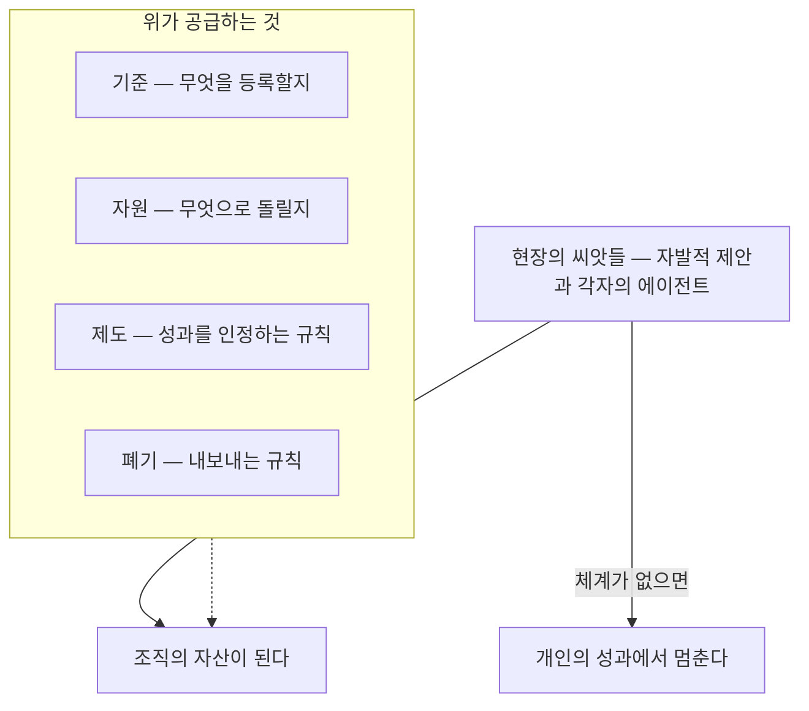
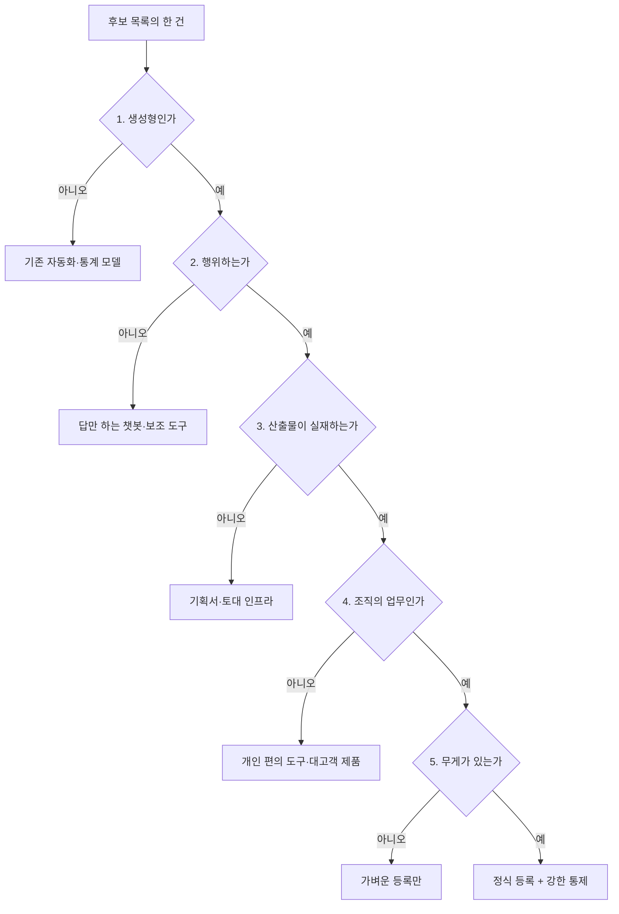
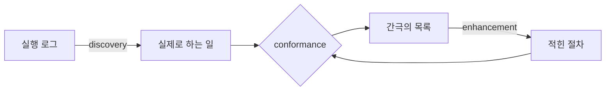
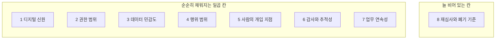
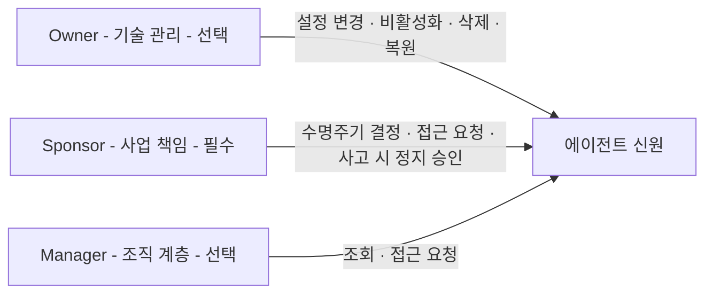
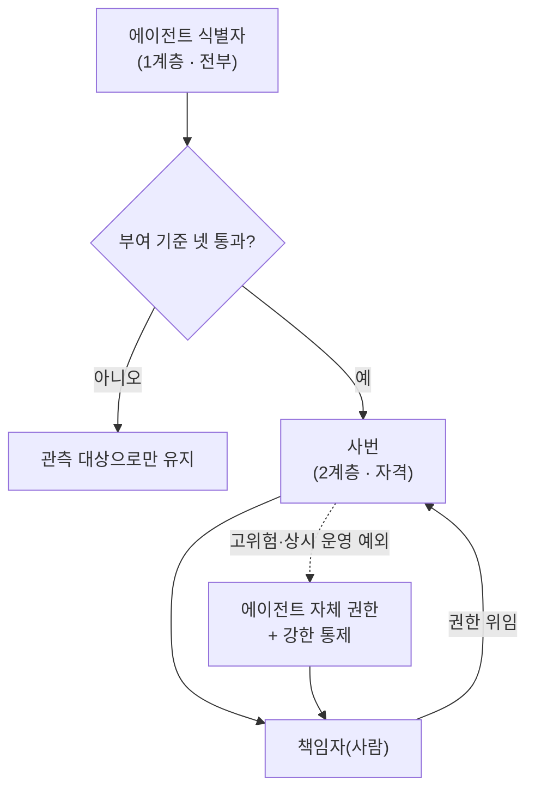
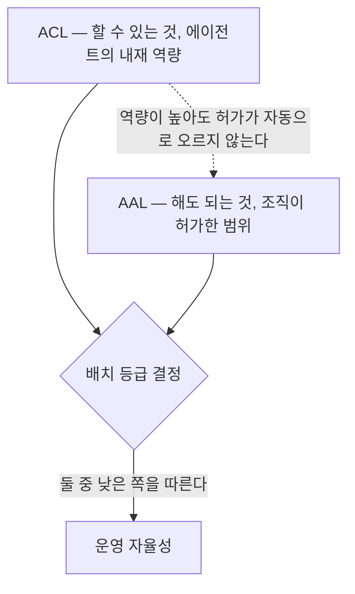
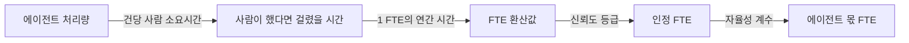
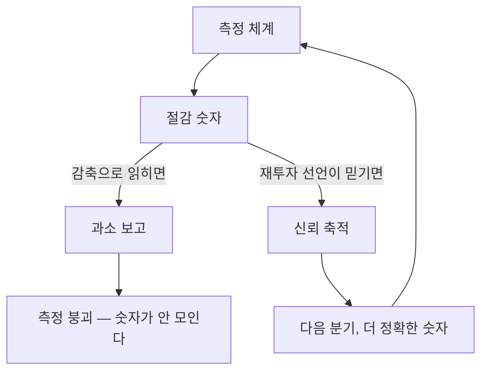
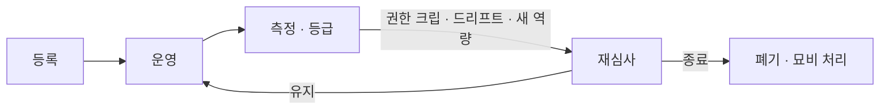

# 디지털 워커의 시대, AI 에이전트를 조직의 성과로 만드는 체계

## 저자

김상기

**판본:** v1.2.0 · 2026-09-12

---

## 판권

**디지털 워커의 시대, AI 에이전트를 조직의 성과로 만드는 체계**

**판본:** v1.2.0
**발행일:** 2026-09-12
**저자:** 김상기
**식별자:** urn:uuid:5cef80ff-b2ad-43fd-b003-63c0f827313f

### 라이선스

이 책은 **CC BY-NC-SA 4.0** 라이선스로 배포된다 — [Creative Commons 저작자표시-비영리-동일조건변경허락 4.0 국제](https://creativecommons.org/licenses/by-nc-sa/4.0/).

- **저작자 표시(BY):** 출처를 밝혀야 한다.
- **비상업적 이용(NC):** 상업적 목적으로 이용할 수 없다.
- **동일조건 변경허락(SA):** 변경·재배포 시 동일한 라이선스를 적용해야 한다.

### 출처

이 책은 [book-writer](https://github.com/tobyilee/book-writer) 하네스 v1.11.0로 자동 생성되었다.

---

## 서문

2026년 4월 9일, 한국의 기술 커뮤니티 GeekNews에 이런 제목의 토픽이 올라왔다. **「AX팀을 만드는 순간, 당신의 조직은 AX에 실패한다」.**

이 책을 쓰는 사람이 가장 먼저 읽어야 할 문장이었다. 이 책은 조직에 AI 에이전트를 들이는 체계를 세우는 법에 관한 책이고, 그런 체계를 세우는 사람은 대개 그 이름이 붙은 조직에 앉아 있기 때문이다. 그러니 저 제목은 이 책의 기획 자체를 겨눈다.

그 토픽의 댓글 하나가 더 정확했다.

> "AX 추진팀이 나쁘다기 보다는.. AX팀을 만들어놓고 "너희가 AX팀이니까 빨리 AI로 자동화해봐"가 문제라는 말 같아요.. 도메인 현업자가 주도하고 AX기술자가 서포트하면서 AI를 도입하는게 가장 좋을것 같은데.."
> — GeekNews 사용자 `snisty`, 2026년 4월 9일 토픽의 댓글. 개인의 공개 발언이며 조사 데이터가 아니다.

읽고 나서 반박할 말을 찾지 못했다. 동의하기 때문이다. 그리고 그 댓글의 처방 — 도메인 현업자가 주도하고 기술 조직이 받쳐준다 — 이 이 책이 열 장에 걸쳐 도달하는 결론과 같다.

그래서 순서를 이렇게 잡았다. 이 책은 AX팀을 만드는 책이 **아니다.** 아래에서 이미 올라오고 있는 것을 조직의 성과로 **거두는 체계**를 만드는 책이다. 차이는 방향에 있다. 위에서 과제를 정해 내리는 일과, 이미 벌어진 일 가운데 무엇을 조직의 자산으로 인정할지 정하는 일은 다른 작업이다. 뒤의 것에는 판단 기준과 그것을 담을 그릇이 필요하고, 이 책이 만들려는 것이 그 기준과 그릇이다. 아이디어는 계속 아래에서 온다는 것이 이 책의 전제이지 결론이 아니다.

그러니 저 냉소를 이 책은 위협으로 다루지 않는다. **점검 문항으로 쓴다.** 당신이 다음 분기에 세울 등록 절차와 승인 게이트와 등급표는 언제나 같은 시험을 통과해야 한다. 그것이 도메인 조직의 일을 대신 정하고 있는가, 아니면 도메인 조직이 자기 일을 정할 수 있게 받치고 있는가. 앞이라면 저 토픽의 제목이 반년 뒤 당신 조직에 대한 문장이 된다.

### 누가 읽으면 좋은가

체계를 실제로 세우는 사람을 1순위 독자로 놓고 썼다. 진단은 끝났거나 최소한 병목은 아는 상태에서, 위에서는 체계를 세우라는 요구를 받고 아래에서는 또 관리냐는 반발을 받는 자리다. 무엇부터 어떤 순서로 손대야 할지가 이 책의 질문이다. 보안·아이덴티티 담당자, 인사·전략 기획, 도메인 조직의 추진 담당자도 각각 자기 장을 갖는다. 코드는 나오지 않는다. 다루는 것은 조직 설계와 거버넌스와 측정의 언어다.

이 책은 저자의 AX 3부작 중 세 번째다. 앞의 두 권이 만들어본 기록과 진단의 자를 남겼고, 이 책은 그래서 무엇을 어떤 순서로 세울 것인가에 답한다. 다만 **이 책만 읽어도 성립하게 썼다.** 앞의 책을 읽어야 이해되는 서술은 두지 않았고, 성숙도 격자 같은 도구는 처음 나올 때 그 자리에서 짧게 정의한다.

### 어떻게 읽으면 좋은가

열 개 장은 일이 실제로 막힌 순서를 그대로 따라간다. 그래서 처음부터 읽으면 자기가 다음에 부딪힐 벽을 미리 보게 된다. 급하다면 지금 막혀 있는 칸부터 펴도 무리가 없게 썼다. 한 가지만 유의하자 — **앞 칸을 안 채우고 뒤 칸을 채우면 뒤 칸이 헛돈다.** 절차 없이 등록하면 등록부에 빈칸이 늘고, 사용처를 약속하지 않고 측정하면 숫자가 올라오지 않는다.

그리고 각 장은 손에 남는 것을 하나씩 남긴다. 관문 워크시트, SOP 진단표, 작성 규칙 체크리스트, 등록 스키마, 부여 기준, 등급표 초안, 환산식, 사용 제한 선언문 초안, 폐기 체크리스트. 아홉 개를 부록 A에 모아 두었으니 실무에서는 그쪽을 먼저 펴도 된다.

요즘 자주 들리는 선언 하나에도 선을 그어 두자. 조직의 생산 능력이 사람 수로 관리되던 시대가 끝나고 역량으로 관리되는 시대가 온다는 이야기다. 방향은 맞다고 본다. 다만 구호는 한 문단이면 충분하고, 그다음부터는 무엇을 어떻게 셀 것이냐는 지루한 이야기다. 이 책은 그 지루한 쪽에 관한 책이다.

### 미리 밝히는 네 가지

**첫째, 익명화.** 저자의 현장 경험은 *"어느 조직에서는"* 수준으로만 등장한다. 회사·시스템·부서·인물의 이름, 건수·금액·비율·인원, 보고와 회의의 날짜는 쓰지 않았다. 숫자가 필요한 대목에서는 가상의 예시값을 새로 만들고 예시임을 그 자리에서 밝혔다.

**둘째, 시점.** 제품·규제·표준 정보는 모두 **2026년 9월 기준**이다. 이 영역은 분기 단위로 바뀐다. 실제 대응을 설계할 때는 원문을 다시 확인하는 편이 낫다.

**셋째, 출처 성격.** 모든 수치에 조사 주체와 표본과 문헌 유형을 붙였다. 벤더 자체 계측인지 동료평가 논문인지 프리프린트인지 익명 게시물인지를 숫자 옆에 적었고, 라벨을 붙일 수 없는 수치는 쓰지 않았다. 이 책은 남의 과장된 수치를 여러 장에 걸쳐 해부한다. 그런 책이 자기 인용에 라벨을 빼면 그 해부의 자격을 잃는다.

**넷째, 목소리의 비대칭.** 이 책이 인용하는 현장 목소리는 대부분 엔지니어 커뮤니티에서 왔다. 체계를 추진하는 쪽의 1인칭 기록은 공개 웹에 거의 없다. 그래서 이 책의 1순위 독자는 자기가 인용된 문장 속에서 3인칭 비판 대상으로 등장하는 장면을 여러 번 만난다. 그 비대칭을 알고 읽어주기 바란다. 그리고 이 책은 그 문장들을 조롱이 아니라 **예고**로 쓴다 — 당신이 이렇게 하면 현장에서 이런 말이 나온다는 뜻이다.

셋째와 넷째는 같은 성질의 고지다. 남의 편향을 지적하려면 자기 편향을 먼저 적어야 한다.

---

## 목차

**PART 1. 전향 — 위가 할 일은 따로 있다**

- 1장. 씨앗은 저절로 수확되지 않는다

**PART 2. 절차 — 체계의 입장권**

- 2장. 세어보면 다 있는데, 대보면 없다
- 3장. 적힌 절차와 실제로 하는 일
- 4장. 기계가 읽는 절차

**PART 3. 등록 — 조직에 자리를 만든다**

- 5장. 등록한다는 건 무엇을 적는다는 뜻인가
- 6장. 제도는 청구서에 부딪혀 모양이 잡힌다
- 7장. 할 수 있는 것과 해도 되는 것

**PART 4. 성과 — 세는 법과 그 대가**

- 8장. 성과를 세는 법
- 9장. 절감분은 누구의 것인가

**PART 5. 끝 — 설계되지 않은 마지막 칸**

- 10장. 아무도 설계하지 않은 마지막 칸

**부록**

- 부록 A. 워크시트 모음 — 각 장이 남긴 아홉 개의 도구
- 부록 B. 참고문헌

---

# PART 1. 전향 — 위가 할 일은 따로 있다

바텀업이 씨앗을 만든다. 그러나 씨앗은 저절로 수확되지 않는다.

---

# 1장. 씨앗은 저절로 수확되지 않는다

"이제 탑다운으로 정리하자."

이 말을 들으면 대부분 같은 장면을 떠올린다. 위에서 과제 목록이 내려온다. 부서별로 할당이 붙는다. 분기마다 진척을 보고한다. 안 하면 평가에 반영된다. 이 그림이 워낙 익숙해서, 회의실에서 저 문장이 나오는 순간 절반은 이미 이 장면을 보고 있다. 말한 쪽도, 듣는 쪽도.

그런데 실제로 통한 탑다운은 이 모양이 아니었다.

정확히 말하면, 이 모양의 탑다운이 통했다는 증거를 나는 찾지 못했다. 반대 방향의 증거는 어렵지 않게 나온다. 위에서 정해 내린 목록은 실행 단계에서 실체가 없는 것으로 판명되고, 위에서 강제한 도구는 우회 경로를 낳고, 위에서 찍어 누른 표준은 문서로만 남는다. 반면 잘 굴러간 조직에서 위가 한 일을 되짚어 보면 무엇을 하라고 정한 대목이 의외로 적다. 대신 다른 것들이 있었다. 무엇을 인정해줄 것인지의 기준. 돌릴 수 있는 자원. 성과를 성과로 세어주는 제도. 그리고 — 이게 늘 마지막에 빠져 있는데 — 그만둔 것을 정리하는 규칙.

그래서 이 책은 탑다운이라는 단어를 조금 다르게 쓴다. 위에서 내려와야 하는 것은 **거두는 체계**다. 씨앗은 계속 아래에서 만들어지고 있고, 위가 할 일은 그 씨앗이 밭에서 그대로 썩지 않게 하는 것이다.

차이는 방향에 있다. 정할 때 위는 무엇을 할지를 결정하고, 거둘 때 위는 이미 벌어진 일 가운데 무엇을 조직의 자산으로 인정할지를 결정한다. 뒤의 것에는 판단 기준과 그것을 담을 그릇이 필요하다. 이 책이 열 장 내내 만들 것이 그 기준과 그릇이다.

## 채택은 인터넷보다 빨랐다. 그런데

지난 몇 년의 AI 도입을 한 문장으로 줄이면 이렇게 된다. 엄청나게 빨리 퍼졌고, 조직 성과로는 거의 응축되지 않았다.

빅·블랜딘·데밍이 2024년에 낸 전미경제연구소(NBER) 워킹페이퍼 32966은 미국 성인을 대상으로 생성형 AI 사용을 반복 설문한 결과다. 정식 게재본이 아닌 워킹페이퍼이고 응답자 자기보고에 기반한다. 그 조사에서 18~64세 인구의 거의 40퍼센트가 생성형 AI를 써봤다고 답했고, 취업자 응답자의 23퍼센트는 직전 한 주 안에 업무 목적으로 썼다고 답했다. 연구진의 비교가 인상적이다. 생성형 AI의 업무 채택 속도는 PC만큼 빨랐고, 전체 채택 속도는 PC나 인터넷보다도 빨랐다.

여기까지는 우리가 아는 이야기다. 문제는 같은 조사의 다음 줄이다.

응답자들이 스스로 보고한 절감 시간은 **총 근로 시간의 1.4퍼센트**였다.

두 숫자를 나란히 놓아보자. 인터넷보다 빨리 퍼진 기술이, 노동 시간의 1.4퍼센트를 줄였다. 자기보고라 오히려 후하게 나왔을 텐데도 그렇다. 뭔가 이상하지 않은가. 개인이 체감하는 효용과 조직이 회수하는 효용 사이에 커다란 구멍이 하나 있다는 뜻이다.

그 구멍을 정면으로 지적한 조사가 2025년에 나왔다. MIT의 프로젝트 NANDA가 낸 보고서는 통합된 AI 파일럿 중 5퍼센트만이 실질적 가치를 뽑아내고 있고 대다수는 측정 가능한 손익 영향이 없다고 진단했다. 이 보고서는 방법론을 반드시 함께 밝혀야 한다. 2025년 상반기에 공개된 AI 이니셔티브 300여 건을 리뷰하고 구조화 인터뷰 52건과 설문 응답 153건을 모았는데, 그 설문 대상이 **네 개 컨퍼런스에 참석한 시니어 리더들**이다. 그래서 여기 나오는 비율은 모집단 추정치가 아니라 경향으로 읽어야 한다(원문 확보 상태는 부록 B에 적었다).

반박도 함께 적어 둔다. 영어권 개발자 커뮤니티에서 두 가지 지적이 나왔다. 하나는 표본이 **공개된** 배포 사례라는 점이다. 비공개로 조용히 굴러가는 프로젝트는 애초에 빠졌다. 다른 하나는 "실패"의 정의다. 대형 시스템 도입 통계에서 실패란 대개 예산·일정 초과를 뜻했지 작동하지 않는다는 뜻이 아니었다. 이 두 반박은 그대로 점검 항목이 된다. 남의 조사를 사내 보고에 인용하기 전에 표본이 무엇에서 뽑혔는지, 그 조사가 말하는 "성공"과 "실패"가 우리 정의와 같은지를 확인하자. 이 습관이 없으면 8장에서 우리가 만든 숫자도 같은 방식으로 반박당한다.

숫자의 크기에 논증을 걸지는 않겠다. 확인하려는 것은 방향 하나이고, 방향은 다른 조사에서도 같게 나온다. 매킨지가 2026년에 낸 글로벌 설문 보고서 — 컨설팅사 자체 설문이다 — 에서 응답자 열 명 중 여덟 명이 자기 개인 생산성이 향상됐다고 답했다. 같은 조사에서 AI가 회사의 영업이익에 기여했다고 답한 비율은 37퍼센트였고, 전년 대비 변화가 없었다.

개인 생산성 8/10. 영업이익 기여 37퍼센트, 제자리.

빅 등의 것은 학술 워킹페이퍼, MIT 프로젝트 NANDA의 것은 편의표본 보고서, 매킨지의 것은 컨설팅사 설문이다. 성격도 방법론도 달라 어느 하나에 논증 전체를 걸 수는 없다. 그런데 셋이 같은 곳을 가리킨다. **개인에게서는 잡히고 조직에서는 안 잡힌다.**

이게 바텀업의 성적표다. 낙제점은 아니다. 씨앗이 이렇게 많이, 이렇게 빨리 뿌려진 적이 없었다. 문제는 그다음 칸에 있다.

## 개인은 배웠는데, 조직은 남기지 못했다

왜 개인에게서 잡힌 것이 조직에서 사라질까? 흔한 설명은 "아직 규모가 작아서"다. 편한 설명이지만 실증을 보면 그렇게 단순하지 않다. 먼저 개인 층위의 효과가 실제로 있다는 것부터 확인하자. 다만 숫자를 뭉뚱그려 "AI는 생산성을 몇 퍼센트 올린다"로 쓰면 안 된다. 직무도 과제도 모델 세대도 다르기 때문이다.

브린욜프슨·리·레이먼드가 『Quarterly Journal of Economics』 140권 2호에 실은 동료평가 논문은 고객지원 상담원 5,172명을 대상으로 시간당 처리 건수가 15퍼센트 늘었다고 보고했다. GPT-3.5 세대 기준이다. 그런데 평균보다 더 중요한 것은 분포다. 원문은 이렇게 적었다. 경험이 적고 숙련도가 낮은 노동자는 속도와 품질을 모두 개선했지만, **가장 경험이 많고 가장 숙련된 노동자는 속도에서 작은 이득을, 품질에서 작은 하락을 보였다.** 같은 방향이 한 번 더 확인된다. 추이 등이 『Management Science』에 실은 논문은 세 곳의 현장 무작위 실험에서 개발자 4,867명을 관찰해 완료 과제가 26퍼센트가량(표준오차 10.3퍼센트포인트) 늘었으며 역시 경험이 적을수록 향상 폭이 컸다고 보고했다. 코드 완성 도구 세대 기준이다.

그런데 델아쿠아 등이 『Organization Science』에 실은 사전 등록 무작위 실험이 다른 그림을 보탠다. 고숙련 경영 컨설턴트 758명에게 18개 지식노동 과제를 시켰다. 2023년 GPT-4 세대 기준이다. 결과가 과제에 따라 정반대로 갈렸다. AI가 잘하는 영역 — 이 논문의 표현으로는 **경계 안** — 에서는 과제 완수가 12.2퍼센트, 속도가 25.1퍼센트 올랐고 맹검 평가 품질은 40퍼센트 개선됐다. 그런데 경계 밖 과제에서는 정답을 낼 확률이 약 19퍼센트 낮아졌다. 같은 사람이, 같은 도구를 들고, 과제만 바꿨을 뿐인데 그렇다.

연구진은 이 지형에 **들쭉날쭉한 경계(jagged frontier)** 라는 이름을 붙였다. 이 이름이 이 책의 논지에 결정적이다. 경계가 매끄럽다면 개인이 몇 번 써보고 감을 잡을 수 있다. 그런데 이 경계는 들쭉날쭉하다. 겉보기에 비슷한 두 과제 중 하나는 경계 안이고 하나는 밖이다.

여기서 서늘한 결론이 하나 나온다. 어떤 과제가 경계 안이고 밖인지를 알려면 여러 사람의 여러 시도를 모아서 봐야 한다. 그건 조직이 축적해야 비로소 아는 지식이다. 개인 한 사람의 시행착오로는 닿지 않는다. 그런데 바텀업 실험이 개인의 머릿속에서 시작하고 끝나면, 그 지식은 조직에 남지 않는다. 담당자가 팀을 옮기거나 퇴사하면 같이 나가고, 다음 사람이 처음부터 다시 겪는다.

씨앗은 저절로 수확되지 않는다는 문장의 실무적 의미가 여기 있다. 수확한다는 말이 낭만적으로 들리겠지만 실제로 하는 일은 꽤 건조하다. **누가 무엇을 시켜서 무엇이 나왔는지가 어딘가에 남는 상태**를 만드는 것이다. 그 장치가 이 책이 앞으로 다룰 등록부이고, 평가이고, 로그다.

그런데 축적이 까다롭다. 경계 지도를 그리려면 잘된 것만큼 안 된 것이 필요한데, 누가 자기 실패를 자발적으로 올리겠는가. 그래서 축적은 선의에 기대면 실패한다. 무언가를 돌린 흔적이 자동으로 남는 경로 위에 얹혀 있어야 한다. **사람이 성실해야 유지되는 체계는 유지되지 않는다.**

## 그래서 위에서 정하면 되는가

여기까지 읽고 나면 결론이 하나로 몰린다. 각자 하도록 뒀더니 조직에 아무것도 안 남는다. 그러니 이제 위에서 정해서 내리자. 전사 과제를 지정하고, 부서마다 할당하고, 사용률을 평가에 넣자.

이 충동은 자연스럽다. 그리고 이 책의 독자가 지금 그 자리에 서 있을 확률이 높다. 위에서는 체계를 세우라고 하고 아래에서는 또 관리냐고 하는, 딱 가운데 자리다. 그 자리에서 손에 가장 먼저 잡히는 답이 "정해서 내리기"다. 그런데 현장을 되짚어 보면 이 충동을 지지하는 데이터가 나오지 않는다.

어느 조직에서 있었던 일이다. AI 과제를 공모해 목록을 만들고, 그 목록에서 진짜로 에이전트라 부를 만한 것을 골라내려고 관문을 여러 개 세웠다. 실제로 행동하는가, 산출물이 실재하는가, 조직의 업무인가, 되돌릴 수 없는 일을 건드리는가. 관문을 하나씩 통과시키니 후보가 크게 줄었고, 마지막까지 남은 것은 처음 목록의 아주 일부였다. 그 남은 후보들의 출처를 되짚어 봤다. 압도적 다수가 **구성원이 스스로 올린 제안**이었다.

위에서 지정한 대표 과제만 놓고 보면 겉보기에 그럴듯한 것들이 남고, 실제로 무언가를 처리하고 있는 에이전트를 놓친다. 거꾸로 아래에서 올라온 것만 보면 조직 목표와의 연결이 헐겁다. 그래서 양쪽을 합쳐야 목록이 완성된다. 같은 조직에서 절차 표준화를 논의할 때도 결론이 비슷했다. 지원 부서가 표준 양식을 만들어 내려보내는 방식은 작동하지 않았고, 도메인 조직이 자기 절차를 주도하고 지원 부서는 조정과 지원을 맡는 형태로 정리됐다.

한 조직의 관찰이니 이걸로 일반화할 수는 없다. 다만 "중앙이 좋은 과제를 골라 내려보낸다"는 발상이 생각만큼 안전하지 않다는 신호로는 충분하다.

물론 반대편 증거도 있다. 앞서 본 매킨지 설문에서, 대기업 가운데 하나 이상의 기능에서 AI 에이전트를 확장 적용하고 있다고 답한 비율은 27퍼센트에서 40퍼센트로 올랐고 소규모 조직의 같은 지표는 22퍼센트에서 제자리였다. 탑다운 옹호론이 들 수 있는 가장 강한 카드다. 절반은 동의한다. 다만 이 숫자는 **체계를 세울 수 있는 규모의 조직만 확장 단계까지 도달했다**는 뜻으로도 똑같이 읽힌다.

이 관찰들이 이 책의 방향을 바꿨다. 처음 구상은 단순했다. 바텀업이 벽에 부딪혔으니 탑다운으로 전향한다. 그런데 현장은 그 문장을 그대로 지지하지 않는다. 그래서 이렇게 고쳤다.

> 바텀업이 씨앗을 만든다. 그러나 씨앗은 저절로 수확되지 않는다. **탑다운이 해야 할 일은 지시가 아니라 거두는 체계다.**

이 교정이 사소해 보인다면, 실무에서 무엇이 달라지는지 보자. "정하는 탑다운"은 과제 목록을 공급한다. "거두는 탑다운"은 다른 것들을 공급한다. 무엇을 등록할지의 기준. 돌릴 수 있는 자원. 성과를 성과로 인정하는 제도. 그리고 폐기의 규칙. 아이디어가 계속 아래에서 온다는 것을 전제로 깔고, 그것이 조직 자산이 되는 경로를 위에서 놓는 일이다.

그림 1. 씨앗은 아래에서 오고, 체계는 위에서 온다

말이 근사하니 한 번 의심하고 넘어가자. 근거가 있는 이야기인가.

## AI는 조직을 고치지 않는다. 증폭할 뿐이다

있다. 그것도 꽤 직접적인 형태로. 구글 클라우드의 DORA 팀이 2025년에 낸 『State of AI-assisted Software Development』 보고서는 결론을 이렇게 정리한다.

> AI의 일차적 역할은 **증폭기**다 — 조직이 이미 가진 강점과 약점을 확대한다. AI 투자에서 가장 큰 수익은 도구 자체가 아니라 그 아래 놓인 조직 시스템에 대한 전략적 집중에서 온다.

이 문장은 위로처럼 들리지만 실은 경고다. AI는 팀을 고쳐주지 않는다. 원래 잘하던 팀은 더 잘하게 되고, 원래 엉망이던 팀은 더 빨리 엉망이 된다. 앞 절의 들쭉날쭉한 경계도 같은 이야기다. 축적하는 조직에서는 경계 지도가 쌓이고, 그렇지 못한 조직에서는 같은 시행착오가 사람 수만큼 반복된다.

같은 보고서가 한 걸음 더 나간다. 어떤 조직이 AI에서 불균형하게 큰 편익을 보는지 짚는데, 그 조건이 셋이다. **강한 버전 관리, 관측성, 그리고 내부 플랫폼.**

이 목록을 잠시 들여다보자. 여기 "AI 과제"라는 항목이 있는가. 없다. 도구 이름도, 목표 수치도 없다. 셋 다 중앙이 깔아주는 밑바탕이다. 버전 관리는 되돌릴 수 있게 하고, 관측성은 볼 수 있게 하고, 내부 플랫폼은 다시 만들지 않게 한다. 요컨대 기준이고 자원이고 제도다. 거두는 체계가 무엇을 공급해야 하는가에 대한 답이 실증으로 나온 셈이고, 이 책이 앞으로 설계할 등록부·감사 로그·폐기 규칙이 하는 일과 정확히 같다. 대상만 코드에서 에이전트로 바뀐다.

여기서 껄끄러운 함의가 따라 나온다. AX 체계를 세우려고 손을 대다 보면 얼마 못 가 AX가 아닌 숙제와 마주친다. 로그가 없어서 관측을 못 하고, 시스템에 접근할 경로가 없어서 자동화를 못 한다. 전부 예전부터 미뤄 둔 디지털 전환 숙제다. 2장에서 한 번 더 정면으로 만나게 되니 미리 각오해 두는 편이 낫다. 체계를 세우는 일의 상당 부분은 미뤄 둔 것을 갚는 일이다.

계보도 길다. 브린욜프슨·히트·양이 2002년 『Brookings Papers on Economic Activity』에 실은 동료평가 논문은, 기업에 설치된 컴퓨터 자본 1달러가 다른 자산을 통제한 뒤에도 최소 5달러의 시장가치와 연결된다고 보고했다. 1990년대 컴퓨터 도입 데이터이므로 이 비율을 그대로 AI에 대입하면 과대 해석이다. 여기서 가져올 것은 숫자가 함축하는 구조 쪽이다. 기술 구매 1에 대해 조직 쪽 보완재가 5만큼 붙어야 값이 나온다는 것 — 절차 정비, 역할 재정의, 재교육, 측정 체계가 전부 그 "5"에 해당한다.

그리고 이 보완재 투자에는 고약한 성질이 있다. 브린욜프슨·록·사이버슨이 2017년에 정리하고 2021년 『AEJ: Macroeconomics』에 실은 **생산성 J커브**가 그것인데, 범용 기술 도입 초기에는 측정되는 생산성이 오히려 떨어진다. 조직이 무형자산에 자원을 쏟는데 그 투자는 비용으로 잡히고 산출로는 안 잡히기 때문이다. 체계를 세우는 동안 숫자가 나빠 보이는 게 정상이라는 뜻이다. 다만 이 이론은 위험하게 오용될 수 있다. "J커브니까 기다리자"는 알리바이가 되는 순간, 아무것도 안 하는 조직과 열심히 무형자산을 쌓는 조직이 같은 문장 뒤에 나란히 숨는다. 골짜기를 건너는 중인지 그냥 서 있는 중인지 구별할 수단이 없으면, J커브는 이론이기를 그만두고 변명이 된다. 이 책이 8장에서 측정을 그렇게 집요하게 다루는 이유가 여기 있다.

## 포장도로와 우리

"중앙이 밑바탕을 깔아라"는 처방은 자칫 "중앙이 다 정해라"로 미끄러진다. 포장도로를 깔 것인가, 우리를 지을 것인가의 문제다. 미끄럼을 막는 난간 두 개를 세우고 가자. 첫 번째 난간은 강제의 결과다.

영어권 개발자 커뮤니티에는 2025년 봄부터 2026년 여름까지 AI 사용 의무화를 겪은 사람들의 증언이 꾸준히 올라왔다. 여러 스레드에 걸쳐 있고, 대부분 익명이며 자기 회사나 제3자 회사에 대한 진술인데 결이 거의 같다. *"의무화가 시행됐고 이제 강제로 쓰고 있다. 그런데 리더십에서 내려온 가이드는 전혀 없다."* 사용량을 인사 평가 점수에 넣은 회사, 필수 쿼리 수까지 지정한 회사, 지표를 못 맞추면 성과 개선 계획 대상이 된다는 이야기까지 나온다. 그리고 예상 가능한 결과가 뒤따른다. 준수해 보이려고 필요하지도 않은 작업에 AI를 돌려 숫자를 맞추는 행동이다. 한국어 개발자 커뮤니티에서도 2026년 8월 말에 같은 지적이 올라왔다. *"AI 사용량 자체를 성과 지표로 삼으면 사람들은 필요하지 않은 작업에도 AI를 사용해 숫자를 맞추게 될 수 있음."* 여기서 설계 규칙 하나를 건져 가자. **지표를 평가에 연결하기 전에, 그 지표를 채우는 가장 게으른 방법이 무엇인지부터 적어보는 것이다.** 그 방법이 조직에 아무 가치도 만들지 않는다면 그 지표는 평가에 걸면 안 된다. 이 점검은 1분이면 끝나고, 여기 적힌 일 년 넘게 쌓인 원성을 대부분 막아준다.

읽는 법도 분명히 하고 가자. 이건 남의 실패담을 구경하는 자리가 아니다. 저 문장들이 겨누는 자리에 이 책의 독자가 서 있다. 사용률을 평가에 넣는 결정을 다음 분기에 내릴 사람이 바로 그 자리다. 그러니 예고편으로 읽어야 한다. 당신이 그렇게 하면 반년 뒤 어느 커뮤니티에 당신 조직에 대한 저 문장이 올라가고, 그때 당신 대시보드의 사용률은 목표치를 채우고 있을 것이다. 아무도 그 도구로 이렇다 할 무엇을 하지 않는 채로. **사용률은 관찰용 지표로만 두고, 목표는 절차 위에 얹자.**

다만 이 증언들은 개발자 커뮤니티의 목소리이지 업계 전반의 정서가 아니다. 같은 커뮤니티 안에서도 이 공간이 상당 부분 반향실이라는 경고가 나왔고, 자발적으로 도입해 잘 쓰고 있다는 목소리도 있다. *"예전에는 구현 속도가 병목이었는데, 이제는 생각과 아이디어만이 한계다."* 커뮤니티의 정서를 업계의 정서로 승격시키는 순간, 이 책은 자기가 비판하려는 부실한 인용과 같은 자리에 선다. 더 정밀한 진단도 있다. 실패 모드는 강제 그 자체보다 **맥락을 무시한 획일화**에 가깝다는 것이다. 기능적으로 맞지 않는 팀에까지 같은 워크플로를 밀어 넣었을 때 반감이 가장 컸다.

두 번째 난간은 플랫폼 쪽에서 온다. 넷플릭스는 자기 내부 플랫폼을 **포장도로(paved path)** 라고 부른다. 일급 지원을 받는 인프라·언어·툴링이 깔린 더 매끄러운 길이다. 그런데 이 설계에서 정말 중요한 대목은 따로 있다. 누구도 포장도로로 강제되지 않는다.

같은 철학을 플랫폼 엔지니어링 쪽에서 정리한 표현도 있다. 골든 패스란 지원되고 의견이 담긴 경로이고, 손으로 하는 것보다 빠르며 피하는 것보다 안전하다. 그리고 핵심 문장. **플랫폼은 옳은 길을 쉬운 길로 만든다.** 표준과 가드레일과 제도적 지식이 몇몇 시니어의 머릿속을 떠나 그 길 자체에 구워져 있다. 기준을 문서로 배포하는 대신 길에 구워 넣으라는 이야기이고, 5장에서 등록부를 설계할 때 다시 쓰인다.

반대편에도 이름이 붙어 있다. 2026년 3월에 나온 같은 계열의 글이 **골든 케이지 증후군**이라는 표현을 쓴다. 만들어 두면 알아서 올 거라 믿었다가 안 오고, 인지 부하 대신 허영 지표를 추적하고, 감춰둔 복잡성이 장애 때 개발자를 가둔다. 커뮤니티 성격의 글이라 조사 수치는 인용하지 않겠다. 진단 한 줄은 남길 만하다.

> 의무적 채택은 우회로를 낳는다.

이 글이 제시한 판정 질문은 이 장에서 가장 쓸모 있는 도구일지도 모르겠다.

> **내일 이걸 선택 사항으로 만들면, 당신은 그래도 쓸 것인가?**

자기 조직의 등록 절차와 승인 프로세스에 이 질문을 대보자. 답이 "아니오"라면 그건 지금 버티고 있다는 뜻이고, 버티는 것은 반드시 새는 지점을 찾는다. 개발자가 플랫폼을 우회할 때, 그들은 당신에게 무언가를 말하고 있는 것이다. 우회는 반항이기 이전에 신호다.

두 난간이 사실 같은 난간이다. 가트너가 2026년 5월 26일에 낸 보도자료는(확인 경로는 부록 B) 단순한 에이전트에까지 과도한 제한을 걸면 딜리버리가 지연되고 **섀도 개발**이 유발된다고 지적했다. 강제된 플랫폼은 우회로를 낳고, 과잉 통제된 거버넌스는 그림자 개발을 낳는다. 그러니 이 책이 앞으로 설계할 등록 절차와 승인 게이트와 등급표는 언제나 같은 시험을 통과해야 한다. **공식 경로가 개인 경로보다 편한가.** 이 시험을 통과하지 못하면, 그 통제는 우회를 유발하는 데서 그친다.

## 같은 문서가 힘이 되기도 하고 족쇄가 되기도 한다

"체계를 세우자"고 말하면 반드시 돌아오는 대답이 있다. *"관료제 만들지 마세요."*

이 반응은 정당하다. 절차를 늘려서 일이 좋아진 경험보다 나빠진 경험이 훨씬 많기 때문이다. 그런데 이 반응을 그대로 수용하면 체계를 세울 수 없고, 무시하면 앞 절에서 본 우리를 짓게 된다. 옴짝달싹하기 어려운 자리다.

이걸 정리해주는 정본 이론이 하나 있다. 애들러와 보리스가 1996년 『Administrative Science Quarterly』 41권 1호에 실은 동료평가 논문인데, 이들의 주장은 이렇게 요약된다. **문제는 형식화의 양이 아니라 유형이다.**

같은 절차 문서가 어떤 조직에서는 구성원에게 능력을 실어주고(enabling), 어떤 조직에서는 구성원을 소외시킨다(coercive). 논문 자체의 표현으로는, 관료제를 소외시키는 것으로 보는 평가와 능력을 실어주는 것으로 보는 평가가 왜 엇갈리는지를 조화시키려는 시도다. 그러니 "절차를 줄여라"는 처방은 애초에 잘못된 축을 잡고 있다. 물어야 할 것은 어느 유형으로 만드느냐다. 두 유형을 가르는 설계 특성까지 들어가지는 않겠다. 원문 대조가 끝나지 않아 확인 안 된 것을 아는 척하지 않으려 한다.

대신 이 구분에서 가져올 문장이 따로 있다. enabling 형식화가 무엇인지에 대한 한 줄 정의다. 이 정의는 애들러와 보리스의 구분을 관리통제 연구로 옮긴 다음 세대에서 나왔다. 아렌스와 채프먼이 2004년 『Contemporary Accounting Research』 21권 2호에 실은 동료평가 논문의 표현이다.

> **현장의 지식과 경험을 중앙의 목표를 위해 동원하려는 시도.**

잠시 멈추고 순서를 보자. 현장의 지식과 경험이 먼저 있다. 그것을 중앙이 동원한다. 지식의 출처는 아래고, 목표의 출처는 위다. 형식화란 그 둘을 잇는 장치다.

이 책이 앞에서 세운 교정 — 바텀업이 씨앗을 만들고 탑다운은 거두는 체계를 만든다 — 은 이 한 줄에 이미 들어 있었던 셈이다. 두 유형을 가르는 구분이 세워진 것은 1996년이고, 그 구분이 이 정의로 다듬어진 것은 2004년이다. 둘 중 어느 쪽도 AI 에이전트를 예견했을 리는 없다. 그래서 오히려 신뢰가 간다. 이건 조직이 현장의 것을 자산으로 바꾸는 오래된 문제이고, AI는 그 문제의 규모와 속도만 키웠다.

여기에 이론 하나를 더 얹을 수 있다. 클라인과 소라가 1996년 『Academy of Management Review』 21권 4호에 실은 동료평가 논문은 "파일럿은 성공했는데 확산이 안 된다"의 고전적 답을 주는데, 그 답이 지목하는 변수도 결국 조직이 만드는 조건이다. 앞 절에서 사용률을 목표로 삼지 말자고 한 것도 이 이론이 받쳐 준다. 다만 이 이론은 변화관리를 정면으로 다루는 9장에서 뼈대로 쓰므로, 여기서는 방향만 확인한다. 위가 공급해야 하는 것의 정체는 여기서도 같게 나온다. 조건이고 제도다. 과제 목록은 여기 없다.

## 먼저 못 박아 둘 세 가지

이 책은 조직에 AI 에이전트를 등록하고, 신분을 주고, 성과를 세고, 폐기하는 이야기로 간다. 그 이야기를 시작하기 전에 세 가지를 정리하지 않으면 독자를 잃는다. 특히 보안과 인프라를 아는 독자일수록 먼저 잃는다.

**첫째, 이 책에서 신분을 준다는 말은 권한을 준다는 말이 아니다.**

에이전트에게 사번을 주자는 발상에는 오래된 반론이 붙는다. 프로세스가 어떤 사용자의 주변 권한을 통째로 갖고 그 사용자로서 돌아간다는 발상 자체가 지금의 난장판을 만든 원인 중 하나인데, 거기에 이름표만 새로 붙이는 것 아니냐는 지적이다. 한 걸음 더 나가면, 그거 결국 서비스 계정 리브랜딩 아니냐는 물음이 된다.

둘 다 정당한 지적이라 처음부터 좁혀 두겠다. 이 책에서 에이전트의 식별자가 하는 일은 하나다. **로그에 책임 주체를 남기는 것.** 어떤 행위가 있었을 때 그것을 누가 시켰고 누가 책임지는지가 기록에 남게 만드는 장치다. 권한은 거기 딸려 오지 않는다. 실제 권한은 과제 단위로 따로 붙이고 따로 회수한다. 귀속의 문제와 인가의 문제를 한 덩어리로 묶는 순간, 그 지적이 겨눈 난장판이 정확히 재생산된다. 이걸 1장에서 말하는 이유는 순서 때문이다. 사번 이야기를 먼저 꺼내고 구분을 나중에 붙이면 보안 담당자는 이미 책을 덮는다. 구체화는 5장과 6장에서 한다.

**둘째, 지금은 불이 난 상태가 아니다.**

AX 관련 자료를 읽다 보면 긴급성을 파는 문장을 자주 만난다. 이미 에이전트가 통제 불능으로 번지고 있다, 지금 안 하면 늦는다. 그런데 2026년 9월 기준으로 증거를 모아보면 그 그림이 잘 안 나온다. 벤더 제품은 정식 출시됐지만 **실사용 후기를 커뮤니티에서 찾을 수 없다.** 검색어를 바꿔 여러 번 시도해도 나오지 않는다. 표준 진영에서도 에이전트 신원을 어떻게 다룰지가 아직 논의 중이다. 학계 쪽 진단도 정직하다. AI 정책 연구기관 IAPS가 2025년에 낸 『AI Agent Governance: A Field Guide』는 이 분야의 질문과 개입 수단 탐색이 아직 초기 단계이며 극소수의 연구자들만이 다루고 있다고 적었다.

그러니 이 책은 이렇게 쓴다. **제품은 나왔고, 표준은 아직 미확정이고, 도입 사례는 공개되지 않았다. 그래서 지금이 설계를 결정할 수 있는 창이다.**

겁을 주는 것보다 약해 보인다면, 그건 맞다. 약하게 쓰는 게 맞다. 이 책은 앞으로 여러 장에 걸쳐 남의 과장된 수치와 홍보성 발표를 해부할 것이다. 그런 책이 자기 첫 장에서 긴급성을 부풀리면 그 순간 자격을 잃는다. 실무적으로도, 아직 안 터졌을 때 세우는 편이 터진 뒤에 수습하는 것보다 훨씬 싸다. 제도를 급하게 만들면 반드시 통제 쪽으로 기운다. 시간이 있을 때 만들어야 enabling 쪽이 된다.

**셋째, 왜 하필 SOP에서 시작하는가.**

이 책의 목적지는 등록인데 목차는 절차 이야기부터 시작한다. 왜 가장 재미없어 보이는 데서 시작하는가?

앞의 그 조직에서, 어떤 에이전트에게 정식 신분을 줄지 판단할 기준을 넷 정했다. 다른 시스템이나 에이전트를 호출하는 범위, 접근 권한의 크기, 상시 운영 여부, 그리고 **절차가 글로 적혀 있는가.**

네 번째가 걸린다. 절차가 적혀 있지 않은 에이전트는 등록 자격 자체가 없다는 뜻이기 때문이다. 무엇을 하는지 적히지 않은 것은 무엇을 책임지는지도 적을 수 없다. 감사할 대상도, 재심사할 기준도, 폐기할 조건도 전부 절차 문서에서 나온다. **SOP는 이 체계의 입장권이다.**

실감 나게 말해보자. 어떤 에이전트를 등록하려고 양식을 열었다고 하자. 첫 칸이 "무슨 일을 하는가"다. 여기에 "고객 문의를 처리한다"고 적으면 그 밑의 칸들이 전부 막힌다. 어떤 종류의 문의인지, 어디까지 스스로 처리하고 어디서 사람에게 넘기는지, 처리했다는 판정은 무엇으로 하는지, 잘못 처리했을 때 무엇이 되돌려지는지. 답하려면 결국 절차를 적어야 하고, 적기 시작하는 순간 우리는 SOP를 쓰고 있는 것이다. 등록이 절차를 요구하는 게 아니다. **등록 양식을 채우는 행위 자체가 절차를 쓰는 행위다.**

이 대목은 4장 끝에서 회수된다. 산업 표준 진영에서도 절차를 노출하는 규약과 신분을 부여하는 규약이 비슷한 시기에 합류했다. 우리가 조직 안에서 더듬어 찾은 순서가 바깥에서도 똑같이 반복되고 있다.

## 앞으로 부딪힐 아홉 개의 벽

체계를 세우는 일이 어떤 순서로 막히는지, 이 책은 그 순서를 그대로 목차로 삼았다. 일이 막힐 때마다 다음 벽이 나타난 순서를 그대로 옮겼다. 그래서 독자는 자기가 다음에 부딪힐 벽을 미리 보게 된다.

| # | 부딪히는 지점 | 필요한 것 | 다루는 장 |
|---|---|---|---|
| 1 | 목록은 있는데 실체를 모른다 | 재고 조사 | 2장 |
| 2 | 실체를 가리려니 정의가 없다 | 관문·판별 프레임 | 2장 |
| 3 | 절차가 어디에도 적혀 있지 않다 | SOP 발견과 기계가 읽는 절차 | 3·4장 |
| 4 | 등록하려니 적을 칸이 없다 | 등록 스키마 | 5장 |
| 5 | 비용과 라이선스가 막는다 | 두 계층 신분·권한 위임 | 6장 |
| 6 | 누가 책임지는지 불분명하다 | 오너·자율성 등급 | 5·7장 |
| 7 | 성과를 못 잰다 | 환산식·신뢰도·자율성 계수 | 8장 |
| 8 | 쟀더니 현장이 숨긴다 | 절감분 처리 원칙·변화관리 | 9장 |
| 9 | 아무도 폐기를 설계하지 않았다 | 재심사·킬 스위치 | 10장 |

표 1. 체계 구축이 부딪히는 순서와 이 책의 배치

각 장은 여기서 도구를 하나씩 남긴다. 관문 워크시트, SOP 진단표, 작성 규칙 체크리스트, 등록 스키마, 부여 기준, 등급표, 환산식, 사용 제한 선언문 초안, 폐기 체크리스트. 읽고 나서 손에 아무것도 안 남는 장은 이 책의 기준으로 실패한 장이다. 어느 칸부터 펴도 무리가 없게 썼지만, 한 가지만 유의하자. **앞 칸을 안 채우고 뒤 칸을 채우면 뒤 칸이 헛돈다.**

표를 훑어보면 벽이 대체로 기술이 아닌 자리에서 나타난다. 모델 성능이 모자라서 막히는 칸이 하나도 없다. 정의가 없어서, 적을 칸이 없어서, 청구서가 막아서, 사람이 숨겨서 막힌다. AX 체계 구축이 결국 조직 설계 작업인 이유가 여기 있다.

장마다 어느 능력을 올리는지도 밝히겠다. 이 책은 조직의 AX 성숙도를 여섯 축으로 나눠 본다. 인식·동기·역량(A), 기획·개발(B), 연동·배포·운영(C), 평가·측정·개선(D), 자원·비용(I), 보안·거버넌스(J). 그리고 각 축을 다섯 단계로 잰다. 각자도생(1) — 반복(2) — 레일(3) — 검증(4) — 진화(5). 바텀업이 만들어낸 상태는 대체로 1~2단계의 모습이고, 이 책이 하려는 일은 그것을 3단계 이상으로 넘기는 일이다. 이 격자는 진단용 언어일 뿐이니 낯설면 지금은 흘려보내도 좋다. 필요할 때마다 그 자리에서 다시 설명하겠다. 이 장은 축 A를 1단계에서 2단계로 올린다. 각자 알아서 쓰는 상태에서, 무엇을 위에서 공급할지에 대한 공유된 인식이 생기는 단계다.

거두는 체계의 첫 동작은 무엇일까? 거두려면 먼저 무엇이 있는지 알아야 한다. 그래서 다음 벽은 재고 조사다. 그런데 재고 조사에는 함정이 하나 있다. 목록은 이미 있기 때문이다. 어느 조직이든 AI 과제 목록쯤은 갖고 있고, 대체로 그 목록이 꽤 길다는 데서 안심한다.

당신 조직의 목록은 지금 몇 줄인가? 그리고 그중 몇 개를 실제로 열어봤는가?

---

# PART 2. 절차 — 체계의 입장권

절차가 글로 적히지 않은 에이전트는 등록 자격이 없다. 그런데 무엇이 있는지부터 모른다면 적을 대상도 정해지지 않는다.

---

# 2장. 세어보면 다 있는데, 대보면 없다

2025년 6월, 시장조사 기관 가트너(Gartner)가 짧은 추정치 하나를 내놓았다. 에이전틱 AI를 표방하는 벤더가 수천 곳인데, 그중 실제로 에이전틱이라고 부를 만한 역량을 갖춘 곳은 **약 130개**라는 것이다. 가트너는 이 현상에 이름까지 붙였다. **에이전트 워싱(agent washing)** — 기존 챗봇과 자동화 도구, 예전 RPA에 에이전트라는 라벨만 새로 붙이는 일이다. (가트너 발표, 2025년 6월 25일. 원문 페이지에 직접 접근하지 못해 복수 매체 교차 확인을 거친 수치임을 밝혀 둔다.)

이 숫자를 액면 그대로 믿을 필요는 없다. 가트너가 무엇을 "실제 에이전틱 역량"으로 셌는지는 공개되지 않았다. 그래도 방향은 남는다. 이름은 값이 싸고 실체는 값이 비싸다. 그래서 이름표를 세는 것과 실체를 세는 것 사이의 간극이 자릿수 단위로 벌어질 수 있다.

열 달 뒤에 나온 다른 조사는 이 간극을 조직 안쪽에서 다시 보여준다. 딜로이트(Deloitte)가 24개국 IT·비즈니스 리더 3,235명을 대상으로 한 조사(2026년 4월 24일 발표)에서, 에이전틱 AI를 최소한 "어느 정도는" 쓰고 있다고 답한 비율은 **23%**였다. 그런데 에이전틱 AI에 성숙한 거버넌스 모델을 갖췄다고 답한 비율은 **21%**였다.

두 숫자가 거의 같으니 균형이 맞는 것 아니냐고 읽고 싶어진다. 딜로이트 보고서의 제목이 이미 답을 말한다. *"AI 에이전트가 가드레일보다 빠르게 확산되고 있다."* 같은 조사에서 2027년까지 최소한 어느 정도는 쓰겠다고 답한 비율은 74%였다. 쓰는 쪽은 세 배 넘게 늘어날 예정인데 갖춘 쪽은 그 자리에 있다면, 지금의 균형은 곧 벌어질 간격의 출발점에 가깝다.

여기까지가 밖에서 보이는 풍경이다. 그런데 이 장면을 남의 이야기로 읽고 넘어가면 곤란하다. 당신 조직의 목록도 정확히 같은 방식으로 만들어졌기 때문이다.

한 가지만 먼저 갈라두자. 조직이 어느 칸에 있는지를 재는 것은 진단이고, 진단은 이미 끝났거나 최소한 시작은 했을 것이다. 지금 하려는 일은 그 조직에 무엇이 있는지를 세는 것이다. **성숙도가 아니라 재고다.** 진단은 점수를 남기고, 재고는 목록을 남긴다. 그리고 체계는 점수 위에 세울 수 없다. 목록 위에 세운다.

## 이름표를 세면 목록은 불어난다

조직이 "AI 과제를 공모합니다"라는 공지를 한 번 띄우면 무슨 일이 벌어질까? 목록은 아주 빠르게 불어난다. 이건 좋은 신호다. 앞 장에서 봤듯 씨앗은 아래에서 올라오고, 공모는 그 씨앗을 위로 끌어올리는 가장 값싼 장치다. 보고 자리에서도 그 숫자는 훌륭하게 작동한다. "저희 조직에는 이미 이만큼의 AI 과제가 있습니다."

그런데 그 목록을 한 건씩 열어보기 시작하면 표정이 바뀐다.

상당수는 몇 년 전에 만들어진 규칙 기반 자동화다. 잘 돌고 있고 성과도 분명한데, 이번 공모에 맞춰 소개 문구만 새로 쓴 것이다. 또 어떤 것은 분류 모델을 붙인 데이터 분석 과제다. 예측 정확도를 개선하는 훌륭한 일이지만 스스로 무언가를 하지는 않는다. 세 번째 부류는 아직 아이디어 문장 한 줄이다. 만들 사람도, 붙일 시스템도, 착수 시점도 정해지지 않았다. 여기에 개인 편의 도구와 대고객 서비스의 기능 하나까지 섞여 들어온다.

이름표는 전부 "AI 과제"다. 실체는 전부 다르다.

공모라는 장치 자체의 성질도 한몫한다. 목록에 올리면 관심과 지원을 받고, 안 올리면 없는 것이 된다. 그러니 애매하면 올린다. 각자의 자리에서는 합리적인 판단이다. 문제는 그 합리적인 행동들이 모여 만든 목록을, 취합하는 쪽에서 있는 그대로의 실태로 읽는다는 데 있다.

**그래서 조직은 자기가 가진 것을 실제보다 훨씬 많다고 믿게 된다.** 이 착시가 왜 위험할까? 부풀려진 목록 자체는 참을 만하다. 문제는 그다음이다. 그 목록을 근거로 제도를 설계하면 제도가 헛돈다.

세 갈래로 헛돈다. 첫째, 등록 스키마를 만들었는데 등록할 대상의 상당수가 등록할 필요가 없는 것이다. 등록부는 첫 달부터 잡음으로 채워지고, 두 달째부터는 아무도 안 본다. 둘째, 자율성 등급표를 만들었는데 애초에 자율적으로 도는 게 거의 없다. 정교한 표의 항목이 전부 최하 등급에 몰려 있으면 그 표는 아무 결정도 돕지 못한다. 셋째, 예산과 인력은 목록 크기에 비례해 잡히는데 실제 운영 부담은 다른 곳에서 발생한다. 스무 건을 관리할 준비를 했는데 정작 손이 가는 건 세 건이고, 그 세 건에는 아무도 배정되어 있지 않다.

여기서 흔히 나오는 대응이 "그럼 키워드로 한번 걸러봅시다"다. 해보면 알겠지만 이건 거의 아무것도 걸러내지 못한다. 이름을 붙이는 사람과 실체를 만드는 사람이 다르고, 이름은 유행을 따라가기 때문이다. 오히려 작년에 만들어진 진짜 실행형 자동화가 이름이 촌스럽다는 이유로 탈락하고, 이번 달에 적힌 아이디어 한 줄이 세련된 이름 덕에 통과한다. 밖에서 벤더들이 하는 일을 조직 안에서 그대로 반복하는 셈이다. 듣기 편한 이야기는 아니지만 사실이다.

이 장이 어느 칸을 움직이려는지도 밝혀두자. 1장에서 깔아 둔 여섯 축·다섯 단계의 격자로 말하면, 재고 조사는 **보안·거버넌스(축 J)와 기획·개발(축 B)을 1단계 각자도생에서 2단계 반복으로** 옮기는 일이다. 각자 알아서 세던 상태에서 같은 기준으로 두 번 셀 수 있는 상태로 넘어가는 것이다. 소박한 진전이다. 그런데 이 칸을 건너뛰고 3단계 레일을 깔면 깔아놓은 레일 위로 아무것도 지나가지 않는다. 레일은 대상이 정해진 다음에야 의미가 있다.

## 밖에서도 목록은 빠르게 분다

이게 한 조직만의 문제라면 오히려 다행이다. 대조군을 하나 보자.

미국 연방정부는 각 기관이 연례 AI 활용 사례 인벤토리를 작성해 예산관리국에 제출하고, 공개 가능한 항목은 기관 웹사이트에 게시하도록 하고 있다. 관리 지침에 근거한 의무이고, 제출본은 공개 저장소에 원자료로 올라온다. 2025년 인벤토리에는 **56개 기관에서 3,611건**이 제출됐다. 전년의 1,757건과 비교하면 **105% 증가**다. (미국 정부 공개 원자료.)

일 년 만에 두 배가 됐다는 사실은 조심해서 읽어야 한다. 활용이 실제로 두 배가 됐을 수도, 세는 관행이 자리 잡으면서 원래 있던 것이 드러났을 수도, 제출 기준이 넓어졌을 수도 있다. 셋 다일 가능성이 가장 높다. 어느 쪽이든 한 가지는 분명하다. **공식적으로 세기 시작하면 목록은 빠르게 분다.** 정부에서도 그렇다. 그러니 조직의 목록이 지난 분기 대비 두 배가 됐다는 사실 자체는 좋은 소식도 나쁜 소식도 아니다. 그건 늘었다는 뜻이기 전에 세기 시작했다는 뜻이다. 이 구분을 못 하면 증가율이 성과 지표가 되고, 증가율이 성과 지표가 되는 순간 목록은 다시 부풀기 시작한다.

이 인벤토리에서 진짜로 눈여겨볼 것은 총 건수보다 분류 항목 쪽이다. 스키마에는 시스템을 여섯 가지로 나누는 `classification` 필드가 있는데, 그 여섯 값 중 하나가 `Agentic`이다. 고전적 머신러닝, 컴퓨터 비전, 생성형 AI, 자연어 처리, 강화학습과 나란히 에이전틱이 독립된 값으로 앉아 있다.

이게 왜 중요할까? **정부가 에이전트를 따로 세고 있다는 뜻이기 때문이다.** 생성형 AI 안에 뭉뚱그리지 않고 별도의 값으로 갈라 세야 할 이유가 있다고 판단했다는 것이다. 그리고 이 판단은 행정이 내렸다. 누군가는 이 필드를 채워야 했고, 채우려면 갈라야 했다. 여기저기서 "무엇을 에이전트라고 부를 것인가"를 두고 회의를 한 시간씩 하고 있을 때, 어떤 등록 체계는 이미 그 칸을 만들어 두고 데이터를 받고 있다. 세야 해서 갈라본 쪽이 먼저 도착했다.

이 사례에서 하나 더 가져갈 것이 있다. 이 목록은 매년 작성되고, 공개 가능한 항목은 밖에 게시된다. 지난번 목록과 이번 목록을 대볼 수 있고, 누군가 그것을 읽고 물어볼 수 있다. 목록에 검증 압력이 걸리는 것이다. 당신 조직의 목록은 어떤가? 대개 한 번 취합되고, 보고에 쓰이고, 다음 취합 때 새로 시작한다. 그러면 목록은 그때그때 필요한 모양으로 만들어진다. 설명은 간단하다. **읽는 사람이 없는 목록은 정확할 이유가 없다.** 그러니 재고 조사를 설계할 때 절차만 설계하지 말고 주기와 공개, 이 두 조건을 함께 얹는 편이 낫다.

여기서는 규모와 증가율까지만 보자. 이 정도로 잘 설계된 스키마를 갖춘 등록부가 실제로 어떻게 작동했는지는 5장에서 정면으로 본다. 미리 한 줄만 말해두면, 그쪽 이야기는 여기보다 훨씬 불편하다. 필드가 잘 설계돼 있다는 것과 그 필드가 실제로 채워진다는 것은 완전히 다른 문제이기 때문이다.

## 미루던 일에 기한이 붙었다

재고 조사가 좋은 일이라는 건 다들 안다. 문제는 좋은 일이 늘 밀린다는 것이다. 분기 목표에는 "재고 조사 완료"보다 "에이전트 3종 오픈"이 훨씬 잘 어울린다. 재고 조사에는 데모가 없고, 데모가 없는 일은 보고 자리에서 두 번째 슬라이드를 넘기지 못한다. 그래서 이 일은 하고 싶은 사람도 없고 반대하는 사람도 없는 채로 다음 분기로 넘어간다.

그런데 2026년 9월 기준으로, 국내 조직에는 이 미루기를 어렵게 만드는 외부 압력이 하나 생겼다.

**「인공지능 발전과 신뢰 기반 조성 등에 관한 기본법」이 2026년 1월 22일에 시행됐다.** 흔히 AI 기본법이라고 부르는 그 법이다. 고영향 인공지능과 생성형 인공지능을 다루는 사업자에게 구체적인 책무를 지운다. 그중 실무에 가장 먼저 닿는 것이 투명성 확보 의무다 — 고영향 AI 또는 생성형 AI를 활용한 제품·서비스를 제공할 때, AI를 기반으로 운영된다는 사실을 이용자에게 사전에 알려야 한다. 여기에 안전성 확보 의무가 따라붙는다.

많은 조직이 여기서 한 번 안심한다. "우리는 모델을 만들지 않는데요."

그 안심이 유효하지 않다는 것이 이 법의 핵심이다. 의무 주체의 범위에 모델을 만드는 회사만이 아니라, 남이 만든 AI를 이용해 제품·서비스를 제공하는 회사까지 포함된다. **"AI를 만들지 않고 쓰기만 한다"는 면책 사유가 되지 못한다.** 상용 모델을 API로 붙여 사내 업무를 자동화하고 그 결과가 어떤 형태로든 고객에게 닿는다면, 그 조직은 이 법이 말하는 인공지능사업자다.

이 범위가 실무에서 어떻게 번지는지 따라가 보자. 고객 문의에 답하는 초안을 모델이 쓰고 상담사가 손봐서 보낸다고 해보자. 이건 AI 기반 운영인가? 도구와 서비스를 가르는 선을 어디에 긋느냐에 따라 판단이 갈릴 수 있다. 그런데 판단이 갈리든 말든, 판단을 하려면 그런 흐름이 조직 안에 몇 개나 있는지부터 알아야 한다. 목록이 없으면 판단할 대상 자체가 없다.

계도 기간은 있다. 시행 후 최소 1년 이상으로 알려져 있으니 2027년 초 무렵까지는 시간이 있는 셈이다. 다만 정확한 종료 시점은 이 책을 쓰는 2026년 9월 기준으로 확정 공표된 것을 확인하지 못했다. 규제 정보는 분기 단위로 바뀌니 실제 대응을 설계할 때는 소관 부처의 최신 고시를 함께 확인하는 편이 낫다. (여기서는 조문 번호를 인용하지 않는다. 시행일과 의무 주체의 범위, 계도 기간의 성격까지만 이야기한다.)

계도 기간을 어떻게 읽을 것인가도 중요하다. 유예로 읽으면 다음 분기로 밀리고, 설계 창으로 읽으면 지금이 가장 값싼 시점이 된다. 등록할 대상이 적을 때 체계를 세우는 것과 이미 수백 개가 돌 때 세우는 것은 난이도가 다르다. 뒤에 세우면 세는 일과 정리하는 일과 설명하는 일을 동시에 해야 한다. 앞 장에서 이 책이 "지금 난리가 났다"고 쓰지 않기로 한 이유가 여기 있다. 난리가 나기 전이라서 값싸게 할 수 있는 것이다.

자, 이제 실무적인 질문 하나가 남는다. 사전 고지 의무를 지키려면 무엇을 먼저 알아야 하는가? 무엇이 AI 기반으로 돌아가고 있는지를 알아야 한다. 어느 화면의 어느 응답이, 어느 배치 작업의 어느 산출물이 모델을 거쳐 나오는지를 알아야 고지할 대상을 정할 수 있다. 안전성 확보 의무도 마찬가지다. 대상을 모르면 조치할 범위도 모른다.

**재고를 모르면 대응할 대상도 모른다.** 이 한 줄이 재고 조사에 외부 기한을 붙인다. 이제 이 일은 하고 싶은 사람이 없어도 굴러가야 하는 일이 됐다.

## 관문 다섯 개 — 이 책이 남기는 첫 도구

그렇다면 어떻게 세야 할까?

가장 먼저 떠오르는 방법은 좋은 정의를 하나 만드는 것이다. "AI 에이전트란 무엇인가"를 정의하고 거기 맞는 것만 세자는 것이다. 해본 조직은 알겠지만 이 길은 대체로 막힌다. 정의 회의를 세 번쯤 하면 참석자 수만큼의 정의가 생기고, 그중 어느 것도 목록의 애매한 항목을 갈라주지 못한다. 정의는 회의실에서 합의되지만 판정은 항목 하나하나에서 일어나기 때문이다. 게다가 내가 만든 것이 정의 안에 들어와야 지원을 받으니, 회의는 개념 토론의 형태를 한 예산 협상이 된다.

한 번의 기준으로 거르려는 시도도 비슷하게 실패한다. 느슨하게 잡으면 아무것도 걸러지지 않고, 빡빡하게 잡으면 정작 중요한 것까지 함께 떨어진다. 그리고 떨어진 쪽에서 항의가 들어왔을 때 "기준에 안 맞아서요"로는 설명이 되지 않는다.

그렇다고 정의 없이 가자는 말은 아니다. 참조점은 필요하고, 좋은 참조점은 이미 나와 있다. 에이전트를 만드는 회사들이 각자 정의를 걸어두었고, 나란히 놓으면 쓸모가 있다.

| 출처 | 정의 |
|---|---|
| OpenAI, 『A Practical Guide to Building Agents』 (2025) | "Agents are systems that **independently** accomplish tasks on your behalf." — 사용자를 대신해 과업을 독립적으로 완수하는 시스템 (강조는 원문) |
| Anthropic, 「Building Effective Agents」 (2024-12) | "Agents are systems where LLMs dynamically direct their own processes and tool usage, maintaining control over how they accomplish tasks." — LLM이 자기 프로세스와 도구 사용을 동적으로 지휘하며 과업 수행 방식의 통제권을 쥔 시스템. 미리 짜인 경로를 따르는 워크플로(workflow)와 명시적으로 구분한다 |
| Google, 에이전트 백서 (2024) | "an application that attempts to achieve a goal by observing the world and acting upon it using the tools that it has at its disposal" — 가진 도구로 세계를 관찰하고 그에 작용하여 목표를 달성하려는 애플리케이션 (백서 원문 PDF는 미접근 — 문면은 독립된 2차 문헌 다수로 교차 확인했다) |

문장은 제각각이지만 셋이 가리키는 곳은 같다. **목표**가 있고, 도구로 외부에 **작용**하며 — 읽고 보여주기만 하는 게 아니라 — 그 과정을 **스스로 결정**한다. 그리고 셋 다 무엇이 아닌지도 함께 말한다. OpenAI의 가이드는 정의 바로 아래에 이렇게 못 박는다. LLM을 쓰더라도 그것으로 실행 흐름을 제어하지 않으면 — 단순 챗봇, 단발 호출, 분류기라면 — 에이전트가 아니다.

이 공통분모를 손에 들면 흔한 목록의 정체가 미리 보인다. 대시보드는 관찰만 하고 작용하지 않는다. 규칙 기반 알람은 작용하지만 스스로 결정하지 않는다. 음성이나 이미지 처리를 자동화한 것은 정해진 경로를 벗어나지 않는다. 셋 다 훌륭한 도구이고 값을 내고 있을 것이다. 다만 세 정의 중 어느 것으로도 에이전트는 아니다.

그런데 이 좋은 정의들을 실제 목록에 대보면 곧 한계가 온다. "독립적으로"는 어디부터인가. 사람이 마지막에 한 번 승인하면 독립이 깨지는가. "동적으로 지휘한다"는 분기 하나면 충분한가. 정의는 방향을 주지만, 판정은 해주지 않는다.

그래서 방향을 바꿔보자. **한 번에 거르지 말고, 관문을 여러 개 세워 단계적으로 좁힌다.** 실제로 작동한 관문의 순서는 대략 이렇다.

**① 생성형인가.** 기존의 규칙 기반 자동화, 통계 모델, 예전부터 돌던 배치 작업을 여기서 걸러낸다. 걸러진 것들에도 값이 있다는 점을 판정 결과에 꼭 적어두자. 잘 돌고 있다면 그대로 두면 된다. 이 한 줄을 안 적으면 첫 관문부터 반발이 생긴다.

**② 행위하는가.** 답만 하는 것과 실제로 하는 것을 가른다. 챗봇과 초안 도구는 여기서 갈라지고, 반대편에는 쓰고 보내고 등록하고 처리하는 것들이 남는다. 판정이 헷갈리면 이렇게 물어보자. 결과물이 사람의 손을 거치지 않고 다음 단계로 넘어가는가? 사람이 복사해 붙여넣어야 다음이 진행된다면 아직 이쪽이 아니다.

**③ 산출물이 실재하는가.** 기획서만 있는 것, 아직 만들어지지 않은 것, 다른 것들이 올라탈 토대 인프라인 것을 걸러낸다. 마지막 항목이 특히 헷갈린다. 공용 게이트웨이나 프롬프트 관리 도구는 AX의 핵심 자산이지만 그 자체가 등록·평가의 단위는 아니다. 별도의 인프라 목록으로 빼두자. 섞어두면 나중에 성과를 셀 때 분모가 이상해진다.

**④ 조직의 업무인가.** 개인 편의 도구와 대고객 제품을 걸러낸다. 판정 기준은 하나다 — 팀의 업무와 목표에 연결되는가. 누군가 혼자 만들어 혼자 쓰는 훌륭한 도구는 이 체계의 대상이 아니다. 그렇다고 없애라는 뜻은 전혀 아니다. 오히려 그런 도구가 많다는 건 좋은 신호다.

**⑤ 무게가 있는가.** 되돌릴 수 없는 일을 하는가, 돈·대외 커뮤니케이션·민감정보를 건드리는가. 여기까지 통과한 것이 정식 등록과 강한 통제의 대상이다. 이 관문은 앞의 넷과 성격이 다르다. 앞의 넷은 대상 여부를 가르지만, 이 관문은 대상 안에서 강도를 가른다.

그림 1. 재고 조사의 다섯 관문

각 관문을 지날 때마다 후보는 크게 줄어든다. 마지막에 남는 것은 처음 목록의 아주 일부다. 처음 이 절차를 돌려본 사람은 대개 두 번 놀란다. 한 번은 이렇게 많이 떨어진다는 데 놀라고, 또 한 번은 떨어진 것들이 하나같이 "떨어질 만했다"는 데 놀란다.

그래서 보고하는 자리에서는 프레임을 미리 잡아두는 편이 낫다. 목록이 줄어든 것은 초점이 생겼다는 뜻이다. 이 문장을 준비하지 않고 회의에 들어가면 두 배로 불어난 숫자를 자랑했던 지난 분기의 자료가 곧바로 되돌아온다. 꽤 곤혹스러운 자리가 된다. 떨어진 항목들을 사유별로 묶은 표를 함께 준비하자. 그러면 "줄었다"가 "정리됐다"로 읽힌다.

이 관문을 누가 돌리는가도 설계에 속한다. 중앙 조직이 전부 판정하겠다고 나서면 판정이 밀리고, 현장이 방어적으로 적기 시작한다. 앞 장의 결론이 여기에도 적용된다 — 중앙은 관문과 판정 기준을 공급하고, 판정은 그 업무를 아는 도메인 조직이 한다.

## 관문의 순서가 곧 정의다

여기서 이 장의 핵심 통찰이 나온다. 조금 천천히 읽어주면 좋겠다.

**정의를 만들지 않았는데 정의가 생겼다.**

다섯 관문을 순서대로 통과시키고 나면 "이 조직이 AI 에이전트라고 부르는 것"의 외연이 확정된다. 그 외연은 항목 하나하나의 판정이 쌓여 만들어졌다. 그리고 이렇게 만들어진 정의에는 추상적 정의가 갖지 못하는 성질이 셋 있다.

첫째, **다시 돌릴 수 있다.** 다음 분기에 새 후보 목록이 들어와도 같은 관문을 같은 순서로 통과시키면 된다. 정의 문서는 개정 회의를 열어야 바뀌지만, 관문은 그냥 다시 돌리면 된다.

둘째, **판정자가 바뀌어도 결과가 크게 흔들리지 않는다.** 앞으로 이 책은 등급이니 계수니 하는 판정 장치를 여러 개 세울 텐데, 그런 장치는 대개 판정의 편차 때문에 무너진다. 정교하게 만들어도 사람마다 다르게 판정하면 소용이 없다. 관문을 질문 형태로 잘게 쪼개두면 그 편차가 줄어든다.

셋째, **설명할 수 있다.** 떨어진 쪽에 "왜요"라고 물었을 때 답할 문장이 있다. "세 번째 관문에서 산출물이 아직 없어서 이번 회차 대상이 아닙니다. 만들어지면 다음 회차에 다시 봅니다." 이 답은 절차처럼 들린다.

"에이전트란 무엇인가"를 추상적으로 논쟁하는 대신 거르는 절차를 만들면 정의가 저절로 확정된다. 이것이 이 책이 정의를 다루는 방식이고, 5장의 등록 스키마와 7장의 자율성 등급에서도 같은 방식을 쓴다. **절차를 만들어서 개념을 확정한다.** 순서가 거꾸로다.

관문의 순서에도 이유가 있다. 값싼 판정을 앞에, 비싼 판정을 뒤에 놓았다. ①과 ②는 과제 설명서만 읽어도 대개 판정된다. ③과 ④는 담당자에게 한 번 물어봐야 한다. ⑤는 실제로 무엇을 건드리는지 확인해야 하므로 가장 비싸다. 순서를 뒤집으면 모든 항목에 대해 "돈을 건드리는가"를 확인하느라 몇 주가 지나가고, 그중 대부분은 애초에 생성형도 아니었다는 걸 나중에 알게 된다. 비싼 판정을 앞에 두면 재고 조사 자체가 큰 프로젝트가 되고, 큰 프로젝트가 되는 순간 다시 다음 분기로 밀린다. **한 사람이 며칠 안에 1차 통과를 끝낼 수 있어야 이 절차는 살아남는다.**

물론 이 방식에도 대가가 있다. 정의를 절차로 만들었다는 것은 절차가 바뀌면 정의도 바뀐다는 뜻이다. 관문 하나의 문구를 손보면 지난 분기에 통과했던 것이 이번 분기에 떨어질 수 있고, 그러면 "작년에는 대상이라더니 왜 지금은 아니냐"는 정당한 질문이 들어온다. 해법은 변경 이력이다. 관문 문구를 바꿀 때마다 언제, 무엇을, 왜 바꿨는지를 한 줄씩 적어두자. 처음에 "행위하는가"라고만 적었던 관문이 반년 뒤에 "결과물이 사람의 손을 거치지 않고 다음 단계로 넘어가는가"로 구체화됐다면, 그 사이에 어떤 판정에서 막혔는지가 그 변경에 담겨 있다.

판정자 둘의 의견이 갈리는 항목도 반드시 나온다. 억지로 한쪽으로 밀어 넣지 말고 **판정 보류 칸**을 만들어 모아두자. 서너 개 쌓이면 공통으로 걸리는 지점이 보이고, 그 지점이 다음 관문 개정의 재료가 된다.

이 관문을 실제 목록에 대보면 어떤 그림이 나오는지, 하나의 관찰을 적어둔다. 내 주변에서 "조직에서 쓰는 에이전트"라 불리는 것들을, 앞의 세 정의를 손에 들고 하나씩 열어본 적이 있다. 대부분 대시보드였다. 나머지는 규칙 기반 알람이었고, AI를 쓴다는 것도 열어보면 음성이나 이미지 처리를 자동화한 것이었다. 첫 관문과 두 번째 관문을 넘는 것이 거의 없었다. 목록은 길었지만, 이 장의 정의로 에이전트라 부를 만한 것은 그 안에 사실상 없었다.

반대쪽 그림도 있다. 개인의 업무를 돕는 에이전트는 빠르게 늘고 있다. 블로그 초안을 대신 써서 올려 주는 것, 보안 시스템이 통보한 공격 IP를 방화벽에 자동으로 차단 등록하는 것 — 나도 그런 것을 몇 개 만들어 쓰고 있고, 내 일을 꽤 덜어준다. 그런데 이것들을 전제 관문에 대보면 판정이 갈린다. 조직의 업무 흐름에 연결된 것도 있고, 내 개인 산출을 돕는 도구에 머무는 것도 있다. 그리고 어느 쪽이든 "한 사람 몫의 역할을 맡겨 정식 등록까지 갈 물건인가"라고 물으면, 아직 아니라고 답하게 된다.

두 관찰을 겹치면 재고 조사의 실제 모양이 나온다. 조직 명의의 목록에는 에이전트가 아닌 것이 가득하고, 에이전트에 가까운 것은 개인의 책상 위에 흩어져 있다. 관문은 앞의 것을 걷어내는 도구다. 뒤의 것을 조직으로 끌어올리는 통로는 6장에서 만든다 — 모두에게 식별자를 주되, 자격을 갖춘 것만 정식 등록으로 올리는 두 계층이 그것이다. 그러니 재고 조사가 끝났을 때 "우리는 아직 에이전트가 없다"는 결론이 나와도 이상하지 않다. 그것은 실패한 조사가 아니라, 처음으로 정확해진 목록이다.

## 실무자에게는 질문 셋이면 된다

관문 다섯 개는 취합 담당자가 목록 전체를 훑을 때 쓰는 도구다. 현장의 실무자에게는 다른 형태가 필요하다. 자기가 만든 것 하나를 두고 "이건 등록 대상인가"를 30초 안에 판단해야 하기 때문이다. 다섯 개짜리 흐름도를 띄워놓고 고민하게 만들면 대부분은 그냥 안 하고 넘어간다.

압축하면 전제 하나와 질문 셋이 된다.

| | 묻는 것 | 아니라면 |
|---|---|---|
| **전제** | 조직의 업무인가 (팀 목표에 연결되는가) | 대상 아님 |
| **①** | 실제로 행동하는가 (쓰기·발송·처리) | 가볍게 등록만 |
| **②** | 스스로 도는가 (사람은 예외 상황에만 개입) | 보통 등록 |
| **③** | 되돌릴 수 없는 일인가 (돈·대외·민감정보) | 등록 + 모니터링 |
| | 셋 다 그렇다 | **정식 등록 + 강한 통제** (승인 게이트·감사 로그·킬 스위치) |

세 질문이 각각 무엇을 결정하는지 짚고 가자. ①은 관리 대상 여부를, ②는 얼마나 자주 볼 것인지를, ③은 무엇을 미리 막을 것인지를 정한다. 사람이 매번 확인하는 물건은 사람이 감시자 역할을 하지만, 스스로 도는 물건은 아무도 안 볼 때 무언가를 한다.

오른쪽 열의 세 단계도 실체가 있어야 한다. 말만 다르고 처리가 같으면 실무자는 금방 알아채고 대충 답한다. 가볍게 등록만은 이름·담당자·용도를 남기고 분기마다 살아 있는지 확인하는 것, 보통 등록은 여기에 실행 기록과 비상 연락처가 더해진 것, 등록 + 모니터링은 결과를 주기적으로 들여다보고 이상 징후에 알림이 가는 상태다. 이렇게 갈라두면 실무자는 귀찮은 일이 얼마나 늘어나는지 미리 알 수 있고, 알 수 있으면 정직하게 답한다.

이 표를 처음 보면 관문 다섯 개를 그냥 줄여놓은 것처럼 보인다. 그런데 하나가 결정적으로 달라졌다. **판정 결과가 통과/탈락이 아니라 통제의 강도다.**

이 차이가 이 책 전체에서 가장 중요한 설계 결정 중 하나로 이어진다.

> **통제의 강도를 에이전트의 능력이 아니라 되돌릴 수 없음의 정도로 정한다.**

조이는 대상은 위험한 정도로 정해진다. 예를 들어보자. 최신 모델을 쓰고, 여러 도구를 엮어 복잡한 분석을 수행하고, 결과를 잘 정리된 보고서로 내놓는 물건이 있다. 대단히 정교하다. 그런데 그 보고서를 읽고 결정하는 것은 사람이고, 보고서가 틀렸다면 다시 만들면 된다. 되돌릴 수 있다. 반대로 아주 단순한 규칙 몇 줄로 도는 것이라도 대외 발송 버튼을 누른다면 이야기가 다르다. 나간 메일은 돌아오지 않는다.

직관은 자꾸 전자를 무섭게 여긴다. 정교한 것이 통제하기 어려워 보이기 때문이다. 직관을 거스르는 쪽이 맞다. 통제해야 할 것은 되돌릴 수 없는 행동 쪽이다.

학술 쪽에서도 같은 방향의 이야기가 나온다. AI 시스템에 식별자를 부여하는 일이 언제 가장 정당화되는지를 다룬 연구(Chan, 2024, 「IDs for AI Systems」 — 아직 동료평가를 거치지 않은 프리프린트다)는 그 지점을 이렇게 짚는다 — AI 시스템이 세상에 큰 영향을 미칠 수 있는 상황, 예컨대 "금융 거래를 하거나 실제 사람과 접촉하는" 곳이다. 위험은 능력이 높은 곳보다 닿는 곳에 있다.

같은 연구 계열이 "가시성(visibility)"을 정의하는 방식도 이 워크시트와 잘 맞는다(Chan 외, 2024, FAccT 게재 동료평가 논문). 어떤 에이전트가 **"어디서·왜·어떻게·누구에 의해"** 쓰이는가에 대한 정보가 가시성이다. 방금 만든 세 질문은 이 중 "어떻게"와 "어디서"를 묻고 있다. 나머지 둘 — 왜, 누구에 의해 — 은 5장의 등록 스키마가 맡는다. 재고 조사는 가시성의 절반을 확보하는 일이다.

임원 자리에서 쓸 만한 비유도 하나 있다. 같은 연구진이 이듬해 낸 후속 논문(Chan 외, 2025, TMLR 게재)은 에이전트에 식별자를 붙이는 일을 이미 세상에 있는 제도들에 빗댄다 — 소비재의 일련번호, 항공기의 기체등록번호, 사업자등록번호. 전부 리스크와 사고를 관리하기 위해 존재하는 번호들이다. 이 비유의 힘은 익숙함에 있다. 이미 여러 영역에서 오래 하던 일을 여기서도 하자는 이야기로 들리기 때문이다.

실무 규칙으로 옮기면 간단하다. **결제와 대외 커뮤니케이션에 닿는 것부터 등록하자.** 전부 등록하려다 아무것도 등록 못 하는 것보다 훨씬 낫다. 그리고 이 세 질문은 별도 회의 안건으로 만들지 말고, 만드는 사람이 착수할 때 채우는 신고 양식에 그대로 넣자. 판정을 나중에 몰아서 하면 그건 감사가 되고, 만들 때 함께 하면 그건 설계가 된다.

## 진짜 관문은 API 쪽에 있다

여기서 뼈아픈 이야기를 하나 해야겠다.

세 질문을 실제 후보에 적용해보면 관문 ①에서 예상보다 많은 것이 떨어진다. 그런데 떨어지는 이유가 예상과 다르다. **떨어지는 이유는 대개 대상 시스템 쪽에 있다. 행동을 걸 인터페이스가 없는 것이다.**

기획서에는 이렇게 적혀 있다. "에이전트가 승인 요청을 확인하고 처리한다." 그런데 그 승인 시스템에는 외부에서 호출할 수 있는 인터페이스가 없다. 사람이 화면에 로그인해서 버튼을 누르는 것만 가능하다. 그러면 이 에이전트는 정의상 아무리 훌륭해도 아무것도 못 한다. 화면을 흉내 내는 우회로가 없는 건 아니지만, 그 우회로는 화면이 한 번 바뀌면 조용히 깨지고 깨진 걸 아무도 모른 채 며칠이 지난다. 그런 물건을 정식 자원으로 등록하는 건 곤란하다.

이건 놀랍도록 흔하다. 그리고 이 대목에서 많은 조직이 처음으로 불편한 사실과 마주한다. **AX 체계를 세우려고 시작한 일이 결국 디지털 전환 숙제로 되돌아온다.** 몇 년 전에 미뤄둔 레거시 시스템의 인터페이스 개방, 데이터 표준화, 계정·권한 체계 정비 같은 것들 말이다. AI가 그 숙제를 건너뛰게 해줄 거라는 기대가 있었을 텐데, 아쉽게도 그렇지 않다. AI가 하는 일은 미룬 숙제가 어디에 있는지를 아주 정확하게 알려주는 데까지다.

이 숙제를 전사 지시 한 장으로 풀어낸 조직이 있다. 2002년 전후, 아마존 창업자 제프 베이조스가 전 개발 조직에 내린 지시다. 베이조스 본인이 공개한 적은 없고, 당시 아마존에 있었던 엔지니어 스티브 예기가 2011년에 옮긴 회고 문면이 정본처럼 유통된다.

> "All teams will henceforth expose their data and functionality through service interfaces. Teams must communicate with each other through these interfaces. There will be no other form of interprocess communication allowed. (…) Anyone who doesn't do this will be fired."
> — 모든 팀은 이제부터 자신의 데이터와 기능을 서비스 인터페이스로 노출한다. 팀 간 소통은 이 인터페이스로만 한다. 그 외의 프로세스 간 통신은 일절 허용하지 않는다. (…) 이것을 하지 않는 사람은 해고된다.

이 지시가 십수 년 뒤 AWS라는 사업으로 이어졌다는 회고와 함께 자주 인용된다. 여기서 눈여겨볼 것은 지시의 형식이다. 베이조스는 과제 목록을 내리지 않았다. 무엇을 만들라고 하지도 않았다. **모든 시스템에 붙일 곳이 있어야 한다는 기준 하나를 내리고, 예외를 봉쇄했다.** 1장의 언어로 옮기면 이것이 거두는 탑다운이 자원을 공급하는 방식이다 — 씨앗을 고르는 대신 밭을 갈았다. 그리고 에이전트 시대에 이 지시를 다시 읽으면 무게가 달라진다. 그때 인터페이스의 소비자는 다른 팀의 개발자였지만 지금은 에이전트다. 붙일 곳이 없는 시스템은, 에이전트에게는 존재하지 않는 시스템이다.

두 가지를 권하고 싶다.

첫째, **재고 조사 산출물에 "API 가용성" 열을 하나 추가하자.** 대상 시스템이 호출 가능한 인터페이스를 제공하는지, 부분적으로만 제공하는지, 사람만 조작 가능한지를 적는다. 세 값이면 충분하다. 이 열 하나가 나중에 강력한 근거 자료가 된다. "붙일 곳이 없어서 못 만든다"를 목록으로 보여줄 수 있기 때문이다. 같은 시스템이 여러 후보에서 반복해 걸린다면, 그 시스템 하나를 여는 것이 에이전트 열 개를 만드는 것보다 나은 투자다.

이 열은 예상 못 한 것도 드러낸다. 후보들이 특정 시스템 주변에 몰려 있다는 사실이다. 잘 열려 있는 시스템 주변에는 후보가 여러 개 붙어 있고, 닫혀 있는 시스템 쪽에는 아이디어조차 올라오지 않는다. 해봐야 안 된다는 걸 현장이 이미 알기 때문이다. 그러니까 후보 목록은 업무의 중요도를 그리는 대신 시스템의 개방도를 그리고 있다. 이 사실을 모르고 목록을 읽으면 정작 가장 손이 많이 가는 업무 영역이 AX 대상에서 통째로 빠진 채 계획이 세워진다. 꽤 위험한 일이다.

둘째, **이 열의 결과는 인프라 로드맵이 받아야 한다.** AX 추진 조직이 이 숙제를 자기 예산으로 떠안는 순간 AX는 시스템 연동 프로젝트가 되고 원래 하려던 일은 밀린다. 앞 장에서 이야기한 것처럼 중앙이 공급할 목록에는 기준·자원·제도가 들어가고, 과제 목록은 들어가지 않는다. "붙일 곳을 만드는 일"은 그중 자원에 해당한다. 기준을 만드는 조직이 자원까지 직접 만들려고 하면 둘 다 늦어진다.

## 눈에 안 보이는 재고를 어떻게 셀 것인가

지금까지 센 것은 전부 누군가 신고한 것이다. 그런데 조직 안에서 실제로 돌고 있는 것 중 상당 부분은 신고되지 않는다. 개인이 구독한 도구로 업무 문서를 만들고, 팀 단위로 결제한 서비스에 사내 자료를 넣고, 누군가 주말에 만든 스크립트가 어느새 팀의 정기 업무가 되어 있다. 흔히 섀도 AI(shadow AI)라고 부르는 영역이다.

먼저 수치에 대해 정직하게 밝혀두자. **섀도 AI에 관한 통계는 거의 전부 벤더 조사이거나 업계 조사다.** 조사 주체와 표본이 불분명한 것도 적지 않고, 집계 사이트를 거치며 원 출처가 흐려진 것도 많다. 그래서 이 책은 그 숫자들을 분위기 전달용으로만 쓰고 논증의 하중을 싣지 않는다. 다만 어느 조사를 봐도 방향은 같다. 생각보다 많고, 조직이 아는 것보다 많다. 직급이 높을수록 승인되지 않은 도구를 더 많이 쓴다는 결과를 담은 조사도 있는데, 조사 주체가 명확하지 않아 수치는 옮기지 않겠다. 방향만 놓고 봐도 곱씹을 만하다. 리더가 지키지 않는 규칙은 공지로 지켜지지 않는다.

섀도 AI는 바텀업의 성공 지표이자 실패 지표다. 아무도 시키지 않았는데 사람들이 알아서 쓰고 있다는 점에서 성공이고, 조직이 그것을 모른다는 점에서 실패다. 모르는 것은 거둘 수 없다.

여기서 갈림길이 나온다. 한쪽은 탐지와 차단이고, 다른 쪽은 공식 경로의 개선이다. 탐지 쪽 사람들이 자기 일을 설명하는 언어를 한번 보자. 어느 개발자 커뮤니티에 이런 문장이 올라온 적이 있다(2026년 7월 1일 게시).

> "지금 큰 관심사는 섀도 AI입니다. 그러니까 직원이 민감한 데이터를 ChatGPT에 붙여넣는 걸 **잡아내는(catching)** 거죠."

문장 자체는 아무 문제가 없다. 보안 담당자로서 정확한 서술이고, 실제로 해야 하는 일이기도 하다. 그런데 잡아낸다는 단어가 직원에게 어떻게 들릴지를 생각해보면 이야기가 달라진다. 잡아낸다는 말의 반대편에는 잡히는 사람이 있다. 그리고 그 사람은 대부분 회사가 안 주는 도구를 스스로 구해서 일을 더 잘하려고 한 사람이다. 국내 커뮤니티에 올라온 다른 한 줄이 그 사정을 잘 보여준다(게시 시점 상대 표기, 2026년 9월 조회 기준으로 2026년 5월 무렵).

> "일단 회사에서 AI 서비스를 지원 거의 안해주네요. 개인별로 쓰는건 개인이 하라고 하고(회사에서 쓰려고 개인이 AI 서비스 구독 ㅜ) 팀에는 클로드 프로?월 3만원짜리 지원하고 끝."

당신이 이런 상황에서 탐지부터 붙이면 무슨 일이 생길까? 도구는 사라지지 않고 더 안 보이는 곳으로 옮겨간다. 개인 계정으로, 개인 기기로, 퇴근 후로. 그리고 다음번 재고 조사에서 목록은 더 깨끗해 보이고 실체와의 간극은 더 벌어진다. 측정을 정확하게 만들려는 조치가 측정을 더 부정확하게 만드는 구조다. 이 구조는 8장과 9장에서 훨씬 더 위험한 형태로 다시 나온다. 미리 이름을 붙여두자면, 재는 행위가 재려는 대상을 숨게 만드는 문제다.

그래서 이 책이 권하는 설계 조건은 하나다. **공식 경로가 개인 경로보다 나아야 한다.** 조건을 구체적으로 적어보자. 공식 도구가 최신 모델을 쓰고, 결재 없이 오늘 신청해 오늘 쓸 수 있고, 제약이 업무 흐름을 망가뜨리지 않으면 섀도 AI의 상당 부분은 저절로 양지로 올라온다. 셋 중 하나만 어긋나도 사람들은 다시 개인 경로로 돌아간다. 재고 조사의 관점에서 보면 이건 데이터 품질 문제로 다루는 편이 낫다. 사람들이 숨기지 않아야 목록이 정확해진다.

측정 방식 자체도 바꾸는 편이 낫다. 성숙도나 활용도를 잴 때 대개 설문을 돌리는데, "AI 도구를 업무에 활용하십니까?"라는 질문이 실제로 재는 것은 응답이다. 대안은 산출물에 흔적이 있는지를 보는 것이다. 정부 공개 문서에서 언어모델이 개입한 흔적을 탐지한 연구가 있는데(앳킨슨·오브라이언, 2026, ICML 2026 워크숍 발표 논문), 연구진은 이 접근을 "진술된 의도가 아니라 드러난 행동에 기반한다"고 설명한다. 2021년 기준선에서는 흔적이 일관되게 0에 가까웠는데 2026년 기준으로는 조사한 10개 소스 중 4개에서 유의한 징후가 나타났다. 다만 언어모델 텍스트 탐지는 오탐과 미탐이 난제로 남아 있으니 이 수치는 추세로만 읽자. 가져갈 것은 질문의 형태다 — "몇 명이 쓴다고 답했나"를 "산출물에 흔적이 있나"로 바꿔 재는 것. 행동을 보는 측정은 사람을 심문하지 않는다는 부수 효과까지 딸려 온다.

## 판정하려는 순간, 판정할 근거가 없다

이제 워크시트를 손에 쥐었다. 관문 다섯 개와 질문 셋. 목록을 앞에 놓고 실제로 돌려보자.

①과 ②는 잘 굴러간다. 생성형인지 아닌지는 대개 한눈에 보이고, 행동하는지 답만 하는지도 설명서를 읽으면 갈린다. 그런데 ③과 ⑤에서 손이 멈춘다. 왜 그럴까?

이 두 관문을 판정하려면 **"이 에이전트가 무슨 절차를 수행하는가"**를 알아야 하기 때문이다. 산출물이 실재하는지 알려면 어떤 산출물이 나와야 하는지를 알아야 하고, 무게가 있는지 알려면 어떤 단계에서 무엇을 건드리는지를 알아야 한다. 이건 정보의 문제다. 판정자를 바꿔도 달라지지 않는다.

그래서 후보 목록의 그 칸을 열어본다. 대부분 비어 있다.

과제명이 있고, 담당자가 있고, 기대 효과가 한 줄 적혀 있다. 어떤 절차를 어떤 순서로 수행하는지, 각 단계에서 무엇이 나와야 하는지, 어디서 사람이 개입하는지는 어디에도 없다. 있다 해도 "AI가 처리한다" 수준이다. 담당자에게 물어보면 대개 잘 설명해준다. 머릿속에는 다 있고, 다만 어디에도 적혀 있지 않을 뿐이다.

**판정하려는 순간, 판정할 근거가 없다.**

이게 재고 조사가 실제로 막히는 지점이다. 흥미로운 건 이 벽이 워크시트가 작동한 증거라는 점이다. 관문이 제대로 만들어졌기 때문에 이 공백이 드러났다. 관문을 세우기 전에는 이 칸이 비어 있다는 사실조차 아무도 몰랐다. 세는 데는 아무 지장이 없었으니까. 세는 것과 대보는 것의 차이가 여기서 갈린다.

그러니까 이 장은 워크시트 말고 결론을 하나 더 남긴다.

**관문의 판정 가능성 자체가 절차 문서를 요구한다.**

등록 대상인지 판정하는 것만 하려고 해도, 그전에 그 에이전트가 무슨 일을 어떤 순서로 하는지가 어딘가에 글로 적혀 있어야 한다. 그리고 이 요구는 관문 다섯 개를 성실하게 통과시키려고 하니 저절로 나왔다.

워크시트를 다 만들고 목록을 다 훑고 나면, 자연히 다음 문장이 입에서 나온다.

*"그래서 그 절차를 적어야 하는데… 왜 그 말이 이렇게 반갑지 않은가."*

### 이 장의 핵심

- 이름표를 세면 조직은 자기가 가진 것을 실제보다 훨씬 많다고 믿는다. 부풀려진 목록 위에 제도를 설계하면 등록부는 잡음으로 채워지고, 등급표는 결정을 돕지 못하고, 예산은 엉뚱한 곳에 잡힌다.
- 정의를 합의하는 대신 거르는 절차를 만들자. 관문 다섯 개를 순서대로 통과시키면 정의가 저절로 확정된다. 그 정의는 다시 돌릴 수 있고, 판정자가 바뀌어도 덜 흔들리고, 떨어진 쪽에 설명할 수 있다.
- 통제의 강도는 되돌릴 수 없음의 정도로 정한다. 결제와 대외 커뮤니케이션에 닿는 것부터 등록하는 편이 낫다.
- 재고 조사에는 이제 외부 기한이 붙었다. 2026년 1월 시행된 AI 기본법의 의무 주체에는 남이 만든 AI를 이용해 제품·서비스를 제공하는 회사까지 포함된다.
- 판정하려는 순간 판정할 근거가 없다는 사실이 이 장의 진짜 발견이다. 관문이 제대로 만들어졌기 때문에 절차 문서의 공백이 드러났다.

---

다음 분기를 기다릴 것 없다. 이번 주에 할 수 있는 일이 있다.

기존 후보 목록에서 아무 항목이나 열 건을 뽑자. 무작위면 더 좋다. 그리고 그림 1의 관문 다섯 개를 순서대로 통과시켜보자. 한 건에 5분이면 된다. 떨어진 것들은 지우지 말고 왜 떨어졌는지 사유를 옆 칸에 적어두자. 그 칸이 다음 회차의 기준이 된다.

그러고 나서 살아남은 것들에 열을 두 개 더 만들어보자. 하나는 "대상 시스템에 호출 가능한 인터페이스가 있는가." 다른 하나는 "이 에이전트가 수행하는 절차가 적힌 문서가 있는가." 있으면 링크를, 없으면 빈칸을.

두 번째 열의 빈칸이 몇 개인지가 다음 장의 출발점이다.

---

# 3장. 적힌 절차와 실제로 하는 일

2020년 7월, 한 개발자가 해외 기술 커뮤니티 게시판에 짧은 문장 하나를 남겼다.

> "Confluence is where documentation goes to die. And then rot."
> — 컨플루언스는 문서가 죽으러 가는 곳이다. 그리고 거기서 썩는다.

한 사람의 그날 기분이었다면 여기 옮길 이유가 없다. 그런데 같은 게시판에서 2019년 3월, 2022년 2월, 2023년 8월, 2024년 2월에 각각 다른 사람이 거의 같은 문장을 반복했다. 검색이 안 된다, 원하는 페이지를 찾을 수 없다, 열리기까지 한참 걸린다, 그냥 쓰레기다. 2019년부터 2024년까지, 다섯 해에 걸쳐 다섯 사람이 같은 말을 했다. 한국어 커뮤니티의 기록도 결이 같다. 검토를 마친 공식 문서 버전이 있는데 다음 버전을 작업하려면 별도 작업용 페이지를 만들어야 하고 그러다 보니 검색 결과가 오염된다는 지적이 있었고, 문서 도구가 너무 느려서 "기다리는 중"이라는 말이 관용구가 될 정도였다는 증언도 있었다. 두 건 모두 2026년 9월 조회 기준이다.

출처의 성격을 먼저 밝혀 두자. 앞의 다섯 건은 해외 개발자 커뮤니티 게시물이고 뒤의 둘은 한국어 기술 커뮤니티 게시물이다. 어느 쪽도 업계 전체를 대표하는 조사가 아니라 개인들의 공개 발언이다. 그래도 여러 해에 걸쳐 서로 다른 사람들에게서 같은 문장이 나왔다는 사실 자체는 세어볼 만하다.

이 이야기를 장 첫머리에 꺼내는 데는 이유가 있다. 당신이 다음 주 회의에서 "우리도 에이전트에게 줄 절차 문서를 정비합시다"라고 말하는 순간, 그 자리에 앉은 사람들의 머릿속에 떠오를 그림이 방금 그것이기 때문이다. 그 그림은 오랜 경험이 만들어 낸 예측이다. 이 예측을 설득으로 이기려 들면 진다. 대신 조건을 바꾸면 된다. 그러니 우리가 세워야 할 문장은 하나다. **살아 있는 절차만이 재료가 된다.**

그렇다면 살아 있는 절차는 지금 어디에 있을까? 여기서 조금 이상한 답이 나온다. 대개 문서 안에는 없다.

## 적힌 절차와 실제로 하는 일

조직 연구에서 가장 자주 인용되는 관찰 하나를 빌려 오자. 어떤 일이든 그 일에는 두 개의 얼굴이 있다. 하나는 **적힌 절차**다. 문서에 정리된 단계, 신입에게 설명할 때 쓰는 순서, "우리 팀은 이렇게 일합니다"라고 말할 때의 그 그림이다. 다른 하나는 **실제로 하는 일**이다. 특정한 사람이, 특정한 날에, 특정한 상황에서 실제로 손을 움직인 것이다.

이 구분 자체는 라투르(Latour)에게서 왔고, 그것을 조직의 일상적인 일에 또렷하게 적용한 연구가 펠드먼과 펜틀랜드(Feldman & Pentland)의 2003년 논문이다(『Administrative Science Quarterly』 48권 1호, 동료평가 논문). 그들은 앞의 것을 **ostensive**, 뒤의 것을 **performative**라고 불렀다. 용어를 먼저 외울 필요는 없다. 한국어로 "적힌 절차"와 "실제로 하는 일"이라고만 기억해도 이 장을 읽는 데 아무 문제가 없다. 다만 논문이 뒤쪽을 정의한 방식은 한 번 볼 만하다. 실제로 하는 일이란 "the specific actions, by specific people, at specific times and places, that bring the routine to life", 즉 루틴을 살아 있게 만드는 특정한 사람들의 특정한 시간과 장소에서의 특정한 행동이다. 한 문장에 '특정한'이 세 번 나온다. 우연이 아니다. 실제로 하는 일은 언제나 상황에 붙어 있다는 뜻이고, 상황이 매번 다르니 행동도 매번 조금씩 다르다.

이제 두 얼굴의 관계를 보자. 논문의 문장을 그대로 옮기면 이렇다. 적힌 절차는 사람들이 실제 수행을 "guide, account for, and refer to" 하게 해 준다 — 안내하고, 설명하고, 참조하게 한다. 그리고 실제 수행은 적힌 절차를 "creates, maintains, and modifies" 한다 — 만들고, 유지하고, 수정한다. 방향이 한쪽으로만 흐르지 않는다. 문서가 행동을 낳고, 행동이 다시 문서를 고친다.

여기서 흔한 오해 하나를 짚어야 한다. 적힌 것과 실제가 다르면 대개 우리는 둘 중 하나가 틀렸다고 생각한다. 문서가 낡았거나, 현장이 규정을 안 지키거나. 그래서 대응도 둘 중 하나다. 문서를 갱신하거나, 준수를 감사하거나. 그런데 이 연구는 세 번째 답을 내놓는다. 두 얼굴은 원래 다르다. 적힌 절차는 일반화된 것이고 실제 수행은 특정한 것이기 때문이다. 일반화된 것과 특정한 것이 완전히 겹치는 상태는 논리적으로 존재하기 어렵다. 만약 어떤 절차에서 그 둘이 정확히 일치한다고 보고된다면, 먼저 의심할 것은 그 일이 지금도 실제로 수행되고 있는가다.

이 구분을 손에 쥐면 조직에서 벌어지는 익숙한 장면 하나가 다르게 보인다. 감사에서 절차 미준수가 지적되고, 담당자가 "실무에서는 그렇게 못 합니다"라고 답하고, 결국 문서에 예외 조항이 붙는다. 우리는 이 장면을 관료제의 낭비로 여기는 데 익숙하다. 그런데 방금 본 정의에 따르면, 그 장면은 실제 수행이 적힌 절차를 수정하는 경로가 작동한 순간이다. 형태가 거칠 뿐이지 기능은 정상이다. 문제는 그 경로가 감사라는 연 1회 이벤트에만 열려 있다는 데 있다.

## 그 간극이 왜 자원인가

절차를 에이전트에게 넘긴다고 해 보자. 가장 자연스러운 순서는 이렇다. 문서 저장소를 뒤져 해당 업무의 절차 문서를 찾는다. 그 단계를 그대로 프롬프트나 도구 정의로 옮긴다. 에이전트를 돌린다.

이 순서에는 조용한 함정이 하나 있다. **우리가 옮긴 것은 일이 실제로 되는 방식이 아니라 일이 된다고 적혀 있는 방식이다.** 문서에 없는 예외 처리, 다음 단계로 넘기기 전에 담당자가 습관적으로 확인하는 것, 특정 조건에서만 슬쩍 건너뛰는 단계 — 이런 것들은 문서에 거의 적히지 않는다. 적을 이유가 없어서다. 사람에게는 굳이 적지 않아도 전달되는 것들이니까.

그렇게 만들어진 에이전트는 절차대로 도는데 결과가 이상하다. 그리고 이 실패는 티가 잘 나지 않는다. 절차를 지켰기 때문에 생긴 실패라서, 로그를 열어 봐도 어느 단계가 틀렸는지 짚기가 어렵다. 모든 단계가 문서대로 실행됐다고 나오기 때문이다. 원인은 문서에 없다. 그 일을 오래 해 온 사람에게 물어야 하고, 그 사람이 "아, 그건 원래 이렇게 안 하는데요"라고 말해 주기 전까지는 아무도 모른다. 절차 문서를 그대로 자동화했을 때 가장 흔히 마주치는 실패가 이것이다.

그런데 같은 간극을 반대편에서 보면 이야기가 달라진다. 적힌 절차와 실제로 하는 일이 벌어져 있다는 것은, 곧 **문서에 없는 지식이 실행 안에 남아 있다**는 뜻이다. 그 지식은 어디에 있는가? 사람의 손끝에, 그리고 시스템이 남긴 기록에 있다. 아직 아무도 꺼내지 않았을 뿐 사라진 것은 아니다.

그래서 이 책은 간극을 캐낼 수 있는 광맥으로 다룬다. 앞의 논문이 말한 방향을 실무로 번역하면 이렇게 된다. **실행이 문서를 갱신하는 경로를 만들어라.** 사람이 일한 기록이 절차 문서를 고치고, 나중에는 에이전트가 일한 기록이 같은 문서를 고친다. 그 경로가 있으면 문서는 살아 있고, 없으면 발행되는 순간부터 늙기 시작한다. 이 장 첫머리의 커뮤니티 증언들이 가리키는 것도 결국 그 경로의 부재다. 느린 도구는 표면의 증상이었다. 문서는 아무도 다시 열어야 할 이유가 없을 때 죽는다.

경로라는 말이 막연하게 들린다면 최소 형태를 하나 그려 보자. 절차 문서마다 담당자를 한 명 지정하고, 정해진 주기마다 그 절차의 실행 기록과 문서를 나란히 놓고 30분만 대조한다. 달라진 것이 있으면 문서를 고치고, 고쳤다는 사실과 날짜를 남긴다. 여기까지가 최소다. 도구도 예산도 필요 없고, 필요한 것은 그 30분이 업무로 인정된다는 조직의 합의뿐이다. 이 합의가 없으면 뒤에 무엇을 붙여도 굴러가지 않는다.

여기서 이 장의 첫 번째 실무 지침이 나온다. 절차 문서를 만드는 일보다 절차 문서가 갱신되는 경로를 먼저 설계하는 편이 낫다. 문서는 하루면 쓴다. 경로는 하루로 안 된다.

## 지도를 그리기 전에 발자국을 봐라

그러면 실제로 하는 일은 어떻게 관측할까? 담당자를 붙잡고 물어보는 방법이 있다. 나쁘지 않지만 한계가 분명하다. 사람은 자기가 실제로 무엇을 하는지 정확히 기억하지 못한다. 특히 습관이 된 단계일수록 그렇다. 물어보면 대개 적힌 절차를 다시 말해 준다. 그게 자기가 하는 일이라고 진심으로 믿기 때문이다.

다른 방법이 있다. 시스템이 이미 남긴 기록을 읽는 것이다. 이 접근에는 오래된 이름이 붙어 있다. **프로세스 마이닝**이다. 이 분야를 체계화한 빌 판 데어 알스트(Wil van der Aalst)가 2011년 『Process Mining: Discovery, Conformance and Enhancement of Business Processes』에서 정리한 세 축이 그대로 우리 작업 순서가 된다. 책 제목이 곧 그 세 축이다.

- **discovery(발견)** — 이벤트 로그에서 실제 프로세스의 모양을 뽑아낸다. 문서를 보지 않고 기록만으로 절차를 그린다.
- **conformance(대조)** — 그렇게 그린 실제 절차를 적혀 있는 절차와 맞대어 본다. 어디가 어긋나는지 목록이 나온다.
- **enhancement(개선)** — 대조에서 나온 것을 문서에 되먹인다. 문서가 실제에 가까워진다.

앞 소절에서 말한 대조를 기계적으로 수행하는 절차가 정확히 이 conformance다. 손으로 하던 일을 도구가 대신하는 셈이다.

그림 1. 발견 → 대조 → 개선의 닫힌 루프

이 그림에서 눈여겨볼 것은 화살표가 되돌아온다는 점이다. 루프가 닫혀 있다. 나중에 에이전트가 그 절차를 수행하기 시작하면 왼쪽 위의 "실행 로그"에 에이전트의 기록이 함께 쌓이고, 같은 루프가 계속 돈다. 사람의 절차를 캐던 도구가 그대로 에이전트의 절차를 캐는 도구가 되는 것이다. 절차 정비를 한 번 하고 끝내는 일로 여기지 않으려면 이 그림을 기억해 두는 편이 좋다.

그런데 여기에 아주 불편한 전제가 하나 붙어 있다. 프로세스 마이닝은 **양질의 이벤트 로그**를 요구한다. 각 건이 어떤 케이스에 속하는지, 언제 일어났는지, 무슨 활동이었는지가 정리되어 있어야 한다. 이 세 가지 중 하나만 빠져도 도구는 아무것도 그려 주지 못한다. 케이스 식별자가 없으면 개별 사건이 하나의 흐름으로 묶이지 않고, 타임스탬프가 없으면 순서를 세울 수 없고, 활동명이 없으면 무슨 일이 일어났는지 알 수 없다. 애초에 로그를 남기지 않는 시스템이라면 시작조차 못 한다.

많은 조직이 여기서 멈춘다. 그리고 이 멈춤 자체가 이 책의 논지를 한 번 더 확인해 준다. 절차를 캐려 했더니 로그가 없고, 로그를 남기려면 시스템에 손을 대야 한다. **AX 체계를 세우려다 결국 하던 디지털 전환 숙제로 되돌아간다.** 뼈아프지만 이걸 우회하는 지름길은 이 책에도 없다.

다만 에이전트에 한해서는 이 전제의 무게가 달라진다. 구조적인 이유가 있다. 사람의 절차는 여러 시스템에 흩어져 실행되므로, 로그를 남기려면 시스템마다 손을 대야 했다. 과거 프로세스 마이닝 도입이 번번이 여기서 주저앉았다. 그런데 에이전트의 절차는 어떤 시스템을 상대하든 **한 곳을 반드시 지난다. 모델 호출이다.** 추론도, 도구 선택도, 다음 단계의 결정도 전부 모델을 불러야 일어난다. 그렇다면 모델 앞에 게이트웨이 하나를 세우는 것으로 이야기가 달라진다. 누가(케이스), 언제(타임스탬프), 무엇을 하려고(활동) 모델을 불렀는지가 그 길목에서 저절로 남는다. 프로세스 마이닝이 수십 년간 요구해 온 세 요소를, 시스템마다 로그를 심는 대신 길목 하나에서 줍는 것이다.

덤이 하나 더 있다. 에이전트가 다른 에이전트를 부르는 호출도 같은 길목을 지난다. 그래서 누가 누구를 부르는지의 지도가 — 등록부에 신고된 연결 범위가 아니라 **실제로 일어나고 있는 호출 관계**가 — 트래픽에서 동적으로 그려진다. 그리고 신고와 실제가 어긋나는 지점은 그대로 이 절의 주제인 대조(conformance)의 대상이 된다. 사람의 조직도는 분기에 한 번 그리지만, 에이전트의 조직도는 이 길목에서 매일 새로 그려질 수 있다.

그리고 같은 길목은 기록만 남기지 않는다. 지나는 곳이 하나라는 것은 **막을 곳도 하나**라는 뜻이다. 이 게이트웨이에 권한 규칙을 걸면 7장에서 말할 환경 축의 통제가 되고, 차단 스위치를 달면 10장에서 말할 킬 스위치의 집행 지점이 된다. 등록부가 종이 위의 약속이라면, 게이트웨이는 그 약속이 물리적으로 집행되는 자리다. 내가 지켜보는 현장에서도 이 길목에 관측과 통제를 함께 세우는 구축이 실제로 진행되고 있다.

심사의 방식도 따라 바뀐다. 절차 심사는 원래 사람과 증거를 상대하는 일이었다. 심사관이 담당자를 인터뷰하고, 기록을 표본으로 걷고, 진술과 문서를 맞춰 본다. 실행 자체를 볼 수 없으니 실행의 흔적을 사람의 기억과 서류에서 재구성하는 것이다. 그런데 에이전트의 실행은 전량이 로그로 남아 있다. 물어볼 담당자도, 걷어 올 표본도 필요 없다. 실행 기록을 적힌 절차에 그대로 대면 된다. 심사는 남는다 — 판단과 책임은 여전히 사람의 몫이다. 다만 재료가 바뀐다. 진술 대신 로그, 표본 대신 전수, 연 단위 심사 주기 대신 상시 대조. 그리고 개선의 회전도 같이 빨라진다. 사람 절차의 심사는 지적 사항이 나오면 시정 조치의 확인이 다음 심사까지 걸렸지만, 에이전트는 절차를 고치고 곧바로 다음 실행에서 고쳐졌는지를 볼 수 있다.

물론 이것이 사람 절차의 로그 문제까지 풀어 주지는 않는다. 그래서 앞 문단의 "지름길 없음"은 여전히 참이다. 게이트웨이 밖에서 일어나는 일 — 이를테면 도구가 실행된 뒤 대상 시스템 안에서 벌어지는 부수 효과 — 도 게이트웨이에는 잡히지 않는다. 그래도 출발선은 다르다. 지금 에이전트 체계를 세우는 조직은, 과거 프로세스 마이닝을 도입하던 조직이 갖지 못했던 관측 지점을 공짜에 가깝게 얻고 시작한다.

대신 순서를 바꿀 수는 있다. 로그가 없는 절차부터 정비하지 말고, **로그가 있는 절차부터 정비한다.** 어차피 등록도 측정도 그쪽이 먼저 가능하다. 그리고 로그가 없는 절차는 표본 관찰로 시작한다. 완전한 데이터를 기다리는 대신 다섯 건이든 열 건이든 실제 처리 과정을 옆에서 지켜보고 적는 것이다. 정밀도는 떨어지지만, 문서만 보고 있는 것보다는 언제나 낫다. 그 표본을 담아낼 그릇이 다음 소절에서 만들 표다.

## 우리 조직의 절차는 지금 어디에 있는가

여기까지 왔으면 이 장이 남길 도구를 꺼낼 때가 됐다. 방금 설명한 대조를 도구 없이, 표본 관찰만으로도 시작할 수 있게 만든 것이다. 이름은 **SOP 진단표**라고 부르자. 세 개의 열이면 충분하다.

| 적힌 단계 | 실제 로그·관찰에서 확인된 단계 | 간극의 성격 |
|---|---|---|
| 문서에 적혀 있는 순서 그대로 | 기록이나 관찰로 확인한 것 | 아래 넷 중 하나로 분류 |

세 번째 열이 이 표의 핵심이다. 간극에도 종류가 있고, 종류마다 처방이 다르다.

- **누락** — 실제로는 하는데 문서에 없다. 처방: 문서에 추가한다. 가장 다루기 쉬운 유형이다.
- **순서 역전** — 문서와 실제의 순서가 다르다. 처방: 어느 쪽이 옳은지부터 판정한다. 실제 순서가 더 나은 경우가 생각보다 많다.
- **비공식 우회** — 문서에 있는 단계를 특정 조건에서 건너뛴다. 처방: 조건을 명문화하거나, 그 단계를 없앤다. **우회 자체를 금지하는 것은 대개 답이 되지 못한다.** 우회에는 이유가 있고, 그 이유가 사라지지 않으면 우회도 사라지지 않는다.
- **형식화 불가** — 사람의 판단으로만 되는 단계다. 처방: 옮기지 않는다. 여기에 사람을 남기고 경계로 표시한다. 이 유형은 다음 소절에서 따로 다룬다.

말로만 보면 추상적이니 예시를 하나 채워 보자. **아래는 설명을 위해 지어낸 가상의 절차이며, 실제 조직의 사례가 아니다.** 어떤 회사에 "거래처 대금 지급 요청 검토"라는 절차가 있고 문서에는 다섯 단계가 적혀 있다고 해 보자.

| 적힌 단계 | 실제 로그·관찰에서 확인된 단계 | 간극의 성격 |
|---|---|---|
| ① 요청서 접수 | 접수됨. 문서와 동일 | — |
| ② 계약서 대조 | 대조 전에 담당자에게 먼저 전화해 금액을 확인 | 누락 (전화 확인이 문서에 없음) |
| ③ 예산 항목 확인 | ②보다 먼저 수행되는 경우가 대부분 | 순서 역전 |
| ④ 팀장 승인 | 소액 건은 승인 없이 ⑤로 감 | 비공식 우회 (기준 금액이 문서에 없음) |
| ⑤ 지급 시스템 등록 | 등록 직전 "느낌이 이상한" 건은 담당자가 보류 | 형식화 불가 |

이 표를 열 개 절차에 대해 채워 보면 대개 두 가지가 한꺼번에 드러난다. 하나는 문서가 얼마나 낡았는가다. 다른 하나는 어떤 절차가 에이전트에게 넘길 만한가다. 위 예시라면 ①~③은 지금 옮길 수 있고, ④는 기준 금액을 명문화한 뒤에야 옮길 수 있고, ⑤는 지금 옮기면 안 된다. 절차 정비와 후보 선별이 같은 표에서 동시에 나오는 셈이다. 앞 장에서 만든 관문이 "이것이 에이전트인가"를 물었다면, 이 표는 "이것을 에이전트에게 넘길 준비가 됐는가"를 묻는다.

쓰는 방법도 정해 두자. 세 가지만 지키면 된다. 첫째, **적힌 단계를 먼저 채운다.** 관찰부터 시작하면 관찰한 것에 맞춰 문서를 읽게 되고, 그러면 간극이 안 보인다. 둘째, **한 절차에 다섯에서 열 건 정도의 실제 사례를 본다.** 한 건만 보면 그 담당자의 습관인지 조직의 관행인지 구별되지 않는다. 셋째, 간극이 없는 행도 지운다. 표를 간극만 남기고 압축하면 다음 회의에서 무엇을 논의해야 하는지가 그대로 안건이 된다.

한 가지만 더 당부하자. 이 표는 그 일을 직접 하는 사람이 채워야 한다. 감사 담당자가 채우면 전혀 다른 표가 된다. 우회를 적어 내면 불이익이 온다고 느끼는 순간, 네 번째 행이 조용히 비어 버린다. 그리고 그렇게 비어 버린 표는 원래 문서보다 더 나쁘다. 실제를 반영했다는 착각까지 얹어 주기 때문이다. 이 문제는 뒤에서 훨씬 큰 규모로 다시 나온다. 사람들이 자기 일에 대한 사실을 숨기기 시작하면 어떤 측정 체계든 무너진다.

## 어디까지 옮길 수 있는가

방금 표의 마지막 유형, 형식화 불가로 돌아가자. 이 질문에는 학계에서도 결론이 나지 않았다. 양쪽을 다 보고 가는 편이 낫다.

한쪽에는 노나카(Nonaka)의 1994년 논문이 있다(『Organization Science』 5권 1호, 동료평가 논문). 암묵지는 형식지로 전환될 수 있다는 입장이고, 그 전환 과정에 **외재화(externalization)**라는 이름을 붙였다. 조직의 지식은 "a continuous dialogue between tacit and explicit knowledge", 즉 암묵지와 형식지 사이의 끊임없는 대화를 통해 만들어진다는 것이 그의 정식화다. 이 틀은 지식경영 분야에서 지금도 가장 널리 인용된다.

반대쪽에는 걸레이(Gourlay)의 2006년 논문이 있다(『Journal of Management Studies』 43권 7호, 동료평가 논문). 그는 노나카의 네 가지 전환 모드를 하나씩 검토한 뒤, 어느 것도 "none are supported by evidence that cannot be explained more simply" — 더 단순한 설명으로 대체할 수 없는 증거를 갖지 못했다고 결론지었다. 더 아픈 지적도 있다. 노나카의 틀이 "omits inherently tacit knowledge", 본질적으로 암묵적인 지식을 아예 빠뜨린다는 것이다. 공정하게 덧붙이면, 걸레이가 제시한 대안 틀 역시 광범위한 실증 검증을 거친 것은 아니다. 양쪽 다 완결되지 않은 논쟁이라는 뜻이다.

이 논쟁의 승부를 여기서 가릴 생각은 없다. 대신 실무에 필요한 결론만 가져가자. **절차를 적는 일은 전부를 옮기는 작업이 아니라 옮길 수 있는 것을 골라내는 작업이다.** 그리고 골라내는 과정에서 옮길 수 없는 영역이 드러나면, 그 영역을 사람에게 남기고 경계를 그어 두는 것까지가 설계에 포함된다.

이 결론에는 실용적인 무게가 있다. "모든 노하우를 문서로 만들면 에이전트가 다 처리한다"는 전제로 시작한 프로젝트는 대체로 좌초한다. 좌초하는 지점도 비슷하다. 쉬운 대부분을 옮기고 나서 남은 일부에 몇 배의 시간을 쏟다가, 그 일부가 애초에 옮길 수 없는 것이었다는 사실을 뒤늦게 발견한다. 처음부터 그 구간을 **경계선**으로 선언하고 시작했다면 같은 프로젝트가 성공으로 기록됐을 것이다. 산출물은 똑같은데 목표를 어떻게 잡았느냐가 판정을 갈랐을 뿐이다.

경계선을 그었다면 그것을 어딘가에 적어야 한다. 절차 문서에 "이 단계는 사람이 판단한다"는 표시를 남기고, 왜 그런지도 한 줄 붙여 둔다. 이 표시는 나중에 두 번 일한다. 한 번은 에이전트를 만들 때 어디까지 자동화할지의 경계로, 또 한 번은 그 에이전트를 등록할 때 사람이 개입하는 지점을 적는 칸으로. 등록부에 "사람의 개입 지점"이라는 항목이 필요한 이유가 여기서 이미 생긴다.

그러니 절차를 정비할 때 목표를 이렇게 잡아 두자. 완결된 문서를 만드는 것보다, **어디까지가 옮길 수 있는 구간인지에 대한 합의**를 만드는 편이 훨씬 값지다.

## 표준이 없으면 개선도 없다

여기까지 읽고 이런 의문이 들 수 있다. 절차를 적는 일이 이렇게 성가시고 불완전하다면, 그냥 잘하는 사람들이 각자 알아서 하게 두면 안 되는가? 실제로 지금까지의 AI 도입은 대체로 그렇게 진행됐다. 할 수 있는 사람이, 할 수 있는 것부터, 각자.

이 질문에 대한 가장 오래된 답이 제조 현장에 있다. 도요타 생산방식의 **표준작업(standardized work)** 개념이다. 린 생산 문헌이 반복해서 정리해 온 요지는 이렇다. 표준작업은 개선(kaizen)의 토대로 설계됐다. 이유는 단순하다. 비교할 표준이 없으면 개선이 정말 개선인지 확인할 방법이 없기 때문이다. 표준화 → 표준 준수 → 문제 발견 → 개선 → 새 표준 수립 → 다시 반복. 표준작업과 개선은 같은 사이클의 두 부분이다.

이 문장을 지금 우리 상황에 겹쳐 보면 꽤 서늘하다. **각자 알아서 하는 AI 실험은 표준 없는 개선이다.** 모두가 나아지고 있다고 말하는데, 무엇 대비 나아졌는지는 아무도 모른다. 성과를 합산할 수 없고, 합산할 수 없으니 자원 배분의 근거가 되지 못한다. 앞 장에서 재고를 세어 보자고 했던 것과 같은 문제가 절차 층위에서 반복되는 셈이다. 세어 보려면 세는 단위가 있어야 하고, 절차에서 그 단위가 표준이다.

조금 더 실무적인 장면으로 옮겨 보자. 두 팀이 사실상 같은 업무를 각자 자동화했다고 하자. 한 팀은 처리 시간이 절반으로 줄었다고 보고하고, 다른 팀은 오류가 크게 줄었다고 보고한다. 둘 다 사실이다. 그런데 두 성과를 더할 수 있는가? 기준이 되는 절차가 서로 다르니 더할 수 없다. 어느 쪽 방식을 다른 조직에 옮겨야 하는지도 판단할 수 없다. 각자의 출발선이 어디였는지 아무도 적어 두지 않았기 때문이다. 도요타 사이클에서 '표준 준수'라는 단계가 굳이 들어 있는 이유가 여기 있다. 그 단계의 목적은 다음 개선의 기준선을 고정하는 데 있다. 통제와는 상관이 없다.

도요타 사례에서 한 가지 더 짚고 갈 것이 있다. 그 표준을 만들고 고치는 주체가 **현장 작업자 자신**이라는 점이다. 표준을 위에서 내려보내고 현장이 준수 여부만 감사받는 구조였다면 개선 사이클은 돌지 않았을 것이다. 표준을 만드는 손과 그 표준으로 일하는 손이 같아야 개선이 표준으로 되돌아온다. 이 사실은 이 책이 1장에서 세운 방향을 절차 층위에서 다시 확인해 준다.

제도 쪽에도 같은 지혜가 있다. 품질경영 표준인 ISO 9001:2015는 문서화된 정보의 통제와 가용성을 요구하면서도 **형식이나 구조는 규정하지 않는다.** 그리고 해설 자료들이 정리하는 문서화된 정보의 기능은 셋이다. 지식의 운반체, 의도를 전달하는 수단, 증거의 기록. 이 세 가지는 우리가 에이전트에게 절차를 주려는 이유와 정확히 겹친다. 에이전트에게 절차를 주는 것은 지식을 옮기는 일이고, 무엇을 원하는지 전달하는 일이고, 나중에 무슨 일이 있었는지 확인할 근거를 남기는 일이다.

형식을 규정하지 않은 그 유연성에는 뜻밖의 배당금도 있다. 같은 요구가 수십 년 뒤 기계가 읽는 형식으로 옮겨 가는 것을 허용하기 때문이다. 문서화된 정보가 반드시 사람이 읽는 문서일 필요는 없다는 뜻이다. 기계가 읽는 형식도 같은 요구를 만족한다.

## 쓰기는 공짜가 되고 읽기는 희소해졌다

절차 정비가 성가신 일이라는 데까지 동의했다면, 2026년의 가장 자연스러운 다음 생각은 이것이다. "그거 AI한테 시키면 되지 않나?" 회의록과 코드와 기존 문서를 넣고 절차서를 뽑아내면 며칠이면 끝날 것 같다.

2026년 8월에 올라온 짧은 코멘트 하나가 이 기대에 정확히 찬물을 끼얹는다. 해외 기술 커뮤니티의 한 사용자가 남긴 문장이다.

> "When I get an LLM-generated doc or runbook, my first thought is that its very possible that I'm the first person who has ever read this."
> — LLM이 만든 문서나 런북을 받으면, 첫 생각은 '내가 이걸 읽은 최초의 인간일 가능성이 꽤 높다'는 것이다.

읽고 나면 등골이 식는다. 그리고 이건 문서 품질에 대한 불평 이상의 이야기다. 예전에는 문서를 쓰는 비용이 높았고, 그 비용을 치른 사람이 최소한 한 번은 그것을 읽었다. 검토자도 읽었다. **쓰기가 공짜가 되면서 그 최소한의 보증이 사라졌다.** 아무도 읽지 않은 절차서가 저장소에 쌓이고, 그것을 처음 읽는 존재가 당신이 등록하려는 그 에이전트가 된다.

이 상황이 특히 고약한 이유가 있다. 사람이 잘못 쓴 문서는 다음 사람이 읽다가 "이거 이상한데" 하고 멈춘다. 그런데 에이전트는 멈추지 않는다. 이상한 절차도 이상한 대로 성실하게 수행한다. 사람이 절차 문서의 마지막 검증 장치 노릇을 해 왔다는 사실을, 그 사람을 빼고 나서야 알게 되는 것이다.

같은 커뮤니티의 다른 사용자가 2026년 7월에 남긴 조언이 실무적인 처방에 가깝다. AI로 문서를 한 번에 뽑아내는 것은 나쁜 생각이고, 쓸모가 있으려면 **검증 패스를 여러 번** 거쳐야 한다는 것이다. 두 건 모두 개인의 공개 발언이며 조사 데이터가 아니다. 그래도 실무자가 뽑을 결론은 하나다. 한 번에 뽑아낸 절차서를 그대로 저장소에 올리지 않는다.

검증이라는 말이 또 막연하니 이 장의 도구와 연결해 두자. AI가 뽑아낸 절차서를 검증하는 방법은 앞에서 이미 만들었다. 그 절차서를 진단표의 첫 번째 열에 붙이고, 두 번째 열을 실제 기록으로 채워 보면 된다. 생성된 문서가 실제와 얼마나 어긋나는지가 그 자리에서 드러난다. 문장을 다듬는 작업과는 성격이 전혀 다르다. 그리고 이 검증에는 부수 효과가 하나 있다. AI가 그럴듯하게 채워 넣었지만 실제로는 아무도 하지 않는 단계가 걸러진다. 사람이 쓴 절차서에는 그런 단계가 잘 생기지 않는다. 없는 일을 굳이 적을 이유가 없기 때문이다.

그래서 이 장의 두 번째 실무 지침은 이렇다. 절차서 생성에 AI를 쓰는 것은 괜찮다. 다만 **초안 생성기로만 쓰고 검증은 사람에게 남긴다.** 그리고 검증했다는 사실 자체를 기록에 남긴다. 누가 언제 이 문서를 확인했는지가 문서 안에 적혀 있지 않으면, 그 문서는 아무도 읽지 않은 문서와 구별되지 않는다. 확인자와 확인 날짜, 두 칸이면 된다. 이 책 후반부에서 등록부를 설계할 때 같은 성격의 칸이 다시 등장한다. 누가 책임지는지를 적어 두지 않으면 아무것도 관리되지 않는다는 원칙은 문서에서나 에이전트에서나 같다.

## 누가 절차를 적는가

마지막으로 남은 질문은 주체다. 조직에서 절차를 정비하자는 결정이 내려지면 그다음 장면은 대개 정해져 있다. 지원 부서가 표준 양식을 만들어 배포하고, 각 조직에 기한을 주고, 취합해서 저장소에 올린다. 그렇게 만들어진 문서의 운명이 이 장 첫머리의 인용문이다.

절차 표준화를 실제로 시도해 본 조직들이 도달한 결론은 그 반대쪽이다. **도메인 조직이 주도하고, 지원 부서는 조정하고 지원한다.** 하향식으로 찍어 누른 표준화가 남기는 것은 문서뿐이다. 이유는 이 장에서 이미 다 나왔다. 실제로 하는 일을 아는 사람은 그 일을 하는 사람뿐이고, 적힌 절차를 살아 있게 유지하는 것도 결국 그 사람의 손이기 때문이다.

그렇다면 중앙은 무엇을 하는가? 중앙이 공급하는 것은 틀이다. 어떤 항목을 채워야 하는가, 간극을 어떻게 분류하는가, 갱신 주기는 얼마인가, 어디에 두어야 나중에 에이전트가 읽을 수 있는가. 이 장에서 만든 진단표가 바로 그런 물건이다. 내용은 비어 있고 틀만 있다. 그 빈칸을 채우는 사람은 현장이다.

여기서 흔히 생기는 오해 하나만 풀고 가자. 도메인이 주도한다는 말이 중앙은 손을 떼라는 뜻으로 읽히곤 한다. 그러면 다시 각자도생으로 돌아간다. 주도의 대상이 다를 뿐이다. 무엇을 절차로 적을지, 어느 단계가 우회되는지, 어디까지가 사람의 판단인지 — 이건 현장만 안다. 반대로 그 결과를 어떤 형식으로 남길지, 얼마나 자주 갱신할지, 어디에 두어야 나중에 등록과 이어질지는 현장이 조직마다 다르게 정하면 곤란하다. 앞의 것을 중앙이 정하면 문서가 죽고, 뒤의 것을 현장에 맡기면 열 개 조직에서 열 가지 양식이 나온다.

여기에 하나만 더 얹으면 틀이 완성된다. 그 30분을 업무로 인정하는 제도다. 양식을 배포하는 일에는 비용이 거의 들지 않는다. 그래서 대개 그것만 한다. 정작 어려운 쪽은 현장의 시간을 확보해 주는 일이고, 그것을 할 수 있는 곳은 중앙뿐이다. 1장에서 우리는 위가 공급할 것을 넷으로 정리했다. 기준, 자원, 제도, 그리고 폐기의 규칙. 절차 층위에서도 목록은 그대로다. **위가 공급하는 것은 절차의 내용이 아니라 절차를 적고 유지하는 방식이다.**

이제 다시 처음의 질문으로 돌아가자. 우리 조직의 절차는 지금 어디에 있는가? 문서 저장소에 일부가 있고, 로그에 일부가 있고, 담당자의 손끝에 나머지가 있다. 이 셋을 한자리에 모아 대조하는 작업이 이 장이 말한 전부다. 그러고 나면 절차를 만드는 일이 조금 다르게 보인다. 이미 흩어져 있는 것을 찾아내고, 찾아낸 것을 계속 살아 있게 지키는 일에 가깝다.

결국 절차 문서의 수명은 그것이 실행과 얼마나 자주 만나느냐로 정해진다.

---

# 4장. 기계가 읽는 절차

절차를 줬는데 안 지켜진다면, 절차의 문제인가 읽는 쪽의 문제인가?

사람에게 물으면 답이 갈린다. 문서가 너무 길었거나, 읽는 사람이 게을렀거나, 둘 다이거나. 그런데 읽는 쪽이 에이전트면 이 질문이 훨씬 날카로워진다. 에이전트는 게으르지 않다. 주의가 산만해지지도 않고, 바쁘다고 건너뛰지도 않고, 상사가 보지 않는다고 대충 하지도 않는다. 사람에게 절차가 안 지켜질 때 우리가 대는 이유의 대부분이 여기서는 성립하지 않는다. 그러니 안 지켜졌다면 원인이 어딘가에 분명히 있다.

문제는 그 원인을 알아내기가 생각보다 어렵다는 것이다. 사람이라면 왜 안 했느냐고 물어볼 수 있다. 물론 사람의 답도 완전히 믿을 것은 못 되지만, 적어도 되물을 수는 있다. 에이전트에게 물으면 대개 그럴듯한 답이 돌아온다. 그런데 그 답이 실제로 그 순간에 작동한 이유인지 확인할 방법이 없다. 사후에 만들어낸 설명일 수도 있고, 애초에 그 문서를 읽지도 않았을 수도 있다.

3장에서 우리는 절차를 발견하는 데까지 왔다. 적힌 것과 실제로 하는 일 사이의 간극을 재고, 그 간극 자체를 자원으로 쓰는 데까지. 이제 그 절차를 기계가 읽는 형태로 옮겨야 한다. 여기서 기획자가 가장 먼저 부딪히는 벽이 바로 저 질문이고, 이 벽은 기술 문제처럼 보이지만 사실은 설계 문제다. 그래서 이 장은 반박부터 받고 시작한다.

## 긴 규칙 파일은 지켜지지 않는다

에이전트에게 절차 문서를 주는 방식에 대해, 개발자 커뮤니티에는 꽤 강한 회의론이 있다. 2026년 2월부터 8월 사이에 올라온 진술들인데 대부분 익명이고 자기 경험이나 자체 평가에 기반한다. 통제된 비교가 아니라는 점을 먼저 밝힌다. 결은 셋으로 나뉜다.

첫째, **길게 쓸수록 나빠진다**는 주장이다. 상세한 규칙 파일이 최신 모델에서 *"잘해야 불필요하고 자주 실제로 해롭다"*는 진술이 있었다(2026년 8월 말, 특정 모델 동작에 대한 익명 주장). 비슷한 시점에 다른 사용자는 어느 모델 세대부터 규칙 파일 사용을 아예 그만뒀다고 적었다. 도구 연동과 합쳐지면 *"쓸모없는 컨텍스트 부풀리기"*가 된다는 것이다.

이 주장의 방향에 주목하자. 모델이 좋아질수록 긴 지시가 더 방해된다는 쪽에 가깝다. 사실이라면 시간이 해결해주지 않는다는 뜻이 된다.

둘째, **지켰는지 확인할 방법이 없다**는 지적이다. 모델이 외부 컨텍스트 파일을 진짜로 반영하는지, 아니면 준수하는 시늉만 하는지 검증할 수단이 없다는 것이다. 출력만 봐서는 문서를 읽고 그렇게 한 것인지, 안 읽었는데 우연히 비슷하게 나온 것인지 구별되지 않는다.

셋째가 가장 아프다. 조용한 실패다.

> "Claude Code doesn't validate it - it just silently ignores the skill."
> (도구가 검증하지 않는다. 그냥 조용히 무시한다.)

2026년 2월의 진술이다. 이게 왜 아픈가 하면, 실패가 신호를 내지 않기 때문이다. 문법 오류가 나면 알 수 있다. 파일을 못 찾으면 알 수 있다. 그런데 파일을 잘 읽어서 잘 무시하면 대시보드에는 아무것도 안 뜬다. 절차를 배포했다는 사실과 절차가 작동한다는 사실 사이에 아무 연결이 없는 상태로 몇 달이 지나갈 수 있다.

뒷맛이 개운치 않은 종류의 실패다. 문제가 있다는 것조차 모르는 채로 보고서에는 "가이드 배포 완료"라고 적힌다. 그리고 나중에 사고가 나면 그때서야 아무도 그 문서를 따르지 않고 있었다는 사실이 드러난다.

다만 이 논쟁은 아직 끝나지 않았다. 반대 증언도 같은 시기에 있었다. 잘 유지된 규칙 파일이 도구의 자동 메모리 기능보다 거의 항상 더 나은 결과를 냈다는 것이다(2026년 8월 말, 익명의 자체 평가). 양쪽 다 개인의 관찰이고 어느 쪽도 통제된 실험이 아니다. 그러니 "규칙 파일은 소용없다"는 결론을 여기서 끌어내면 안 된다. 확인된 것은 하나뿐이다. **잘 되는 경우와 안 되는 경우가 갈리는데, 무엇이 그것을 가르는지가 아직 정리되지 않았다.**

읽는 법을 정하고 가자. 이 회의론은 남의 실패담이 아니다. 전사 AI 사용 가이드를 문서로 만들어 배포하려는 사람이 이 책의 독자이고, 저 진술들이 예고하는 것이 바로 그 문서의 운명이다. 반년 뒤 당신은 가이드를 배포했고, 준수율을 물으면 아무도 답하지 못하는 상태에 있을 수 있다. 그러니 여기서 할 일은 미리 배우는 것이다.

그리고 이 장의 첫 설계 규칙이 나온다. 절차를 배포했다는 사실을 성과로 세지 않는다. **세어야 할 것은 배포량이 아니라 준수 여부이고, 준수 여부를 볼 수 없다면 그 절차는 아직 배포되지 않은 것과 같다.** 1장에서 세운 규칙과 같은 계열이다. 거기서는 사용률을 목표로 삼지 말자고 했다. 여기서는 배포량을 목표로 삼지 말자고 한다. 둘 다 세기 쉬운 것과 알고 싶은 것이 어긋나는 함정이다.

## 그래서 절차의 형태가 바뀐다

회의론을 자세히 읽으면 겨누는 대상이 좁아진다. 길고, 한 덩어리이고, 추상적이고, 검증되지 않는 문서다. 네 가지가 겹칠 때 실패한다. 그렇다면 반대 방향으로 설계하면 된다.

같은 커뮤니티에서 실무자들이 정리한 작성 규칙이 몇 가지 있다. 성격은 경험칙이지 실증이 아니라는 점을 밝히고 옮긴다.

| 잘 안 되는 형태 | 대신 |
|---|---|
| 한 덩어리 문서에 전부 담기 | **점진적 공개** — "X 할 때는 Y를 참조하라"로 쪼갠다 |
| 추상적 정의와 원칙 서술 | **짧은 명령형** — "항상 테스트를 먼저 쓴다" 같은 간결한 지시 |
| 프롬프트를 길게 만들어 품질 확보 | **검증 지점을 늘려** 품질 확보 |
| 한 번 쓰고 두는 문서 | 주기적으로 걷어내는 **관리 대상 자산** |

표 1. 에이전트 절차 문서의 네 가지 전환

하나씩 보자.

점진적 공개는 문서를 짧게 쓰라는 말과 다르다. 총량은 같을 수 있다. 달라지는 것은 한 번에 얼마나 펼쳐 보이느냐다. 전부 미리 읽히는 대신, 특정 상황에 닿았을 때 그 상황의 규칙만 참조하게 만든다. 조직 문서로 치면 두꺼운 업무 편람을 통째로 읽히는 방식과, 상황별 한 장짜리 지침을 필요할 때 꺼내 쓰게 하는 방식의 차이다. 사람에게도 뒤쪽이 잘 통한다는 것을 우리는 이미 안다. 새로 온 사람에게 300쪽짜리 규정집을 주고 다 읽으라고 하면 아무도 안 읽는다.

짧은 명령형은 조금 반직관적이다. 기획자는 대개 정의를 먼저 쓰도록 훈련받는다. "품질이란 무엇인가"를 정의하고 그로부터 규칙을 도출한다. 그런데 실무자들이 관찰한 바로는, 학술적 정의보다 *"항상 이렇게 한다"*는 간결한 지시가 더 잘 지켜진다. 정의는 해석의 여지를 남기고, 해석의 여지는 편차를 만든다. 절차서를 잘 쓰는 사람일수록 정의를 앞세우는 습관이 있어서, 이 전환이 의외로 어렵다.

같은 맥락에서 나온 관찰이 하나 더 있다. 도구를 만드는 쪽에서도 모델 세대가 올라갈수록 시스템 지시를 덜어내는 방향으로 갔다는 이야기다. 얼마나 덜어냈는지는 검증된 수치가 없어 옮기지 않는다. 다만 방향만은 앞의 회의론과 일치한다. 지시를 더 넣어서 품질을 확보하려는 시도가 어느 지점부터는 역효과를 낸다는 것이다. **여기서 실무 규칙 하나가 따라 나온다. 절차 문서가 길어질 때 "빠진 게 있어서"인지 "불안해서"인지 구분하자.** 뒤쪽이면 그 문단은 검증 지점으로 옮겨야 한다.

검증 늘리기가 셋 중 가장 중요하다. 한 실무자는 이렇게 정리했다.

> "95% is running the verification deterministically."
> (95퍼센트는 검증을 결정론적으로 돌리는 일이다.)

2026년 8월의 진술이고 개인의 경험칙이다. 수치를 그대로 받을 필요는 없지만 방향은 분명하다. 절차를 주는 일보다 절차 준수를 어떻게 확인하는가가 본체라는 뜻이다. 앞 절의 조용한 실패가 왜 생기는지도 여기서 설명된다. 검증 지점이 없으면 무시가 무시로 보이지 않는다.

이 전환이 조직 층위에서 무엇을 요구하는지 생각해보자. 검증을 결정론적으로 돌리려면 무엇이 성공이고 무엇이 실패인지가 코드로 판정 가능해야 한다. 그 판정 기준은 절차 문서 안에 있어야 한다. 결국 절차를 쓰는 일이 곧 판정 기준을 정하는 일이 된다. **그리고 판정 기준을 정하는 일은 개발이 아니라 기획이다.** 이 장이 던진 질문 — 기획자가 직접 쓸 수 있는 것은 어디까지인가 — 에 대한 답이 여기서 반쯤 나온다.

네 번째 전환은 뒤에서 따로 다룬다. 유지 비용 이야기라서 무게가 다르다.

## 단계를 나열하지 말고, 산출물을 못 박아라

SOP를 쓰라고 하면 대부분 단계를 나열한다. 1번 접수, 2번 확인, 3번 처리, 4번 통보. 익숙하고 쓰기도 쉽다. 그런데 이 형태를 에이전트에게 주면 절반만 전달된다.

다중 에이전트 협업 연구인 MetaGPT는 이 지점을 정확히 짚었다. 2024년 ICLR에 구두 발표로 채택된 연구인데, 여기서 정의하는 SOP의 기능은 이렇다.

> "outline the responsibilities of each team member, while establishing standards for intermediate outputs."
> (각 구성원의 책임을 규정하고, **중간 산출물의 기준**을 세운다.)

뒷부분이 핵심이다. 단계 나열은 누가 무엇을 하는지까지만 말한다. 그런데 협업이 무너지는 자리는 대개 단계와 단계 사이다. 앞 단계가 내놓은 것이 뒷 단계가 받을 수 있는 형태가 아닐 때 무너진다.

이 연구의 문제의식도 거기 있었다. 여러 에이전트를 순진하게 연결하면 연쇄적 환각이 생긴다는 것이다. 앞 에이전트가 그럴듯하지만 틀린 것을 내놓고, 뒤 에이전트가 그것을 사실로 받아 다음을 만든다. 오류가 검출되지 않은 채 증폭된다.

사람 조직에서도 익숙한 모양이다. 잘못된 전제로 만든 보고서가 그다음 회의의 입력이 되는 일 말이다. 다만 에이전트 쪽이 훨씬 빠르고, 중간에 "이거 좀 이상한데요"라고 말할 사람이 없다. 산출물 기준을 못 박으면 이 연쇄가 각 단계에서 끊긴다. 다음 단계로 넘어가기 전에 조건을 만족하는지 검사하기 때문이다.

시점은 밝혀 둔다. 이 연구의 실험은 2023~2024년 모델 세대를 기준으로 했고, 이후 세대에서의 재현성은 논쟁적이다. 여기서 가져올 것은 설계 원리 쪽이다. 벤치마크 수치에는 기대지 않는다.

실무로 옮기면 이렇게 된다. 절차서의 각 단계에 "무엇을 한다" 옆에 "그 결과로 무엇이 나와야 하고, 그것이 갖춰야 할 조건은 무엇인가"를 나란히 적는다. 접수 단계라면 접수 결과로 **어떤 필드가 채워진 레코드가 생기는가**를 적는다. 접수했다는 사실만으로는 부족하다. 확인 단계라면 확인 결과가 어떤 값으로 남는지까지 적는다.

이 한 칸이 추가되면 앞 절의 결정론적 검증이 비로소 가능해진다. 그리고 부수 효과가 하나 더 있다. **사람이 쓴 절차서의 빈틈이 이 칸에서 드러난다.** "적절히 검토한다"는 단계에 산출물 기준을 적으려고 하면 손이 멈춘다. 적절한 검토의 결과로 무엇이 남는지가 정해져 있지 않기 때문이다. 그 순간이 3장에서 말한 간극을 만나는 자리다.

그래서 이 작업은 문서를 옮기는 일로 시작해서 조직의 기준을 정하는 일로 끝난다. 시작할 때 예상한 것보다 훨씬 무거운 일이라는 뜻이고, 일정을 잡을 때 이 점을 감안하는 편이 낫다.

여기서 실무적으로 한 가지를 덧붙인다. 산출물 기준을 적다 보면 반드시 "이건 사람이 봐야 한다"는 단계가 나온다. 금액이 크거나, 대외로 나가거나, 되돌리기 어려운 단계다. 그 지점을 절차서에 명시적으로 표시해 두자. 나중에 자율성 등급을 매길 때 이 표시가 그대로 입력이 된다. 7장에서 통제의 강도를 어떻게 정할지 다룰 때, 근거가 되는 것이 바로 이 표시들이다. 절차를 쓰는 단계에서 미리 찍어두면 등급 심사가 훨씬 수월해진다.

## 기획자가 직접 쓸 수 있는 데까지

그렇다면 이 작업을 누가 하는가? 사람이 읽던 절차를 에이전트가 읽는 절차로 옮기는 일 전체가 개발 과제라면, 기획자는 요구사항만 던지고 물러나야 한다. 실제로 많은 조직이 그렇게 하고 있고, 그래서 일이 잘 안 된다.

Amazon Science가 2025년 EMNLP 산업 트랙에 발표한 변환 프레임워크는 이 작업을 세 모듈로 나눈다.

| 모듈 | 하는 일 |
|---|---|
| **Clarifier** | 사내 지식베이스를 참조해 SOP의 모호한 표현을 제거한다. **사람이 반드시 개입한다** |
| **Planner** | 정제된 지시를 함수 호출·조건 분기·사람 확인 지점을 갖춘 계층적 작업 흐름으로 바꾼다 |
| **Implementor** | 실행 가능한 코드 조각이나 의사코드 템플릿을 만든다 |

표 2. SOP를 실행 가능한 절차로 옮기는 세 단계

이 구조가 실무자에게 주는 답이 분명하다. Clarifier와 Planner는 도메인을 아는 사람의 일이고, Implementor부터가 개발의 일이다. 기획자가 직접 쓸 수 있는 것은 앞의 둘이며, 실무에서 어려운 쪽도 앞의 둘이다.

첫 모듈이 사내 지식베이스를 참조한다는 점도 눈여겨볼 만하다. 절차서 한 장만 놓고 모호성을 없앨 수는 없다. 그 조직에서 그 표현이 관행적으로 무엇을 뜻해왔는지가 다른 문서와 과거 처리 기록에 흩어져 있기 때문이다. 3장에서 로그를 먼저 보라고 한 이유가 여기서 한 번 더 확인된다. 발견 단계에서 모은 재료가 이 단계의 입력이 된다.

특히 첫 모듈에 사람이 반드시 들어간다는 설계가 눈에 띈다. 모호성을 제거하려면 "이 표현이 실제로 무엇을 뜻하는가"를 아는 사람이 필요하기 때문이다. *"적절히 검토한 후"*가 무슨 뜻인지, *"이상이 있으면"*의 이상이 무엇인지는 문서 안에 없다. 담당자 머릿속에 있다. 그리고 담당자에게 물어도 곧바로 안 나온다. 대개 이렇게 대답한다. "그건 보면 압니다."

이 대목이 실무에서 가장 난감한 자리다. 그 "보면 아는 것"을 문장으로 꺼내는 데 회의 몇 번이 필요하고, 꺼내고 나면 담당자마다 답이 다르다는 사실이 드러난다. 같은 일을 십 년 해온 두 사람이 서로 다른 기준으로 판단하고 있었다는 것을 그 자리에서 알게 된다. 회의가 불편해진다.

그런데 그것이 이 작업의 값어치이기도 하다. 절차를 옮기다가 조직이 자기 기준을 처음으로 명시하게 되는 것이다. 에이전트를 붙이지 않기로 결정하더라도 그 명시는 남는다.

3장에서 우리는 SOP 작성을 옮길 수 있는 것을 골라내는 작업으로 정리했다. 이 프레임워크는 그 주장을 설계로 구현한 셈이다. 모호성 제거 단계 자체가 암묵지를 캐내는 인터뷰이고, 그래서 자동화되지 않는다. 자동화하면 그 단계가 하는 일 자체가 사라진다.

발표된 종단 정확도 수치가 있으나 원문 대조를 마치지 못했다. 이 책은 그 값에 논증을 걸지 않는다. 가져올 것은 세 모듈로 나눈다는 구조와 첫 모듈에 사람을 넣었다는 설계 결정이다.

## 최신 모델로 갈아끼우면 좋아지지 않는가

체계를 세우는 자리에서 자주 듣는 반문이 있다. 지금 잘 안 되는 건 모델이 아직 부족해서이고, 몇 달 뒤 더 좋은 모델로 갈아끼우면 자연히 해결되지 않겠느냐는 것이다. 절차를 정교하게 만드는 데 드는 공수가 아깝다는 뜻이기도 하다. 예산 회의에서 이 말이 나오면 대체로 이기기 어렵다. 기다리는 쪽이 늘 싸 보이기 때문이다.

이 기대를 정면으로 검증한 벤치마크가 있다. SOP-Bench는 사람 전문가가 쓴 실제 SOP에서 도출한 2,000개 이상의 과제를 12개 비즈니스 도메인에 걸쳐 모았다. 프리프린트이고 2026년 2월 시점의 모델 라인업으로 측정했다는 점을 밝혀 둔다.

결과가 둘이다. 첫째, 도메인별 성공률 편차가 매우 크다. 57퍼센트에서 100퍼센트까지 벌어졌다. 둘째, 어떤 모델과 에이전트 조합도 전 도메인을 지배하지 못했다. 저자들의 결론은 이렇다.

> "Newer models do not guarantee better performance."
> (최신 모델이 더 나은 성능을 보장하지는 않는다.)

이 두 결과가 등록 설계에 직접 들어온다.

**첫째, 등록부에 모델 버전과 성능 기준선을 함께 적는다.** 에이전트를 등록한다는 것은 곧 모델 교체를 관리한다는 뜻이다. 어떤 모델로 언제 측정해서 어느 수준이 나왔는지가 기록에 없으면, 모델을 바꾼 뒤 좋아졌는지 나빠졌는지 말할 수 없다. 그리고 말할 수 없으면 되돌릴 수도 없다. 1장에서 본 세 가지 밑바탕 가운데 버전 관리가 왜 첫 자리에 있었는지가 여기서 다시 확인된다.

모델 이름만 적어두면 나중에 비교가 안 된다. 어떤 과제 묶음으로, 언제, 어떤 기준으로 쟀는지가 함께 있어야 한다. 기준선 없이 모델만 바꾸면 체감으로 판단하게 되고, 체감은 대개 새것 쪽으로 기운다.

**둘째, 도메인별로 등록하고 도메인별로 평가한다.** 편차가 57퍼센트에서 100퍼센트까지 벌어진다면 전사 평균은 의미 있는 숫자가 아니다. 평균 80퍼센트라는 보고를 받았을 때, 그것이 모든 도메인이 고르게 80인지 절반은 100이고 절반은 60인지에 따라 해야 할 일이 완전히 달라진다. 앞쪽이면 전반적인 개선 과제이고, 뒤쪽이면 특정 도메인을 들어내야 하는 문제다. 한 도메인에서 잘 도는 조합을 다른 도메인에 그대로 옮기면 안 된다는 뜻이기도 하다.

셋째 함의도 있다. 절차를 정교하게 만드는 공수가 아깝다는 논리가 여기서 무너진다. 모델이 알아서 좋아진다면 기다리는 것이 합리적이겠지만, 도메인별 편차가 크고 최신 모델이 보장을 주지 않는다면 조직이 통제할 수 있는 변수는 절차 쪽에 남는다. 기다림은 전략이 되지 못한다.

학계 전반의 흐름도 참고할 만하다. 업무 프로세스 관리 분야에서 2024~2025년을 지나며 생성형 접근이 비생성형 접근을 뚜렷이 앞섰고, 실제 적용은 발견과 구현 단계, 특히 **추출** 작업에 집중되고 있다. 개별 연구의 서지를 확정하지 못해 추세로만 적는다. 다만 이 추세가 3장의 결론과 맞물린다는 점은 짚을 만하다. 도구가 잘하는 것은 여전히 있는 절차를 캐내는 일이다.

## 도구 쪽은 이미 여기까지 왔다

여기서 잠깐 기술 쪽 사정을 훑는다. 조직 설계를 다루는 이 책에서 다소 이질적인 절이지만, 지금 무엇이 가능한지 모르면 절차 체계를 설계할 수 없다.

**절차의 계층은 이미 사실상의 표준이 되어 있다.** 2025년 8월에 여러 도구 제공자들이 함께 형식화하고 이후 Linux Foundation 산하 조직이 관리하게 된 `AGENTS.md` 규약이 그것인데, 스스로를 *"기계를 위한 README"*라고 부른다. 스키마를 강제하지 않는 순수 마크다운이다. 확산 규모에 대해서는 출처마다 숫자가 크게 달라 인용하지 않는다.

규모보다 구조를 볼 자리다. 이 규약은 저장소 하위 디렉터리에 파일을 추가로 둘 수 있고, **트리에서 가장 가까운 파일이 우선한다.** 전사 규칙을 위에 두고 부문 규칙을 아래에 두면, 각 부문은 자기에게 가까운 규칙을 따르되 위에서 정한 것을 상속받는다. 조직의 규정 체계와 구조가 같다.

이 동형성이 우연은 아닐 것이다. 규모가 커지면 중앙 하나로 다 정할 수 없고, 그렇다고 각자 알아서 하게 두면 일관성이 사라진다. 사람 조직이 오래전에 도달한 타협을 도구 쪽이 다시 발견한 셈이다. 1장에서 중앙이 공급할 것은 기준이라고 했는데, 그 기준을 어떤 모양으로 배치할지에 대한 답이 여기 이미 나와 있다. 계층으로 내리는 것이다. 그리고 이 구조에서는 부문이 자기 규칙을 고치는 일이 중앙의 승인 없이도 가능하다. 1장의 교정된 논지가 파일 배치 규칙에 그대로 구현돼 있는 셈이다.

**문서와 실행 사이의 중간 단계도 실물로 존재한다.** 2025년 4월에 소개된 Atuin Desktop은 로컬 우선 런북 편집기인데, 문서처럼 보이지만 실제로 실행되는 절차서를 만든다. 셸 명령과 데이터베이스 질의와 HTTP 요청을 한 문서 안에 두고, 반복되는 운영 절차를 공유 가능한 흐름으로 묶는다. 문서에서 에이전트 절차로 한 번에 건너뛰지 않아도 된다는 뜻이다.

**읽는 문서 → 실행되는 런북 → 에이전트가 수행하는 절차**라는 계단이 있고, 각 단계마다 조직이 얻는 것이 다르다. 중간 단계에서 이미 절차가 실행 가능해지므로, 에이전트를 붙이기 전에 절차 자체의 정확성을 검증할 수 있다. 실행되는 런북이 제대로 안 돌면 그 절차는 애초에 잘못 적힌 것이다. 에이전트 탓을 하기 전에 걸러지는 셈이다.

**신분 쪽 규약도 같은 시기에 움직였다.** 에이전트가 외부 도구와 데이터에 접근하는 통로를 정한 모델 컨텍스트 프로토콜(MCP)이 2025년 3월에 인가 프레임워크를 도입했고, 2025년 6월에는 토큰이 엉뚱한 서버에서 재사용되지 못하게 하는 요구사항을 넣었다. 2026년 7월에는 출시 이래 가장 큰 폭의 개정이 있었다. 그리고 2026년 8월, Okta의 기업용 인가 방식인 Cross App Access(XAA)가 이 규약의 공식 확장으로 채택됐다. 규약 원문을 직접 열람하지 못하고 공개된 개정 이력으로 확인한 내용이라는 점을 밝혀 둔다.

정리하면 이렇다. **절차를 노출하는 규약과 신분을 부여하는 규약이 2026년에 합류했다.** 도구를 만드는 쪽에서도 절차만으로는 안 되고 그 절차를 누가 어떤 자격으로 수행하는지가 함께 정해져야 한다는 결론에 도달한 것이다.

같은 방향의 신호가 하나 더 있다. 프로세스 마이닝 도구인 Celonis가 Agent Mining이라는 이름으로 에이전트의 의사결정과 추론 로직을 분석하는 기능을 내놓기 시작했다. 3장에서 사람의 절차를 캐내던 바로 그 도구가 이제 에이전트의 절차를 캐낸다. 도구의 이름은 그대로인데 대상만 바뀌었다.

## 규칙 파일도 부패한다

마지막으로 유지 비용을 계산에 넣자. 이걸 빼놓으면 이 장이 권하는 모든 것이 미래의 짐이 된다.

**SOP 부패는 사람만의 문제가 아니다.** 오래된 규칙 파일에 낡은 지시가 쌓이면 새 모델을 오히려 혼란시킨다는 관찰이 있다(2026년 8월, 개인 경험담). 3장에서 본 죽은 위키 페이지와 같은 병이고, 대상만 사람에서 모델로 바뀌었다.

그런데 한 가지가 더 나쁘다. 사람은 낡은 규칙을 보면 알아서 무시한다. "이건 예전 방식이고 지금은 안 그래요"라고 말해준다. 모델은 그 낡은 규칙을 성실하게 따른다. 부패한 문서가 사람에게보다 에이전트에게 더 해로운 이유다.

**모델이 바뀌면 기존 구조가 깨진다.** 새 모델이 기존 지시를 무시하거나 다르게 해석하는 경험이 보고됐다(2026년 8월, 개인 경험담). 이 말은 곧 에이전트 절차가 버전 고정과 회귀 테스트를 요구하는 자산이라는 뜻이다. 코드에는 당연히 붙이는 것을 절차 문서에는 안 붙이는 조직이 대부분이다. 문서를 자산으로 취급하는 습관이 없기 때문이다.

여기서 셈이 하나 나오는데, 해 보면 만만치 않다. 모델을 분기마다 갈아끼우는 조직이라면, 등록된 에이전트 수만큼의 절차 문서를 분기마다 재검증해야 한다는 뜻이 된다. 에이전트가 수십 개면 감당할 만하다. 수백 개가 되면 이야기가 달라진다. 그리고 등록 체계를 잘 만들수록 등록되는 에이전트 수는 늘어난다.

AI로 문서를 대량 생성하려는 유혹이 여기 겹친다. 3장에서 본 그 문제다. 원샷으로 뽑은 문서는 검증 패스를 여러 번 거치지 않으면 값어치가 없다는 지적이 있었다(2026년 7월, 개인 경험담). 쓰기가 공짜가 되면 부패 속도도 함께 빨라진다. 만들기는 쉬워지는데 걷어내기는 여전히 사람 손이다.

계보가 경고하는 바도 같다. 로봇 프로세스 자동화가 기대만큼 되지 않은 이유로 **실무자들이 꼽는 것은 성능이 아니라 깨지기 쉬움**이었다. 유지보수 부담이 대체하려던 노동보다 커지는 경우가 많았다는 것이다(2026년 7월, 개인 경험담). 손익이 역전되면 아무리 잘 만든 자동화도 접힌다. 그리고 접힐 때는 대개 조용히 접힌다. 누가 공식적으로 중단을 선언하는 일은 드물다. 담당자가 바뀌고 아무도 손대지 않는 상태로 남는다.

이 책이 권하는 등록 체계가 같은 함정에 빠지지 않으려면, 절차 자산의 유지 비용을 처음부터 계산에 넣어야 한다. 규칙 파일 정리 주기, 회귀 테스트 주기, 모델 교체 시 재검증. 이 셋에 드는 공수를 절감 효과에서 빼고도 남는지 보고 시작하자. 6장에서 등록 체계 전체의 운영 비용을 다룰 때 이 항목이 다시 나온다.

이 장이 남기는 도구는 여기까지를 한 장으로 접은 것이다.

| # | 점검 항목 | 확인 |
|---|---|---|
| 1 | 각 단계의 **산출물 기준**을 못 박았는가 (무엇이 나와야 하고, 어떤 조건을 갖춰야 하는가) | ☐ |
| 2 | 추상적 정의 대신 **짧은 명령형**으로 썼는가 | ☐ |
| 3 | 한 덩어리 대신 **점진적 공개** 구조로 짰는가 ("X 할 때는 Y를 참조하라") | ☐ |
| 4 | **결정론적 검증 지점**이 어디인지 지정했는가 | ☐ |
| 5 | **모델 버전과 성능 기준선**을 기록했는가 | ☐ |
| 6 | **규칙 파일 정리 주기와 회귀 테스트 주기**를 정했는가 | ☐ |

표 3. 에이전트 SOP 작성 규칙 체크리스트

여섯 항목 중 넷은 절차를 쓰는 사람의 몫이고, 나머지 둘은 절차를 유지하는 사람의 몫이다. 그리고 대개 그 둘이 같은 사람이 아니라는 데서 문제가 시작된다. 쓰는 사람은 프로젝트가 끝나면 떠나고, 유지하는 사람은 왜 그렇게 썼는지 모른다. 5번과 6번이 등록부에 들어가야 하는 이유가 여기 있다. 문서에 적어두면 잊히지만 등록 항목이 되면 남는다.

## 절차가 적히면, 그다음 질문이 온다

1장에서 미뤄 둔 약속이 하나 있었다. 어느 조직이 에이전트에게 정식 신분을 줄지 판단하는 기준을 넷 정했는데, 그중 하나가 **절차가 글로 적혀 있는가**였다는 이야기다. 왜 하필 그것이 자격 요건인지, 이제 답할 수 있다.

이 장에서 우리는 절차 문서에 여섯 가지를 요구했다. 산출물 기준, 명령형 서술, 계층 구조, 검증 지점, 모델 버전과 기준선, 유지 주기. 이 여섯을 갖춘 문서가 있다는 것은 곧 그 에이전트가 무엇을 하는지, 어떻게 확인하는지, 언제 다시 봐야 하는지가 이미 정해져 있다는 뜻이다. 감사할 대상도, 재심사할 기준도, 폐기할 조건도 전부 이 문서에서 나온다. 절차가 없는 에이전트를 등록하면 등록부에 빈칸만 늘어난다.

거꾸로 말하면 이렇다. 절차 문서를 제대로 쓰고 나면 등록에 필요한 정보의 절반쯤이 이미 손에 있다. 등록이 새로운 부담으로 느껴지는 조직은 대개 앞 칸을 건너뛴 조직이다. 절차 없이 등록부터 하면 항목마다 새로 조사해야 하고, 그 조사가 결국 절차 인터뷰가 된다. 순서를 지키면 한 번 할 일을 순서를 어기면 두 번 한다.

도구를 만드는 쪽이 절차 규약과 신분 규약을 같은 해에 붙인 것도 같은 이유일 것이다. 절차만 있으면 누가 하는지 모르고, 신분만 있으면 무엇을 하는지 모른다. 그리고 이 책이 SOP에서 출발한 이유도 결국 같다. 우리가 조직 안에서 더듬어 찾은 순서가 바깥에서도 반복되고 있다면, 그 순서가 임의로 정해진 것은 아닐 것이다.

그러니 다음 질문은 하나다. 등록한다는 건, 대체 무엇을 적는다는 뜻인가?

---

# PART 3. 등록 — 조직에 자리를 만든다

등록한다는 것은 책임의 소재를 만드는 일이다. 그런데 자리를 하나 만들려는 순간, 아무도 회의실에서 꺼내지 않았던 질문이 따라온다 — 그래서 몇 개를 만들 건가.

---

# 5장. 등록한다는 건 무엇을 적는다는 뜻인가

2024년 7월 9일, 인사관리 소프트웨어 회사 래티스(Lattice)가 발표를 하나 내놓았다. 디지털 워커에게 정식 직원 레코드를 준다는 것이었다. 회사 설명에 따르면 이 디지털 워커들은 안전하게 온보딩되고, 훈련받고, 목표와 성과 지표를 배정받고, 적절한 시스템 접근권을 받고, 심지어 책임지는 관리자까지 배정받는다.

**사흘 뒤 철회했다.**

철회 성명의 한 구절이 이 장의 출발점이다. *"이 혁신은 많은 대화와, 아직 답이 없는 질문들을 불러일으켰습니다."* 그리고 제품에서 디지털 워커를 더 이상 추진하지 않겠다고 밝혔다.

무엇이 잘못됐을까? 기술은 충분했다. 신분을 주고, 소유자를 정하고, 접근권을 배정하고, 상태를 관리한다 — 이 설계는 2026년 9월 기준으로 여러 벤더가 실제로 출시해 팔고 있는 제품의 설계와 거의 같다. 발표 시점의 기술로도 못 할 일이 아니었다.

2년 뒤 무슨 일이 있었는지를 보면 차이가 선명해진다. 워크데이(Workday)는 2025년 2월 11일에 **에이전트 시스템 오브 레코드(Agent System of Record)** 를 발표했고 2026년 2월에 정식 출시했다. 해결하겠다고 내건 문제에는 이름까지 붙였다 — **에이전트 스프롤(agent sprawl)**. 그리고 이 제품이 담는 것은 에이전트 목록, 설명, 어느 보안 그룹이 접근 권한을 갖는지, 국가별 가용 지역, 현재 상태, 그리고 비용과 투자수익률이다.

래티스가 하려던 일과 목록이 상당히 겹친다. 그런데 하나는 사흘 만에 접었고 다른 하나는 제품으로 살아남았다.

## 사흘과 2년을 가른 것

두 사례를 나란히 놓아보자.

| | 래티스 (2024년 7월, 사흘 만에 철회) | 워크데이 (2025년 발표 → 2026년 출시) |
|---|---|---|
| 배치 위치 | 인사 시스템 안, 사람 직원과 같은 레코드 | 별도 에이전트 레지스트리 (인사·재무와 연동하되 분리) |
| 부르는 말 | "AI 직원(employees)" | "에이전트", "디지털 노동", "디지털 인력" |
| 프레이밍 | 사람과 동렬 | "직원처럼(like employees) 통치한다" |
| 관리 축 | 인사 평가 축에 편입 | 비용·투자수익률·접근권한·상태 |

워크데이 블로그의 한 문장이 그 차이를 정확히 담고 있다. 에이전트가 조직의 인력 전략의 일부가 된다는 대목인데, 원문은 이렇게 이어진다 — **"투자처럼 측정되고, 직원처럼 통치되며, 훈련과 학습으로 개선된다."**

여기서 결정적인 것은 조사(助詞) 하나다. **직원*으로* 만들지 않고 직원*처럼* 통치했다.** 그리고 위치가 달랐다. 인사 레코드 옆에, 연동은 하되 분리된 원장에 넣었다.

왜 이 차이가 사흘과 2년을 갈랐을까? 인사 레코드는 사람의 자리다. 사람의 입사와 승진과 평가와 퇴사가 기록되는 곳이고, 조직 구성원 전체가 그 의미를 안다. 그 자리에 사람이 아닌 것을 앉히면 조직은 그것을 선언으로 읽는다. "이 회사는 사람과 AI를 같은 칸에 놓는다"는 선언 말이다. 그 선언을 감당할 준비가 된 조직은 2024년에도 2026년에도 거의 없었다.

반면 별도 원장은 아무것도 선언하지 않는다. 관리 대상 목록이 하나 늘어날 뿐이다. 그래서 같은 항목을 채워도 반발이 생기지 않는다. 워크데이가 "에이전트 스프롤"이라는 이름을 먼저 붙인 것도 같은 계산으로 보인다. 문제를 난립으로 규정하면 해법은 정리가 되고, 정리에는 아무도 반대하지 않는다. 만약 같은 제품을 "AI 직원 인사관리"라고 불렀다면 필드가 똑같아도 다른 대화가 시작됐을 것이다.

그래서 이 장이 세우려는 첫 원칙은 이렇게 정리된다.

> **에이전트를 조직에 등록하되, 사람의 자리에 앉히지 마라.**

한 가지 오해는 미리 막아두자. 이 대비를 "인사 쪽은 틀렸고 보안·IT 쪽이 맞다"로 읽으면 곤란하다. 워크데이의 제품도 인사·재무 시스템과 연동한다. 소유자가 누구인지 알려면 인사 데이터가 필요하고, 그 사람이 퇴사하면 인사 시스템이 먼저 안다. 갈린 것은 어느 테이블에 행을 만드느냐였다. 연결은 하되 같은 테이블에 넣지 않는 것, 이 미세한 차이가 제도의 수용성을 갈랐다.

그럼 당신 조직에서는 이 원장을 어디에 두어야 할까? 후보는 대개 셋이다. 인사 시스템, 자산·구성 관리 데이터베이스, 그리고 신원·접근 관리 체계다. 첫째는 방금 본 이유로 피하는 편이 낫다. 둘째는 무난하지만 대개 사람이 손으로 채우는 문서에 머문다 — 뒤에서 볼 반문이 정확히 이 지점을 겨눈다. 셋째가 현재로서는 가장 유력하다. 자격증명 발급 경로 위에 있어서 등록이 실제 작동에 걸리기 때문이다. 다만 이건 2026년 9월 기준의 판단이고, 전용 레지스트리 제품이 자리를 잡으면 답이 바뀔 수 있다.

이 원칙은 이 장의 스키마 설계만 규율하지 않는다. 6장에서 신분 체계를 설계할 때도, 9장에서 이 체계를 사람들에게 설명할 때도 같은 원칙이 작동한다. 등록의 기술적 난이도보다 등록의 배치 장소가 성패를 가른다는 이야기이기 때문이다.

참고로 이 장이 움직이는 칸은 축 J(보안·거버넌스)의 2단계에서 3단계다. 각자 알아서 관리하던 것을 반복 가능한 절차로 만든 게 2단계였고, 그 절차를 조직이 유지하는 레일 위에 올리는 것이 3단계다.

## 등록한다는 건 여덟 칸을 채운다는 뜻이다

"에이전트를 등록하자"는 말은 회의실에서 아무 저항 없이 통과된다. 그런데 다음 주에 스프레드시트를 열면 곧바로 막힌다. **무슨 열을 만들 것인가.**

현장에서 실제로 필요했던 항목은 여덟 가지로 수렴한다.

| # | 항목 | 이 칸이 답하는 질문 |
|---|---|---|
| 1 | 디지털 신원 | 이것을 무엇으로 부르고 무엇으로 식별하는가 |
| 2 | 권한 범위 | 어디까지 접근할 수 있는가 |
| 3 | 데이터 민감도 | 무엇을 다루는가 |
| 4 | 행위 범위 | 무엇을 할 수 있는가 |
| 5 | 사람의 개입 지점 | 어디서 사람이 확인하는가 |
| 6 | 감사와 추적성 | 무엇을 했는지 어떻게 되짚는가 |
| 7 | 업무 연속성 | 담당자가 떠나면 어떻게 되는가 |
| 8 | 재심사와 폐기 기준 | 언제, 어떻게 내보내는가 |

몇 칸은 처음 보면 겹쳐 보인다. 특히 2번(권한 범위)과 4번(행위 범위)이 그렇다. 그런데 실제로 채워보면 다른 칸이라는 게 금방 드러난다. 권한 범위는 닿을 수 있는 곳을 적고, 행위 범위는 해도 되는 일을 적는다. 어떤 시스템에 읽기 권한이 있다고 해서 그 데이터를 외부로 요약해 보내도 된다는 뜻은 아니다. 이 둘을 한 칸에 뭉치면 7장에서 자율성 등급을 매길 때 근거가 사라진다. 그때 필요한 것이 정확히 이 두 축의 차이이기 때문이다.

5번(사람의 개입 지점)도 실무에서 값어치가 크다. "사람이 검토한다"는 말은 아무 정보도 주지 않는다. 필요한 것은 어느 단계에서, 무엇을 보고, 무엇을 승인하는가다. 이 칸이 비어 있으면 사고가 났을 때 "왜 아무도 못 막았나"에 답할 수 없고, 8장에서 자율성 계수를 곱할 때 분모도 만들어지지 않는다.

7번(업무 연속성)은 대개 가장 늦게 채워진다. 만든 사람이 계속 있을 거라고 암묵적으로 가정하기 때문이다. 그런데 조직에서 사람은 옮기고 나간다. 만든 사람이 사라진 에이전트는 아무도 끄지 못하는 물건이 된다 — 끄면 무엇이 멈추는지 아는 사람이 없어서다. 꽤 아찔한 상태인데, 대개 그런 게 있다는 사실조차 모르는 채로 몇 달이 지난다.

이 표를 실제 조직에 돌려보면 흥미로운 일이 벌어진다. **앞의 일곱 칸은 대체로 순순히 채워진다.** 담당자들은 자기가 만든 것이 어디에 접근하는지, 무엇을 건드리는지, 어디서 사람이 확인하는지를 대개 안다. 물어보면 답이 나온다.

**마지막 한 칸이 늘 비어 있다.**

어떻게 들일지는 다들 설계한다. 어떻게 내보낼지는 아무도 설계하지 않는다. 이 비대칭은 구조적이다. 만들 때는 만드는 사람이 있고 예산이 있고 성과가 있는데, 내보낼 때는 셋 다 없다. 왜 그런지, 그리고 그 구조를 어떻게 뒤집는지는 10장에서 정면으로 다룬다.

그림 1. 여덟 칸의 등록부 — 들이는 일곱 칸은 채워지고, 내보내는 한 칸은 비어 있다

그런데 여덟 칸을 한꺼번에 요구하면 어떻게 될까? 첫 회차에 등록률이 떨어진다. 만드는 사람 입장에서 여덟 칸은 결재 서류처럼 보이고, 결재 서류처럼 보이는 순간 다음 주로 미뤄진다. 그래서 처음에는 세 칸으로 시작하는 편이 낫다 — 디지털 신원, 스폰서, 그리고 행위 범위. 이 셋만 있어도 "무엇이 몇 개 도는지"와 "누가 책임지는지"와 "무엇을 할 수 있는지"가 잡힌다. 나머지 다섯은 등급이 올라갈 때 붙이면 된다. 열은 처음부터 여덟 개를 만들어 두되, 채우기를 강제하는 것은 셋부터다.

여기서는 한 가지만 확인해두자. **여덟 번째 칸을 스키마에서 빼지 마라.** 채워지지 않더라도 열은 남겨둬야 한다. 빈 열은 부채로 보이지만, 없는 열은 부채라는 사실조차 보이지 않게 만든다.

## 남들은 무엇을 적으라고 하는가

여덟 칸이 이 책만의 발명인지 확인해보자. 다행히 대조할 공개 스키마가 여럿 있다.

규제부터 보자. 유럽연합 AI법은 부속서 8에서 고위험 AI 제공자가 데이터베이스에 등록할 정보를 열세 항목으로 못 박았다. 제공자 정보, 상품명과 식별 참조번호, 의도된 목적과 사용 조건, 입력값과 작동 로직, 인증서 정보, 출시 회원국 목록 같은 것들이다. 여기서 두 가지가 눈에 띈다.

첫째, 일곱 번째 항목이 시스템 상태인데 그 값에 리콜됨(recalled)이 들어 있다. 규제가 폐기 상태를 스키마 안에 이미 넣어뒀다는 뜻이다. 방금 "마지막 한 칸이 비어 있다"고 했던 그 칸을, 규제는 처음부터 열로 만들어 두었다.

둘째, 배포자를 위한 절이 따로 있다. 만든 자와 쓰는 자의 등록 의무가 분리돼 있고, 배포자는 기본권 영향평가 결과 요약과 개인정보 영향평가 요약을 제출한다. 다만 정확히 쓰자. 2026년 9월 기준으로 **민간 배포자는 아직 이 데이터베이스 등록 대상이 아니다** — 배포자 등록 의무는 공공기관과 유럽연합 기관에 걸려 있다.

시점도 두 겹으로 밝혀야 한다. 흔히 "AI법 고위험 의무가 2026년 8월 시행"이라고 알려져 있는데 **2026년 9월 기준으로 이는 틀렸다.** 독립형 고위험 시스템 의무는 2027년 12월로, 규제 제품에 내장된 AI는 2028년 8월로 연기됐다. 정합표준 마련이 늦어진 것이 사유다. 그렇다고 AI법 전체가 미뤄진 것도 아니다 — 금지 조항은 2025년 2월부터, 범용 AI 모델 의무는 2025년 8월부터 이미 시행 중이다. (연기 경과는 법무법인 깁슨던(Gibson Dunn)의 2026년 5월 27일 분석으로 확인했다. 이 대목은 분기 단위로 바뀌니 실제 대응 시점에 원문을 다시 확인하는 편이 낫다.)

정부 인벤토리는 더 실무적이다. 2장에서 본 미국 연방정부의 AI 활용 사례 인벤토리는 필드가 서른여섯 개다. 책임지는 개인 또는 팀의 연락처, 개발 단계, 고영향 여부와 그 판정 근거, 분류, 산출물, 운영 개시일, 계약 사용 여부, 벤더명, 운영 인가 보유 여부, 개인정보 포함 여부가 줄줄이 붙는다. 개발 단계 값에 은퇴(Retired)가 있고, 분류 값에 에이전틱(Agentic)이 있다. (미국 정부 공개 원자료.)

여기서 이 장의 가장 유용한 관찰이 하나 나온다. **서른여섯 개 중 아홉 개는 고영향으로 판정된 항목에만 붙는다.** 배포 전 테스트를 했는지, 영향 평가를 마쳤는지, 독립적 검토를 받았는지, 상시 모니터링이 있는지, 운영자 교육이 마련됐는지, 페일세이프가 있는지, 결과에 이의를 제기할 절차가 있는지, 공개 의견 수렴을 했는지.

즉 **위험 등급에 따라 요구 항목이 달라진다.** 가트너(Gartner)가 2026년에 "비례적 거버넌스"라고 부른 것이, 정부 등록 스키마에는 이미 구현돼 있었다.

이 관찰이 당신 조직의 설계를 바꾼다. 스키마를 만들 때 흔히 하는 실수가 모든 에이전트에 같은 칸을 요구하는 것이다. 그러면 두 가지가 동시에 일어난다. 가벼운 에이전트를 만든 사람은 서른여섯 칸 앞에서 등록을 포기하고, 무거운 에이전트를 만든 사람은 대충 채우고 넘어간다. 공통 칸을 얇게 두고 무거운 칸은 등급이 올라갈 때만 붙이면 둘 다 막을 수 있다. 2장의 관문 다섯 개가 그 등급 판정을 이미 해뒀다는 점도 기억해두자.

국내 압력도 이 방향을 가리킨다. 2장에서 본 AI 기본법의 의무 주체 범위가 여기서 다시 걸린다 — 그래서 무엇을 적어 둬야 하는가. 사전 고지의 대상을 정하려면 어떤 흐름이 AI 기반인지가 원장에 적혀 있어야 하고, 안전성 조치를 설명하려면 사람의 개입 지점과 감사 기록이 적혀 있어야 한다. 여덟 칸 중 다섯 칸이 여기에 걸린다.

벤더 제품도 대조 대상이다. 2026년 9월 기준으로 서비스나우, 워크데이, 마이크로소프트가 각자의 레지스트리 필드를 제품으로 공개했고, 사비언트는 제안 형태로 내놓았다. 네 벌을 겹쳐 보면 소유자·상태·접근 권한이 반복해서 나타난다. 어느 한 필드가 네 벌 모두에 들어 있지는 않지만, 서로 다른 회사가 서로 다른 고객을 보고 만든 목록이 같은 칸 주변으로 수렴한다는 것만으로도 읽을 값이 있다.

## 기술 관리와 사업 책임을 가른다

네 벌 중 한 벌을 조금 더 깊이 보자. 마이크로소프트의 엔트라 에이전트 ID(Entra Agent ID)는 관리 모델을 설명하면서 이렇게 적는다 — **기술 관리(technical administration)와 사업 책임(business accountability)을 분리한다.** (공식 문서, 2026년 4월 작성·9월 갱신.)

역할이 셋이다.

그림 1. 세 역할의 권한 경계

**오너**는 개발자나 IT 담당자다. 인증 속성을 바꾸고, 다른 오너와 스폰서를 추가하고, 비활성화하고 삭제하고 다시 살린다. 기술적으로 할 수 있는 일이 가장 많다.

스폰서는 사업 책임자다. 갱신·연장·제거 같은 수명주기 결정을 하고, 접근 권한 패키지를 요청하고, 사업적 정당화를 대며, 보안 사고가 났을 때 그 에이전트의 행동이 정상인지 판단하고 정지와 권한 조정을 승인한다. 그런데 앱 설정은 바꾸지 못하고, 한번 삭제된 것을 되살리지도 못한다.

**매니저**는 조직 계층상의 상급자다. 자기 밑으로 보고되는 에이전트를 조회하고 접근 권한을 요청할 수 있을 뿐, 수정도 삭제도 못 한다.

여기서 눈여겨볼 설계 결정이 셋이다.

첫째, **스폰서만 필수다.** 문서는 "각 에이전트 신원과 청사진마다 최소 한 명의 스폰서가 필요하다"고 못 박는다. 기술 관리자는 없어도 등록이 성립하는데 사업 책임자는 없으면 성립하지 않는다. 등록의 무게중심이 어디 있는지를 이 한 줄이 말해준다.

둘째, 승계를 명시한다. 스폰서인 직원이 이동하거나 퇴사할 때 후계가 보장되도록 스폰서십을 유지해야 한다고 적혀 있다. 여덟 칸 중 일곱 번째, 업무 연속성 칸이 여기에 대응한다.

셋째가 가장 흥미롭다. **관리자 역할을 가진 사람이 생성 과정에서 자동으로 스폰서가 되지는 않는다.** 문서가 밝힌 사유는 "개별 에이전트에 대한 직접적 책임으로 관리자에게 의도치 않은 과부하를 지우는 것을 피하기 위해서"다. 위임 생성의 경우에는 호출한 사용자가 자동으로 스폰서가 되는데, 관리자 역할 보유자는 그 자동 승계에서 빠진다.

이게 왜 중요한지 실무로 옮겨보자. 책임자 필드를 만들면 조직은 곧 편한 답을 찾는다. 플랫폼 팀장 이름을 전부 붙여버리는 것이다. 그러면 서류상으로는 모든 에이전트에 책임자가 있고, 실질적으로는 아무에게도 없다. 책임 희석을 막는 규칙을 스키마 자체에 넣어야 한다는 것이 이 설계가 주는 교훈이다.

오너가 선택 항목이라는 점도 곱씹어볼 만하다. 처음 보면 이상하다 — 기술적으로 할 수 있는 일이 가장 많은 역할이 왜 필수가 아닌가. 실무로 옮겨보면 이해가 된다. 만든 사람이 팀을 옮기거나 퇴사해도 그 에이전트는 계속 돌아야 하고, 그때 기술 관리는 다른 사람이나 플랫폼 팀이 이어받으면 된다. 대체 가능한 역할이라는 뜻이다. 반대로 사업 책임은 대체가 어렵다. "이 에이전트가 왜 존재하는가"에 답할 수 있는 사람은 그 업무를 가진 조직 안에만 있기 때문이다.

당신 조직에 옮길 때 던질 질문은 하나다. **스폰서 자리에 누가 앉는가.** 답이 "AX 추진 조직"이나 "플랫폼 팀"으로 나온다면 그 설계는 이미 어긋났다. 사업적 정당화를 대고 사고 시 정지를 승인할 사람은 그 업무의 성과를 책임지는 도메인 조직 쪽에 있다. 앞 장들에서 반복해 나온 결론이 여기서도 같은 모양으로 나타난다 — 중앙은 칸을 공급하고, 칸을 채우는 것은 그 일을 아는 쪽이다.

## 세 갈래가 같은 칸에 도착했다

책임자 필드를 만들자고 하면 반드시 나오는 반문이 있다. "왜 굳이 사람 이름을 적어야 합니까." 관리를 위한 관리처럼 들리기 때문이다. 필드 하나가 늘면 채울 사람이 늘고, 채울 사람이 늘면 반발도 는다.

이 반문에 답할 재료가 있다. 세 갈래가 **서로 참조하지 않은 채 같은 결론에 도달했다.**

첫째, 제도. 중국의 알고리즘 등록제와 생성형 AI 서비스 관리 잠행 조치(2023년)는 신고 시 모델 유형, 데이터셋 출처, 리스크 완화 조치와 함께 **지정 책임자(designated responsible personnel)** 를 공개하도록 요구한다.

둘째, 제품. 방금 본 엔트라의 **스폰서**가 그것이다. 필수 필드이고, 사고 시 판단 주체이며, 자동 승계에서 관리자를 배제한다.

셋째, 표준 프레임. 미국 국립표준기술연구소의 AI 위험 관리 프레임워크는 통치(GOVERN)를 "누가 책임지는가", 매핑(MAP)을 "무엇에 대해 책임지는가"로 나누고, 운영·조달하는 모든 AI 시스템에 대해 **명명된 리스크 수용자(named risk acceptance)** 를 요구한다. 책임 귀속이 명확해야 하고 그 수용이 문서화돼야 한다고도 적는다. (2023년 1월 발간. 세부 조항 번호는 출처 간에 표기가 갈려 여기서는 쓰지 않는다.)

규제 당국, 제품 개발사, 표준 제정 기관. 셋은 서로 다른 나라에서 서로 다른 동기로 움직였고, 도착한 칸이 같다. 같은 것을 다른 언어로 말하고 있는 셈이다.

그래서 사내 설득에서 쓸 문장은 이렇게 된다. *"책임자 필드는 제도와 제품과 표준이 각자 도달한 결론입니다."* 이 한 문장이 "왜 굳이 사람 이름을 적어야 하냐"는 반문을 대체로 끝낸다. 취향의 문제로 시작된 대화가 관행의 문제로 옮겨가기 때문이다.

이론 쪽 근거도 두 겹으로 있다. 하나는 **대리인 문제**다. 콜트(Kolt)의 2025년 논문은 AI 에이전트가 일으키는 문제를 정보 비대칭, 재량권, 충성 세 갈래로 특징짓고, 인간 대리인에게 통하던 해법 — 인센티브 설계, 모니터링, 신인의무 — 이 왜 한계에 부딪히는지를 논증한다. 매니저를 붙이는 것이 대리인 문제의 해결 장치라는 이야기다.

다른 하나가 더 날카롭다. 산토니 데 시오와 메카치는 2021년 논문에서 책임 공백이 최소 네 개의 서로 얽힌 문제라고 정리한다. 유책성의 공백, 도덕적 책임의 공백, 공적 책임의 공백, 그리고 **능동적 책임의 공백**이다. 원인도 제각각이어서 어떤 것은 기술적이고 어떤 것은 조직적·법적·윤리적이라고 적는다.

네 번째를 조직 설계 언어로 옮기면 사고가 나기 전에 예방할 의무를 진 사람이다. 그리고 이것이 네 공백 중 **조직 설계로만 메울 수 있는 유일한 공백**이다. 나머지 셋은 법이나 기술로도 접근할 여지가 있다. 유책성은 법이 다루고, 공적 책임은 감사 로그와 공시가 일부 담당한다. 그런데 능동적 책임은 누군가에게 그 의무를 배정하지 않으면 어디에서도 생기지 않는다. 기술로만 풀려는 시도가 왜 번번이 실패하는지가 여기서 설명된다.

마지막으로 계보 하나만 짚자. 에이전트를 조직으로 명세하는 발상은 대규모 언어모델보다 20년 앞선다. 휘브너 등이 2002년에 내놓은 다중 에이전트 조직 모델은 조직을 세 차원으로 명세했다 — 구조(역할과 그룹), 기능(전역 계획과 미션), 규범(어느 역할이 어느 미션에 의무와 허가를 갖는지). 역할이 개별 에이전트의 행동을 제약하고, 조직 링크가 에이전트 간 교환을 규율한다는 서술이 그때 이미 있었다. 같은 계보에서 조직의 목표와 개별 에이전트의 목표가 어긋날 수 있다는 긴장을 정면으로 다룬 모델도 나왔다.

**다만 그대로 가져다 쓸 수는 없다.** 당시 에이전트는 명세된 대로만 행동하는 결정적 프로그램이었고, 오늘의 에이전트가 가진 비결정성과 프롬프트 취약성은 그 전제에 없었다. 계보로 읽되 설계도로 읽지는 말자. 이 계보에서 가져갈 것은 "조직으로 명세한다"는 발상 자체가 이미 검증된 적 있다는 안심이다.

## 그런데 그 등록소는 죽지 않는가

여기까지 읽고 실무자가 떠올릴 반문이 하나 있다. 아마 이 장에서 가장 아픈 반문일 것이다.

*"위키에 페이지 하나 더 만드는 거 아닙니까?"*

3장에서 문서가 죽으러 가는 곳이라는 표현을 봤다. 그 냉소가 여기에 그대로 적용된다. 어느 개발자는 인벤토리 대시보드를 만들었는데 방치를 막지 못했고 결국 그 대시보드 자체도 방치됐다고 적었다(2025년 5월 게시). 등록소를 만들자는 제안은 이런 경험 위에 떨어진다. 회의에서 이 말이 나오면 대체로 말문이 막힌다 — 반박할 근거가 마땅치 않기 때문이다. 그러니 이 반문을 피해 가면 이 장의 설계는 첫 분기를 못 넘긴다.

증거를 하나 보자. 필드를 잘 설계하면 해결되는 문제인지를 확인할 수 있는 사례다.

2장에서 미국 연방 인벤토리의 규모를 봤다. 필드가 서른여섯 개고, 고영향 항목에는 아홉 개가 더 붙고, 상태 값에 은퇴가 있고, 분류에 에이전틱이 있다. 스키마 설계만 놓고 보면 이 책이 제안할 수 있는 수준을 이미 넘어선다.

그런데 그 인벤토리를 분석한 기록을 보면 이야기가 달라진다. **다수 인벤토리가 일관성 없는 문서화를 담았고, 필수 리스크 관리 관행의 준수에 대한 세부 정보가 불충분했다.** 리스크 관리 관행의 면제와 연장에 대한 공개 보고는 압도적으로 희소했고, 연장 기간에 대한 구체적 정보를 포함한 곳은 국토안보부 한 곳뿐이었다. 고영향 항목은 이론상 배포 전 테스트와 영향 평가와 모니터링과 이의제기 정보를 제공해야 하는데, 실무에서는 불완전했다.

출처 성격을 정확히 밝혀 두자. 이 분석은 시민사회 단체의 보고서와 언론 보도이며 동료평가를 거친 학술 논문이 아니다. 다만 원자료인 인벤토리 자체는 공개 저장소에 올라와 있어 누구나 대조할 수 있다.

여기서 나오는 결론이 이 장의 핵심 중 하나다.

**등록부의 실패 모드는 등록이 안 되는 것이 아니라, 등록은 되는데 알맹이가 비는 것이다.**

그리고 이 사실이 답의 방향을 뒤집는다. 서른여섯 필드를 갖춘 정부 스키마조차 알맹이가 빈다면, 필드를 더 잘 설계하는 것은 답이 될 수 없다. 필드를 더 늘리는 것은 더더욱 아니다. 여기까지 오면 조금 찜찜해진다 — 이 장이 지금까지 한 일이 대체로 "무슨 칸을 만들 것인가"였기 때문이다.

계보도 같은 경고를 한다. 모델 카드는 2019년에 제안된 이래 의도된 용도와 범위 밖 용도를 구분해 적자는 좋은 규약을 제시했다. 그 구분은 지금도 에이전트 권한 명세의 필드로 그대로 쓸 수 있다. 그런데 모델 카드는 자발적 공시라 강제력이 없고, 그래서 발행률이 낮고 품질 편차가 크다는 비판이 뒤따랐다. "문서를 만들자"에서 멈춘 제안의 전형적인 결말이다.

그렇다면 무엇이 다른 결말을 만들까? 이 책의 답은 하나다.

**등록소를 사람이 유지하는 문서로 설계하지 마라. 등록이 운영 경로 위에 있어야 산다.**

무슨 뜻인지 구체적으로 옮겨보자. 등록되지 않은 에이전트가 자격증명을 받지 못한다면, 등록은 관리 업무가 아니라 **작동 조건**이 된다. 등록부의 상태 값이 실제 접근 권한과 연결돼 있다면, 상태를 갱신하지 않은 에이전트는 어느 시점에 멈춘다. 스폰서 필드가 비어 있으면 생성 자체가 실패한다면, 그 필드는 절대 비지 않는다.

이 방향이 옳다는 것은 앞에서 본 제품 설계가 이미 증명한다. 스폰서를 필수로 만든 것, 접근 권한 패키지에 만료를 두는 것, 자동 승계 규칙을 넣은 것 — 전부 사람의 성실함에 기대지 않고 구조에 기대는 장치들이다.

당신 조직에서 이걸 검증하는 질문은 짧다. **"이 원장을 아무도 업데이트하지 않으면 무슨 일이 벌어지는가?"** 답이 "아무 일도 안 벌어진다"라면 그 원장은 이미 죽어 있다. 반대로 "몇 개가 멈춘다"라면, 그 원장은 앞으로도 살아 있을 것이다.

## 사번이 하는 일은 귀속이다

또 하나의 반문이 남았다. 이쪽은 보안과 인프라를 하는 사람들에게서 온다.

*"프로세스가 어떤 사용자의 모든 주변 권한을 가진 채 '그 사용자로서' 돌아간다는 발상 자체가, 우리를 지금의 난장판에 빠뜨린 것의 일부다."* (2025년 9월 게시)

정당한 지적이다. 사람의 계정을 빌려 도는 프로세스가 어떤 사고를 냈는지는 지난 20년의 보안 사고 목록이 말해준다. 그러니 "에이전트에게 사번을 준다"는 문장이 그 목록의 다음 줄로 읽히는 것도 무리가 아니다. 이 지적을 받으려면 용어를 정확히 좁혀야 한다.

**이 책이 말하는 사번은 권한 묶음이 아니라 로그에 남는 책임 주체 식별자다.** 실제 권한은 과제 단위로 별도 관리한다. 등록이 하는 일은 **귀속**이다 — 무슨 일이 벌어졌을 때 그것이 누구의 책임 아래 있었는지를 되짚을 수 있게 하는 것.

로그의 형태로 옮기면 세 항이 된다. **에이전트가, 어떤 사용자를 대신하여, 어떤 권한 맥락을 경유하여 행위했다.** 세 항이 다 남아야 되짚을 수 있다. 첫 항만 있으면 누구 일인지 모르고, 둘째 항만 있으면 사람이 직접 한 일과 구별되지 않는다.

여기까지 오면 또 하나의 반문이 예약된다. "그럼 그냥 서비스 계정 아닙니까?" 이 반문은 6장에서 정면으로 받는다. 미리 한 줄만 말해두면, 이 책의 답은 **발급 주체와 원장 주체를 갈라두는 데** 있다. 서비스 계정과 다르다고 우겨서 얻을 것은 없다.

이 구분이 성립하려면 로그가 받쳐줘야 한다. 그런데 로그는 한 겹으로 부족하다. 모델 컨텍스트 프로토콜(MCP)의 표준화 논의에서 나온 문장 하나가 이 문제를 정확히 짚는다.

> "클라이언트가 주장한 맥락만 있고 서명된 실행 기록이 없으면 검증할 수 없다. 서명된 실행 기록만 있고 의도 맥락이 없으면 해석하기 어렵다."

(MCP 표준 제안 논의, 2026년 5월 게시. 2026년 9월 기준 아직 제안 단계다.)

"왜 했는가"와 "무엇을 했는가"는 다른 증거다. 의도 없는 실행 기록은 해석이 안 되고, 실행 기록 없는 의도는 검증이 안 된다. 그래서 같은 논의는 호출 사유, 사용 모델, 사용자 의도, 대화 식별자를 필드로 제안한다.

여기서 반드시 함께 설계해야 할 것이 하나 더 있다. **에이전트가 자기 입으로 말한 의도가 인가 판단에 닿으면 안 된다.** 같은 논의에 참여한 다른 제안은 정책 판단 단계와 감사 기록 단계를 파이프라인 구조로 물리적으로 분리하자고 말한다. 의도는 기록의 재료로만 쓴다. 이 경계를 흐리면 감사 로그가 우회 경로로 바뀐다. 모델이 그럴듯한 의도 문장을 만들어 붙이는 것은 아주 값싼 일이기 때문이다.

한 걸음 더 나아간 지적도 있다. 캅테인 등(2026, 프리프린트)은 **실행 경로가 런타임 거버넌스의 중심 객체**라고 말한다. 정책 함수의 입력으로 에이전트 신원, 실행 이력, 제안된 행위, 그리고 조직 맥락 넷을 든다. 신분과 계정을 발급했다고 끝이 아니다. "오늘 이미 세 건을 승인했으면 네 번째는 사람이 본다" 같은 정책은 실행 시점에만 판정된다. 조직 맥락이 정책 함수의 정식 입력으로 들어간다는 점도 이 책의 주제와 정확히 맞물린다.

## 감사의 값은 얼마인가

마지막 실무 반문이다. 로그를 두 겹으로 남기고 실행 경로를 판정하면 시스템이 느려지지 않겠느냐는 것. 이 반문은 대개 회의 막바지에 나오고, 답을 준비해 가지 않으면 그 자리에서 설계가 뒤집힌다.

답할 숫자가 하나 있다. 니안 등(2026, 프리프린트)은 변조를 탐지할 수 있는 기록과 사전 실행 중재를 함께 붙였을 때의 오버헤드를 측정했고, **중앙값 8.3밀리초**를 보고했다. 같은 연구는 오픈소스 에이전트 프로젝트 여섯 개를 조사해 617건의 보안 문제를 찾아냈는데, 감사 가능성의 기본 전제조건조차 생태계 전반에 구현돼 있지 않다는 것이 요지였다.

**숫자를 쓸 때 조건을 반드시 붙이자.** 이것은 동료평가를 거치지 않은 프리프린트이고, 617건은 프로젝트 여섯 개 표본이라 선정 편향의 여지가 있으며, 8.3밀리초는 그 실험 조건에서의 중앙값이다. 당신 조직의 오버헤드가 그 값이라는 뜻이 아니다. 조건을 빼고 "8밀리초면 무시할 수준"이라고 말하는 순간, 이 책이 8장에서 남의 숫자를 의심하라고 말할 자격이 사라진다.

그럼에도 방향은 유효하다. 같은 연구가 제시한 명제 — **감사 가능성 없이 책임질 수 있는 에이전트 시스템은 없다** — 와 함께 읽으면 논쟁의 무게중심이 옮겨간다. 질문이 "얼마나 느려지는가"에서 "이 정도 지연을 감수하지 않고 책임을 물을 방법이 있는가"로 바뀐다.

그 연구가 정리한 감사 가능성의 다섯 차원은 사내 점검표로 그대로 옮겨 쓸 만하다. 행위를 복구할 수 있는가, 생애주기 전체를 덮는가, 정책을 검사할 수 있는가, 책임을 귀속할 수 있는가, 증거가 무결한가. 다섯 중 넷이 앞의 여덟 칸과 겹친다는 점도 확인해두자. 스키마와 감사는 한 벌로 설계하는 편이 낫다.

### 이 장의 핵심

- 래티스와 워크데이는 거의 같은 설계를 내놓았고 결과가 갈렸다. 차이는 배치 장소와 조사(助詞)에 있었다. **에이전트를 조직에 등록하되 사람의 자리에 앉히지 마라.**
- 등록 스키마는 여덟 칸으로 수렴한다. 앞의 일곱은 순순히 채워지고 여덟 번째(재심사와 폐기)가 늘 빈다. 채워지지 않더라도 열은 남겨두자.
- 공개 스키마 네 벌이 공통으로 요구하는 것은 소유자·상태·접근 권한이다. 그리고 정부 스키마는 위험 등급에 따라 요구 항목을 달리한다 — 모든 에이전트에 같은 칸을 요구할 필요가 없다.
- 책임자 필드는 제도(지정 책임자)·제품(스폰서)·표준(명명된 리스크 수용자) 세 갈래가 각자 도달한 결론이다. 조직 설계로만 메울 수 있는 공백이 하나 있고, 그것이 능동적 책임이다.
- 등록부는 등록이 되고도 알맹이가 빌 수 있다. 그래서 답은 배치에 있다 — **등록이 운영 경로 위에 있어야 산다.**

---

이 장은 채울 칸과 그 칸을 지키는 구조까지 왔다. 그런데 아직 답하지 않은 것이 하나 남았다.

여덟 칸 중 첫째 칸, **디지털 신원**을 실제로 발급하려면 무슨 일이 벌어지는가?

스프레드시트에 이름을 적는 것과 계정을 만드는 것은 전혀 다른 일이다. 계정을 만들면 그 순간부터 청구서가 붙기 시작한다.

---

# 6장. 제도는 청구서에 부딪혀 모양이 잡힌다

결정이 내려진 다음 날 아침이라고 해 보자. 어제 회의에서 방향이 잡혔다. 우리 조직의 에이전트에게 사람과 같은 신분을 주기로. 사번을 부여하고, 계정을 만들고, 소유자를 지정하고, 성과를 귀속시킨다. 회의실 분위기는 좋았다. 앞 장에서 정리한 등록 항목도 이미 손에 있다.

당신은 그 결정을 실행에 옮기려고 계정 관리 담당자에게 요청을 보낸다. 한 시간 뒤 답장이 온다. 짧다.

"몇 개 만드실 건가요? 라이선스 비용부터 확인해야 할 것 같습니다."

여기서 잠깐 멈추게 된다. 계정을 만드는 일에 비용이 든다는 생각을 어제 회의에서 아무도 하지 않았다. 그리고 이 질문에 답하려고 계산기를 두드리는 순간, 어제 세운 깔끔한 설계가 조금씩 모양을 바꾸기 시작한다.

변형이 끝났을 때, 설계는 어제보다 나아져 있었다.

## 계정 하나가 부르는 것들

사번을 준다는 말은 실무에서 한 줄로 끝나지 않는다. 사번을 받으면 계정이 생긴다. 계정이 생기면 그 계정이 조직의 협업 도구와 업무 시스템에 들어간다. 그리고 상용 소프트웨어 상당수는 계정 수를 기준으로 과금한다. 사람이든 아니든, 디렉터리에 등재되어 서비스를 쓰는 주체 하나당 얼마다.

여기서 계산이 갑자기 커진다. 에이전트가 열 개일 때는 문제가 되지 않는다. 백 개, 수백 개로 늘어나면 이야기가 달라진다. 사람 직원 한 명이 쓰는 도구 묶음의 월 비용을 에이전트 하나에 그대로 곱하는 셈이 되기 때문이다.

숫자 감각을 잡기 위해 계산을 하나 해 보자. **아래 값은 설명을 위해 지어낸 가상의 예시이며 실제 조직의 수치가 아니다.** 어떤 회사에서 직원 한 명이 쓰는 업무 도구 묶음의 월 비용이 5만 원이라고 하자. 에이전트 200개에 사람과 같은 계정을 주면 월 1,000만 원, 연 1억 2,000만 원이다. 그런데 이 200개 중 실제로 협업 도구에 글을 쓰거나 메일을 보내야 하는 것은 몇 개일까? 대부분은 정해진 시스템 하나를 호출하고 결과를 돌려주는 일만 한다. 사람이 쓰는 도구 묶음이 통째로 필요한 에이전트는 소수다.

계산기를 두드리다 보면 이 지점에서 셈이 멈칫한다. **우리가 사려던 것과 실제로 필요한 것이 다르다는 사실이 그제야 보이기 때문이다.** 어제 회의에서는 "사람과 같은 신분"이 하나의 덩어리로 보였다. 청구서가 그 덩어리를 뜯어 보게 만든다.

게다가 에이전트는 사람보다 만들기 쉽다. 잘 굴러가면 복제하고, 부서마다 변형을 만들고, 실험용으로 몇 개를 더 띄운다. 사람 정원은 예산 심의와 채용 절차를 거쳐 늘어나는데, 에이전트 정원에는 그런 관문이 없다. 그러니 "사람과 똑같은 신분을 주자"는 문장은 실무에서 이렇게 번역된다. **사람 정원 증가에 붙던 비용 구조를, 정원 통제 장치가 없는 대상에 그대로 적용하자는 말이다.**

이 벽에 부딪혀 본 조직들의 결론은 대체로 같다. 사람과 같은 계정을 전부에게 주는 설계는 규모가 커지는 순간 지탱되지 않는다. 그런데 이 벽을 만난 조직이 도달한 다음 설계가 흥미롭다. 비용 때문에 어쩔 수 없이 택한 우회로가, 따져 보면 처음 설계보다 더 옳았다. 그 이야기로 가기 전에 공개된 자료부터 확인하자. 이 벽이 우리 조직만의 특수 사정인지, 아니면 구조적인 것인지부터 알아야 한다.

## 공개된 가격표가 말해 주는 것

2026년 중반 기준으로, 주요 클라우드 아이덴티티 제품이 에이전트 신원을 어떻게 취급하는지는 공식 문서로 확인할 수 있다. 구조가 꽤 명확하다.

- **에이전트의 신원을 만들고 관리하는 것 자체**는 추가 비용이 없다. 해당 아이덴티티 서비스를 이미 쓰고 있다면 그 안에서 된다.
- **그 에이전트가 실제로 업무 서비스와 워크플로에서 동작**하려면 사용자 단위 라이선스를 산다.
- **조건부 접근 정책을 적용**하려면 상위 등급이 필요하다.
- **위험 탐지, 액세스 검토, 수명주기 관리** 같은 거버넌스 기능은 그보다 더 상위 등급 또는 별도 묶음이다.

가격을 여기 적지는 않겠다. 이 영역은 분기 단위로 바뀌고, 공개 가격 페이지와 2차 자료의 숫자가 어긋나는 경우도 있어서 그대로 옮기면 독자를 틀리게 만들 수 있다. 대신 구조만 기억하자. **세는 것은 공짜고, 쓰는 것은 유상이며, 관리하는 것은 더 유상이다.**

이 구조가 왜 중요한가? 우리가 앞 장에서 세운 등록 체계의 목적이 두 가지로 나뉘기 때문이다. 하나는 무엇이 몇 개 도는지 아는 것이다. 다른 하나는 그것들이 실제로 일하게 하고 성과를 귀속시키는 것이다. 그리고 가격표는 이 둘을 정확히 다른 값으로 매기고 있다. 앞의 것은 거의 공짜다.

세 번째 줄과 네 번째 줄도 그냥 지나칠 것이 아니다. 액세스 검토와 수명주기 관리가 상위 등급에 묶여 있다는 것은, **거버넌스를 제대로 하려는 조직이 더 많이 낸다**는 뜻이다. 조금 얄궂다. 등록만 하고 재심사도 폐기도 하지 않는 조직은 싸게 끝나고, 마지막 칸까지 채우려는 조직은 청구서가 커진다. 이 사실은 예산 협의 전에 알고 들어가야 한다. "거버넌스 기능이야말로 우리가 사려는 것의 본체"라고 미리 말해 두지 않으면, 예산 삭감의 1순위가 정확히 그 항목이 된다.

같은 문서에서 신규 객체 유형 넷이 정의된다는 것도 확인된다. 신원의 설계도에 해당하는 것, 그 설계도의 주체, 에이전트 신원 자체, 그리고 각 에이전트 신원에 선택적으로 붙일 수 있는 사용자 객체다. 마지막 것이 흥미롭다. 공식 문서는 에이전트 신원과 그 사용자 객체가 "서로 다른 접근 권한을 가질 수 있다"고 명시한다. 신원이 있다는 것과 사용자로 취급된다는 것이 별개라는 뜻이다.

정직하게 덧붙일 것이 하나 있다. 그 사용자 객체가 라이선스 좌석을 소비하는지에 대한 명시 문장은 확인하지 못했다. 이 책이 확인한 것은 신원 생성이 무상이라는 것과 실제 동작에 사용자 단위 라이선스가 필요하다는 것까지다. 중간의 이 한 칸은 비어 있고, 도입을 검토한다면 그 조직이 직접 벤더에 확인해야 한다. 계약 협상에서 이 질문을 문서로 남겨 두는 것 자체가 나중에 근거가 된다.

그래도 방향은 읽힌다. 제품들이 이미 **신원과 사용자를 분리 가능한 객체로 설계해 두었다.** 우리가 아침에 계산기를 두드리며 발견한 그 구분을, 제품 쪽에서도 같은 이유로 발견한 것으로 보인다.

## 디지털 좌석이라는 냉소

이쯤에서 나올 만한 반응이 있고, 실제로 나왔다. 2026년 4월 해외 기술 커뮤니티에 올라온 한 사용자의 코멘트다.

> "If a company gets more efficient and uses fewer people, Microsoft's immediate reaction is to figure out how to invent some kind of digital seats so they can keep taxing the headcount."
> — 회사가 효율화되어 사람을 덜 쓰게 되면, 마이크로소프트의 즉각적인 반응은 정원에 계속 과세할 수 있도록 어떤 종류의 디지털 좌석을 발명해 내는 것이다.

개인의 공개 발언이고 조사 데이터는 아니다. 그런데 이 냉소에는 근거가 있다. 소프트웨어 업계에는 **간접 사용 과금**이라는 오래된 분쟁의 계보가 있다. 사람이 직접 시스템에 로그인하지 않고 다른 시스템을 통해 데이터를 주고받아도 그 접근을 라이선스 대상으로 볼 것인가를 두고, 벤더와 고객이 오래 다퉜다. 쟁점은 늘 같았다. 라이선스의 단위를 무엇으로 셀 것인가.

에이전트는 그 분쟁의 다음 라운드에 딱 맞는 소재다. 사람이 아니면서 사람처럼 시스템을 쓰고, 사람보다 훨씬 빠르게 늘어나기 때문이다. 그러니 이 협상은 앞으로 몇 년간 반복될 것이고, 우리 쪽에서 준비할 것은 하나다.

여기서 이 장의 첫 번째 실무 규칙이 나온다. **등록 단위와 과금 단위를 명시적으로 분리하라.** 우리가 만드는 등록부의 단위를 벤더의 좌석 수와 일치시키지 않는다. 일치시키면 두 가지가 동시에 일어난다.

하나는 등록부가 비용 통제의 대상이 되는 것이다. 등록을 하나 늘릴 때마다 비용이 늘어난다면, 조직에는 등록을 줄이라는 압력이 생긴다. 관리하려고 만든 장부가 관리를 줄이는 방향으로 작동하기 시작한다.

다른 하나는 조직이 단위를 조작해 회피하는 것이다. 에이전트 다섯 개를 하나로 합쳐 신고하거나, 아예 등록하지 않고 돌린다. 그러면 우리가 앞 장에서 그렇게 공들여 만든 원장이 실체와 어긋난다. 2장에서 세어보자고 했던 그 재고 조사가 통째로 원점으로 돌아간다. 이건 정신이 번쩍 드는 시나리오다. 제도를 만든 쪽이 제도를 무력화하는 유인을 직접 설계해 넣은 셈이기 때문이다.

같은 스레드에는 이런 말도 있었다. 5분 뒤에는 회사 전체에 에이전트를 하나만 두는 도구가 나올 것이라고. 농담이지만 예측으로는 정확하다. 단위에 세금을 매기면 시장은 단위를 줄이는 방향으로 진화한다. 그러니 등록부의 단위는 관리에 필요한 단위로 정하고, 벤더 계약의 단위는 그것과 별개로 협상한다. **두 숫자가 다르다는 사실 자체를 이상하게 여기지 않도록 처음부터 문서에 적는다.** 나중에 감사에서 "등록된 에이전트 수와 구매한 좌석 수가 왜 다르냐"는 질문이 반드시 나온다. 그때 설명하는 것보다 지금 적어 두는 쪽이 훨씬 싸다.

## 두 계층으로 나눈다

이제 아침의 계산기 문제로 돌아가자. 전부에게 사람과 같은 계정을 줄 수 없다면 어떻게 할까? 실무에서 도달한 답은 계층을 나누는 것이다.

**1계층은 식별자다.** 만들어진 모든 에이전트가 받는다. 목적은 관리와 관측이다. 무엇이 몇 개 도는지, 누가 만들었는지, 어디에 붙어 있는지를 안다. 이 층은 값이 싸야 한다. 싸야 빠짐없이 부여할 수 있고, 빠짐없이 부여해야 재고가 실체와 맞는다. 앞 절에서 확인한 가격 구조가 이 설계를 뒷받침한다. 신원을 만들고 목록에 올리는 것 자체는 대체로 공짜다.

**2계층은 사번이다.** 기준을 통과한 것만 받는다. 목적은 생산성 관리다. 평가의 대상이 되고, 자원을 배정받고, 성과가 귀속된다. 여기서부터 비용이 발생하므로 심사가 필요하고, 심사가 있으니 자격 기준도 있어야 한다.

비유하자면 앞의 것은 지원자 명단이고 뒤의 것은 정규 임용이다. 둘 사이에 인턴 단계를 두는 설계도 나온다. 제한된 범위에서 실제 업무를 시켜 보고, 기록을 남기고, 그 기록으로 승격을 판정하는 방식이다. 인턴 단계에는 기한을 못 박아 두는 편이 좋다. 기한이 없으면 승격도 탈락도 하지 않은 채 인턴 상태로 몇 년을 도는 에이전트가 쌓인다. 그 상태가 관리상 가장 나쁘다. 등록은 되어 있는데 아무도 책임지지 않고, 성과 집계에도 안 잡히고, 그렇다고 지울 근거도 없다.

그렇다면 2계층으로 올리는 기준은 무엇인가? 실무에서 채택된 것은 넷이다.

| 기준 | 묻는 것 | 왜 이것이 기준인가 |
|---|---|---|
| 연결 범위 | 다른 시스템이나 다른 에이전트를 호출하는가 | 연결이 늘면 영향 범위가 늘어난다 |
| 접근 권한 | 어떤 데이터와 기능에 닿는가 | 닿는 곳이 곧 사고 시 피해 범위다 |
| 상시 운영 여부 | 일회성 실험인가, 계속 도는 업무인가 | 계속 도는 것에만 유지 비용이 든다 |
| **절차 문서 보유 여부** | 이 에이전트가 수행하는 절차가 글로 적혀 있는가 | 기준선이 없으면 평가가 성립하지 않는다 |

네 번째를 보자. 이 책이 왜 절차 문서에서 출발했는지에 대한 답이 여기 있다. 1장에서 예고하고 4장에서 다리를 놓았던 것이 이 칸이다. **절차가 적혀 있지 않은 에이전트는 입장권이 없다.** 성과를 귀속시키려면 무엇을 했는지 알아야 하고, 무엇을 했는지 알려면 무엇을 하기로 되어 있었는지가 먼저 있어야 한다. 앞의 세 기준이 위험과 비용을 묻는다면, 이 기준은 관리 가능성 자체를 묻는다.

이 기준에는 부수 효과도 있다. 2계층 승격에 절차 문서를 요구하면, 절차 문서를 쓸 유인이 생긴다. 3장에서 우리는 절차를 적는 일이 왜 반갑지 않은 일인지 길게 이야기했다. 그 일에 보상을 붙이는 가장 실효적인 방법이 이것이다. 문서를 쓰라고 독려하는 대신, 문서가 있어야 통과되는 관문을 하나 세운다.

그리고 여기가 이 장의 핵심이 드러나는 자리다. 비용 때문에 억지로 나눈 두 계층이, 실은 서로 다른 두 질문에 대응한다. 1계층은 "무엇이 존재하는가"를 묻고 2계층은 "무엇에 책임을 물을 것인가"를 묻는다. 처음 설계에서는 이 둘이 뭉쳐 있었다. 청구서가 그것을 갈라 주었다.

## 권한은 빌려 쓰는 것이 기본값이다

계층을 나누고 나면 곧바로 다음 질문이 온다. 2계층 에이전트가 실제로 일을 하려면 권한이 있어야 한다. 그 권한을 누구의 것으로 할 것인가?

답은 두 가지다. 에이전트에게 자기 권한을 직접 주거나, 사람의 권한을 빌려 쓰게 하거나. 실무의 기본값으로 삼을 만한 것은 뒤쪽이다.

그림 1. 두 계층과 책임자 매핑

그림에서 눈여겨볼 것은 오른쪽 아래로 향하는 화살표가 전부 사람에게 모인다는 점이다. 위임 구조에서 에이전트가 무엇을 하든, 그 행위는 누군가의 권한을 빌려서 이루어진다. 로그에는 빌려준 사람의 이름이 함께 남는다. **책임의 종착점이 언제나 사람으로 남는다.**

이 설계에는 실무적인 이점이 하나 더 있다. 권한 관리 대상이 늘지 않는다는 것이다. 에이전트마다 권한 집합을 따로 정의하고 유지하면, 에이전트가 늘어나는 만큼 권한 정책도 늘어난다. 그리고 그 정책들은 시간이 지나면서 서로 어긋나기 시작한다. 사람의 권한을 빌리는 구조에서는 사람 쪽 권한 체계 하나만 유지하면 된다.

물론 예외가 필요하다. 야간에 도는 배치 작업처럼 사람이 없는 시간에 동작해야 하는 것, 사람의 세션과 무관하게 상시 대기해야 하는 것이 있다. 이런 경우에는 에이전트가 자기 권한을 가져야 한다. 다만 그때는 통제를 함께 세운다. 접근 범위를 좁게 자르고, 자격 증명의 수명을 짧게 하고, 실행 기록을 별도로 남긴다. 예외를 허용하되 예외의 비용을 함께 부과하는 방식이다.

여기서 두 가지를 정직하게 밝혀 둘 필요가 있다.

첫째, **사람이 개입하지 않는 상황의 인가에는 아직 확립된 표준이 없다.** 여러 서버를 프로덕션에서 운영한다는 한 개발자의 공개 기록은 문제를 이렇게 정리했다. 사용자가 루프에 없고, 중앙 아이덴티티 제공자도 없으며, 표준 인가 흐름은 사용자 에이전트의 리디렉션을 전제하는데 에이전트에게는 브라우저가 없다는 것이다. 이 개발자는 결국 자체 방식으로 해결했다고 적었다. 익명 개인의 주장이고 검증된 것은 아니다. 그래도 이 영역이 아직 미완이라는 신호로는 읽힌다.

둘째, **에이전트가 다른 에이전트를 호출할 때 책임이 어디로 가는지는 정리되지 않았다.** 2026년 기준의 한 학술 분석은 이것을 아이덴티티 영역의 핵심 공백 중 하나로 꼽았다. 아직 동료심사를 거치지 않은 프리프린트이고, 저자들은 이 공백이 구조적이어서 공학적 노력만으로는 메워지지 않는다고 결론지었다. 우리가 지금 세우는 등록부도 이 문제를 완전히 풀지는 못한다. 다만 위임의 사슬을 기록으로 남겨 두면, 나중에 표준이 정해졌을 때 옮겨 갈 수는 있다. 기록이 없으면 그 옮김조차 못 한다.

마지막으로 위임 모델에도 그림자가 있다. 사람의 권한을 빌린다고 할 때 그 사람의 권한 **전체**를 빌리면 곤란하다. 담당자 한 명이 가진 모든 접근 권한을 에이전트가 그대로 물려받는 구조라면, 사고가 났을 때 피해 범위가 그 사람이 닿을 수 있는 전부가 된다. 그러니 위임은 과제 단위로 좁혀야 한다. 이 절차를 수행하는 데 필요한 권한만, 그 절차가 도는 동안만이다.

## 층위가 다르다

이 2계층 설계가 책상 위의 발명이 아니라는 증거가 공개 기록에 남아 있다. 시점이 6년 떨어진 두 사례를 나란히 놓으면 층위 차이가 그대로 보인다.

**2020년 7월, 도이체방크(Deutsche Bank)**가 자사 기업금융 부문에 첫 "디지털 직원"을 온보딩했다고 공식 보도자료로 발표했다. 원문은 이렇게 적었다.

> "It has been allocated an employee number and has a dedicated working email address."
> — 사번이 부여되었고 전용 업무 이메일 주소를 가진다.

여기서 두 가지를 정확히 짚어야 한다. 첫째, 이것은 **사번**이다. 공식 보도자료가 직접 그 단어를 적었으므로 이 표현을 쓸 수 있다. 다만 보도자료가 밝힌 것은 사번과 전용 이메일 주소까지이고, 인사 시스템에 실제로 어떻게 등재됐는지는 공개되지 않았다. 둘째, 이것은 **2020년, 대규모 언어 모델이 등장하기 전, 규칙 기반 자동화 시대의 일이다.** 자동화에 의미 인식과 AI 기능을 결합한 것으로 설명됐다. 지금 우리가 말하는 생성형 에이전트의 사례로 옮겨 쓰면 사실이 아니다. 그리고 중요한 조건이 하나 더 있다. **그것은 하나였다.** 부문의 첫 디지털 직원이라고 보도자료가 명시했다.

**2026년 BNY**의 사례는 층위가 다르다. 경영진이 밝힌 바에 따르면 이 은행은 백 개가 넘는 특화된 "디지털 직원"을 운영 중이다. 이들은 회사 로그인을 가지고, 사람 라인 매니저에게 보고하며, 그 매니저가 산출물을 검토하고 승인한다. 각 인스턴스의 접근 범위는 좁게 정의된 팀 안으로 한정된다.

그런데 확인된 표현은 **사용자 ID, 로그인, 이름, 페르소나**까지다. 회사 보도자료 원문은 없고 공식 웹페이지도 이 표현을 쓰지 않는다. 그러니 이 사례를 "사번을 줬다"고 쓰면 근거를 넘어선다. 매니저 지정이 인사 시스템상의 실제 보고 라인인지도 공개 자료로는 확인되지 않는다.

그런데 바로 이 조심스러움이 이 절의 결론이다. **두 사례의 층위 차이 자체가 2계층 설계의 실물 증거다.** 2020년의 사례는 봇 하나를 인사 제도 안에 넣었다. 2026년의 사례는 백 개가 넘는 에이전트를 업무 신원 체계 안에 넣되 인사 제도와는 다른 층에 두었다. 규모가 커지면 층이 갈린다. 하나일 때 가능했던 것이 백 개일 때 불가능해지고, 그 불가능이 설계를 바꾼다.

한 가지 더 짚어 둘 것이 있다. 뒤쪽 사례에서 사람 매니저가 산출물을 검토하고 승인한다는 대목이다. 신분을 어느 층에 두느냐와 무관하게, 두 사례 모두 사람이 종착점에 있다. 앞 절에서 본 위임 구조가 다른 형태로 같은 결론에 닿아 있는 셈이다.

여기서 근거의 성격을 정리한다. 앞의 사례는 회사 공식 보도자료이고, 뒤의 사례는 최고경영자와 최고정보책임자의 인터뷰를 매체가 보도한 것이다. 신뢰 등급이 다르며, 이 책은 그 차이를 문장의 강도에 반영한다. 그리고 두 사례 모두 은행이라는 점도 함께 봐야 한다. 규제가 강하고 감사 관행이 오래된 산업이라 기록을 남기는 문화가 이미 있다. 다른 산업에 그대로 옮길 때는 그 조건 차이를 감안해야 한다.

## 새 신원인가, 있는 신원인가

여기까지 오면 다른 방향에서 반론이 들어온다. 애초에 에이전트마다 새 신원을 만드는 것이 옳으냐는 물음이다.

이 반론은 표준을 만드는 쪽에서 나온다. 워크로드 아이덴티티 연합을 다루는 한 표준 제안의 설계 의도는 이렇게 적혀 있다. 워크로드가 **이미 가지고 있는 자격 증명**을 쓰게 해서, 더 나은 선택지가 있는데도 클라이언트 시크릿을 더 늘리지 않아도 되게 하자는 것이다. 실행 환경이 이미 각 워크로드에 암호학적 신분을 발급하고 있는데 그 위에 또 한 겹의 신원 체계를 쌓을 이유가 무엇이냐는 물음이다.

기술적으로 보면 이 지적에는 무게가 있다. 자격 증명이 늘어나는 것은 그 자체로 공격 표면이 늘어나는 일이다. 관리해야 할 비밀이 하나 늘 때마다 유출될 자리도 하나 는다. 이 긴장은 피하지 않는 쪽이 정직하다.

그리고 답의 방향은 이미 나와 있다. **발급 주체는 런타임이되, 등록과 소유와 수명주기의 원장은 조직이 갖는다.** 에이전트가 시스템에 접속할 때 쓰는 자격 증명은 실행 환경이 짧은 수명으로 발급한다. 그것이 보안 측면에서 낫다. 우리가 만드는 등록부는 그 자격 증명을 대체하지 않는다. 등록부가 답하는 질문은 다른 것이다. 이 에이전트는 누가 만들었고, 누가 책임지며, 무슨 절차를 수행하고, 언제 폐기되는가. 이건 실행 환경이 답해 줄 수 없는 질문이다. 실행 환경은 이 워크로드가 진짜 그 워크로드인지는 알아도, 그것을 만든 사람이 지난달에 퇴사했다는 사실은 모른다.

이 구분을 세우면 앞서 나왔던 다른 반론에도 함께 답하게 된다. "그거 결국 서비스 계정 리브랜딩 아니냐"는 물음 말이다. 답은 이렇다. 자격 증명 층위에서는 그 지적이 상당 부분 맞다. 우리가 새로운 인증 기술을 발명하는 것은 아니니까. 차이는 그 위에 얹는 원장에서 생긴다. 서비스 계정에는 대개 소유자 필드가 없거나, 있어도 퇴사한 사람의 이름이 남아 있다. 수행하는 절차가 문서화되어 있지도 않고, 폐기 기준도 없다. 우리가 만드는 것은 그 빈칸들이다.

같은 자리에서 또 하나의 경계를 그어 두자. 커뮤니티에서 반복적으로 나오는 우려 중에 조직도가 폭발한다는 것이 있다. 2026년 3월의 한 게시물은 하루 반 만에 역할이 스무 개로 불어나고 실제 산출물 대신 메타 작업이 우선되기 시작했다고 적었다. 개인 실험 규모의 경험담이지만 방향은 새겨들을 만하다. 같은 해 9월에는 에이전트를 인사 시스템에 직속 보고자로 등록하지는 말아 달라는 호소도 올라왔다. 둘 다 개인의 공개 발언이다.

그래도 경계는 분명히 해 두는 편이 낫다. **사번을 준다는 것은 책임의 귀속을 뜻하지 조직 놀이를 뜻하지 않는다.** 에이전트에게 직급을 매기고 보고 체계를 만들고 회의체를 구성하는 순간, 우리는 관리하려던 대상을 관리 비용으로 바꾸게 된다. 사람 제도의 문법을 어디까지 빌리고 어디서 끊을 것인가는 다음 장에서 등급을 다룰 때 본격적으로 나온다.

## 청구서를 처음부터 계산에 넣는다

이제 이 장의 마지막 질문이다. 그래서 이 체계를 운영하는 데 얼마가 드는가?

이 질문을 회피하면 안 되는 이유가 계보에 있다. 로봇 프로세스 자동화가 먼저 같은 길을 갔고, 먼저 실패했다. 실패의 구조를 한 문장으로 요약한 커뮤니티 증언이 있다. 2026년 7월에 올라온 글로, 기존 자동화가 너무 깨지기 쉬웠고 **유지보수 부담이 대체하려던 노동보다 커지는 경우가 많았다**는 것이다. 다른 사용자들의 경험담도 같은 방향을 가리킨다. 자동화 스크립트를 오래 다뤄 본 끝에 완전 자동화를 접고 결정론적 코드에 AI를 의도적으로 결합하는 쪽으로 갔다는 증언이 있고, 런타임 에이전트가 깨지기 쉽고 감사하기 어렵다는 판단이 직장에서의 자동화 경험으로 강화됐다는 증언도 있다.

이 계보를 정직하게 받아들이면 결론은 분명하다. **로봇 프로세스 자동화가 실패한 구조는 기술이 아니라 손익이었다.** 그리고 "이번엔 다르다"는 말로는 이 구조를 넘지 못한다. 넘으려면 비용 항목을 처음부터 적어 놓고 시작해야 한다. 아래가 이 장이 남기는 두 번째 도구다.

| 비용 항목 | 언제 발생하는가 | 놓치기 쉬운 이유 |
|---|---|---|
| 인사 데이터와 접근 권한 그룹의 지속 동기화 | 상시 | 초기 구축 비용으로만 잡고 운영비를 안 잡는다 |
| 소유자 이탈 시 자격 증명 교체 | 담당자 퇴사·이동 때마다 | 사람 오프보딩 절차에 이 단계가 없다 |
| 감사 로그 적재와 보관 | 상시 | 저장 비용은 규모에 비례해 늘어난다 |
| 절차 문서의 회귀 테스트 | 모델을 교체할 때마다 | 모델 교체를 비용 이벤트로 보지 않는다 |
| 라이선스 | 2계층 부여 시점부터 | 이 장 전체가 그 이야기다 |
| 등록·심사 자체의 인건비 | 상시 | 제도 운영에 사람이 든다는 사실을 빼먹는다 |

두 번째 항목을 조금 더 보자. 2026년 4월의 한 커뮤니티 게시물이 이렇게 물었다. 자동화에 이름이 걸린 사람을 해고하거나 정리할 때마다 키를 교체해야 하느냐고. 냉소적인 어조지만 실무적으로 정확한 질문이다. 소유자를 지정하는 설계에는 소유자가 사라질 때의 절차가 반드시 따라붙는다. 그 절차가 없으면 소유자 필드는 시간이 지날수록 퇴사자 명단이 된다. 이 문제는 마지막 장에서 폐기를 다룰 때 다시 나온다.

네 번째 항목도 짚어 두자. 모델을 새 버전으로 교체하는 일은 대개 개선으로만 여겨진다. 그런데 4장에서 봤듯이 모델이 바뀌면 기존 절차가 그대로 작동한다는 보장이 없다. 그러니 모델 교체는 회귀 테스트를 동반하는 비용 이벤트다. 등록부에 모델 버전과 성능 기준선을 함께 적어 두라고 한 이유가 여기서 청구서로 돌아온다. 기준선이 없으면 교체 후에 성능이 떨어졌는지조차 알 수 없고, 알 수 없으면 되돌릴 시점도 못 잡는다.

여섯 개 항목을 다 적고 나면 다음 질문이 자연스럽게 나온다. 그래서 이게 남는 장사인가? 이 책은 그 답을 대신 계산해 줄 수 없다. 조직마다 인건비도 다르고 절차의 반복 빈도도 다르기 때문이다. 다만 판단의 형태는 말할 수 있다. **한 에이전트의 연간 유지 비용이 그 에이전트가 절감한 노동의 가치를 넘으면 그것은 폐기 후보다.** 그리고 이 판정을 하려면 두 숫자가 다 있어야 한다. 비용 쪽은 이 장의 표가 준다. 절감 쪽은 아직 없다. 그것을 어떻게 셀 것인가가 다음 부의 주제다.

한 가지 반가운 숫자도 있다. 감사 오버헤드가 성능을 크게 해치지 않는다는 실측이 있다. 다만 특정 실험 조건에서의 중앙값이고 아직 동료심사를 거치지 않은 프리프린트다. 조직 규모와 구성이 다르면 값도 달라진다. 그래도 "감사를 붙이면 느려진다"는 막연한 우려를 근거 없이 받아들일 필요는 없다는 정도로는 쓸 수 있다.

이제 이 장의 처음으로 돌아가자. 아침에 받은 그 짧은 답장, 몇 개 만들 거냐는 질문 말이다. 그 질문이 어제의 설계를 망가뜨린 것처럼 보였지만 실제로 한 일은 반대다. 전부에게 사람과 같은 신분을 주려던 설계는 두 계층으로 갈렸고, 갈리면서 각 층의 목적이 또렷해졌다. 권한은 사람에게서 위임받는 형태가 기본값이 되었고, 에이전트가 스스로 가지는 권한은 고위험 상시 운영에만 남는 예외가 되었다. **비용 제약이 거버넌스를 망친 것이 아니라 바른 방향으로 밀어붙였다.**

좋은 제도는 대개 이상 앞에서가 아니라 청구서 앞에서 모양을 갖춘다.

---

# 7장. 할 수 있는 것과 해도 되는 것

테스트트랙에 운전자 106명을 앉혔다. 차에는 중간 등급 자동화가 들어 있었다. 실험 전에 시스템의 한계를 명시적으로 알려줬고, 감독 책임이 운전자에게 있다는 것도 반복해서 고지했다. 그리고 주행 중 앞에 장애물을 세웠다.

**28퍼센트가 충돌했다. 눈은 그 장애물을 보고 있었고, 손은 핸들 위에 있었는데도 그랬다.**

빅터 등이 2018년에 보고한 결과다. 원문은 이렇게 적었다 — *"이 리마인더도, 시스템 한계와 감독 책임에 대한 명시적 지시도, 76명 중 21명(28퍼센트)이 눈을 충돌 대상에 둔 채로 충돌하는 것을 막지 못했다."*

자율주행 실험이다. 이 책은 자동차를 다루지 않으니 그대로 옮길 수는 없다. 다만 여기서 무너진 것이 감독이라는 설계 가정이라는 점은 그대로 옮겨진다. 사람을 감독자로 세워두면 위험이 관리된다는 가정 말이다. 우리가 에이전트에 자율성 등급을 매기고 "이 등급부터는 사람이 확인한다"고 적을 때, 정확히 그 가정 위에 서 있다.

그래서 이 장은 등급표를 만들기 전에 등급표가 어디서 무너지는지부터 본다. 통제의 강도는 무엇으로 정하는가? 에이전트가 똑똑한 정도인가, 아니면 되돌릴 수 없는 정도인가?

## 중간 등급이 가장 위험하다

자율주행 등급 논의에서 가장 곤란한 자리는 언제나 중간이었다. 완전 수동은 사람이 다 한다. 완전 자율은 기계가 다 한다. 중간은 기계가 하다가 사람에게 넘긴다.

넘기는 그 순간을 서로 다른 팀이 서로 다른 방법으로 조사했다. 계측이 가능했던 것부터 보자.

에릭손과 스탠턴이 2017년에 인계 시간을 실측했더니 1.97초에서 25.75초까지, 13배 분산이 나왔다. 장 등이 2019년에 129편을 모아 메타분석한 결과는 평균 2.72초였는데 연구별로 0.69초에서 19.79초까지 벌어졌다. 메랏 등이 2014년에 잰 것은 더 뒤의 시점이다. 핸들을 잡고 나서도 제어가 안정화되기까지 35~40초가 걸렸다. 미국 도로교통안전국이 2백만 대 규모로 벌인 결함조사에서는 467건의 충돌이 분석 대상이 됐고, 국가교통안전위원회는 개별 사고 2건을 따로 조사했다.

숫자가 제각각인데, 제각각인 것 자체가 결론이다. **인계에 필요한 시간을 하나로 정할 수 없다.** 사내 등급표에 "사람이 확인한다"고 적을 때 우리는 그 확인에 걸리는 시간을 암묵적으로 짧게 가정하는데, 그 가정을 뒷받침할 값이 없다는 뜻이다.

여기에 오래된 진단이 붙는다. 베인브리지가 1983년에 쓴 「자동화의 아이러니」는 이 구조를 이미 정확히 적었다.

> "the designer who tries to eliminate the operator still leaves the operator to do the tasks which the designer cannot think how to automate."
> (조작자를 없애려는 설계자는, 자동화할 방법을 자기가 생각해내지 못한 일들을 결국 조작자에게 남긴다.)

남겨진 그 일이 하필 가장 어려운 일이다. 같은 글의 다른 문장은 이렇다 — *"가능성이 낮은 이상 상황을 감시한다는 기본 기능은 인간에게 수행 불가능하다."*

엔즐리가 2017년 『Human Factors』에 실은 논문은 이것을 딜레마로 정식화했다.

> "as more autonomy is added to a system, and its reliability and robustness increase, the lower the situation awareness of human operators and the less likely that they will be able to take over manual control when needed."
> (시스템에 자율성이 더해지고 신뢰성과 견고성이 올라갈수록, 인간 조작자의 상황 인식은 낮아지고 필요할 때 수동 제어를 넘겨받을 가능성은 줄어든다.)

**잘 만들수록 감독이 어려워진다.** 곱씹을수록 무거워지는 문장이다. 우리가 에이전트 성능을 올리는 데 쓰는 노력이 감독 가능성을 갉아먹고 있다는 뜻이기 때문이다.

미국 도로교통안전국의 2024년 조사 보고서도 같은 자리를 짚었다. 운전자가 기대한 시스템 능력과 실제 능력 사이의 불일치가 *"결정적 안전 공백"*을 만들었고, 그것이 *"예견 가능한 오용과 회피 가능했던 충돌"*로 이어졌다는 것이다.

여기서 갈래를 한 번 세어보자. 테스트트랙 실험(오프닝의 106명), 129편을 모은 메타분석, 시뮬레이터 실험, 전문가 인터뷰, 규제 당국의 결함조사, 개별 사고조사. **여섯이다.** 수행한 팀이 다르고 방법도 다르며, 서로를 검증하려고 설계된 연구도 아니다.

그 여섯이 각자 "중간 등급을 안전하게 만들려면 무엇이 필요한가"를 물었다. 답을 모아보면 기이한 그림이 나온다. 필요한 조건들이 하나같이 중간 등급의 편익을 상쇄하거나 없앤다. 사람이 계속 상황을 파악하고 있어야 한다면 자동화로 얻은 여유가 사라진다. 인계 시간을 넉넉히 주려면 애초에 기계가 혼자 판단하는 구간을 줄여야 한다. 감독을 성실하게 만들려면 에이전트를 덜 믿을 만하게 두어야 한다.

**중간 등급이 나쁘다는 이야기가 아니다.** 중간 등급을 안전하게 만들면 그것은 더 이상 중간 등급이 아니게 된다는 이야기다.

조직으로 옮기면 이렇게 된다. 에이전트에 중간 등급을 주고 사람이 확인하게 하는 설계는 가장 자연스러워 보이지만, 실제로는 조건이 가장 많이 붙는 설계다. 그 조건을 다 붙일 생각이 없다면 중간 등급을 만들지 않는 편이 낫다. 위로 올리거나 아래로 내리는 쪽이 정직하다.

## 승인을 축으로 삼으면 외양만 남는다

중간 등급을 실무로 옮기면 대개 승인 게이트가 된다. 에이전트가 무언가 하려고 할 때 사람에게 물어보고, 사람이 확인 버튼을 누르면 진행한다. 설계가 단순하고 감사에도 잘 남는다.

그런데 실제로 얼마나 눌러줄까?

Anthropic이 자사 제품의 텔레메트리를 공개했다. 2026년 5월 25일 자 엔지니어링 포스트인데, 사용자가 권한 승인 프롬프트의 약 93퍼센트를 승인하고 있었다. 같은 회사의 다른 포스트에서도 같은 수치가 확인된다. 벤더가 자기 제품에 대해 낸 자체 계측이라는 점을 밝혀 둔다. 진단 쪽이 더 중요하다.

> "The more approvals a user sees, the less attention they pay to each, becoming over time much less diligent in their supervision."
> (승인을 많이 볼수록 하나하나에 기울이는 주의는 줄어들고, 시간이 지나며 감독은 훨씬 덜 성실해진다.)

이 숫자 하나에 논증을 걸 생각은 없다. 다만 방향이 세 갈래의 다른 계보와 정확히 맞물린다.

첫째, 판정 자체가 사람마다 갈린다. 시온 등이 에이전트 행위 등급의 판정자 간 일치도를 측정한 결과 카파값 0.30이 나왔다. 낮은 값이다. 같은 행위를 놓고 두 사람이 다른 등급을 매긴다는 뜻이고, 승인 게이트란 결국 그 판정을 매번 사람에게 시키는 장치다.

둘째, 자동화 편향이라는 오래된 계보가 있다. 스킷카 등이 1999년에 보고한 실험에서, 자동화 보조를 받지 않은 참가자가 매우 신뢰할 만하지만 완벽하지는 않은 보조를 받은 참가자보다 모니터링 과제를 더 잘 수행했다. 자동화를 성실한 탐색의 대체물로 쓰기 때문이다. 1999년 항공 시뮬레이션 연구이고, 현대 언어모델의 오류 양상은 그럴듯한 환각이라 탐지가 더 어려운 쪽으로 다르다.

여기서 이 책에서 가장 반직관적인 문장이 나온다. **거의 항상 맞는 시스템이 가장 위험하다.** 에이전트가 95퍼센트 맞으면 사람은 검토를 멈춘다. 70퍼센트 맞는 에이전트가 오히려 더 성실하게 감독된다. 성능 향상이 감독 품질을 떨어뜨린다.

셋째, 현장의 진술도 같다. 한 개발자 커뮤니티에 2026년 7월 올라온 문장은 이렇다 — *"사용자에게 승인이나 거부를 묻는 방식은 무엇이든 터지기를 기다리는 재앙이다."* 익명 진술이다.

그렇다면 축을 어디에 세워야 하는가. 같은 회사가 답의 방향을 스스로 보여줬다. 2025년 10월 20일 자 포스트에서, 샌드박싱으로 권한 프롬프트를 84퍼센트 줄였다고 보고했다. 역시 자체 계측이다.

이 대비를 눈여겨보자. 승인 축에서는 사람이 93퍼센트를 그냥 눌러주고 있었다. 환경 축에서는 물어볼 일 자체가 84퍼센트 사라졌다. 같은 커뮤니티의 다른 문장이 원리를 짧게 말한다 — *"보안은 환경에 속한다. 하네스가 아니라."*

실무 규칙으로 옮기면 이렇다. **승인은 되돌릴 수 없는 소수 행위에만 남기고, 나머지는 애초에 닿을 수 없게 만든다.** 그리고 등급표에 위협 모델 열을 둔다. 이 등급에서 무엇이 잘못될 수 있는지를 적지 않으면 등급은 이름표에 그친다.

남는 질문이 하나 있다. 승인을 소수 행위로 줄이고 나머지를 구조로 막았다고 하자. 그렇게 쌓이는 전수 실행 로그는 누가 읽는가. 3장에서 심사의 재료가 진술에서 로그로 바뀐다고 했는데, 전수 로그는 사람이 읽을 수 있는 양이 아니다.

그래서 실무는 검증하는 에이전트를 따로 세우는 쪽으로 간다. 작업 에이전트의 실행 기록을 적힌 절차와 대조하고, 어긋난 것만 골라 올리는 역할이다. 다만 조건이 둘 붙는다. 첫째, **검증자는 작업자와 다른 곳에서 틀려야 한다.** 8장에서 팀 성과를 가르는 것이 정확도가 아니라 틀리는 지점의 차이라는 실증을 보게 될 텐데, 그 논리가 여기 먼저 적용된다. 같은 모델을 같은 맥락으로 불러 받아 낸 "검증했음"은 복창에 가깝다. 다른 모델 계열을 쓰든 입력을 다르게 주든 — 이를테면 검증자에게는 절차 원문과 규칙만 주고 작업자의 사정은 주지 않는 식으로 — 틀림의 상관을 끊어야 한다. 둘째, **검증 에이전트도 등록부에 오르는 에이전트다.** 등급이 매겨지고 판정 로그가 남는다. 그래야 "검증자는 누가 검증하나"라는 회귀가 감사 가능성에서 끊긴다.

그러면 사람의 자리는 사라지는가. 사라지지 않고 이동한다. 건별 검증은 위에서 본 대로 사람이 감당할 수 없는 일이 됐다. 사람이 하는 일은 검증 체계를 설계하는 것, 검증자의 판정을 표본으로 감사하는 것, 그리고 검증자가 올려 보낸 예외를 판정하는 것이다. 조금 뒤에 이 장의 명제로 다시 만나겠지만, 여기서도 통제는 실행의 순간에서 설계의 순간으로 옮겨 간다.

## 할 수 있는 것과 해도 되는 것

자율성 이야기가 헛도는 이유는 두 가지가 계속 섞이기 때문이다. 기술적으로 가능한 범위와 조직이 허용할 범위다.

에너지·중공업 기업인 ExxonMobil의 기술 조직이 2026년 7월에 낸 프리프린트가 이 둘을 명시적으로 분리했다. **동료심사를 거치지 않은 10페이지 산업 실무 보고이고, 실증 사례가 단일 기업 2건**이라는 점을 먼저 밝힌다. 비가역성이 지배적인 물리 도메인의 직관이라 소프트웨어에 그대로 이식되지 않을 수 있다. 그럼에도 이 구분은 이 책이 찾던 형태다.

| 축 | 무엇을 재는가 |
|---|---|
| ACL (Autonomous Capability Level) | 에이전트의 내재적 기술 역량. 그 역량이 실제로 행사되는지와 무관하다 |
| AAL (Allowed Autonomy Level) | 배포 환경에서 허가된 범위. 조직이 감수할 의사가 있는 책임의 수준이다 |

표 1. 두 개의 자율성 축

저자들의 정식화는 짧다.

> "Importantly, higher capability does not automatically imply higher allowed autonomy."
> (중요한 점은, 더 높은 역량이 자동으로 더 높은 허용 자율성을 뜻하지는 않는다는 것이다.)

> "An agent should not operate at an AAL higher than the human organization is prepared to accept."
> (에이전트는 조직이 받아들일 준비가 된 것보다 높은 허용 자율성으로 운영되어서는 안 된다.)

그림 1. 두 축의 분리 — 배치는 역량이 아니라 허가가 정한다

허용 자율성 쪽은 사람의 역할로 다섯 칸이 된다.

| AAL | 사람의 역할 | 사람이 하는 일 | 실패했을 때 |
|---|---|---|---|
| A1 | 손을 얹고 | 직접 실행 | 오류가 한 번의 호출에 갇히고, 실행한 사람이 바로 고친다 |
| A2 | 지시를 얹고 | 지시 | 에이전트가 조언하고, 그 조언이 사람의 판단을 간접적으로 나쁘게 만들 수 있다 |
| A3 | 눈을 얹고 | 감독 | 에이전트가 행위한다. 실패가 조언에서 행동으로 바뀐다 |
| A4 | 마음을 얹고 | 목표와 제약 설정 | 사람이 단계를 감독하지 않는다. 실패의 원인이 실행 실수에서 설계 오류로 옮겨간다 |
| A5 | 마음을 떼고 | 정책 설정 | 의사결정 권한이 위임된다. 실패가 과업 오류를 넘어 책임과 거버넌스의 공백을 드러낸다 |

표 2. 허용 자율성 다섯 단계

이 표에서 눈여겨볼 곳은 마지막 열이다. 등급이 올라갈 때 **실패의 성격이 바뀐다.** 낮은 등급에서 실패는 실행 실수이고 그 자리에서 고쳐진다. 높은 등급에서 실패는 설계 오류가 되고, 더 높이 가면 제도의 공백이 된다. 사고가 났을 때 누구를 부를지가 등급마다 달라진다는 뜻이기도 하다.

저자들은 이것을 세 축의 변화로 정리했다. 사람의 통제가 덜 직접적이 되고, 가역성이 줄고, 실패의 결과를 봉쇄하기 어려워진다. 그리고 A3에서 A5로 가는 과정을 통제권이 실행 중 감독에서 사전 거버넌스로, 다시 위임된 권한으로 넘어가는 연속적 이전이라고 적었다.

**통제가 사라지는 게 아니라, 통제가 놓이는 시점이 앞당겨진다.** 실행 중에 지켜보던 것을 설계 시점으로 옮기고, 다시 정책 시점으로 옮긴다. 등급을 올린다는 것은 감시를 미리 해두는 일이다. 그러니 등급을 올리기 전에 물어야 할 것이 하나 생긴다. 우리는 지금 그 감시를 앞당겨 할 준비가 되어 있는가?

## 두 축이 어긋난 자리가 설계다

이 프레임이 실무에 주는 것은 격자에서 대각선을 벗어나는 칸이다. 역량과 허용이 같은 등급이면 격자를 그릴 이유가 없다.

논문의 실증 2건이 정확히 그 칸에 있다.

첫째, 데이터 엔지니어링에 쓰는 다중 에이전트 구성은 기술적으로 C4 수준이었다. 그런데 배치는 A3로 낮췄다. 이유가 구체적이다. 통제되지 않은 백필 작업이 하류 파이프라인을 오염시킬 수 있기 때문이다.

둘째, 에너지 운영 코파일럿은 연 2만 건 규모의 비정형 현장 보고서를 검토한다. 기술적으로 C3인데 A2, 그러니까 자문 전용으로 배치했다. 운영 원칙을 이렇게 적었다 — *"AI가 추론하고, 가드레일이 검증하고, 사람이 결정한다."* 물리 도메인의 행위는 대체로 되돌릴 수 없다는 판단이다.

저자들의 문장이 이 장의 중심에 놓일 만하다.

> "The gap between C4 and A2 or A3 is not a deficiency; it is a `deliberate governance choice`."
> (C4와 A2 또는 A3 사이의 간극은 결함이 아니다. 의도된 거버넌스 선택이다.)

왜 중요한가. 조직에서 등급 논의를 하다 보면 낮은 등급이 아직 덜 된 상태로 취급된다. 언젠가 올려야 할 것을 사정상 못 올리고 있다는 식이다. 로드맵에 "3분기 내 자율 실행 전환"이라고 적히는 순간 낮은 등급은 결함이 된다. 그런데 여기서는 낮춘 것이 결론이다. 되돌릴 수 없는 일이기 때문에 낮췄고, 능력은 충분했다.

같은 자리에서 등식 하나를 더 버리자. **역량 등급이 높은 에이전트가 조직에 더 필요한 에이전트라는 등식이다.** 등급표를 만들고 나면 시선이 자연스럽게 표의 오른쪽 위 — 높은 역량, 높은 자율 — 로 쏠린다. 그런데 조직 전체로 보면 값을 먼저 내는 것은 대개 반대쪽이다. 역량은 평범해도 여러 부서가 실제로 쓰는 범용 에이전트다. 이유는 산수다. 등록·권한·감사·운영의 비용은 에이전트 단위로 들어가는데, 효용은 실제로 쓰는 부서 수만큼 곱해진다. 최고 역량의 특수 에이전트 하나는 한 부서의 문제를 깊게 풀고, 평범한 범용 에이전트 하나는 열 부서의 같은 문제를 동시에 던다. 그리고 실사용 부서 수는 그 자체로 검증이다. 여러 부서가 자발적으로 붙었다는 것은 수요가 실재한다는 뜻이고, 이 신호는 어떤 심사표보다 위조하기 어렵다. 그러니 포트폴리오를 짤 때는 표의 오른쪽 위를 채우는 일보다 왼쪽 아래를 넓게 까는 일을 먼저 놓자. 등급표의 소임은 위험의 배분이다. 야심의 배분까지 맡기면 표가 일을 잘못 배운다.

한국의 AX 논의가 자주 멈추는 자리가 여기다. **"우리 모델이 뭘 할 수 있나"까지는 가는데 "우리 조직이 뭘 허용할 것인가"로 넘어가지 않는다.** 앞의 질문은 벤더가 답해주고, 뒤의 질문은 아무도 대신 답해주지 않기 때문이다. 그래서 뒤의 질문이 회의에서 자주 미뤄지고, 미뤄진 채로 배포된다.

뒤의 질문에 답하려면 기준이 필요하다. 2장에서 만든 판별 프레임이 그 기준이다. 되돌릴 수 없는 일인가, 돈이나 대외 커뮤니케이션이나 민감정보에 닿는가. **통제의 강도를 능력이 아니라 되돌릴 수 없음의 정도로 정한다.** 똑똑한 에이전트보다 위험한 에이전트를 먼저 조인다.

대조가 선명한 예가 하나 있다. 코드 커밋과 물리 공정 제어 명령은 기술적으로 비슷한 난이도의 행위일 수 있다. 그런데 앞의 것은 되돌릴 수 있고 뒤의 것은 안 된다. 같은 능력의 에이전트라도 허용 등급이 달라져야 하는 이유가 여기 있다. 사내로 옮기면 사보 초안 작성과 대외 공시 자료 수정이 같은 자리에 놓인다. 둘 다 문서를 고치는 일인데 되돌릴 수 있는 범위가 완전히 다르다.

## 실무 프레임 넷을 나란히 놓으면

이 책이 등급표를 처음 제안하는 것은 아니다. 2025년부터 2026년 사이에 나온 실무 프레임 넷을 놓고 보면 공통점과 차이가 함께 보인다.

| 출처 | 성격 | 등급 수 | 통제 차등 | 발행 |
|---|---|---|---|---|
| Gartner 비례적 거버넌스 | 컨설팅 조사 | 4 | 가장 명확 | 2026-05-26 |
| Cloud Security Alliance 자율성 등급 | 표준·기관 | 6 (L0~L5) | 있음 | 2026-01-28 |
| 펑·맥도널드·장 (컬럼비아 나이트 연구소) | 학술 | 5 | 있음 + 자율성 인증제 | 2025-07-28 |
| Salesforce 에이전트 성숙도 모델 | 벤더 | 5 | 부분적 (성숙도 축이 주) | 2025-04-10 |

표 3. 자율성 등급 프레임 네 종

가트너 쪽 진단부터 보자. 보도자료(2026년 5월 26일)에 따르면 분석가의 지적은 이렇다.

> "Enterprises are treating AI agent governance as `binary, either locked down or fully trusted`, and that is the root cause of failure."
> (기업들은 에이전트 거버넌스를 이분법으로 다룬다. 잠그거나 완전히 신뢰하거나. 그것이 실패의 근원이다.)

확인 경로(원문 미접근, 복수 매체 교차)는 부록 B에 밝혔다. 이 프레임의 네 단계는 관찰 전용, 조언, 승인을 받고 행위, 자율 행위로 올라가는데, 각 단계에 붙는 통제가 다르다는 점이 유용하다. 관찰 단계에는 범위 지정 데이터 접근과 사용 로깅이면 되고, 승인 단계에서는 감사 추적을 갖춘 승인 워크플로와 에이전트 전용 인시던트 대응 절차가 필요하며, 자율 단계에서는 지속 모니터링과 신속 롤백과 서킷 브레이커와 명확한 소유권이 요구된다.

**등급을 나누는 목적이 여기 있다.** 통제 항목을 차등 배분하려는 것이다. 모든 에이전트에 같은 통제를 걸면 낮은 등급에서는 그 통제가 과잉이 되어 우회를 부른다. 1장에서 본 실패 모드 — 강제와 과잉 통제가 우회로와 섀도를 낳는다 — 가 등급 설계에서 그대로 반복되는 자리다. 반대쪽 끝에서는 같은 통제가 모자란다. 앞에 적은 요건대로라면 자율 단계에는 지속 모니터링과 신속 롤백과 서킷 브레이커가 붙어야 하는데, 관찰 단계의 통제만 걸어두면 그중 아무것도 없다. 잠그거나 완전히 신뢰하거나라는 이분법이 실패하는 이유가 양쪽에 하나씩 있는 셈이다.

클라우드 보안 연합의 여섯 단계에서 가장 값어치 있는 것은 L3의 정의다. 정해진 경계 안에서 움직이고 그 경계를 넘을 때만 사람에게 올린다는 단계인데, 여기 붙은 통제 요건이 이렇다. **기계가 읽을 수 있는 경계 정의와 기술적 강제가 필요하며, 정책 문서만으로는 불가능하다.**

이 책의 논지에 직결되는 문장이다. 체계가 문서로 끝나면 작동하지 않는다. 4장에서 절차 문서에 결정론적 검증 지점을 요구한 것도 같은 이유였다. 경계를 산문으로 적어두면 그 경계는 지켜지는지 확인할 수 없다.

세 번째 프레임의 진짜 기여는 인증서 쪽에 있다. 인증서가 에이전트의 자율성 상한을 규정한다. 개발자가 에이전트와 함께 그 등급 이하로 동작한다는 증거 기반 논증을 제출하면, 제3자 거버닝 바디가 평가해 발급한다. 그리고 **기술 사양이나 운영 환경이 바뀌면 갱신해야 한다.**

등록에서 등급 부여로, 상한 규정으로, 환경 변경 시 재심사로 이어지는 완결된 고리다. 5장에서 만든 등록 스키마와 10장에서 다룰 재심사가 여기서 미리 만난다.

## 단일 값을 쓰지 마라

여기까지 오면 등급표를 만들 준비가 된 것처럼 보인다. 그런데 지금 나와 있는 프레임 대부분이 공유하는 문제가 하나 있다. **자율성을 숫자 하나로 표현한다는 것이다.**

이 습관은 자율주행 등급에서 왔다. 그런데 자동화 등급 이론에는 훨씬 오래된 계보가 있고, 그 계보는 다른 모양이었다.

셰리든과 버플랭크가 1970년대 후반에 정리한 10단계가 출발점이다. 원 보고서를 직접 확보하지 못해 재수록본을 경유했고, 발표 연도 귀속이 자료마다 갈린다는 점을 밝혀 둔다. 중요한 것은 그다음이다.

파라수라만·셰리든·위켄스가 2000년 『IEEE Transactions on Systems, Man, and Cybernetics』에 실은 논문이 이 계보를 정리했다. 초록의 문장이 핵심이다.

> "automation does not merely supplant but changes human activity and can impose new coordination demands on the human operator. We propose that automation can be applied to four broad classes of functions: 1) information acquisition; 2) information analysis; 3) decision and action selection; and 4) action implementation. Within each of these types, automation can be applied across a continuum of levels... A particular system can involve automation of all four types at different levels."

두 가지를 말하고 있다.

첫째, 자동화는 사람이 하던 일을 대신하는 데서 그치지 않고 사람의 활동 자체를 바꾸며, 새로운 조율 부담을 얹는다. 이 문장은 8장으로 이어진다. AX 효과를 사람이 하던 일의 뺄셈으로만 계산하면 새로 생긴 조율 비용이 회계에서 통째로 빠진다.

둘째, 자동화는 **네 부류의 기능에 각각 적용되고, 각 기능마다 등급이 다를 수 있다.** 정보 수집, 정보 분석, 의사결정과 행동 선택, 행동 집행이다. 조직 언어로 옮기면 무엇을 조회하는가, 그것을 어떻게 해석하는가, 어떤 조치를 택하는가, 그 조치를 실제로 집행하는가가 된다.

이론 정리 논문이며 원저 실증 데이터가 없다는 점, 2000년 논문이라 확률적이고 불투명한 현대 모델을 다루지 않는다는 점을 함께 적어 둔다.

이 틀로 중간 등급을 해부하면 앞의 기이함이 설명된다. 자율주행 L3는 앞의 세 기능을 모두 높게 자동화해놓고 **실패했을 때의 결정과 실행만 사람에게 남긴다.** 앞의 세 단계에 전혀 참여하지 않은 사람이 네 번째만 맡는 구조다. 인계 시간이 13배로 벌어진 것이 이상한 일이 아니다. 그 사람은 상황을 파악하는 과정을 통째로 건너뛴 채 결론만 넘겨받는다.

그리고 계보가 끊겨 있다. arXiv에서 셰리든과 자동화 등급과 대규모 언어모델을 모두 포함하는 논문은 0건이었다(2026년 9월 5일 직접 확인). 고전 계보를 명시적으로 잇는 논문은 두 건뿐이고, 나머지는 자율주행 등급만 인용한다. **자율주행 등급은 1차원이고, 1978년부터 2000년까지의 계보는 2차원이다.** 지금의 논의는 더 단순한 쪽을 베끼고 있는 셈이다.

실무 템플릿으로는 엔즐리와 케이버가 1999년에 만든 배분표가 더 직접적으로 이식된다. 열 단계를 네 기능에 걸쳐 배분하되, 각 칸을 사람 / 컴퓨터 / 공동 중 하나로 지정하는 형태다.

| 기능 | 사람 | 컴퓨터 | 공동 |
|---|---|---|---|
| 무엇을 조회·수집하는가 | ☐ | ☐ | ☐ |
| 수집한 것을 어떻게 해석하는가 | ☐ | ☐ | ☐ |
| 어떤 조치를 택하는가 | ☐ | ☐ | ☐ |
| 그 조치를 집행하는가 | ☐ | ☐ | ☐ |

표 4. 네 기능별 자율성 배분표

"자율도 3단계"라고 적는 대신 이 네 칸을 채우자. 채우다 보면 대부분의 조직이 같은 그림을 만난다. 앞의 세 칸은 컴퓨터로 기울어 있고 마지막 칸만 사람에게 남아 있다. **그 배치가 안전한지를 묻는 것이 등급 심사다.**

## 등급표가 감추면 안 되는 것

이 책이 등급표를 내밀면서 반드시 함께 밝혀야 할 한계가 있다.

앞서 나온 카파값 0.30을 다시 보자. **등급 판정자 간 일치도가 낮다는 실증이다.** 등급을 매기면 판단이 객관화된다는 기대가 이 숫자에서 꺾인다. 같은 에이전트를 두고 두 사람이 다른 등급을 매긴다면, 등급표는 판단을 정리했다고 믿게 만들 뿐 실제로는 판단을 숨긴다.

이 한계를 감추면 8장에서 남의 숫자를 의심하라고 말할 자격을 잃는다. 그래서 처방을 함께 놓는다. **등급 판정을 개인 재량에 두지 말고 2장의 관문 질문이 내놓는 산출로 만든다.** 되돌릴 수 없는가, 스스로 도는가, 실제로 행동하는가. 세 질문의 답이 같으면 등급도 같아야 한다. 등급이 갈린다면 질문에 답하는 방식이 갈린 것이므로, 고쳐야 할 곳은 질문의 정의다.

두 번째 한계는 등급 수다. 개발자 커뮤니티의 진술을 보면 실제로 채택된 등급 수가 2로 수렴하는 경우가 보고된다. 테스트 모드와 프로덕션, 또는 제안 전용과 실험용 전권 같은 식이다. 몇 곳인지 셀 수 있는 조사는 아니므로 커뮤니티 관찰로만 받되, 방향은 무시할 것이 못 된다. 다단계를 제안하려면 왜 2단계로 부족한지를 근거로 세워야 한다.

앞의 프리프린트 저자들도 같은 경계를 적었다 — *"자율성 등급의 수는 제한되어야 하고, 각 등급의 의미는 분명히 서술되어야 하며, 등급 간 진행은 명확해야 한다."* 등급을 잘게 쪼개는 것 자체가 승인 피로를 재생산할 수 있다. 근거가 없다면 **2단계에서 시작해 필요할 때 쪼개는 편이 현장 언어에 맞는다.** 다섯 칸짜리 표를 만들어 두고 실제로는 둘만 쓰는 조직을 여럿 보게 될 텐데, 그건 표가 틀린 것이다.

세 번째는 조금 다른 종류의 한계다. **국제 표준도 이 문제를 숫자로 정하지 못했다.** 자율주행 국제 표준의 해당 조항은 인계에 필요한 "충분한 시간"을 초 단위로 규정하지 않았고, 수용성을 "의식의 한 측면"이라고만 정의한다.

이것이 이 장의 실무 논증이다. 표준이 못 정한 것을 사내 등급표가 정해야 한다. 내키지 않는 자리지만 피할 방법이 없다. 그러니 목표를 정확히 잡자. **지금 조직이 감수할 수 있는 선을 명시적으로 적어 두고, 틀리면 고칠 수 있게 만든다.** 완결된 기준을 세우려 들면 표는 영원히 완성되지 않는다.

## 감독자를 세우는 것만으로는 감독이 되지 않는다

마지막으로 등급표가 기대는 전제 하나를 검사한다. 높은 등급에는 사람 감독자를 붙인다는 전제다.

그린이 2022년 『Computer Law & Security Review』에 실은 논문이 인간 감독 정책 41개를 조사했다. 결론이 둘이다. 하나는 사람들이 요구되는 감독 기능을 수행할 능력이 없다는 것이고, 다른 하나가 더 아프다. 그 결과 인간 감독 정책이 결함 있고 논쟁적인 알고리즘의 사용을 정당화하면서 근본 문제는 다루지 않는다는 것이다.

원문의 표현으로는 이런 정책이 알고리즘 채택에 대한 *"잘못된 안전감"*을 제공하고, 벤더와 기관이 알고리즘 피해에 대한 *"책임을 회피"*하게 만든다.

실무 언어로 옮기면 **책임 세탁**이다. 사고가 나면 승인자가 있었다고 방어하는데, 정작 그 승인자에게는 판단할 능력도 시간도 없었다. 앞 절의 93퍼센트가 바로 그 장면이다. 그리고 이 구조는 등급표를 정교하게 만들수록 오히려 튼튼해진다. 표가 그럴듯할수록 방어가 쉬워지기 때문이다.

그린의 대안은 이 책의 방향과 오히려 맞는다. 규제의 중심 기제를 인간 감독에서 제도적 감독으로 옮기라는 것이다. 처방이 세 겹이 된다.

**첫째, 개인 감독자가 아니라 등록·로그·감사라는 제도로 감독을 구성한다.** 5장의 등록부와 감사 로그가 여기서 감독 장치가 된다. 사람 한 명의 성실성에 기대는 설계는 4장에서 세운 원칙과 어긋난다.

둘째, 감독자가 틀릴 것을 전제하고 설계한다. 라욱스가 2023년에 정리한 구분이 유용하다. 사람의 사전 승인 없이는 결정이 성립하지 않는 구성적 개입과, 사후 교정으로 충분한 교정적 개입을 나누는 것이다. 등록부의 권한 필드를 이 두 등급으로 나누면 어디에 승인을 남길지가 정리된다. 그리고 이 구분이 앞 절의 규칙과 맞물린다. 구성적 개입은 되돌릴 수 없는 소수 행위에만 두고, 나머지는 교정적으로 처리한다.

셋째, 승인 버튼 대신 인지적 강제 기능을 둔다. 부친자 등이 2021년에 제안한 설계인데, 사람이 실제로 검토하도록 흐름을 바꾸는 장치다. 에이전트의 결론을 보여주기 전에 사람이 먼저 자기 판단을 적게 하거나, 일정 시간 지연 후 노출하는 식이다. 효과 크기를 확보하지 못해 방향만 인용한다.

함께 기록할 반전이 하나 있다. **설명을 붙이면 감독이 나아진다는 통념은 정면 반박됐다.** 반살 등이 2021년에 보고한 실험에서 AI의 설명은 팀 성과의 상보성을 높이지 못했고, 오히려 권고의 정답 여부와 무관하게 수용률을 높이는 경향을 보였다. 수치는 확보하지 못해 방향만 적는다. 설명을 붙였으니 사람이 잘 판단할 것이라는 기대는 근거가 약하다는 뜻이다.

여기서 실무 카드 하나를 꺼낸다. 등급을 매기면 자연히 책임자의 직급이 따라 올라간다. 낮은 등급은 담당자가, 중간은 팀장이, 높은 등급은 임원이 오너가 되는 식이다. 사람 조직도를 그대로 복제하는 셈인데, 빠르고 설득력 있다. 이해관계자 모두가 이미 그 문법을 안다.

그런데 에이전트는 사람이 아니다. 복제 비용이 0이고, 하루에 수백 번 갱신되며, 성과가 나쁘면 즉시 지울 수 있다. 사람 인사 제도의 문법을 어디까지 빌리고 어디서 끊을 것인가가 설계의 핵심 긴장이다.

이 책은 여기서 답을 단정하지 않는다. 인사 문법을 빌리면 사내 설득이 쉬워지고 기존 결재 체계에 얹을 수 있다. 대신 사람에게 맞춰진 주기가 따라 들어온다. 반기 평가나 연간 승진 같은 것들이 하루에 수백 번 바뀌는 대상에 붙는다. 빌리지 않으면 제도를 새로 설계해야 하고 설득 비용이 커진다. **조직의 규모와 에이전트 수가 이 선택을 가른다.** 열 개를 관리한다면 인사 문법이 편하고, 수백 개가 되면 그 문법이 먼저 무너진다.

## 다음 주에 채울 표 한 장

이 장이 남기는 도구는 등급표 초안이다. 초안이라고 부르는 이유는 앞에서 밝힌 대로다. 국제 표준도 정하지 못한 선을 우리가 한 번에 맞출 수는 없다.

칸은 세 방향으로 열린다. 세로축은 허용 자율성 다섯 단계, 가로축은 네 기능, 그리고 각 행에 위협 모델 열을 붙인다.

| 허용 자율성 | 조회 | 해석 | 선택 | 집행 | 위협 모델 | 필요한 통제 |
|---|---|---|---|---|---|---|
| A1 손을 얹고 | | | | | | |
| A2 지시를 얹고 | | | | | | |
| A3 눈을 얹고 | | | | | | |
| A4 마음을 얹고 | | | | | | |
| A5 마음을 떼고 | | | | | | |

표 5. 자율성 등급표 초안

채울 때 세 가지만 지키자. 등급 판정은 2장의 관문 질문이 내놓는 산출로 한다. 위협 모델 열을 비워두지 않는다 — 비면 그 행은 이름표일 뿐이다. 그리고 2단계로 시작해도 좋다. 다섯 행을 다 채우지 못했다고 실패한 것은 아니며, 오히려 왜 다섯이 필요한지 답하지 못한 채 다섯을 채우는 쪽이 더 나쁘다.

### 이 장의 핵심

- **통제의 강도는 되돌릴 수 없음의 정도로 정한다.** 똑똑한 에이전트보다 위험한 에이전트를 먼저 조인다.
- **기술 역량(ACL)과 허용 자율성(AAL)은 다른 축이다.** 두 축이 어긋난 칸이 곧 의도된 거버넌스 선택이며, 그 선택을 명시적으로 적는 것이 등급표의 목적이다.
- **승인을 등급의 축으로 삼지 않는다.** 승인률 93퍼센트와 판정자 간 카파 0.30이 그 설계의 한계를 보여준다. 축은 능력과 환경에 세우고, 승인은 되돌릴 수 없는 소수 행위에만 남긴다.
- **자율성을 숫자 하나로 적지 않는다.** 관찰·분석·의사결정·실행 네 기능에 따로 배분한다.
- **감독은 제도가 한다.** 등록·로그·감사가 감독 장치이고, 감독자가 틀릴 것을 전제로 설계한다.

---

표를 다 채우고 나면 질문 하나가 남는다. 이 에이전트가 A3에서 잘 돌고 있다는 것을 무엇으로 아는가? 사람 개입률이 낮아지면 등급을 올려도 되는가?

숫자가 필요해지는 지점이다. 그리고 숫자를 세기 시작하면 곧 알게 된다. 우리는 투입은 이미 재고 있고, 성과를 잴 기준은 아직 없다.

---

# PART 4. 성과 — 세는 법과 그 대가

세는 일은 여기서부터 어려워진다. 성과를 재려면 그 숫자를 어디에 쓰지 않을 것인지부터 정해야 한다.

---

# 8장. 성과를 세는 법

자동화 업계에서 오래 일한 한 실무자가 자기 이름을 걸고 이런 글을 올린 적이 있다.

> "'절감 시간' 사업 케이스대로 실현된 자동화 프로그램은 세상에 거의 없을 것이다. 이유는 단순하다 — 인적 자본의 변화를 계산에 넣지 않았기 때문이다. **1만 시간은 근사하게 들린다. 그런데 그건 직원 2만 명에게서 각각 30분씩이다.**"

출처를 먼저 밝혀 두자. 이 문장은 조사 데이터가 아니라 한 사람의 경험담이고, 게시일이 표기되지 않은 글이라 이 책의 관례대로 조회 시점(2026년 9월)으로 갈음한다. 그래도 이 장을 여는 데 이만한 문장이 없다. 당신이 다음 분기에 받게 될 보고서에 정확히 그 숫자가 적혀 있을 것이기 때문이다. "연간 1만 시간 절감." 숫자는 크고, 계산은 맞고, 어디에도 거짓이 없다.

그런데 그 1만 시간이 한 사람의 5년치 노동인지, 2만 명의 30분씩인지에 따라 조직이 할 수 있는 일이 완전히 달라진다. 전자라면 정원 하나가 남는다. 후자라면 아무것도 남지 않는다. 30분은 회의 하나에 흡수되고, 흡수된 30분은 어느 회계 항목에도 나타나지 않는다.

그러니 그 보고서를 받았을 때 던질 첫 질문이 정해진다. 이 시간은 누구에게서, 얼마씩 모인 것인가. 이 장이 만들려는 환산 절차는 결국 그 질문에 답할 수 있는 형태로 숫자를 만드는 일이다.

한 가지 미리 밝혀두자. 투입은 이미 재고 있는데 성과를 잴 기준이 없다는 진단, 그리고 등급이 목적이 되는 순간 등급이 망가진다는 경고 — 둘 다 이 책이 처음 하는 이야기가 아니다. 여기서는 그 진단을 전제로 깔고 곧바로 처방으로 내려간다. 이 장이 남기려는 것은 다음 주에 돌릴 수 있는 절차다.

## 재기 전에 못 박을 것

측정을 다루는 장이니 재는 법부터 시작하는 게 자연스럽다. 그런데 순서를 뒤집자.

**잰 숫자를 어디에 쓰지 않을 것인지부터 정한다.**

이상하게 들릴 수 있으니 이유를 대겠다. **측정 체계는 도구가 정확해질수록 무너진다.** 정확해질수록 그 숫자가 사람에게 위협이 되고, 위협이 되는 순간 현장은 숫자를 숨기기 시작한다.

이 구조가 왜 고약한지 짚고 가자. 보통의 품질 문제는 도구를 개선하면 나아진다. 그런데 여기서는 개선이 문제를 키운다. 추정으로 대충 세던 시절에는 아무도 그 숫자를 심각하게 받아들이지 않았으니 숨길 이유도 없었다. 로그를 붙이고 실측을 시작하는 순간 그 숫자는 근거가 되고, 근거가 되는 순간 무기가 될 수 있다. 측정 체계를 정교하게 만들수록 그 체계를 무력화할 유인도 함께 자란다.

이 구조가 현장에서 어떤 말로 나타나는지, 그리고 왜 그 말이 나오는지는 9장이 증언과 함께 다룬다. 여기서는 결과만 짚어두자. **당신이 다음 분기에 정확한 환산표를 들고 가면, 그 표를 가장 열심히 읽는 사람은 표에 이름이 걸린 조직의 관리자다.** 그 사람에게 절감 숫자는 성과 지표이기 전에 예고로 읽힌다. 그리고 예고로 읽히는 숫자는 정직하게 올라오지 않는다.

그래서 이 장의 첫 처방은 선언이다. "이 숫자는 감원 명단으로 번역되지 않는다"를 제도로 보장하지 못하면 측정을 시작하지 않는 게 안전하다. 구두 약속으로는 부족하다. 문서로 남기고, 기한을 적고, 누가 그 약속을 지키는지를 적어야 한다. 그 선언문을 어떻게 쓰는지는 9장이 다룬다. 여기서는 순서만 확인해두자 — **선언이 먼저고 측정이 나중이다.**

순서를 지키면 얻는 것이 하나 더 있다. 선언을 먼저 하면 측정 설계 자체가 달라진다. 감원 근거로 쓰지 않겠다고 못 박은 숫자는 정원 단위로 합산할 이유가 없어지고, 그러면 조직별 절감 순위표 같은 것도 만들 이유가 없어진다. 무엇을 만들지 않을지가 정해지면 무엇을 만들지가 훨씬 선명해진다.

참고로 이 장이 움직이는 칸은 축 D(평가·측정·개선)의 2단계에서 4단계다. 반복 가능한 측정을 세우고, 그 측정이 스스로를 검증하게 만드는 데까지 간다.

## 무엇과 비교할 것인가

이제 재는 법으로 들어가자. 그런데 환산식보다 앞에 놓아야 할 결정이 하나 있다. 무엇과 비교할 것인가.

이 질문이 왜 중요한지는 한 메타분석이 아주 선명하게 보여준다. 바카로·알마투크·말론이 370개 효과크기를 모아 분석한 연구인데, 게재본 제목은 「인간과 AI의 조합이 유용할 때: 체계적 문헌고찰과 메타분석」이고 『네이처 휴먼 비헤이비어』 8권 12호에 실렸다.

먼저 이 연구의 한계부터 밝히고 들어가자. 대상이 2020년 1월부터 2023년 6월까지 게재된 논문이다. GPT-4가 2023년 3월에 나왔으니 최신 세대 모델로 한 실험이 사실상 거의 없다. 게다가 연도를 조절변수로 넣으면 개선 추세가 보인다 — 2020년 −0.56에서 2023년 +0.11까지 올라온다. 이 연구를 인용할 때 가장 강한 반박이 여기서 나오므로, 반박을 먼저 꺼내 놓고 시작하는 편이 정직하다.

그럼에도 이 연구를 쓰는 이유는 수치보다 수치가 갈리는 구조가 이 장에 필요하기 때문이다.

| | 증강 기준선 (인간 단독과 비교) | 시너지 기준선 (인간 단독·AI 단독 중 나은 쪽과 비교) |
|---|---|---|
| 효과크기 | **g = +0.64** [0.53, 0.74] | **g = −0.23** [−0.39, −0.07] |
| 읽는 방식 | 담당자가 훨씬 잘하게 됐다 | 그 사람을 뺐으면 더 나았다 |
| 출판편향 검정 | ❌ 통과하지 못했다 | ✅ 통과했다 |

같은 370개 효과크기다. 기준선만 바꿨다. 그런데 부호가 뒤집힌다.

여기서 반드시 함께 읽어야 할 것이 출판편향 줄이다. 널리 인용되는 낙관적 수치, 즉 **+0.64가 출판편향 검정을 통과하지 못했고, 비관적인 −0.23이 통과했다.** 저자들은 증강 쪽에 대해 분석의 무결성을 지키려고 출판편향을 보정하지 않았다고 명시한다. 그러니 +0.64만 인용하는 것은 가장 약한 근거를 가장 강한 자리에 놓는 일이 된다.

기준선을 병기해야 하는 이유도 여기서 나온다. "AI를 도입했더니 담당자가 더 잘하게 됐다"와 "인간과 AI를 함께 쓰는 체계가 AI 단독보다 낫다"는 완전히 다른 주장이다. 저자들의 원문은 이렇다 — 분석한 인간-AI 체계는 평균적으로 인간 단독보다는 나았지만, **인간 단독과 AI 단독 둘 다보다 낫지는 않았다.**

이 문장을 조직의 언어로 옮기면 이렇게 된다. **대부분의 AX 보고서는 전자를 측정하고 후자를 주장한다.** 재는 것은 증강인데 결론에서 말하는 것은 시너지다. 악의가 개입해서 그런 게 아니다. 두 기준선의 차이를 아무도 짚어주지 않기 때문이다.

세 번째로, 이질성을 숨기면 안 된다. 두 방향 모두 연구 간 편차가 극단적으로 크다(구체 값은 부록 B의 해당 항목에 적었다). 그래서 "평균 −0.23"을 대표값처럼 쓰면 오독이다. 정확한 진술은 **"평균은 −0.23이지만 편차가 거의 전부다"** 다. 저자들도 초록을 효과의 이질성을 강조하는 문장으로 닫는다.

이 대목은 실무에서 특히 조심해야 한다. 편차가 거의 전부라는 말은 곧 당신 조직의 어느 공정이 어느 쪽에 있는지를 평균으로는 알 수 없다는 뜻이다. 남의 평균을 가져와 자기 조직에 적용하는 순간 그 숫자는 장식에 가까워진다.

네 번째 조심할 지점. 이 연구에서 생성 과업의 효과크기가 +0.19로 나오는데, **이걸 "생성 과업에서는 시너지가 난다"로 쓰면 안 된다.** 통계적으로 0과 구분되지 않고 표본도 작기 때문이다(수치는 부록 B). 여기서 말할 수 있는 정확한 진술은 "의사결정 과업의 손실과 생성 과업의 이득 사이의 차이가 유의하다"까지다.

마지막으로 함께 쓸 만한 확정 수치가 하나 있다. AI가 인간보다 나은 구간에서 시너지는 최저(g = −0.54)인데 증강 지표는 최대(+0.74)를 찍는다. 반대로 인간이 AI보다 나은 구간에서는 시너지가 +0.46이다.

이 대비를 한 문장으로 옮기면 이 장에서 가장 값어치 있는 문장이 나온다. **"담당자가 훨씬 잘하게 됐다"와 "그 사람을 뺐으면 더 나았다"가 동시에 참일 수 있다.**

그래서 AX 체계를 세울 때의 첫 번째 설계 결정은 **기술 선택이 아니라 기준선 선택이다.** 그리고 이 선택은 중립적이지 않다. 기준선을 고르는 순간 "사람을 어디에 둘 것인가"가 이미 결정된다.

## 그렇다고 사람을 빼라는 뜻은 아니다

앞 절을 읽고 나면 위험한 결론으로 미끄러지기 쉽다. "AI 단독이 더 낫다면 사람을 빼면 되는 것 아닌가."

그렇게 읽히지 않게 하려면 답을 같은 자리에 붙여야 한다. 그리고 답이 있다.

헤머 등의 연구는 인간을 팀에 넣는 것이 언제 값어치가 있는지를 조건으로 정리했다. 핵심 조건은 **인간이 AI가 접근하지 못하는 정보를 쥐고 있는가**다. 그 정보가 없으면 인간과 AI의 팀은 AI 단독과 사실상 구별되지 않는다(d = 0.16, p = 1.0). 그 정보가 있으면 팀이 AI 단독을 뚜렷하게 이긴다(d = 0.68, p < 0.001). (프리프린트로 공개된 뒤 『European Journal of Information Systems』에 게재됐다 — 2025년.)

같은 연구의 두 번째 실험이 더 흥미롭다. 단독 성능이 동일한 두 AI를 각각 사람과 짝지었더니 팀 성과가 41% 차이 났다. 모델의 정확도가 같은데 팀의 결과가 갈린 것이다. 갈림의 원인은 틀리는 지점이었다. 사람과 다른 곳에서 틀리는 AI가 팀 성과를 끌어올렸다.

여기서 이 장의 두 번째 문장이 나온다. **"AI를 더 정확하게"가 아니라 "AI가 인간과 다른 곳에서 틀리게"가 팀 성과를 결정한다.**

이 결론이 앞 절의 위험한 독법을 막는다. 기준선 논쟁은 인력 감축 논리에서 공정 설계 논리로 돌아와야 한다. 물어야 할 것도 달라진다. "사람을 뺄까"를 묻는 대신 "이 공정에서 사람이 쥔 정보가 무엇인가" 를 묻는다. 그 정보가 없는 자리라면 사람은 검토자 역할을 못 하고 잡음만 보탠다. 있는 자리라면 사람을 빼는 순간 성과가 떨어진다.

실무로 옮기면 등록부의 한 칸이 여기에 대응한다. 5장에서 세운 여덟 칸 중 사람의 개입 지점 칸이다. 그 칸에 "담당자 검토"라고만 적혀 있으면 이 판단을 할 수 없다. 그 사람이 무엇을 보고 판단하는지, 그리고 그 정보를 에이전트가 볼 수 있는지가 적혀 있어야 한다. 볼 수 있는 정보라면 그 검토 단계는 언젠가 지워도 되는 단계이고, 볼 수 없는 정보라면 그 단계는 지우면 안 되는 단계다.

이 판정을 미루면 어떻게 될까? 검토 단계가 관성으로 남는다. 아무도 지우자고 하지 않고, 아무도 그 단계가 무엇을 막고 있는지 설명하지 못한 채 분기마다 자율성 계수만 깎인다. 반대로 판정을 해 두면 지울 단계와 지키는 단계가 갈리고, 지키는 단계에는 이유가 붙는다. 이유가 붙은 단계는 감원 논의에서 방어된다.

7장에서 자율성 등급을 설계하며 "사람을 어디에 남길 것인가"를 물었던 것이 여기서 측정의 언어로 다시 나타난다. 그리고 이 질문은 9장의 변화관리와도 곧장 이어진다 — 사람이 남는 자리를 근거로 설명할 수 있는 조직과 그러지 못하는 조직은 같은 숫자를 들고도 전혀 다른 대화를 하게 된다.

## 개인 지표에서는 잡히는데 조직 손익에서는 안 잡힌다

1장에서 이상한 현상을 하나 봤다. 개인 생산성은 오르는데 조직 성과는 안 오른다는 것. 왜 그럴까? 그 현상을 실험으로 해부한 연구가 있다.

딜런 등이 7,137명을 대상으로 한 현장 실험(전미경제연구소 워킹페이퍼)에서 세 가지가 관측됐다. **이메일에 쓰는 시간이 주당 3.6시간, 즉 31% 줄었다.** 문서 작성은 다소 빨라졌다. 그런데 **회의 시간에는 유의한 변화가 없었다.**

세 결과를 나란히 놓으면 그림이 선명해진다. **혼자 바꿀 수 있는 것만 바뀌었다.** 이메일은 혼자 쓴다. 문서도 대체로 혼자 쓴다. 회의는 여럿이 한다. 조율이 필요한 이득은 실현되지 않았다.

같은 방향을 다른 각도에서 보여주는 연구도 있다. 데미러 등의 연구(전미경제연구소 워킹페이퍼)는 개발 도구의 효과가 최종 산출물까지 내려오면서 얼마나 줄어드는지를 추적했다. 커밋 누적 효과는 자동완성 도구에서 +40%, 대화형 에이전트에서 +140%, 자율 에이전트에서 +180%까지 올라간다. 그런데 프로젝트 수로는 +50%, 실제 릴리스로는 +30%가 된다. **과업 수준 이득의 약 6분의 1만 최종 산출물로 통과한 셈이다.**

같은 연구가 추정한 대체탄력성은 0.25다. 값이 낮다는 것은 AI와 인간이 강한 보완재라는 뜻이다. 한쪽이 늘면 병목이 다른 쪽으로 옮겨간다.

그래서 실무 규칙이 하나 나온다. **과업 수준 이득을 조직 성과로 곱하지 마라.** "코드 작성이 두 배 빨라졌으니 개발 조직 산출도 두 배"라는 계산은 6분의 1 지점에서 무너진다. 병목은 조율이 필요한 인간 공정에 있고, 그 공정은 도구를 바꿔도 잘 안 바뀐다.

이 관찰은 환산표의 설계에도 직접 영향을 준다. 에이전트 단위로 잰 절감을 그대로 합산하지 마라. 같은 흐름 안의 에이전트 셋이 각각 30%씩 빨라졌다고 해서 그 흐름이 90% 빨라지지 않는다. 흐름 전체의 처리 시간을 따로 재고, 에이전트별 값과 대조해 얼마가 통과했는지를 남겨둔다. 이 대조표가 없으면 다음 분기 보고서의 합산값은 계속 부풀어 오른다.

곁가지로 하나 더 짚자. 설명을 붙이면 사람이 AI를 더 잘 판단하게 되리라는 기대가 널리 퍼져 있는데, 실증은 그 기대를 지지하지 않는다. 반살 등의 연구는 설명이 AI의 추천이 맞을 때는 정확도를 높이지만 틀렸을 때는 오히려 낮춘다는 방향성을 보고한다. 그리고 신뢰도 표시와 비교했을 때 설명이 유의한 개선을 만들지 못했다(각 과업에서 z = −1.18 p = .24 / z = 1.23 p = .22 / z = 0.427 p = .64). 측정 체계에 "설명 가능성을 붙였으니 사람 검토가 정확해질 것"이라는 가정은 넣지 않는다.

## 자기 숫자부터 의심한다

이 책은 남의 숫자를 의심하라고 말하는 책이다. 그래서 자기 인용이 편파적이면 타격이 배가된다. 그러니 이 장이 기대고 싶은 연구 하나를 스스로 흔들어 보자.

메트르(METR)의 2025년 실험은 널리 인용된다. 숙련 오픈소스 개발자들에게 AI 도구 사용을 허용했더니 이런 결과가 나왔다.

- 과제 시작 전 예측: 완료 시간이 24% 줄 것
- 실측: 완료 시간이 19% 늘었다
- 종료 후 사후 추정: 20% 줄었다

예측과 실측이 39%포인트 갈린다. 이 장이 만들려는 신뢰도 등급에 이보다 좋은 근거는 없어 보인다.

그런데 후속이 있다. 같은 팀이 2026년 2월에 속도 향상을 보고했다. 이 후속을 빼고 2025년 결과만 인용하면, 이 책은 스스로 하지 말라고 말하는 바로 그 선택적 인용을 하는 셈이 된다.

원 연구의 조건도 밝혀야 한다. 표본이 개발자 16명이고, 대상 프로젝트에 평균 5년의 사전 경험을 가진 사람들이다. AI의 상대 우위가 가장 작은 조건이며, 프리프린트다. 이 결과를 "AI는 생산성을 떨어뜨린다"로 일반화하면 심각한 오독이다.

그렇다면 이 연구에서 무엇을 가져갈까? 논점을 더 약하고 더 견고한 명제로 옮기면 된다. 이 장에 필요한 것은 "AI가 개발자를 느리게 한다"가 아니라 **"자기 보고와 실측이 갈라진다"** 이다. 후속 연구가 속도 향상을 보고했다는 사실은 이 약한 명제를 조금도 흔들지 않는다. 오히려 강화한다 — 같은 팀이 조건을 바꾸자 결과가 뒤집혔다면, 자기 보고로 그 차이를 잡아낼 수 있었겠는가?

약한 명제로 후퇴하면 반박이 근거가 된다. 이 태도를 이 장 전체에 적용한다.

같은 태도를 조직 안에서도 쓸 수 있다. 절감 보고서를 받았을 때 "이 숫자가 맞습니까"라고 물으면 대화가 방어로 흐른다. 대신 "이 숫자는 어떻게 만들어졌습니까" 라고 물어보자. 실측인지 추정인지, 기준값은 누가 정했는지, 언제 잰 것인지가 나온다. 앞의 질문은 상대를 시험하지만 뒤의 질문은 절차를 드러낸다. 다음 절의 신뢰도 등급이 하는 일이 정확히 이 질문의 제도화다.

그 전에 이 태도를 규칙으로 굳혀 두자. **이 체계에 들어오는 모든 수치에는 출처 성격 라벨을 붙인다** — 조사 주체, 표본, 시점, 문헌 유형. 실측인지 추정인지, 사내 로그인지 벤더 백서인지, 동료평가를 거친 연구인지 프리프린트인지를 숫자 옆에 적는다. 라벨이 없는 숫자는 표에 올리지 않는다.

번거로운 규칙처럼 보이는데, 값은 반년 뒤에 돌아온다. 그 표를 두고 논쟁이 붙었을 때 라벨이 있으면 논쟁이 숫자의 출처로 좁혀지고, 라벨이 없으면 논쟁이 사람의 신뢰도로 번진다. 앞의 논쟁은 한 시간이면 끝나지만 뒤의 논쟁은 분기를 넘긴다.

## RPA가 먼저 했고, 먼저 실패했다

FTE 환산은 새 발명이 아니다. 로봇 프로세스 자동화 시대에 업계가 이미 했고, 그 결과가 남아 있다. "이번엔 다르다"고 말하려면 그때 나온 비판을 넘어야 한다.

무엇이 달라졌는지 확인하려면 그때 쓰던 계산식부터 봐야 한다. 업계 관행이던 계산식은 단순하다. 봇의 월 처리 건수를 사람의 월 처리 건수로 나누거나, 건당 사람 소요시간에 봇 처리 건수를 곱해 월 정규 근로시간으로 나눈다. 채택 문턱으로는 "한 프로세스를 자동화해서 최소 2 FTE는 확보돼야 할 만하다"는 기준이 돌았다. 지금 AX 쪽에서 도는 계산식과 구조가 같다.

여기서 업계 자기모순이 드러난다. 벤더 자료에는 **"보수적으로 잡아도 라이선스 1개가 3 FTE"** 라는 숫자가 있는데, 같은 업계의 실무 문헌에는 **"실무에서는 1대 1을 넘기는 것조차 어렵다"** 고 적혀 있다. 이유도 함께 적혀 있다. 로봇은 대체로 정규 업무시간에만 돌고, 시스템 지연과 응답시간 때문에 사람보다 빠르지도 않다는 것이다. (양쪽 모두 벤더·업계 문헌이다.)

세 배와 한 배가 같은 업계 안에 공존한다. 어느 쪽이 맞는지는 이 책이 판정할 수 없다. 다만 같은 계산식이 세 배 차이 나는 결과를 낼 수 있다는 사실 자체가 그 계산식의 성질을 말해준다.

비판은 네 갈래로 정리된다.

첫째, 벤더 사업 케이스가 과장된다. 12개월 미만 회수, 3년 투자수익률 500% 같은 숫자가 제시되는데, 조직은 적합한 프로세스 개수를 과대평가하고 규칙 정교화 작업량을 과소평가한다. 그 결과 비용 절감이라는 핵심 이정표가 끝내 실현되지 않고, 그러면 정치적 지지가 증발한다.

**둘째, 절감 시간 사업 케이스에 근본 결함이 있다.** 이 장의 오프닝 인용이 바로 그 지적이다. 절감된 시간이 한 사람에게 모이지 않으면 그 시간은 회수되지 않는다.

셋째, 이중 계상이 일어난다. 사무 인력이 제거되지 않고 재배치되었다면 재배치 가치는 정원 절감과 별도로 계상해야 한다는 지적이다.

넷째가 가장 실무적이다. 계산식 자체가 비표준이다. 업계 문헌은 이렇게 적는다 — 모두가 자기만의 FTE 편익 계산식을 쓰며, 생산 가능 시간은 하루 5.5시간에서 8시간 사이 어디든이고 연간 생산일수는 200일에서 255일 사이 어디든이다. 두 값의 조합에 따라 **같은 자동화의 편익이 40% 이상 차이 난다.**

넷째 비판이 다음 절의 출발점이다. 분모가 정해지지 않으면 전사 합산이 무너진다.

그리고 이 넷 중 어느 것도 모델 성능으로 해결되지 않는다는 점을 눈여겨보자. 전부 회계와 합의의 문제다. 그러니 "이번 세대 모델은 훨씬 낫다"는 말은 이 비판들에 대한 답이 되지 못한다. 실패의 원인은 **편익을 세는 방식에 합의가 없다는 데** 있었다. 지금 AX 쪽에서 같은 계산식을 쓰면서 같은 합의를 건너뛰고 있다면, 결말도 같은 자리에 있을 것이다.

## 두 단 환산과 세 개의 벽

이제 환산 절차를 세우자. 투입은 이미 재고 있다. 토큰도 비용도 대시보드에 뜬다. 문제는 성과 쪽이다.

환산은 두 단으로 이뤄진다.

그림 1. 두 단 환산과 두 계수가 붙는 지점

돌려보면 곧바로 세 개의 벽이 나온다.

**첫째, 분모가 없다.** "1 FTE는 연 몇 시간인가"에 조직이 합의한 답이 없다. 인사·재무·현업이 각자 다른 값을 쓰고 있고, 대개 그 사실 자체를 서로 모른다. 앞 절에서 본 5.5~8시간, 200~255일 문제가 그대로 재현된다. 이건 AX 추진 조직이 정할 수 있는 값이 아니다. 인사 부서가 정해줘야 한다. 그리고 한번 정하면 전사가 같은 값을 쓴다.

분모가 그림을 얼마나 바꾸는지 보여주는 사례가 있다. 2018년 데이터를 분석한 맥엘헤런 등의 연구는 같은 데이터에서 기업 수를 기준으로 채택률을 계산하면 6%인데, 고용 규모로 가중하면 18%가 된다고 보고한다. 세 배 차이다. (연도를 밝혀 두는 이유가 있다. 채택률 자체는 그 뒤로 크게 올랐을 것이다. 여기서 가져갈 것은 분모가 만드는 격차다.) 그림을 바꾼 것은 무엇으로 나누느냐다.

**둘째, 분자가 부실하다.** "이 일을 사람이 하면 몇 분 걸리는가"라는 기준값이 필요한데, 조직마다 제각각이면 전사 합산이 성립하지 않는다. 이 문제를 파고들면 결국 직무 분석이라는 고전적 숙제로 돌아간다. 2장에서 API 가용성이 미뤄둔 디지털 전환 숙제를 드러냈던 것과 같은 구조다. 미뤄둔 과제가 하나 더 드러난 셈이다.

그리고 분자에는 함정이 하나 더 있다. 기준값을 정할 때 사람들은 대개 그 일이 가장 오래 걸렸던 경우를 떠올린다. 힘들었던 기억이 선명하기 때문이다. 그래서 자기보고 기준값은 체계적으로 부풀려지는 경향이 있고, 그 위에 처리 건수를 곱하면 오차가 그대로 확대된다. 이 편향은 다음 절의 신뢰도 등급이 자기보고를 절반만 인정하는 이유 중 하나다.

기준값을 정하는 실무 요령을 하나 덧붙이자. 완벽한 직무 분석을 기다리지 말고 처음에는 담당 조직이 스스로 적게 하되, 그 값을 공개하라. 같은 업무의 기준값이 조직마다 세 배 차이 나는 것이 목록으로 보이면 조정 압력이 저절로 생긴다. 중앙이 기준값을 정해 내리는 것보다 이 편이 빠르고, 앞 장들에서 반복해 나온 결론과도 같은 모양이다.

**셋째, 실측 인프라가 아직 없다.** 실제 처리 로그를 주는 시스템이 준비되기 전까지는 추정으로 버텨야 한다. 그런데 추정을 그대로 받으면 숫자를 믿을 수 없고, 실측될 때까지 기다리면 아무것도 시작하지 못한다. 꽤 옹색한 자리인데, 이 벽을 넘는 장치가 다음 절의 두 계수다.

## 두 계수 — 신뢰도와 자율성

**첫 번째 계수는 신뢰도다.** 숫자의 출처에 따라 인정 비율을 달리한다.

| 등급 | 근거 | 인정 |
|---|---|---|
| 실측 | 시스템 로그·처리 기록 | 전부 |
| 표본 | 시간일지·직접 관찰 등 표본 실측 | 일부 할인 |
| 자기보고 | 담당자 추정 | 절반 |

왜 인정 비율을 나누는가? 실측될 때까지 기다리면 아무것도 시작하지 못하고, 자기보고를 그대로 받으면 표 전체가 신뢰를 잃기 때문이다. 등급은 그 사이를 잇는 장치다. 이 설계의 값어치는 인프라가 없는 조직도 오늘 참여할 수 있다는 데 있다. 동시에 실측으로 옮겨갈 유인이 생긴다. 같은 성과인데 인정이 두 배라면 로그를 붙일 이유가 명확해진다. 그래서 자기보고 등급에는 폐지 시한을 못 박는다. 시한이 없으면 자기보고는 영구 제도가 된다.

이 설계가 문헌으로 방어된다는 점도 확인해두자. 메이브와 웨스트의 고전적 메타분석은 자기평가와 실제 수행의 상관이 r = .29로 낮다고 보고한다. 여기까지만 읽으면 "자기보고는 못 믿는다"가 결론처럼 보인다. 그런데 같은 연구가 함께 보고한 것이 더 중요하다 — **측정 조건이 변동의 64%를 설명한다.**

**신뢰도는 설계 변수다.** 어떻게 묻느냐가 그 값을 정한다. 그래서 신뢰도 등급표에는 가산·감산 조건을 함께 붙이는 편이 낫다.

가산 조건은 이렇다. "지난주에 몇 건을 처리했습니까" 같은 구체적 기간 앵커를 쓸 것, 나중에 실측과 대조할 예정임을 미리 알릴 것, 실행 당사자가 아닌 제3자가 추정할 것, 원인과 결과를 서로 다른 출처에서 받을 것.

감산 조건은 반대다. "통상적으로 얼마나 걸립니까" 같은 형태로 묻는 경우, 원인과 결과를 같은 설문지로 묻는 경우, 그리고 그 숫자가 평가나 보상에 연동되는 경우.

두 번째 감산 조건에는 정량 근거가 있다. 포드사코프 등의 연구는 원인과 결과를 같은 설문지로 물으면 상관이 133~304% 팽창한다고 보고한다. 설문 하나로 "AI를 얼마나 쓰십니까"와 "얼마나 절감됐습니까"를 함께 묻는 순간, 그 조사는 관계를 최대 세 배까지 부풀린다. 사내 AX 성숙도 조사가 대개 이 형태라는 점을 생각하면 뜨끔해지는 대목이다.

**두 번째 계수는 자율성이다.** 대부분의 에이전트는 사람을 대체하지 않고 보조한다. 사람이 검토하는 단계가 남아 있으면 절감 시간을 전부 에이전트 몫으로 잡을 수 없다. 사람이 얼마나 남아 있는지에 따라 계수를 곱하고, 실측이 되면 사람 개입 없이 끝난 비율을 그대로 쓴다.

두 계수는 서로 다른 것을 보정한다. 신뢰도는 *이 숫자를 믿을 수 있나*를 묻고, 자율성은 *이 중 에이전트 몫이 얼마인가*를 묻는다. 곱해서 쓰지만 이중 할인이 아니다. 이 구분을 설명하지 못하면 현장에서 "왜 두 번 깎느냐"는 반발이 나온다.

7장과의 연결이 여기서 생긴다. 개입률이 낮아지면 자율성 계수가 올라가고, 계수가 올라간다는 것은 등급이 올라갔다는 뜻이며, 등급이 올라가면 통제 설계가 달라진다. 즉 **측정이 곧 등급 심사가 된다.** 두 체계를 따로 운영할 이유가 없다.

예시로 계산을 한 번 해보자. **아래 숫자는 설명을 위해 지어낸 가상의 값이며 실제 조직의 수치가 아니다.** 어떤 에이전트가 월 400건을 처리하고, 사람이 한 건에 12분 걸린다고 하자. 그러면 월 80시간이다. 1 FTE를 연 1,800시간, 월 150시간으로 정했다면 0.53 FTE가 된다. 근거가 표본 실측이라 신뢰도 0.7을 곱하고, 사람이 3분의 1을 검토하고 있어 자율성 0.67을 곱하면 최종 인정은 약 0.25 FTE다. 처음의 0.53과 절반 가까이 차이 난다. 이 간극이 바로 이 표가 하는 일이다.

## 지표가 보상에 걸리는 순간

환산표를 만들었다고 하자. 그다음에는 무슨 일이 벌어질까? 미리 알아두는 편이 낫다.

먼저 흔한 오귀속 하나를 정정하고 가자. **"지표가 목표가 되면 좋은 지표이기를 멈춘다"는 말은 굿하트가 한 말이 아니다.** 이 정식화는 1997년 스트래던의 논문(『유러피언 리뷰』 5권 3호)에 나온다. 굿하트의 1975년 원문은 다른 문장이다 — 관측된 통계적 규칙성은 통제 목적으로 압력이 가해지는 순간 무너지는 경향이 있다.

사소한 정정처럼 보이지만 그렇지 않다. 인용의 인용을 쫓다 보면 원전이 흐려진다. 이 책이 문헌 등급을 따지고 남의 수치를 의심하라고 말하는 이유가 이 한 사례에 들어 있다.

그리고 스트래던의 초록에는 이 장 전체의 경구로 삼을 만한 문장이 있다. **감사는 감시 이상의 일을 한다 — 감사는 자기 자신의 생명을 가지며, 그것이 감사하는 대상의 생명을 위태롭게 한다.**

지표가 무너지는 방식은 유형화되어 있다. 만하임과 개러브런트는 굿하트 효과를 회귀형·극단형·인과형·적대형 네 갈래로 나눈다(동료평가를 거치지 않은 프리프린트다). 대리지표와 실제 목표 사이의 통계적 관계가 최적화 때문에 붕괴하는 것이 공통 구조다.

이게 추상적인 이야기가 아니라는 것을 보여주는 실증도 있다. 비번과 후드가 영국 공공 부문에서 관측한 결과인데, 같은 대상에 대해 **공식 통계는 96%인데 환자 설문은 77%** 였다. 그리고 공표된 별점과 실제 임상 품질의 상관이 0이었다. 지표가 보상에 걸리는 순간 지표와 실체가 분리된다는 것이, 다른 분야에서 이미 측정된 것이다.

에이전트 쪽에서도 같은 일이 시작됐다. 어느 개발자 커뮤니티에는 토큰 사용량이 리더보드로 걸리자 순위를 지키려고 쓸모없는 작업에 토큰을 태운다는 증언이 올라왔다(2026년 5월 게시. 익명 게시물이며 검증되지 않았다. 단일 게시물이므로 업계 관행으로 읽으면 안 된다). 국내 커뮤니티에도 같은 결의 관찰이 있다(2026년 8월 말 게시).

> "AI 사용량 자체를 성과 지표로 삼으면 사람들은 필요하지 않은 작업에도 AI를 사용해 숫자를 맞추게 될 수 있음"

그렇다면 지표를 아예 걸지 말아야 할까? 그건 다른 극단이다. 지표가 없으면 측정도 없고, 측정이 없으면 이 장 전체가 성립하지 않는다. 실무적인 답은 보상에 거는 지표와 관찰하는 지표를 갈라두는 것이다. 관찰용 지표는 많을수록 좋고 보상용 지표는 적을수록 좋다. 그리고 보상에 걸린 지표는 반드시 그 지표를 만들어내는 방법이 함께 발명된다는 것을 전제하고 설계한다.

이 문장을 "현장이 잔머리를 쓴다"로 읽으면 절반만 읽은 것이다. **당신이 사용량을 지표로 거는 순간 조직은 사용량을 만들어낸다.** 사람들의 품성 문제가 아니다. 지표가 그렇게 설계됐기 때문이다.

그래서 실무 규칙이 하나 나온다. **AI 사용량을 성과 지표로 삼지 마라.** 사용량이 실제 성과로 잘 이어지지 않는다는 관찰은 커뮤니티에서 반복해 나오는데, 이건 커뮤니티 관찰이지 조사 결과가 아니다. 그러니 논증의 하중은 다른 데 싣자. 사용량이 놓치는 것이 하나 있다. 시켜서 쓰는 것과 스스로 쓰는 것이 사용량 지표에서는 똑같이 1로 계산된다. 둘을 가르는 이론적 근거는 9장에서 변화관리를 다룰 때 나온다.

## 정직하게 남길 것

마지막으로 이 체계가 못 하는 일을 적어두자. 못 하는 일을 적지 않은 측정 체계는 오래 못 간다.

이중 계상이 남는다. 여러 조직이 같은 업무 흐름에 각자 에이전트를 만들면 절감이 두 번 세 번 계산된다. 각 조직의 계산은 저마다 정확한데 합계만 틀린다는 점이 이 문제를 특히 고약하게 만든다. 전사 합산 전에 흐름 단위로 중복을 확인하는 절차가 필요한데, 그 절차를 자동화할 방법은 아직 없다.

시간으로 환산되지 않는 성과가 남는다. 품질 향상과 리스크 감소는 이 체계 밖에 있다. 이걸 억지로 시간으로 환산하면 그 순간 이 표는 신뢰를 잃는다. 별도 항목으로 정성 기술하고, 환산하지 않았다는 사실 자체를 남기는 편이 낫다.

초기에는 숫자가 나쁘게 나온다. 무형 투자는 비용으로 잡히고 산출로는 안 잡히기 때문에, 체계를 세우는 기간에 측정 생산성이 오히려 떨어지는 것이 정상이다. 다만 이 이론을 알리바이로 쓰지는 말자. "지금은 곡선의 아래쪽이니 기다려 달라"는 말은 무한히 반복될 수 있다. 기다림에도 기한과 확인 지점을 붙여야 한다.

에이전트 KPI는 프레임만 있고 조직 사례가 없다. 과업 성공률, 완료 시간, 사람 개입률, 완료 건당 비용 같은 지표군이 여러 벤더 문헌에서 제안된다. 그런데 실제 조직이 에이전트에 이 지표를 걸고 운영한 공개 사례를 이 책은 찾지 못했다. 그러니 "업계에서는 이렇게 쓴다"고 쓰지 않겠다. 제안된 지표군이 있을 뿐이다.

그중 하나만 짚어두자. 사람 개입률이 지표로 제안된다는 사실 자체가 이 장과 7장을 잇는 다리다. 개입률은 자율성 계수의 실측값이면서 동시에 등급 심사의 입력이다.

그리고 이 책이 답하지 못한 질문이 하나 있다. 성과가 도구에서 나온 것인지 운영자에게서 나온 것인지를 가르는 문제 — 기술이 만든 잉여가 자본과 노동 사이에 어떻게 배분되는가 하는 경제학적 질문이다. 이 영역의 전용 문헌을 우리는 찾지 못했다. 앞 절들에서 인용한 연구들을 귀속 관점으로 다시 읽은 것이지, 이 질문을 직접 다룬 조사를 한 것이 아니다. 공백을 감추기보다 밝히는 편이 이 책의 규율과 일관된다.

마지막으로 이 장이 의도적으로 하지 않은 것 하나. 거시 경제 수치를 쓰지 않았다. AI가 총요소생산성에 미치는 영향에 대해서는 10년 누적 0.66%라는 추정과 연 0.68%포인트라는 추정이 공존한다. 열 배 격차다. 한쪽만 인용하면 독자에게 열 배 틀린 그림을 준다. 이 책은 조직 층위의 책이므로 거시 수치를 기본적으로 쓰지 않는 쪽을 택했다.

### 이 장의 핵심

- 재는 법보다 **잰 숫자를 어디에 쓰지 않을 것인지**를 먼저 정한다. 정확도가 올라갈수록 현장은 숨기고, 그러면 측정 체계가 무너진다.
- 첫 번째 설계 결정은 **기준선 선택**이다. 같은 370개 효과크기에서 기준선만 바꾸면 +0.64와 −0.23이 나오고, 널리 인용되는 낙관 수치 쪽이 출판편향 검정을 통과하지 못했다. 평균은 −0.23이지만 편차가 거의 전부다.
- 그렇다고 사람을 빼라는 결론이 아니다. 인간이 AI가 못 보는 정보를 쥔 공정에만 인간을 넣는다. 팀 성과를 가르는 것은 **AI가 사람과 다른 곳에서 틀리는지**다.
- 환산은 두 단이고 벽은 세 개다(분모·분자·실측 인프라). 신뢰도 계수와 자율성 계수는 서로 다른 것을 보정하므로 곱해도 이중 할인이 아니다. **신뢰도는 설계 변수다.**
- 못 하는 일을 적어두자 — 이중 계상, 시간으로 환산되지 않는 성과, 초기 하락, 조직 사례 없는 에이전트 KPI, 그리고 도구와 운영자 사이의 귀속 문제.

---

이 장은 표 하나를 남겼다. 그 표는 잘 쓰면 조직의 언어가 되고, 잘못 쓰면 조직의 무기가 된다.

그러니 마지막으로 한 가지만 기억해두자. **이 표를 완성한 다음 날, 누군가는 반드시 그 숫자로 정원을 계산할 것이다.** 그때 무슨 말을 할지 준비되어 있지 않다면, 이 표는 아직 만들지 마라.

---

# 9장. 절감분은 누구의 것인가

분기 보고서의 마지막 칸에 커서가 놓여 있다. 앞 장에서 만든 환산 절차를 실제로 돌렸고, 숫자가 나왔다. 신뢰도 등급도 매겼고 자율성 계수도 곱했다. 이제 그 값을 "절감 효과" 칸에 적기만 하면 된다.

그런데 커서가 깜빡이는 채로 손이 멈춘다.

이 숫자를 적으면 다음 주 회의에서 누군가 이렇게 물을 것이다. "그러면 그만큼 사람이 남는다는 거네요?" 그 질문에 뭐라고 답할지 아직 정해지지 않았다. 정해지지 않은 채로 숫자를 먼저 적는 것이 옳은가?

이 망설임은 정직한 망설임이다. 그리고 이 장은 그 망설임을 제도로 옮기는 방법을 다룬다.

## 왜 손이 멈추는가

앞 장에서 우리는 재는 법을 세웠다. 이 장의 출발점은 그 반대편이다. 잘 잰 숫자가 조직에서 어떻게 읽히는가.

이 책에서 가장 중요한 문장 하나를 여기서 꺼낸다.

> **절감이 곧 감원으로 읽히는 순간, 현장은 성과를 숨긴다. 그러면 측정 체계 자체가 붕괴한다.**

문장 자체는 어렵지 않다. 어려운 것은 이 문장이 함의하는 구조다. 우리는 대개 측정이 부정확한 것을 문제로 본다. 그래서 도구를 개선하고, 로그를 붙이고, 기준값을 다듬는다. 앞 장 전체가 그 작업이었다.

그런데 여기서 반대 방향의 힘이 작동한다. **측정이 정확해질수록 그 숫자의 위협도 정확해진다.** 뭉뚱그린 추정치일 때는 아무도 그것으로 인력 계획을 세우지 않는다. 정밀한 실측값이 되면 세울 수 있게 된다. 그러니 도구를 개선할수록 숨길 유인이 커진다. 이건 도구의 품질 문제가 아니라 구조의 문제다.

이 구조가 실제로 어떻게 작동하는지 보여주는 증언이 있다. 2025년 10월 해외 기술 커뮤니티에 올라온 글이다.

> "At my company people always understate the headcount savings. Because the invariable question is - 'You are spending x million and for y FTEs you save only 1 FTE of HC? How does that make sense?'. Or worse yet - 'You estimated 40 FTE savings, why don't we pick and chose 40 FTEs to let go'."
> — 우리 회사에서 사람들은 항상 절감 인원을 축소해서 보고한다. 반드시 이런 질문이 돌아오기 때문이다. "몇백만을 쓰면서 인원 y명분에 겨우 1명분을 절감했다고요? 그게 말이 됩니까?" 아니면 더 나쁜 쪽으로 — "40명분을 절감한다고 추정했죠? 그럼 40명을 골라서 내보내면 되겠네요."

익명 개인이 사내 관행을 전한 글이고 검증된 조사는 아니다. 그래도 이 문단은 앞의 명제를 한 번에 설명한다. 축소 보고를 움직이는 것은 **자기 보존**이다. 무능이나 태만을 원인으로 짚는 진단은 여기서 아무것도 설명하지 못한다. 절감을 크게 보고하면 자기 조직의 영역이 줄어든다. 작게 보고하면 투자 대비 효과가 없다고 질책받는다. 그 사이에서 사람들은 대체로 작게 보고하는 쪽을 택한다. 질책이 감원보다는 견딜 만하기 때문이다. 이 계산을 탓하기는 어렵다. 그러니 먼저 손대야 할 것은 이 계산의 전제다. 절감을 정직하게 보고해도 자기 조직이 위태로워지지 않는다는 조건을 만들지 못하면, 측정 도구를 아무리 정교하게 다듬어도 숫자는 올라오지 않는다.

한국어 커뮤니티에는 더 짧고 더 아픈 짝이 있다. 2026년 5월의 글이다.

> "개발자가 먼저 나서서 미친 생산성을 보여줬기에… 관리자는 더 미친 생산성을 바랄 뿐입니다. 그러게 적당히 사용했어야죠."

여기서 처벌의 형태가 다르다는 것을 알 수 있다. **기준선 상향**이다. 그리고 실무에서는 감원보다 이쪽이 훨씬 흔하다. 잘하면 잘한 만큼이 다음 분기의 기본값이 되고, 그 기본값에서 다시 향상을 요구받는다. 절감분이 어디로 갔느냐고 물으면 답은 간단하다. 다음 분기의 목표치로 갔다. 그렇다면 측정 체계를 설계할 때 목표치 상향의 규칙도 함께 정해야 앞뒤가 맞는다. 향상분의 어느 정도까지를 다음 기준선에 반영할지 미리 못 박아 두면, 잘한 것이 곧 벌이 되는 구조를 조금은 늦출 수 있다.

이 구조가 특히 질긴 것은 스스로를 강화한다는 점이다. 현장이 절감을 축소해 보고하면 체계의 성과가 실제보다 작아 보인다. 성과가 작아 보이면 다음 해 예산이 깎인다. 예산이 깎이면 실측 인프라를 못 깔고, 실측이 없으면 자기보고에 더 의존하게 되며, 자기보고 비중이 커질수록 축소는 더 쉬워진다. 한 바퀴를 돌 때마다 숫자와 실체의 거리가 벌어진다. 그리고 몇 바퀴 뒤에는 아무도 그 표를 믿지 않게 된다. 표는 계속 만들어지는데 그 표로 아무 결정도 하지 않는 상태, 조직에서 흔히 보는 그 상태가 이 회로의 종점이다.

당신이 측정 체계를 세우겠다고 선언하면, 방금 읽은 두 인용 같은 말들이 현장에서 나온다. 그 말들이 나오는 것을 막을 방법은 없다. 다만 이 말들이 나오기 전에 답을 준비해 둘 수는 있다. 그 답이 이 장이 만들려는 물건이다.

## 절감분이 애초에 생기지 않는다면

여기서 훨씬 근본적인 반론을 하나 받고 가자. 앞 장 전체와 이 장의 전제를 흔드는 물음이다. 절감된 시간이라는 것이 정말 생기기는 하는가?

2025년 5월, 한국어 커뮤니티에 올라온 관찰이다.

> "엑셀이 나와서 바뀐 것의 핵심은 일을 자동화시켜준 것이라기 보다는. 일을 실시간으로 그리고 항시적으로 만든거죠. 발표 5분전이라도 수정할수 있는 긴장된 상태가 유지되니.. 일하는 시간개념이 실시간인 동시에 항시적이라 결국 바빠집니다."

개인의 공개 발언이고 조사가 아니다. 그런데 이 관찰이 강한 이유가 있다. 40년 전에 나온 도구로 지금을 설명하기 때문이다. 현재의 AI 논쟁은 진영이 갈려 있어서 어떤 주장을 해도 입장으로 읽힌다. 표계산 프로그램은 그렇지 않다. 그것이 사무직 노동에 무엇을 했는지는 이제 논쟁거리가 아니다. 이 관찰이 우리 설계에 거는 조건은 하나다. 절감분이 생긴다는 것을 전제로 두지 말고, 실제로 생겼는지를 확인하는 단계를 절차 안에 넣어야 한다.

그리고 그 답이 "일이 줄었다"가 아니었다는 것이 이 관찰의 요점이다. 계산이 빨라진 만큼 계산의 요구가 늘었다. 한 번 만들면 끝이던 자료가 언제든 고칠 수 있는 자료가 되었고, 고칠 수 있으면 고쳐 달라는 요청이 온다. 절감된 시간은 새로운 요구로 채워졌다.

이 반론을 이 책의 전제를 지키기 위해 반박하지는 않겠다. 상당 부분 맞는 이야기이기 때문이다. 다만 두 가지를 덧붙일 수 있다.

첫째, 이 구조는 절감분의 행선지를 명시해야 할 이유가 된다. 세지 말아야 할 이유로 읽으면 곤란하다. 절감된 시간이 자동으로 새 요구에 흡수된다면, 그 흡수가 의도된 것인지 아닌지는 조직이 알고 있어야 한다. 아무도 세지 않으면 그 흡수는 그냥 "요즘 왜 이렇게 바쁘지"로 끝난다.

둘째, 앞 장에서 본 실험 하나가 이 관찰과 정확히 맞물린다. 대규모 현장 실험에서 이메일에 쓰는 시간은 유의하게 줄었지만 회의 시간에는 유의한 변화가 없었다. 혼자 바꿀 수 있는 것은 바뀌었고 조율이 필요한 것은 바뀌지 않았다. 표계산 도구의 관찰은 이 결과의 다른 얼굴로 읽힌다. 개인이 확보한 시간은 조직의 요구가 다시 가져간다.

그러니 이 장의 질문을 조금 고쳐 두자. 절감분이 누구의 것이냐는 물음은 실은 그 절감분이 어디로 흘러갈지를 누가 결정하느냐는 물음이다.

## 사용처는 셋뿐이다

흘러갈 곳을 정하려면 선택지를 먼저 봐야 한다. 확보한 시간의 사용처는 셋뿐이다.

| 사용처 | 내용 | 현장의 반응 |
|---|---|---|
| **재투자** | 확보한 시간을 새 일, 더 가치 있는 일로 | 협조적 |
| **품질·처리량 증가** | 같은 인원으로 더 많이, 더 정확하게 | 중립 |
| **감축** | 정원 조정 | 강한 저항 |
표 1. 확보한 시간의 세 사용처와 현장의 반응

이 표에서 정작 중요한 것은 **세 줄이 서로를 오염시킨다**는 사실이다. 조직이 첫 번째를 하겠다고 말해도, 세 번째가 가능하다는 것을 모두가 알고 있으면 첫 번째 선언은 믿기지 않는다. 그리고 믿기지 않는 선언 아래에서 사람들은 앞 절에서 본 대로 행동한다. 숫자를 작게 적는다.

여기서 이 장의 첫 번째 원칙이 나온다. **측정을 세우는 일과 감축을 논하는 일은 순서가 반대여야 한다.** 숫자가 먼저 쌓이고, 그 숫자로 무엇을 하는지 지켜본 경험이 신뢰를 만든 다음에야 활용의 범위를 넓힐 수 있다. 순서를 거꾸로 하면 숫자 자체가 안 모인다.

그림 1. 같은 숫자라도 어떻게 읽히느냐가 측정의 운명을 정한다

실무적으로는 도입 초기 몇 년 동안 **재투자를 기본값으로 명시적으로 선언**하는 형태가 된다. 여기서 "명시적으로"가 중요하다. 말하지 않은 기본값은 기본값이 아니다. 사람들은 말해지지 않은 것을 최악으로 해석한다.

그래서 이 장이 남기는 도구가 선언문이다. 아래는 고쳐 쓰라고 만든 초안이다.

> **측정 결과 사용 제한 선언 (초안)**
>
> 1. 이 체계가 산출하는 절감 수치는 개인 또는 조직 단위의 인력 조정 근거로 사용하지 않는다. 적용 기간은 ○○년 ○월까지이며, 연장 여부는 그 시점에 다시 논의한다. **재논의 없이 기한이 지나면 본 선언은 자동 연장된 것으로 본다.**
> 2. 확보된 시간의 기본 용도는 **재투자**다. 다른 용도로 쓰려면 그 결정을 별도 안건으로 공개 논의한다.
> 3. 이 수치는 조직 단위로만 집계하며, 개인별로 분해해 보관하거나 인사 평가에 연동하지 않는다.
> 4. 이 체계는 에이전트의 활동을 기록한다. 구성원 개인의 도구 사용 내역을 수집 대상으로 삼지 않는다.
> 5. 위 항목의 변경은 사전에 고지하며, 소급 적용하지 않는다.

이런 문서를 쓰자고 하면 대개 두 가지 반응이 온다. 하나는 "그런 약속을 우리가 할 권한이 있느냐"이고, 다른 하나는 "약속해 놓고 나중에 못 지키면 더 나빠진다"이다.

둘 다 타당한 우려다. 그래서 초안 1항에 기한을 넣었다. 영구적인 약속은 지킬 수 없고, 지킬 수 없는 약속은 처음부터 안 하는 편이 낫다. 반면 "앞으로 2년간은 이 숫자를 그 용도로 쓰지 않는다"는 약속은 지킬 수 있고, 그 2년이면 체계가 자리 잡기에 충분하다. 돌려주는 프레임으로 시작하는 데 필요한 최소치가 그 정도다.

## 같은 사실, 여러 개의 문장

선언이 왜 어려운지는 실제 사례를 보면 알 수 있다. 공개된 기록으로 추적 가능한 사례가 하나 있다.

2024년 2월, 클라르나(Klarna)가 보도자료를 냈다. 고객 응대에 AI를 도입한 결과를 발표하는 내용이었고, 숫자가 구체적이었다. 첫 달에 처리한 대화 건수, 전체 고객 응대 채팅에서 차지하는 비중, 반복 문의 감소율, 평균 처리 시간 단축. 그리고 문제의 문장이 있었다.

원문은 그 AI가 **"700명의 전일제 상담원이 하는 일에 상당하는 양"**을 처리한다고 적었다. 이익 개선에 대해서는 그해에 얼마만큼의 개선을 가져올 것으로 예상한다고 썼다.

이 두 표현을 정확히 읽어야 한다. 보도자료는 700명을 대체했다고 쓰지 않았다. 700명분의 일에 상당하는 양이라고 썼다. 쓰인 표현은 환산이고, 대체라는 단어는 그 문장에 없다. 이익 개선도 확정이 아닌 예상이었다.

그런데 이 발표가 세상에 옮겨지는 과정에서 두 표현은 사라졌다. 며칠 뒤 커뮤니티에 올라온 한 사용자의 해부가 그 과정을 정확히 짚었다.

> "So they simultaneously claim that they've got AI that has replaced 700 people, but that they haven't actually fired 700 people, but if you're listening Wall Street we're are firing them, but if you're listening EU regulators and main street no no we're definitely not."
> — 그러니까 이들은 700명을 대체한 AI를 가졌다고 주장하면서 동시에 실제로 700명을 해고하지는 않았다고 하고, 듣는 쪽이 월가라면 해고 중이라는 뜻이고, 듣는 쪽이 규제 당국과 일반 대중이라면 절대 아니라는 뜻이다.

개인의 공개 발언이다. 그래도 이 문단이 짚은 것은 구조적이다. **"AI로 N명분"이라는 문장은 하나의 사실 주장이 아니라 청중별로 다르게 읽히는 여러 개의 진술이다.** 투자자에게는 비용 절감의 신호로, 규제 당국에게는 고용 유지의 해명으로, 직원에게는 예고로 읽힌다. 발화자가 의도를 하나로 정해도 수신자가 셋이면 문장도 셋이 된다. 이걸 처음 겪는 사람은 대개 말을 잃는다. 정확하게 쓴 문장이 자기 손을 떠난 뒤 정반대 뜻으로 돌아오기 때문이다. 그래서 발표문을 준비할 때는 문장을 다듬는 데서 멈추면 안 된다. 각 청중이 그 문장을 받아 무엇을 할 수 있게 되는지까지 적어 두고 시작해야 한다.

이 사례에는 후일담이 있다. 이듬해 이 회사의 최고경영자는 인터뷰에서 AI 응대가 사람보다 싸긴 했지만 품질이 낮았다고 밝혔고, 고객이 원하면 언제든 사람과 대화할 수 있도록 사람을 다시 채용하고 있다고 말했다. 매체 보도를 통해 알려진 내용이며 여러 매체가 교차 보도했다.

그리고 확인되지 않은 것이 하나 남는다. 처음 발표에서 예상한 이익 개선이 실제로 실현됐는지에 대한 사후 공시나 검증 자료를 이 책은 찾지 못했다. 원 발표는 예상이라고 명시했고, 실현 여부는 공개되지 않았다.

이것이 이 절의 결론이다. **선언은 공개되고 검증은 공개되지 않는다.** 그리고 이 비대칭은 공시라는 제도의 성질에서 나온다. 특정 회사를 탓할 일이 아니다. 좋은 예상은 발표할 유인이 있고, 빗나간 예상은 발표할 유인이 없다.

한 회사 안에서 문장이 갈리는 경우도 있다. 2025년 9월에 보도된 세일즈포스(Salesforce)의 사례에서, 최고경영자는 팟캐스트에서 고객 지원 인력을 줄였다고 말했다. 같은 시기 회사 공식 성명은 처리해야 할 문의 건수가 줄어 지원 엔지니어 자리를 적극적으로 충원하지 않게 되었다고 설명했고, 상당수 인력을 다른 직무로 재배치했다고 밝혔다. 해고와 결원 미충원은 같은 사실의 다른 이름일 수 있지만, 듣는 사람에게는 전혀 다른 문장이다.

당신이 절감 수치를 발표하는 자리에 서게 되면, 이 두 사례가 예고편이 된다. 그러니 발표 전에 정할 것이 있다. 이 숫자를 듣는 사람이 몇 종류인지, 그리고 각각에게 같은 문장이 어떻게 들릴지다. 앞 절의 선언문이 필요한 이유가 여기서 한 번 더 나온다. **선언문은 청중이 셋이어도 문장이 하나로 유지되게 만드는 장치다.**

## 자동화가 정말 일자리를 없앴는가

여기까지 오면 이 장이 한쪽으로 기울어 보일 수 있다. 균형을 위해 반대 방향의 실증을 봐야 한다. 그리고 이 실증은 직관을 꽤 강하게 깬다.

경제학자 제임스 베슨(James Bessen)이 2015년에 쓴 기고문의 사례다. 현금인출기가 보급된 기간에 은행 창구직에 무슨 일이 일어났는지를 다뤘다.

> "the number of tellers required to operate a branch office in the average urban market fell from 20 to 13 between 1988 and 2004"
> — 도시 지역 평균 지점을 운영하는 데 필요한 창구직원 수는 1988년에서 2004년 사이 20명에서 13명으로 줄었다.

여기까지는 예상대로다. 그런데 다음 문장이 이어진다.

> "Bank branches in urban areas increased 43 percent"
> — 도시 지역 은행 지점 수는 43퍼센트 늘었다.

지점 하나를 운영하는 비용이 내려가자 지점을 더 열 수 있게 되었다. 그래서 저자는 현금인출기가 보급되는 동안 창구직 일자리 자체는 줄지 않았다고 적었다.

더 강한 사례도 같은 글에 있다. 19세기 방직이다.

> "power looms automated 98 percent of the labor needed to weave a yard of cloth"
> — 역직기는 옷감 1야드를 짜는 데 필요한 노동의 98퍼센트를 자동화했다.

98퍼센트다. 그런데 같은 기간 공장 방직 일자리는 늘었고, 방직공의 임금은 크게 올랐다.

이 두 사례는 "80퍼센트를 자동화하면 인력의 80퍼센트가 남는다"는 직관을 정면으로 깬다. 가격이 내려가면 수요가 늘고, 수요가 늘면 일이 늘어난다.

인용에 한 가지 주의가 필요하다. 위 수치들은 저자 본인이 2015년 3월에 쓴 기고문에 나온 것이다. 다른 논문이 이 저자를 인용하면서 제시한 창구직원 총수의 절대 수치가 따로 있는데, 그것은 저자 본인의 기고문에는 없다. 판본이 다른 수치를 한 문장에 섞으면 그 자체가 이 책이 비판하는 인용 관행이 된다. 그래서 여기서는 저자 본인의 문장만 옮겼다.

그리고 이 사례를 안심의 근거로 쓰면 안 된다. 자동화가 고용을 늘린 경우가 있다는 것은 항상 그렇다는 뜻이 아니다. 로봇 도입이 지역 고용과 임금에 부정적 영향을 미쳤다는 실증도 나란히 존재한다. 여기서 말할 수 있는 것은 하나다. 결과가 한 방향으로 정해져 있지 않다. 그리고 정해져 있지 않다는 사실이 조직의 선택을 중요하게 만든다. 어느 쪽으로 갈지가 기술보다 결정에 달려 있다면, 그 결정을 명시적으로 내리는 것이 이 장의 일이다.

## 등록은 감시로 오해되기 가장 쉽다

측정 이야기를 하는 동안 등록 이야기가 조용히 따라와 있었다. 이 장에서 정면으로 다뤄야 할 위험이 그것이다.

우리가 앞의 여러 장에서 세운 것은 에이전트를 등록하고, 소유자를 지정하고, 실행 기록을 남기는 체계다. 이 문장을 조직에 전달하면 상당수 구성원은 다르게 듣는다. 자기가 입력한 내용이 기록되고 누군가에게 보인다고 듣는다. 2026년 3월 커뮤니티의 한 문장이 그 반응을 압축한다. 회사에서 감독하는 사람이 프롬프트를 전부 추적하고 쉽게 열람할 수 있다는 것이다.

**등록의 대상이 에이전트인지 사람인지를 명확히 갈라주지 못하면, 이 책이 설계한 체계는 감시 매뉴얼로 읽힌다.**

그리고 이 오해는 정서의 문제로 그치지 않는다. 성과를 실제로 떨어뜨린다. 근거가 있다.

작업장의 알고리즘 통제를 종합한 2020년의 학술 리뷰(『Academy of Management Annals』 14권 1호, 동료평가 논문)는 알고리즘 통제의 여섯 기제를 정리했다. 제한하기, 추천하기, 기록하기, 평정하기, 대체하기, 보상하기다. 이 목록을 보면 불편한 사실 하나가 드러난다. **"등록하고 로그를 남긴다"는 우리 설계는 이 목록의 세 번째 항목과 기술적으로 구별되지 않는다.** 로그는 감사에도 쓰이고 감시에도 쓰인다. 같은 데이터, 다른 용도다.

같은 리뷰의 또 다른 요지가 실무적으로 더 중요하다. 통제는 언제나 **쟁투의 장**이라는 것이다. 통제 장치가 도입되면 반대편에서는 그것을 우회하거나 재해석하거나 저항하는 실천이 함께 생긴다. 이 관점을 받아들이면 결론이 하나 따라온다. **등록 체계 도입은 기술 프로젝트가 아니라 협상이다.** 협상에는 상대가 있고, 상대에게는 요구가 있다.

전자적 성과 모니터링에 대한 메타분석(2023년, 동료평가 논문)은 더 직접적인 경고를 준다. 세 가지가 확인됐다. 모니터링이 노동자 성과를 개선한다는 증거는 없다. 모니터링의 존재 자체가 스트레스 증가와 연관된다. 그리고 전자 모니터링과 반생산적 업무 행동 사이에 정적 관계가 있다.

여기에는 외삽의 경계를 분명히 그어야 한다. **이것은 사람을 모니터링한 연구이지 에이전트를 로깅한 연구가 아니다.** 우리가 하려는 것은 후자다. 그런데 요점은 이것이다. 직원이 에이전트 로그를 자기에 대한 감시로 인식하는 순간, 이 연구 결과들이 그대로 발동한다. 인식이 실체를 이긴다.

같은 메타분석에는 처방도 들어 있다. 더 투명하고 덜 침습적으로 모니터링하는 조직은 더 긍정적인 태도를 기대할 수 있다는 것이다.

여기서 한 걸음 더 나갈 수 있다. 투명성을 약속으로만 두지 않고 구조로 만드는 방법이 있다. 표준 논의에서 제안된 형태 하나가 참고가 된다. **정책 판단 단계와 감사 기록 단계를 파이프라인으로 물리적으로 분리하는** 설계다. 에이전트가 스스로 밝힌 의도 같은 정보는 감사 기록에는 남지만 인가 판단에는 닿지 못하게 단계를 갈라 놓는 것이다. 원래 의도는 보안이었다. 자기가 한 말을 근거로 자기 권한을 얻는 경로를 차단하려는 것이다. 그런데 이 구조는 감시 우려에도 그대로 답이 된다. 어떤 데이터가 어느 단계에서만 보이는지가 코드로 정해져 있으면, "이건 안 봅니다"가 확인 가능한 사실이 된다. 문서로 하는 약속은 사람이 바뀌면 흔들리지만, 파이프라인 구조는 바꾸려면 누군가 코드를 고쳐야 하고 그 변경은 기록에 남는다.

이 처방들을 실무 항목으로 옮긴 것이 다음 절이다.

## 커뮤니케이션 체크리스트

선언문과 짝을 이루는 부속이다. 네 항목이고, 순서에 의미가 있다.

**① 사전 고지 — 발견당하지 않게 한다.**
가장 나쁜 시나리오는 구성원이 로그의 존재를 우연히 알게 되는 것이다. 그 순간 이후로는 무슨 설명을 해도 사후 해명으로 들린다. 체계를 켜기 전에 알린다. 알리는 시점이 늦어질수록 같은 내용의 설명이 더 비싸진다.

**② 수집 범위 명시 — 무엇을 보는지와 무엇을 안 보는지를 함께 적는다.**
많은 조직이 앞의 절반만 한다. 그런데 사람들이 알고 싶은 것은 대개 뒤쪽이다. 안 보는 것의 목록이 없으면, 사람들은 명시되지 않은 전부를 본다고 가정한다. 우리 설계에서는 이 항목이 특히 유리하다. 에이전트의 실행 기록과 구성원의 도구 사용 내역은 원래 다른 데이터다. 그 사실을 문서로 못 박을 수 있다.

**③ 당사자 이익과 연결 — 이 기록이 당사자에게 무엇을 해 주는지 말한다.**
사전에 알리고 수집 범위를 투명하게 밝히면 우려가 줄어든다는 조사 결과, 그리고 수집된 데이터가 자기 커리어상 이익과 연결되면 수용하겠다는 응답이 있다. 다만 이 수치들의 일부는 집계 사이트를 경유한 것이라 원 조사를 재확인해야 한다. 그래서 여기서는 방향만 쓴다. 방향은 분명하다. 기록이 자기에게 돌아오는 것이 있으면 사람들은 받아들인다. 실무적으로는 성과 귀속이 그 자리다. 에이전트가 낸 성과가 그것을 만들고 운영한 사람의 기여로 기록된다면, 로그는 증빙이 된다.

**④ 폐기 규칙의 존재를 함께 고지한다.**
이 항목이 앞의 셋보다 덜 알려져 있는데, 실은 가장 효과가 크다. 무엇을 어떻게 내보내는지가 이미 정해져 있다는 사실 자체가 감시 공포를 낮춘다. 이유는 단순하다. **정리의 대상이 에이전트임을 제도로 보여주는 항목이기 때문이다.** 에이전트를 재심사하고 폐기하는 규칙이 문서에 있으면, "정리"라는 단어가 사람을 향하지 않는다는 것이 절차로 증명된다. 이 규칙을 어떻게 만드는지가 다음 장의 주제다.

네 항목의 순서에도 뜻이 있다. 실무에서는 대개 ③부터 하고 싶어진다. 좋은 이야기이기 때문이다. 그런데 ①과 ②를 건너뛰고 ③으로 시작하면 홍보로 들린다. 이익을 먼저 말하는 쪽은 무언가를 감추고 있다고 여겨지기 쉽다. 그러니 순서를 지키자. 무엇을 하는지 먼저 알리고, 범위를 밝히고, 그다음에 이익을 말한다. ④는 시점이 조금 다르다. 폐기 규칙은 체계를 켤 때 아직 완성되지 않았을 수 있다. 그렇다면 "만들고 있고 언제까지 공개한다"까지만 말한다. 없는 것을 있다고 하는 것보다 낫고, 아예 말하지 않는 것보단 훨씬 낫다.

마지막으로 어휘 하나를 금지해 두자. **"잡아낸다"는 말을 쓰지 않는다.** 미승인 도구 사용을 다루는 실무 논의에서 이 동사가 자주 등장한다. 말하는 쪽에서는 탐지 기능을 가리키는 중립적 표현이지만, 듣는 쪽에서는 자기가 잡히는 대상이라는 뜻으로 들린다. 어휘 하나가 체계 전체의 성격을 규정할 수 있다.

## 저항은 분배의 문제다

체크리스트를 다 지켜도 남는 것이 있다. 커뮤니케이션으로 풀리지 않는 부분이다.

2026년 3월, 커뮤니티의 한 문장이 그것을 정확히 짚었다.

> "You work the same hours, but you're more tired, and the company pockets the profits"
> — 일하는 시간은 같은데 더 피곤해지고, 이익은 회사가 챙긴다.

같은 시기 다른 사용자들의 발언도 같은 방향이었다. 개인 생산성이 올라가면 프로젝트당 필요한 인원이 줄고 남는 사람은 나가게 된다는 것, 그리고 인원 감축이 비용을 줄이는 주된 방법이며 AI가 그것을 가능하게 하는 가장 유망한 수단이라는 것. 모두 개인의 공개 발언이다.

이 발언들을 읽는 방식이 중요하다. 조롱으로 읽으면 이 장은 여기서 끝난다. **예고로 읽으면 설계 요구사항이 된다.** 실무자가 AI를 거부하는 진짜 이유는 분배에 있다. 생산성 향상의 과실이 자기에게 오지 않는다고 믿기 때문이다. 이 믿음은 지난 수십 년의 관찰에서 나온 귀납이다. 근거 없는 피해의식으로 치부하면 대응할 방법도 함께 사라진다.

그래서 변화관리를 설득 기법으로 접근하면 실패한다. 필요한 것은 분배의 약속이다. 앞에서 만든 선언문이 그 약속의 최소 형태였다. 그리고 약속에는 지킨 기록이 따라야 한다. 첫 분기에 확보된 시간이 실제로 어디에 쓰였는지를 공개하는 것이, 두 번째 분기의 숫자가 정직하게 올라오게 만드는 유일한 방법이다.

그렇다면 이 약속을 무엇 위에 세울 것인가. 변화관리를 다루겠다고 하면 익숙한 프레임들이 따라온다. 여기서 하나를 정리하고 가자.

"조직 변화의 70퍼센트는 실패한다"는 수치가 있다. AX 관련 자료와 컨설팅 문서에 거의 빠짐없이 등장한다. 2011년의 한 연구(『Journal of Change Management』 11권 4호, 동료평가 논문)가 이 수치의 가장 저명한 출처 다섯을 추적했다. 결과는 이렇다. 각 출처는 증거 없이 그 숫자를 진술했거나, 증거 없이 그 숫자를 진술한 다른 출처를 인용하고 있었다. 저자의 결론은 명확하다. 그런 서사가 널리 퍼져 있다는 것은 인정하되, 그것을 뒷받침하는 유효하고 신뢰할 만한 실증 근거는 없다는 것이다.

그래서 이 책은 그 수치를 쓰지 않는다. 8장에서 남의 숫자에 출처 성격 라벨을 붙이라고 요구해 놓고, 변화관리 장에서 출처 없는 수치로 독자를 설득하면 앞의 요구가 무효가 된다.

유명한 변화관리 프레임을 쓰지 말라는 뜻은 아니다. 조직에서 이미 그 언어를 쓰고 있다면 그대로 쓰면 된다. 다만 그것을 실증 검증을 거친 예측 모델로 믿을 이유는 없다. 대신 후속 실증이 축적된 이론 위에 뼈대를 세울 수 있다.

1996년에 제시된 한 이론(『Academy of Management Review』 21권 4호, 동료평가 논문)은 도입 실패를 두 변수로 설명한다. 하나는 **구현 풍토**다. 대상 구성원이 그 혁신의 사용이 보상받고, 지원받고, 기대된다고 공유해서 인식하는 정도다. 다른 하나는 **혁신-가치 정합**이다. 그 혁신이 자기 가치를 촉진한다고 인식하는지, 저해한다고 인식하는지다.

이 틀이 실무적으로 유용한 이유는 진단이 간단해지기 때문이다. "쓰라고 했는데 안 쓴다"의 원인이 둘로 좁혀진다. 풍토가 약하거나, 가치가 안 맞거나. 그리고 이 이론은 구현의 결과를 네 단계로 구분한다. 저항, 회피, 순응, 헌신이다. **AX 지표가 사용률만 본다면 순응까지만 측정하는 것이다.** 8장에서 사용량을 성과 지표로 삼지 말라고 한 이유가 여기서 이론적 근거를 얻는다.

여기서 파생되는 실행 원칙을 정리해 두자. 선언문 세트를 닫는 마지막 조각이다.

| 실행 원칙 | 근거 | 함께 봐야 할 것 |
|---|---|---|
| 사용자에게 아주 작은 수정 권한이라도 준다 | 결과를 수정할 수 있으면 불완전한 알고리즘도 훨씬 기꺼이 쓰고 성과도 개선됐다. 수정 폭이 심하게 제한된 조건에서도 효과 유지 | 수정 권한이 책임 소재를 흐릴 수 있다 (아래 참조) |
| 에이전트의 오류율을 사람의 오류율과 나란히 공개한다 | 같은 실수를 봐도 알고리즘 쪽에 더 빠르게 신뢰를 잃는다는 실증 | 비교 기준이 없으면 에이전트만 불공정하게 심판받는다 |
| 롤아웃은 효과가 큰 집단부터 시작한다 | 경험이 적은 인력이 증강형 도구에서 더 큰 이득을 본다는 패턴 / 시니어는 대체를 자율성·전문성에 대한 위협으로 인식 | 효과가 큰 집단과 저항이 작은 집단이 대체로 겹친다 |
| 중간관리자를 최우선 대상으로 삼는다 | 탑다운 전향에서 집행 주체이자 최대 저항 세력 | 앞 절의 축소 보고 동기가 이 층위에서 가장 강하다 |
| 리더의 자기 규율을 첫 단계로 둔다 | 규칙을 만드는 쪽이 먼저 그 규칙 밖에 있으면 어떤 체계도 권위를 갖지 못한다 | 관련 조사 수치는 원 조사가 특정되지 않아 이 책은 쓰지 않는다 |
표 2. 측정 수용을 설계하는 실행 원칙

표에 올리지 않고 방향으로만 적어 둘 연구가 하나 있다. 문화 슬로건보다 설명 가능성과 개인의 AI 정체성 형성이 수용을 갈랐다는 2025년 결과인데, 동·남부 아프리카 단일 직군 413명의 자기 보고 횡단 연구 하나에 기대므로 원칙의 반열에는 올리지 않는다.

첫 줄에는 부연이 필요하다. 수정 권한을 주는 설계는 등록부에 "사용자 수정 가능 구간"이라는 필드를 두는 형태가 된다. 그런데 여기에 께름칙한 긴장이 하나 있다. 사용자가 수정했으니 결과의 책임도 사용자에게 있다는 논리로 흐르면, 앞의 여러 장에서 공들여 세운 책임 귀속이 도로 흐려진다. 수용을 높이려던 장치가 책임을 분산시키는 장치가 되는 셈이다. 이 긴장은 등록부에서 명시적으로 끊어야 한다. **수정 가능 구간과 책임 귀속은 별도 필드로 둔다.** 사용자가 어디까지 손댈 수 있는지와 사고가 났을 때 누가 답하는지는 서로 다른 질문이고, 한 칸에 뭉쳐 두면 반드시 뒤섞인다.

마지막 줄도 한마디 덧붙일 만하다. 경영진이 실무자보다 미승인 도구를 더 많이 쓴다는 조사 결과가 여러 곳에서 인용된다. 다만 원 조사가 특정되지 않아 이 책은 그 수치를 쓰지 않는다. 수치가 없어도 논리는 성립한다. 규칙을 만든 쪽이 그 규칙의 첫 번째 준수자가 아니면, 나머지 사람들에게 그 규칙은 통제로만 남는다.

## AX는 DX와 무엇이 다른가

마지막으로 가장 아픈 반론을 받고 끝내자. 이 책 전체를 겨눈다.

커뮤니티에 이런 지적이 있다. 오래된 기업들이 수십 년째 디지털 전환을 말하면서 서류를 디지털화하는 것 이상으로 못 간 이유가 기술에 있지 않고 정치에 있다는 것이다. 충분히 많은 사람이 그 서류에서 자기 일자리를 얻고 있어서, 실제 전환은 정치적으로 지탱 불가능하고 끊임없는 사보타주 때문에 실행 불가능하다는 진단이다.

이 지적이 아픈 이유는 앞의 반론들과 종류가 다르기 때문이다. 다른 반론들은 기술적 반복을 지적했다. 이건 **정치적 반복**을 지적한다. 그리고 정치적 반복은 기술 개선으로 극복되지 않는다. 더 좋은 모델이 나와도, 표준이 정해져도, 등록부가 잘 굴러가도 이 문제는 그대로 남는다.

여기서 "이번엔 다르다"고 답하지 않겠다. 그렇게 답할 근거가 이 책에 없다. 답이 없는 것에는 없다고 쓰는 편이 낫다. 이 책이 인용한 어떤 자료도 AX가 DX의 정치적 실패를 반복하지 않으리라는 증거가 되지 못한다.

대신 실제로 다르게 할 수 있는 것 하나는 말할 수 있다. 디지털 전환은 서류를 디지털화했다. 지금 우리가 하려는 것은 책임의 귀속을 재설계하는 일이다. 서류의 형식을 바꾸는 일에는 기존 업무의 존재 이유가 흔들리지 않는다. 그래서 조직은 형식만 바꾸고 실질은 유지하는 쪽으로 안착할 수 있었다. 반면 무엇을 누가 책임지는지를 다시 적는 작업은 형식만 바꿔서는 끝나지 않는다. 등록부의 소유자 칸을 채우려면 실제로 누군가 손을 들어야 한다.

물론 이 차이가 성공을 보장하지 않는다. 오히려 저항이 더 클 수도 있다. 다만 한 가지는 분명하다. **정원 감축을 목표로 세우는 순간, 이 작업은 그 사보타주 구조에 그대로 들어간다.** 앞에서 다룬 축소 보고와 기준선 상향이 그 구조의 입구다. 그러니 이 장이 내내 말한 순서 — 사용 제한을 먼저 약속하고 측정을 나중에 세우는 것 — 는 윤리적 배려이기 이전에 실행 가능성의 조건이다.

이제 이 장을 덮기 전에 할 일이 하나 남았다. 앞에서 본 선언문 초안을 꺼내 당신 조직의 언어로 고쳐 써 보자. 다섯 항목 중 몇 개를 지금 약속할 수 있는지, 기한은 언제까지로 잡을 수 있는지, 그리고 그 약속을 누구의 이름으로 낼 수 있는지. 이 세 질문에 답이 나오지 않는다면, 앞 장에서 만든 환산 절차를 아직 돌리지 않는 편이 낫다. 숫자는 한 번 나오면 되돌릴 수 없고, 되돌릴 수 없는 숫자를 어디에 쓸지 정하지 않은 채로 꺼내는 것이 이 장이 내내 경고한 바로 그 실수다.

---

# PART 5. 끝 — 설계되지 않은 마지막 칸

들이는 법은 다들 설계한다. 거두는 체계의 마지막 동작은 내려놓는 것이다.

---

# 10장. 아무도 설계하지 않은 마지막 칸

앞 장에서 우리는 약속 하나를 만들었다. 이 숫자는 감원 명단으로 번역되지 않는다는 약속이었다. 선언문 초안을 꺼내 조직의 언어로 고쳐 쓰는 것이 그 장의 마지막 과제였다.

그 약속에는 짝이 있다. 커뮤니케이션 체크리스트의 네 번째 항목, 폐기 규칙의 존재를 함께 고지하라는 그 항목이다. 우리는 거기서 이렇게 말했다. 정리의 대상이 에이전트라는 사실을 제도로 보여주면 감시 공포가 낮아진다고.

그런데 그 문장이 성립하려면 조건이 하나 필요하다. **에이전트를 정리하는 규칙이 실제로 있어야 한다.** 없으면 그 말은 수사(修辭)다. 그리고 수사로 한 약속은 한 분기면 들통난다. 직원들은 첫 사례를 보고 규칙이 있는지 판단하기 때문이다.

1장으로 한 번 더 돌아가 보자. 거기서 우리는 위가 공급할 것을 넷으로 정리했다. 기준, 자원, 제도, 그리고 폐기의 규칙. 앞의 셋은 지금까지 여덟 장에 걸쳐 다뤘다. 마지막 하나가 이 장에 남아 있다.

## 마지막 칸은 왜 비는가

5장에서 등록 항목 여덟 개를 세웠던 것을 기억할 것이다. 디지털 신원, 권한 범위, 데이터 민감도, 행위 범위, 사람의 개입 지점, 감사와 추적성, 업무 연속성, 그리고 재심사와 폐기 기준.

실무에서 이 목록을 들고 다니다 보면 규칙성이 하나 보인다. **앞의 일곱은 대체로 순순히 채워진다.** 신원은 만들면 정해지고, 권한은 부여할 때 정해지고, 민감도는 데이터를 보면 판정되고, 개입 지점은 설계하면서 결정된다. 그런데 마지막 칸에서 손이 멈춘다. 여기서 늘 궁색해진다. 언제 이걸 내보낼 것인가. 무슨 조건이 되면 정리하는가. 그 판단은 누가 하는가.

왜 이 칸만 비는가. 나머지 일곱은 에이전트를 만들면서 자연히 답이 나오는 질문이기 때문이다. 만드는 사람이 답을 알고 있고, 답을 적지 않으면 애초에 만들 수가 없다. 반면 폐기 기준은 만드는 시점에 아무도 관심이 없다. 지금 막 태어난 것을 언제 지울지 정하는 일은, 실무자에게 순위가 한참 뒤로 밀리는 작업이다. 게다가 그 답을 안 적어도 에이전트는 잘 돈다. 적어도 한동안은.

이 공백이 개별 조직의 게으름인지, 아니면 구조적인 것인지는 공개 조사로 확인할 수 있다. 클라우드 시큐리티 얼라이언스(CSA)가 2026년 5월 20일 발표한 비인간 아이덴티티 거버넌스 보고서의 수치가 그것이다. 원문의 진술은 이렇다.

> "78% of organizations have no documented policy for creating or removing AI identities."
> — 조직의 78퍼센트가 AI 아이덴티티를 **만들거나 제거하는 데 관한 문서화된 정책이 없다.**

같은 보고서가 함께 밝힌 것이 둘 더 있다. 51퍼센트가 AI 아이덴티티의 소유권이 불명확하다고 답했고, 기존 아이덴티티 관리 체계가 이 위험을 감당할 수 있다는 데 높은 확신을 표한 응답자는 8퍼센트였다. 업계 단체가 낸 보고서이고 공개된 페이지에서 확인한 수치다. 표본 구성은 원문 전체를 열람하지 못해 밝히지 못한다. 그 점을 감안하고 읽어야 한다.

숫자의 정확한 크기보다 방향이 중요하다. 만드는 정책과 제거하는 정책이 한 문장 안에 묶여 있는데도 78퍼센트가 없다고 답했다. 실무 감각으로는 만드는 쪽이 없을 리 없다. 그렇다면 이 응답의 상당 부분은 뒤쪽 때문일 가능성이 높다.

51퍼센트도 같은 방향을 가리킨다. 소유권이 불명확하다는 것은 그것을 언제 내보낼지 결정할 사람이 정해져 있지 않다는 뜻이다. 폐기는 누군가 판단하고 누군가 책임져야 실행되는 일인데, 그 자리가 비어 있으면 절차가 있어도 발동되지 않는다. 6장에서 소유자 필드가 시간이 지나면 퇴사자 명단이 된다고 했던 것과 같은 구조가 여기서도 작동한다.

설계하지 않으면 그냥 그대로 굴러갈까. 그렇지도 않다. 시장조사 기관 가트너는 2026년 5월 보도자료에서 이런 전망을 내놓았다. **2027년까지 기업의 40퍼센트가 자율 AI 에이전트를 강등하거나 폐기하게 될 것이며, 그 원인이 되는 거버넌스 공백은 운영 사고가 난 뒤에야 발견된다**는 것이다. 원문을 직접 열람하지 못하고 복수 매체의 교차 보도로 확인한 수치라 그만큼 감해 읽어야 한다. 다만 이 전망이 말하는 구조는 분명하다. 폐기는 설계하지 않아도 결국 일어난다. 다만 그때는 사고가 먼저 나고 정리가 뒤따르는 순서가 된다.

## 도구는 이미 설계했다

여기까지 오면 자연스러운 결론이 하나 나온다. "아무도 폐기를 설계하지 않았다." 이 책의 초기 구상도 그랬다.

그런데 2026년 9월 기준으로 그 문장은 사실과 어긋난다. 확인해 보니 반례가 넷이나 있었다.

**첫째, 아이덴티티 거버넌스 제품에 이미 들어 있다.** 마이크로소프트 Entra ID Governance 공식 문서(2026년 6월 기준)는 목적을 이렇게 진술한다. 에이전트에게 수명주기 전반에 걸쳐 감독을 제공하는 책임자가 있게 하고, 에이전트의 접근 권한이 필요 기간보다 오래 남지 않게 한다는 것이다.

문서화된 메커니즘도 구체적이다. 접근 패키지에 만료일이 붙고, 만료가 다가오면 후원자에게 알림이 가고, 연장을 요청하면 새 승인 사이클이 걸린다. 아무도 대응하지 않으면 할당이 자동으로 만료되고 에이전트는 대상 자원에 대한 접근을 잃는다. 신원 자체를 지울 때도 절차가 있다. 같은 제품군은 에이전트 신원 삭제에 연쇄 정리 과정과 소프트 삭제를 둔다고 밝히고 있다. 지우는 즉시 흔적까지 사라지는 방식이 아니라는 뜻이다.

가장 눈여겨볼 것은 그다음이다.

> "If the sponsor is leaving the organization, sponsorship of the agent identities is automatically transferred to their manager."
> — 후원자가 조직을 떠나면, 그 에이전트 신원의 후원 책임은 **그의 매니저에게 자동으로 이전된다.**

문서는 그 이유까지 적어 두었다. 그렇게 해야 언제나 책임지는 사람이 존재하기 때문이다. 6장에서 우리가 걱정했던 것을 기억하는가. 소유자를 지정하는 설계에는 소유자가 사라질 때의 절차가 반드시 따라붙고, 그 절차가 없으면 소유자 필드가 시간이 갈수록 퇴사자 명단이 된다고 했다. 이것이 그 문제에 대한 구체적인 제도 설계다. 앞 절의 51퍼센트에 대한 답이기도 하다 — 소유권을 비우지 않는 장치가 제품 안에 이미 있다.

**둘째, 규제 스키마에 폐기 상태가 있다.** EU AI Act 부속서 VIII은 등록 시스템의 상태 값에 `no longer available`과 **`recalled`** 를 두고 있다. 규제 원문에서 확인되는 값이다. 등록된 것이 내려간 상태를 표현할 자리를 처음부터 만들어 뒀다는 뜻이다. 그리고 상태 값이 있다는 것은 그 상태로 옮기는 절차도 언젠가 요구된다는 뜻이다.

**셋째, 정부 인벤토리에도 있다.** 미국 연방 AI 인벤토리의 `development_stage` 필드에는 **`Retired`** 값이 존재한다. 정부 원자료에서 확인된다. 5장에서 이 인벤토리의 36개 필드를 살펴봤는데, 그중 하나가 이미 수명의 끝을 가리키고 있었다.

**넷째, 학술 프레임에는 갱신 요건까지 있다.** 워싱턴대학교와 나이트 연구소의 연구진이 2025년 7월에 제안한 자율성 등급 체계는 등급만 매기고 끝내지 않는다. **자율성 인증서**라는 장치를 함께 둔다. 인증서는 그 에이전트가 운영될 수 있는 자율성의 상한을 규정하며, 개발자가 에이전트와 함께 그 등급 이하로 동작한다는 증거 기반 논증을 제출하면 제3자 기구가 평가해 발급한다. 그리고 결정적인 조항이 붙어 있다. **기술 사양이나 운영 환경이 바뀌면 인증서를 갱신해야 한다.**

이 넷을 나란히 놓으면 그림이 뒤집힌다. 폐기는 이미 설계된 영역이다. 제품에도, 규제에도, 정부 스키마에도, 학술 프레임에도 들어 있다. 넷째는 특히 완결적이다. 등록하고, 등급을 부여하고, 상한을 규정하고, 환경이 바뀌면 재심사한다. 이 책이 앞에서 따로따로 세운 장치들이 그 루프 안에 전부 들어 있다.

## 그런데 조직이 안 켰다

그렇다면 문제는 사라진 셈인가. 여기서 이 장의 가장 중요한 문장이 나온다.

**도구는 이미 폐기를 설계했다. 조직이 아직 안 켰다.**

이 조정이 원래 주장보다 날카롭다. "아무도 설계 안 했다"는 진단이 맞다면 처방은 간단하다. 누군가 설계하면 된다. 그런데 이미 설계돼 있는데도 안 쓰이고 있다면, 문제는 설계 능력이 아니라 **켜는 결정**에 있다. 그리고 결정은 기술로 해결되지 않는다.

이 진단을 뒷받침하는 것이 앞 절의 78퍼센트다. 기능은 제품 안에 있는데 정책은 조직 안에 없다. 접근 만료일을 설정하는 화면은 열려 있는데 만료일을 며칠로 할지 정한 사람이 없다. 후원자 승계 워크플로는 작동 준비가 돼 있는데 누구를 후원자로 등록할지가 비어 있다.

왜 안 켜는가? 유인의 구조를 보면 답이 나온다. **에이전트를 들이는 일에는 성과가 붙고 내보내는 일에는 성과가 붙지 않는다.** 몇 개를 도입했는지는 분기 보고에 올라가지만, 몇 개를 정리했는지는 아무도 묻지 않는다. 오히려 정리했다고 보고하면 그동안 왜 그걸 돌렸느냐는 질문이 돌아온다. 그러니 실무자 입장에서 폐기는 해도 얻을 것이 없고 안 해도 당장 잃을 것이 없는 작업이다. 9장에서 본 축소 보고와 같은 종류의 계산이다. 유인이 없으면 사람은 그 일을 하지 않는다. 성실성과는 무관하다.

그래서 이 문제를 개인의 성실성에 맡기면 풀리지 않는다. 두 가지 방향이 있다. 하나는 정리 건수를 성과 지표에 넣는 것인데, 8장에서 지표 게이밍을 길게 다룬 이 책이 그것을 권하기는 어렵다. 세는 순간 지우기 위해 만드는 일이 생긴다. 다른 방향이 이 장이 택하는 쪽이다. 사람의 결정에 기대지 않는 구조를 만든다. 뒤에서 다시 다룬다.

여기서 정직하게 밝힐 것이 하나 있다. **이 책은 실제 조직이 공개한 에이전트 폐기 절차를 한 건도 찾지 못했다.** 검색어를 일곱 가지로 바꿔가며 시도했고, 여섯 곳의 기업 엔지니어링 블로그와 공공기관 정책 문서를 뒤졌다. 열세 곳을 확인한 기록이 리서치 원본에 남아 있다. 결과는 0건이다.

이 0건을 어떻게 읽어야 할까? 없는 사례를 지어내지 않는 것이 첫 번째다. 그리고 두 번째로, 이 부재 자체를 발견으로 읽는 것이 정확하다. 조직들은 에이전트를 등록했다는 사실은 발표한다. 몇 개를 운영하는지, 어떤 신분을 줬는지, 누가 관리하는지까지 말한다. 그런데 그것들을 어떻게 내보내는지는 말하지 않는다. 9장에서 우리는 선언은 공개되고 검증은 공개되지 않는다고 했다. 여기서도 같은 비대칭이 반복된다. 들이는 것은 발표할 만한 소식이고 내보내는 것은 그렇지 않기 때문이다.

## 취소와 제거는 다르다

켜기 전에 용어 하나를 갈라야 한다. 실무 설계에서 가장 중요한 구분인데 의외로 잘 다뤄지지 않는다.

**취소(revocation)** 는 활성 세션을 즉시 끝내는 것이다. 지금 돌고 있는 것을 멈춘다. **디프로비저닝(deprovisioning)** 은 아이덴티티와 거기 부여된 권한을 영구히, 완전히 제거하는 것이다.

이 둘을 같은 것으로 취급하면 무슨 일이 생기는가. **취소만 된 에이전트는 등록과 신뢰 관계를 그대로 보유한다.** 지금은 멈춰 있지만 자격 증명이 살아 있고, 접근 제어 목록에 식별자가 남아 있고, 다른 시스템은 여전히 그것을 아는 주체로 취급한다. 겉보기에는 정리된 것처럼 보이는데 실제로는 잠들어 있을 뿐이다. 그리고 잠든 것은 깨울 수 있다.

이 상태에 붙은 이름들이 있다. 좀비 에이전트와 고아 에이전트 — 상시 접근 권한은 있는데 끌 스위치가 없고, 아무도 감시하지 않는 비인간 아이덴티티다. 감시받지 않으므로 공격자가 발견하면 그 권한을 그대로 물려받는다. 오싹한 것은 이것이 발견되는 경로다. 대개 사고가 난 뒤 원인을 추적하다가, 몇 년 전에 누가 만들고 잊은 무언가가 아직 살아 있었다는 사실이 드러난다. 그리고 섀도 에이전트 — 보안 승인 없이 직원이 만든 자동화와 서비스 계정과 API 토큰이다. 2장에서 재고 조사를 하며 만났던 그 목록의 그늘진 부분이 여기서 다시 나온다.

정상적인 제거 절차의 최소 형태는 세 단계다. 중앙 아이덴티티 제공자에서 에이전트의 핵심 신원을 종료하고, 제공자가 연합된 모든 도메인에 제거 신호를 알리고, 모든 접근 제어 목록에서 식별자를 지운다. 세 번째 단계가 실무에서 가장 자주 빠진다. 앞의 둘은 한 시스템 안에서 끝나는데 마지막은 여러 시스템을 돌아야 하기 때문이다. 그리고 그 단계를 빠뜨리면 권한이 고아로 남는다. 6장에서 소유자가 떠날 때마다 자격 증명을 교체해야 하느냐고 물었던 그 질문이 여기서 다시 나오는데, 답은 같다. 교체와 제거를 절차에 넣어 두지 않으면 나중에 한꺼번에 청구된다.

여기에 좋은 어휘가 하나 있다. 폐기된 에이전트의 상태를 설명하면서 나온 표현인데, 신원이 **거버넌스 기록 안에서 묘비 처리된다(tombstoned)** 고 한다. 삭제된 것과 묘비 처리된 것은 다르다. 운영에서는 사라지지만 기록에서는 남는다. 이 구분이 왜 중요한지는 다음 절 체크리스트의 여섯 번째 항목에서 드러난다.

## 폐기 체크리스트

이제 도구를 꺼낸다. 아이덴티티 거버넌스 업체 Saviynt가 2026년 2월에 제시한 6단계 라이프사이클에서 가져온 것이다. 그 프레임은 등록·소유·권한·거버넌스 다음에 **은퇴(Retirement)** 를 독립 단계로 두고, 그 단계가 요구하는 항목을 일곱 개로 정리한다. 벤더가 만든 프레임이지만 항목 자체는 제품에 매이지 않아 그대로 옮겨 쓸 수 있다.

| # | 항목 | 확인할 것 |
|---|---|---|
| ① | 공식 폐기 워크플로 | 승인 절차를 포함하는가. 누가 요청하고 누가 승인하는가 |
| ② | 자격 증명·토큰 즉시 폐기 | API 키·인증서·OAuth 토큰이 전부 목록에 있는가 |
| ③ | 아웃바운드 접근 제거 | 이 에이전트가 호출하던 연동과 도구 권한 |
| ④ | 인바운드 호출 차단 | 이 에이전트를 부르던 엔드포인트·웹훅·큐 |
| ⑤ | 메모리·데이터 정화 | 보관할 것, 익명화할 것, 안전 삭제할 것을 구분했는가 |
| ⑥ | 감사 추적 보존 | 불변 로깅. **지우지 않고 남기는 유일한 항목** |
| ⑦ | 폐기 후 잔여 리스크 모니터링 | 끈 뒤에도 한동안 본다 |

이 표에서 눈여겨볼 것은 ⑥이 나머지와 방향이 반대라는 점이다. ①에서 ⑤까지가 지우는 작업이고 ⑦이 지켜보는 작업인데, ⑥만 남기는 작업이다. 앞 절의 묘비 처리가 여기 대응한다. 에이전트가 무엇을 했는지에 대한 기록은 에이전트보다 오래 살아야 한다. 사고는 대개 폐기 이후에 발견되고, 그때 로그가 없으면 무슨 일이 있었는지 영영 알 수 없다. 5장에서 감사 로그를 등록의 필수 항목으로 세운 이유가 여기서 마지막으로 회수된다.

①도 그냥 넘길 항목이 아니다. 승인 절차를 포함하라는 요구는 폐기에 브레이크를 걸라는 뜻으로 읽히기 쉽지만, 실제 기능은 반대다. 승인자가 정해져 있으면 그 사람이 폐기를 **밀어붙일 수 있다.** 승인 절차가 없으면 아무도 그 결정을 내릴 권한이 없고, 권한이 없으면 아무도 시작하지 않는다. 앞 절에서 본 51퍼센트가 그 상태다.

②는 목록을 만드는 일이 본체다. 자격 증명은 한 곳에 모여 있지 않다. 클라우드 콘솔의 키, 코드 저장소의 시크릿, 사내 시스템의 인증서, 외부 서비스의 토큰이 각각 다른 곳에 있고, 각각 다른 사람이 만들었다. 폐기하려면 그 전부를 알아야 하는데 어디에도 통합 목록이 없다. 그래서 이 항목은 실질적으로 등록 절차에 속한다 — 만들 때 적어 두지 않으면 나중에 세지 못한다.

③과 ④를 갈라 놓은 것도 실무적으로 값지다. 나가는 쪽만 끊고 들어오는 쪽을 열어 두면, 죽은 에이전트를 부르는 호출이 계속 쌓인다. 대개는 조용히 실패하지만 가끔은 조용히 실패하지 않는다. 호출하는 쪽이 응답 없음을 재시도로 처리하면 큐가 밀리고, 그 큐가 다른 업무를 막는다. 반대로 들어오는 쪽만 막으면 그 에이전트가 아직 붙들고 있는 외부 권한이 그대로 남는다. 앞 절의 고아 권한이 정확히 그렇게 생긴다.

⑤도 한마디 덧붙일 만하다. 메모리 정화는 세 갈래로 갈린다는 점이 중요하다. 법령이나 계약 때문에 보관해야 하는 것, 분석 목적이라 익명화하면 되는 것, 그리고 안전하게 지워야 하는 것. 이 셋을 구분하지 않고 "데이터를 정리한다"고만 적어 두면 실무에서는 아무것도 안 하게 된다. 판단할 근거가 없기 때문이다.

⑦은 기간을 정하는 것이 관건이다. 끈 뒤에도 한동안 본다는 말은 좋은데, 한동안이 며칠인지 정해 두지 않으면 아무도 보지 않는다. 실무에서는 그 에이전트가 관여했던 업무의 처리 주기를 기준으로 잡는 편이 무난하다. 월 단위로 도는 정산 업무를 담당했다면 최소 한 번의 정산이 무사히 지나가는 것을 보고 감시를 내린다.

체크리스트를 쓰는 방법도 정해 두자. **폐기 시점에 이 표를 꺼내면 늦다.** ①부터 ⑦까지 채우려면 그 에이전트가 무엇에 붙어 있는지 알아야 하는데, 그 정보는 만들 때가 아니면 정확히 모은 적이 없다. 몇 년 굴러간 에이전트의 연동 목록을 사후에 복원하는 일은 대개 실패한다. 그러니 이 표는 등록 시점에 초안을 채우고 운영 중에 갱신하는 문서다. 5장의 등록 스키마 마지막 칸이 바로 이 표를 가리키고 있었던 셈이다.

그리고 이 표의 칸들은 벤더의 발명이 아니라 규제 스키마가 이미 요구하는 자리이기도 하다. 상태 전환을 기록하는 칸은 EU 고위험 등록부가 가진 `recalled` 상태값과 같은 자리고, 목록에서 내리되 기록은 남기는 칸(⑥ 묘비 처리)은 미국 연방 인벤토리의 `Retired` 단계와 같은 자리다. 두 벤더의 라이프사이클 자료를 참고해 만들었지만, 표가 서는 근거는 그쪽이 아니라 이쪽이다.

## 재심사는 사건에 걸어야 한다

폐기 절차가 있어도 그것을 언제 발동할지가 없으면 작동하지 않는다. 여기서 흔한 설계가 분기 재심사다. 석 달에 한 번 목록을 열고 쓸모없어진 것을 정리한다. 익숙하고, 일정에 넣기 쉽고, 그래서 대개 이렇게 정한다.

그런데 앞의 벤더 프레임이 권하는 것은 다르다. **이벤트 기반의 연속 재인증**이다. 분기 재인증을 명시적으로 배제한다. 무엇을 이벤트로 삼는가?

- 권한 크립 탐지 — 처음 부여한 것보다 권한이 늘어나 있으면 건다
- 접근 패턴 드리프트 — 늘 하던 것과 다른 곳을 건드리기 시작하면 건다
- 새 역량 획득 — 에이전트가 할 수 있는 일이 늘어나면 소유자에게 재확인을 요구한다

세 번째가 이 책의 앞부분과 정확히 맞물린다. 7장에서 우리는 되돌릴 수 없음의 정도로 통제의 강도를 정한다고 했다. 그런데 능력이 늘면 되돌릴 수 없는 일에 닿을 가능성도 함께 는다. 그러니 역량 변경은 등급 재판정의 신호이고, 등급이 바뀌면 통제도 바뀌어야 한다. 앞 절에서 본 자율성 인증서의 갱신 요건이 같은 이야기를 학술 프레임 쪽에서 하고 있다.

8장의 개입률도 같은 자리에서 만난다. 사람 개입 없이 끝나는 비율이 올라갔다는 것은 자율성 계수가 올라갔다는 뜻이고, 그건 등급이 움직였다는 뜻이다. 측정 체계가 등급 심사의 입력이 되는 셈이다.

그렇다면 이 이벤트들을 무엇으로 감지하는가? 감지 장치는 이미 3장에서 만들었다. 적힌 절차와 실제 실행 기록을 대조하는 그 루프 말이다. 그때는 사람의 절차와 문서를 맞춰 봤는데, 에이전트가 돌기 시작하면 같은 대조가 정책과 실행의 대조가 된다. 정책이 허용한 것과 런타임이 실제로 건드린 것을 나란히 놓고 차이를 본다. 차이가 벌어지는 순간이 드리프트이고, 그 순간이 재심사를 거는 이벤트다.

정리하면 이렇게 된다. 등록이 신원을 만들고, 등급이 통제를 정하고, 측정이 등급의 변화를 감지하고, 감지가 재심사를 걸고, 재심사가 폐기 여부를 판정한다. 앞의 아홉 장에서 따로 세운 장치들이 여기서 하나의 회로로 닫힌다.

그림 1. 등록에서 폐기까지의 회로

## 등록소는 죽는가

3장에서 우리는 문서가 죽으러 가는 곳이라는 표현을 만났다. 그 냉소가 이 책 전체를 향해 던지는 질문이 하나 있다. **당신이 만들라는 그 등록소도 결국 같은 운명 아닌가?**

이 반론은 실무적으로 가장 아프다. 그리고 5장에서 우리는 절반을 답했다. 등록이 운영 경로 위에 있어야 산다고. 등록되지 않은 에이전트가 자격 증명을 못 받는다면 등록 자체가 작동 조건이 된다고 했다. 문서를 유지하라고 독려하는 대신, 문서가 없으면 일이 안 되게 만드는 설계다.

나머지 절반이 이 장의 몫이다. **폐기 절차를 사람이 지키는 규칙으로 만들지 말고, 발급 구조에 만료를 내장한다.** 앞에서 본 접근 만료와 재승인 사이클이 정확히 그 형태다. 사람이 정리하러 오지 않아도 시간이 지나면 접근이 스스로 사라지고, 유지하려면 누군가 능동적으로 손을 들어야 한다. 기본값이 소멸이면 방치는 정리와 같은 결과를 낳는다.

이 설계의 이점은 앞 절에서 본 유인 문제를 우회한다는 데 있다. 폐기에 성과가 붙지 않아도 상관없어진다. 아무도 아무것도 하지 않으면 정리가 되기 때문이다. 반대로 유지하는 쪽에 작업이 붙는다 — 연장을 요청하고 승인을 받아야 한다. 그리고 그 작업은 유인이 분명하다. 그 에이전트가 실제로 필요한 사람이 하게 되기 때문이다.

이 설계가 왜 필요한지는 오래된 기록이 보여준다. 오프보딩이 진짜 통증이고 온보딩보다 그쪽이 문제라는 개발자 커뮤니티의 불만이 2013년 10월에 올라와 있다. 그리고 2026년 3월, 다른 사람이 같은 결의 경험을 적었다. 인수 뒤 해고당했는데 1년이 넘도록 사내 협업 도구 접근 권한이 살아 있었다는 것이다. 두 건 모두 해외 개발자 커뮤니티의 개인 발언이고 검증된 조사가 아니며, 뒤의 것은 익명의 사실 주장이다.

그래도 사이의 거리는 세어볼 만하다. **12년이 넘게 같은 불만이 같은 자리에 있다.** 사람 한 명을 내보내는 일도 이만큼 안 풀렸다. 그런데 에이전트는 사람보다 만들기 쉽고, 복제 비용이 없고, 부서마다 변형이 생긴다. 같은 문제가 훨씬 큰 규모로 온다는 뜻이다. 그러니 사람이 기억해서 지키는 절차로 설계하면 안 된다. 12년의 기록이 그 방식의 성적표다.

## 거두는 체계의 마지막 동작

아홉 개의 벽을 지나왔다. 되짚되 나열하지는 않겠다. 그것들이 어떻게 이어져 있는지가 이 책이 하려던 이야기이기 때문이다.

목록은 있는데 실체를 몰라서 재고를 셌다. 세려니 무엇을 셀지 몰라 관문을 만들었고, 관문의 순서가 곧 정의가 됐다. 관문을 통과시키려니 그 에이전트가 무슨 절차를 하는지 적혀 있어야 했고, 그래서 절차가 입장권이 됐다. 절차를 기계가 읽는 형태로 옮기고 나니 등록이 필요해졌고, 등록은 책임의 소재를 만드는 일이었다. 신분을 주려니 청구서가 막아서 계층이 갈렸고, 갈리면서 책임의 종착점이 사람으로 남았다. 등급을 매기려니 가역성이 축이 됐고, 등급이 정해지자 무엇을 잴지가 정해졌다. 재고 나니 그 숫자가 사람에게 어떻게 들리는지가 문제가 됐고, 그래서 측정은 협상이 됐다. 그리고 협상에서 한 약속을 지키려면 폐기의 규칙이 있어야 했다.

이것이 이 책이 말한 순서다. 그리고 처음의 문장으로 돌아간다. **탑다운이 공급하는 것은 과제 목록이 아니다.** 기준이고 자원이고 제도이고 폐기의 규칙이다. 아이디어는 계속 아래에서 온다.

한국어에서 **거두다**는 두 가지를 뜻한다. 하나는 수확이다. 심은 것이 열매를 맺으면 걷어 들인다. 아홉 장을 그 뜻으로 썼다. 다른 하나는 철수다. 펼쳤던 것을 거두어들인다. 이 장이 그 뜻이다. 잘 거두는 체계는 잘 거두어들이는 체계이기도 하다.

마지막으로 이 책이 답하지 못한 것을 적는다. 이 책은 국내 기업의 에이전트 등록 사례를 한 건도 찾지 못했다. 에이전트에 성과 지표를 부여해 운영하는 조직의 공개 사례도 찾지 못했고, 등록된 자율 에이전트의 생산성을 측정한 실증도 확보하지 못했다. 폐기 절차를 공개한 조직은 앞에서 밝힌 대로 0건이다. 그리고 이 책이 인용한 생산성 실증은 대부분 대화형 세대의 실험이라, 지금 우리가 다루는 에이전트와 세대가 다르다. 이 공백들을 감추지 않고 적는 이유는 하나다. 8장에서 남의 숫자에 출처를 요구한 책이 자기 공백을 숨기면 그 요구가 무효가 된다.

그래서 이 책은 지금 당장 무언가 터지고 있다고 쓰지 않았다. 제품은 나왔고, 표준은 아직 정해지지 않았고, 도입 사례는 공개되지 않았다. 그 상태가 뜻하는 것은 위기가 아니라 **창(窓)** 이다. 아직 아무도 기본값을 정하지 않았다는 뜻이고, 지금 정하는 쪽이 그 기본값을 갖는다는 뜻이다.

앞의 아홉 장이 무엇을 들일지를 다뤘다면, 이 장은 무엇을 내려놓을지를 다뤘다. 그리고 순서가 그렇게 된 데는 이유가 있다. 내려놓는 법을 아는 조직만이 마음 놓고 들일 수 있기 때문이다.

---

# 부록 A. 워크시트 모음 — 각 장이 남긴 아홉 개의 도구

각 장에서 만든 도구를 순서대로 모았다. 본문의 맥락 없이도 쓸 수 있게 요약했지만, 각 표가 왜 그 모양인지는 해당 장에 있다. 그리고 **앞 칸을 안 채우고 뒤 칸을 채우면 뒤 칸이 헛돈다** — 이 순서 자체가, 목록 밖의 열 번째 도구다.

## A-1. 재고 조사의 관문 다섯 개와 판별 3질문 (2장)

### 관문 다섯 개 — 목록 전체를 훑는 도구

값싼 판정을 앞에, 비싼 판정을 뒤에 놓았다. 순서를 뒤집으면 재고 조사가 큰 프로젝트가 되고, 큰 프로젝트가 되는 순간 다음 분기로 밀린다.

| # | 관문 | 걸러지는 것 | 판정 요령 |
|---|---|---|---|
| ① | 생성형인가 | 규칙 기반 자동화·통계 모델·기존 배치 | 걸러진 것에도 값이 있다는 점을 판정 결과에 적어 둔다 |
| ② | 행위하는가 | 답만 하는 챗봇·초안 도구 | 결과물이 사람의 손을 거치지 않고 다음 단계로 넘어가는가 |
| ③ | 산출물이 실재하는가 | 기획서·미착수·토대 인프라 | 토대 인프라는 별도 목록으로 뺀다 |
| ④ | 조직의 업무인가 | 개인 편의 도구·대고객 제품 | 팀의 업무와 목표에 연결되는가 |
| ⑤ | 무게가 있는가 | — (대상 안에서 강도를 가른다) | 되돌릴 수 없는가, 돈·대외·민감정보에 닿는가 |

**함께 둘 것:** 관문 문구의 변경 이력(언제·무엇을·왜 바꿨는지 한 줄), 판정 보류 칸, 그리고 후보별 **API 가용성 열**(호출 가능 / 부분 / 사람만).

### 판별 3질문 — 실무자가 30초 안에 쓰는 도구

자기가 만든 것 하나를 두고 판단해야 하는 실무자에게는 이 형태가 필요하다. 판정 결과가 통과/탈락이 아니라 **통제의 강도**라는 점이 관문과 다르다.

| | 묻는 것 | 아니라면 |
|---|---|---|
| **전제** | 조직의 업무인가 (팀 목표에 연결되는가) | 대상 아님 |
| **①** | 실제로 행동하는가 (쓰기·발송·처리) | 가볍게 등록만 |
| **②** | 스스로 도는가 (사람은 예외 상황에만 개입) | 보통 등록 |
| **③** | 되돌릴 수 없는 일인가 (돈·대외·민감정보) | 등록 + 모니터링 |
| | 셋 다 그렇다 | **정식 등록 + 강한 통제** (승인 게이트·감사 로그·킬 스위치) |

오른쪽 열의 세 단계는 실체가 달라야 한다. 말만 다르고 처리가 같으면 실무자는 금방 알아채고 대충 답한다.

## A-2. SOP 진단표 (3장)

적힌 절차와 실제로 하는 일을 대조한다. 로그가 없는 조직도 표본 관찰 다섯에서 열 건으로 시작할 수 있다.

| 적힌 단계 | 실제 로그·관찰에서 확인된 단계 | 간극의 성격 |
|---|---|---|
| 문서에 적힌 순서 그대로 | 기록이나 관찰로 확인한 것 | 아래 넷 중 하나 |

| 간극의 성격 | 처방 |
|---|---|
| **누락** — 실제로는 하는데 문서에 없다 | 문서에 추가한다 |
| **순서 역전** — 문서와 실제의 순서가 다르다 | 어느 쪽이 옳은지부터 판정한다 |
| **비공식 우회** — 특정 조건에서 단계를 건너뛴다 | 조건을 명문화하거나 그 단계를 없앤다. 우회 금지는 대개 답이 아니다 |
| **형식화 불가** — 사람의 판단으로만 되는 단계 | 옮기지 않는다. 사람을 남기고 경계로 표시한다 |

**쓰는 법 세 가지:** 적힌 단계를 먼저 채운다 / 한 절차에 실제 사례 다섯에서 열 건을 본다 / 간극 없는 행은 지운다. 그리고 **이 표는 그 일을 직접 하는 사람이 채운다.** 감사 담당자가 채우면 세 번째 유형이 조용히 비고, 그렇게 비어 버린 표는 원래 문서보다 나쁘다.

## A-3. 에이전트 SOP 작성 규칙 체크리스트 (4장)

여섯 항목 중 넷은 절차를 쓰는 사람의 몫이고, 나머지 둘은 유지하는 사람의 몫이다. 그리고 대개 그 둘이 같은 사람이 아니다 — 5번과 6번이 등록부에 들어가야 하는 이유다.

| # | 점검 항목 | 확인 |
|---|---|---|
| 1 | 각 단계의 **산출물 기준**을 못 박았는가 (무엇이 나와야 하고, 어떤 조건을 갖춰야 하는가) | ☐ |
| 2 | 추상적 정의 대신 **짧은 명령형**으로 썼는가 | ☐ |
| 3 | 한 덩어리 대신 **점진적 공개** 구조로 짰는가 ("X 할 때는 Y를 참조하라") | ☐ |
| 4 | **결정론적 검증 지점**이 어디인지 지정했는가 | ☐ |
| 5 | **모델 버전과 성능 기준선**을 기록했는가 | ☐ |
| 6 | **규칙 파일 정리 주기와 회귀 테스트 주기**를 정했는가 | ☐ |

## A-4. 등록 스키마 여덟 칸 (5장)

앞의 일곱은 대체로 순순히 채워지고 여덟 번째가 늘 빈다. **채워지지 않더라도 열은 남겨 둔다** — 빈 열은 부채로 보이지만, 없는 열은 부채라는 사실조차 보이지 않게 만든다.

| # | 항목 | 이 칸이 답하는 질문 |
|---|---|---|
| 1 | 디지털 신원 | 이것을 무엇으로 부르고 무엇으로 식별하는가 |
| 2 | 권한 범위 | 어디까지 접근할 수 있는가 |
| 3 | 데이터 민감도 | 무엇을 다루는가 |
| 4 | 행위 범위 | 무엇을 할 수 있는가 |
| 5 | 사람의 개입 지점 | 어디서 사람이 확인하는가 |
| 6 | 감사와 추적성 | 무엇을 했는지 어떻게 되짚는가 |
| 7 | 업무 연속성 | 담당자가 떠나면 어떻게 되는가 |
| 8 | 재심사와 폐기 기준 | 언제, 어떻게 내보내는가 |

**첫 회차에는 세 칸만 강제한다** — 디지털 신원, 스폰서, 행위 범위. 나머지는 등급이 올라갈 때 붙인다.

**세 역할의 권한 경계:** 오너(기술 관리, 선택) / **스폰서(사업 책임, 필수)** / 매니저(조직 계층, 선택). 스폰서 자리에 추진 조직이나 플랫폼 팀 이름이 들어가면 그 설계는 이미 어긋났다.

**검증 질문 한 줄:** *이 원장을 아무도 업데이트하지 않으면 무슨 일이 벌어지는가?* 답이 "아무 일도 안 벌어진다"라면 그 원장은 이미 죽어 있다.

## A-5. 두 계층 부여 기준 넷 (6장)

1계층(식별자)은 만들어진 전부에게, 2계층(사번)은 기준을 통과한 것에만.

| 기준 | 묻는 것 | 왜 이것이 기준인가 |
|---|---|---|
| 연결 범위 | 다른 시스템이나 다른 에이전트를 호출하는가 | 연결이 늘면 영향 범위가 늘어난다 |
| 접근 권한 | 어떤 데이터와 기능에 닿는가 | 닿는 곳이 곧 사고 시 피해 범위다 |
| 상시 운영 여부 | 일회성 실험인가, 계속 도는 업무인가 | 계속 도는 것에만 유지 비용이 든다 |
| **절차 문서 보유 여부** | 이 에이전트가 수행하는 절차가 글로 적혀 있는가 | 기준선이 없으면 평가가 성립하지 않는다 |

**함께 정할 것:** 등록 단위와 과금 단위를 명시적으로 분리한다. 인턴 단계를 둔다면 기한을 못 박는다. 권한은 사람에게서 위임받는 형태가 기본값이고, 에이전트 자체 권한은 고위험·상시 운영에만 남기는 예외다.

**운영 비용 항목표:**

| 비용 항목 | 언제 발생하는가 | 놓치기 쉬운 이유 |
|---|---|---|
| 인사 데이터와 접근 권한 그룹의 지속 동기화 | 상시 | 초기 구축 비용으로만 잡고 운영비를 안 잡는다 |
| 소유자 이탈 시 자격 증명 교체 | 담당자 퇴사·이동 때마다 | 사람 오프보딩 절차에 이 단계가 없다 |
| 감사 로그 적재와 보관 | 상시 | 저장 비용은 규모에 비례해 늘어난다 |
| 절차 문서의 회귀 테스트 | 모델을 교체할 때마다 | 모델 교체를 비용 이벤트로 보지 않는다 |
| 라이선스 | 2계층 부여 시점부터 | 등록 단위와 좌석 단위를 일치시키면 커진다 |
| 등록·심사 자체의 인건비 | 상시 | 제도 운영에 사람이 든다는 사실을 빼먹는다 |

**판정 형태:** 한 에이전트의 연간 유지 비용이 그 에이전트가 절감한 노동의 가치를 넘으면 그것은 폐기 후보다.

## A-6. 자율성 등급표 초안 (7장)

세로축은 허용 자율성, 가로축은 네 기능, 그리고 각 행에 위협 모델 열을 붙인다. **자율성을 숫자 하나로 적지 않는다**는 것이 이 표의 요점이다.

| 허용 자율성 | 조회 | 해석 | 선택 | 집행 | 위협 모델 | 필요한 통제 |
|---|---|---|---|---|---|---|
| A1 손을 얹고 (직접 실행) | | | | | | |
| A2 지시를 얹고 (지시) | | | | | | |
| A3 눈을 얹고 (감독) | | | | | | |
| A4 마음을 얹고 (목표·제약 설정) | | | | | | |
| A5 마음을 떼고 (정책 설정) | | | | | | |

**채울 때 세 가지:** 등급 판정은 A-1의 판별 3질문이 내놓는 산출로 한다(개인 재량에 두면 판정자마다 갈린다) / **위협 모델 열을 비워 두지 않는다** — 비면 그 행은 이름표일 뿐이다 / **2단계로 시작해도 된다.** 왜 다섯이 필요한지 답하지 못한 채 다섯을 채우는 쪽이 더 나쁘다.

**전제:** 기술 역량과 허용 자율성은 다른 축이다. 두 축이 어긋난 칸은 결함이 아니라 의도된 거버넌스 선택이며, 그 선택을 명시적으로 적는 것이 이 표의 목적이다. 그리고 승인을 등급의 축으로 삼지 않는다 — 승인은 되돌릴 수 없는 소수 행위에만 남기고 나머지는 애초에 닿을 수 없게 만든다.

## A-7. 환산식과 두 계수 (8장)

**환산 두 단:** 에이전트 처리량 → (건당 사람 소요시간) → 사람이 했다면 걸렸을 시간 → (1 FTE의 연간 시간) → FTE 환산값 → (신뢰도 등급) → 인정 FTE → (자율성 계수) → 에이전트 몫 FTE

**세 개의 벽:** 분모가 없다(1 FTE는 연 몇 시간인가 — 인사가 정해야 하고, 정하면 전사가 같은 값을 쓴다) / 분자가 부실하다(건당 기준값. 담당 조직이 적되 **공개**한다) / 실측 인프라가 아직 없다.

**계수 ① 신뢰도**

| 등급 | 근거 | 인정 |
|---|---|---|
| 실측 | 시스템 로그·처리 기록 | 전부 |
| 표본 | 시간일지·직접 관찰 등 표본 실측 | 일부 할인 |
| 자기보고 | 담당자 추정 | 절반 |

자기보고 등급에는 **폐지 시한을 못 박는다.** 시한이 없으면 자기보고는 영구 제도가 된다.

| 가산 조건 | 감산 조건 |
|---|---|
| 구체적 기간 앵커("지난주에 몇 건") | "통상적으로 얼마나" 형태로 묻기 |
| 실측 대조 예정임을 미리 알림 | 원인과 결과를 같은 설문지로 묻기 |
| 실행 당사자가 아닌 제3자 추정 | 그 숫자가 평가·보상에 연동됨 |
| 원인과 결과를 다른 출처에서 받음 | |

**계수 ② 자율성** — 사람이 남아 있는 만큼 계수를 곱하고, 실측이 되면 사람 개입 없이 끝난 비율을 그대로 쓴다.

두 계수는 서로 다른 것을 보정한다. 신뢰도는 *이 숫자를 믿을 수 있나*, 자율성은 *이 중 에이전트 몫이 얼마인가*를 묻는다. 곱해 쓰지만 이중 할인이 아니다.

**규칙 셋:** 모든 수치에 출처 성격 라벨을 붙인다(라벨 없는 숫자는 표에 올리지 않는다) / 과업 수준 이득을 조직 성과로 곱하지 않는다(흐름 전체의 처리 시간을 따로 재고 대조표를 남긴다) / 보상에 거는 지표와 관찰하는 지표를 갈라 둔다. **AI 사용량을 성과 지표로 삼지 않는다.**

## A-8. 사용 제한 선언문 초안과 커뮤니케이션 4원칙 (9장)

> **측정 결과 사용 제한 선언 (초안)**
>
> 1. 이 체계가 산출하는 절감 수치는 개인 또는 조직 단위의 인력 조정 근거로 사용하지 않는다. 적용 기간은 ○○년 ○월까지이며, 연장 여부는 그 시점에 다시 논의한다. **재논의 없이 기한이 지나면 본 선언은 자동 연장된 것으로 본다.**
> 2. 확보된 시간의 기본 용도는 **재투자**다. 다른 용도로 쓰려면 그 결정을 별도 안건으로 공개 논의한다.
> 3. 이 수치는 조직 단위로만 집계하며, 개인별로 분해해 보관하거나 인사 평가에 연동하지 않는다.
> 4. 이 체계는 에이전트의 활동을 기록한다. 구성원 개인의 도구 사용 내역을 수집 대상으로 삼지 않는다.
> 5. 위 항목의 변경은 사전에 고지하며, 소급 적용하지 않는다.

**커뮤니케이션 4원칙 (순서에 뜻이 있다):**

| # | 원칙 | 요점 |
|---|---|---|
| ① | 사전 고지 | 발견당하지 않게 한다. 알리는 시점이 늦어질수록 같은 설명이 더 비싸진다 |
| ② | 수집 범위 명시 | **무엇을 안 보는지를 함께 적는다.** 안 보는 것의 목록이 없으면 명시되지 않은 전부를 본다고 가정한다 |
| ③ | 당사자 이익과 연결 | 성과 귀속이 그 자리다. ①②를 건너뛰고 ③으로 시작하면 홍보로 들린다 |
| ④ | 폐기 규칙의 존재를 함께 고지 | 정리의 대상이 에이전트임을 제도로 보인다. 아직 없으면 "만들고 있고 언제까지 공개한다"까지만 말한다 |

**금지 어휘:** "잡아낸다." 말하는 쪽에서는 탐지 기능을 가리키는 중립적 표현이지만, 듣는 쪽에서는 자기가 잡히는 대상이라는 뜻으로 들린다.

**실행 원칙:** 사용자에게 아주 작은 수정 권한이라도 준다(단, **수정 가능 구간과 책임 귀속은 별도 필드로 둔다**) / 에이전트의 오류율을 사람의 오류율과 나란히 공개한다 / 롤아웃은 효과가 큰 집단부터 / 문화 슬로건보다 개인 수준의 작업에 투자한다 / 중간관리자를 최우선 대상으로 / 첫 단계는 실무자 교육이 아니라 리더의 자기 규율.

## A-9. 폐기 체크리스트 7항목 (10장)

**폐기 시점에 이 표를 꺼내면 늦다.** 등록 시점에 초안을 채우고 운영 중에 갱신하는 문서다.

| # | 항목 | 확인할 것 |
|---|---|---|
| ① | 공식 폐기 워크플로 | 승인 절차를 포함하는가. 누가 요청하고 누가 승인하는가 |
| ② | 자격 증명·토큰 즉시 폐기 | API 키·인증서·OAuth 토큰이 전부 목록에 있는가 |
| ③ | 아웃바운드 접근 제거 | 이 에이전트가 호출하던 연동과 도구 권한 |
| ④ | 인바운드 호출 차단 | 이 에이전트를 부르던 엔드포인트·웹훅·큐 |
| ⑤ | 메모리·데이터 정화 | 보관할 것, 익명화할 것, 안전 삭제할 것을 구분했는가 |
| ⑥ | 감사 추적 보존 | 불변 로깅. **지우지 않고 남기는 유일한 항목** |
| ⑦ | 폐기 후 잔여 리스크 모니터링 | 끈 뒤에도 한동안 본다. 기간을 숫자로 정한다 |

**용어 구분:** 취소(활성 세션 종료) ≠ 디프로비저닝(신원과 권한의 영구 제거). 취소만 된 에이전트는 등록과 신뢰 관계를 그대로 보유한다.

**재심사는 사건에 건다 (분기 재심사가 아니다):** 권한 크립 탐지 / 접근 패턴 드리프트 / 새 역량 획득 시 소유자 재확인.

**그리고 이것이 이 아홉 개 도구 전체의 마지막 규칙이다** — 폐기 절차를 사람이 지키는 규칙으로 만들지 말고, **발급 구조에 만료를 내장한다.** 기본값이 소멸이면 방치는 정리와 같은 결과를 낳는다.

---

# 부록 B. 참고문헌

본문 저술에 실제로 근거로 쓴 것만 추렸다. 축별로 묶고, 각 항목에 **출처 성격**과 **확인 등급**을 붙였다.

**확인 등급:** ★ 원문 직접 열람 / △ 검색 요약·2차 자료 경유 / ✗ 접근 실패
**문헌 유형:** `[PR]` 동료평가 논문 / `[PP]` 프리프린트 / `[WP]` 워킹페이퍼·워크숍 논문(정식 학회 논문 아님) / `[공식]` 공식 문서·보도자료 / `[규제]` 규제 원문 / `[정부]` 정부 공개 자료 / `[조사]` 컨설팅·업계 조사 / `[벤더]` 벤더 자료 / `[매체]` 언론 보도 / `[커뮤니티]` 커뮤니티 게시물 / `[학술]` 학술 기관·연구소 발간물 / `[보고서]`·`[기술보고서]` 기관 보고서 / `[문헌]` 저자·연도가 특정되지 않은 2차 문헌 / `[PR-단행본]` 동료평가 계열 단행본 / `[PP→PR]`·`[PP→워크숍]` 프리프린트에서 게재·워크숍으로 이행

웹 자료의 접근일은 모두 **2026년 9월 5일**이다. 이 영역은 분기 단위로 바뀌므로, 규제·제품·표준 항목은 인용 시점에 원문을 다시 확인하는 편이 낫다.

## B-1. 등록·아이덴티티 — 1차 자료와 제품

| 자료 | 출처 | 유형 | 확인 |
|---|---|---|---|
| Deutsche Bank's Corporate Bank onboards its first digital employee (2020-07-20) | db.com | `[공식]` | ★ |
| Administrative relationships in Microsoft Entra Agent ID — Owners, sponsors, managers (2026-04-16, 갱신 2026-09-03) | learn.microsoft.com | `[공식]` | ★ |
| What's new in Microsoft Entra Agent ID (2026-05-01, 갱신 2026-08-13) | learn.microsoft.com | `[공식]` | ★ |
| Microsoft Entra ID Governance — 에이전트 수명주기·접근 패키지 만료 (2026-06 기준) | learn.microsoft.com | `[공식]` | ★ |
| Microsoft Agent 365 (제품 페이지, 2026) | microsoft.com | `[공식]` | ★ |
| Workday Agent System of Record (2025-02-11 발표 → 2026-02 정식 출시) | workday.com | `[공식]` | △ |
| Okta brings first-class identity to AI agents with Agent SSO (2026-08-24) | okta.com | `[공식]` | ★ |
| Okta introduces Cross App Access (2025-06-23) | okta.com | `[공식]` | △ |
| Saviynt — 에이전트 아이덴티티 6단계 라이프사이클 (2026-02) | saviynt.com | `[벤더]` | △ |
| SailPoint Agentic Fabric (2026-05-11) | sailpoint.com | `[공식]` | △ |
| CyberArk Secure AI Agents (2025 말) | cyberark.com | `[공식]` | △ |
| The Non-Human Identity Governance Vacuum (CSA 백서, 2026-05-20) | cloudsecurityalliance.org | `[조사]` | ★(랜딩) / ✗(PDF) |
| Agent Identity Governance Framework v1 (CSA, 2026) | cloudsecurityalliance.org | `[조사]` | △ |
| CSA 자율성 등급 L0~L5 (2026-01-28) | cloudsecurityalliance.org | `[조사]` | △ |
| Lattice scraps plans to treat AI bots as employees (2024-07) | SHRM | `[매체]` | △ |
| Lattice / AI workers (2024-07-12) | Fortune | `[매체]` | △ |
| AGENTS.md 규약 (2025-08~) | agents.md | `[공식]` | △ |
| MCP Authorization 스펙 (2025-11-25 판) | modelcontextprotocol.io | `[공식]` | △ |
| MCP SEP-2817 — 감사 로그 이중 구조 제안 (2026-05, 제안 단계) | GitHub | `[커뮤니티]` | △ |
| Atuin Desktop — 실행 가능한 런북 (2025-04) | atuin.sh | `[공식]` | △ |
| Celonis AgentC (2024-10-23) / Agent Mining (2026-05) | celonis.com | `[공식]` | △ |

## B-2. 제도·규제

| 자료 | 출처 | 유형 | 확인 |
|---|---|---|---|
| EU AI Act Article 49: Registration (Reg. (EU) 2024/1689) | artificialintelligenceact.eu | `[규제]` | ★ |
| EU AI Act Annex VIII — 13항목, 상태 값 `recalled`·`no longer available` | artificialintelligenceact.eu | `[규제]` | △ |
| Article 71: EU database for high-risk AI systems | ai-act-service-desk.ec.europa.eu | `[규제]` | △ |
| EU AI Act Omnibus Agreement — Postponed High-Risk Deadlines (2026-05-27) | Gibson Dunn | `[매체]` | ★ |
| 「인공지능 발전과 신뢰 기반 조성 등에 관한 기본법」 (2026-01-22 시행) — 시행일·의무 주체 범위·계도 기간 | 국내 법무법인 해설 자료 | `[규제]` | △ |
| OMB M-25-21 — 연방 AI 활용 사례 인벤토리 지침 (2025-04-03) | 미 예산관리국 | `[정부]` | △ |
| 2025 Federal Agency AI Use Case Inventory (원자료, 56개 기관 3,611건, 36필드) | GitHub / ombegov | `[정부]` | △ |
| 중국 알고리즘 등록제·생성형 AI 서비스 관리 잠행 조치 (2023) — `지정 책임자` 공개 요구 | 중국 국무원 신문판공실 / AppInChina | `[규제]` | △ |
| NIST AI Risk Management Framework (2023-01) — GOVERN/MAP, `named risk acceptance` | NIST | `[공식]` | △ |
| NIST AI RMF to ISO/IEC 42001 Crosswalk | NIST AIRC | `[공식]` | △ |
| ISO 9001:2015 — 문서화된 정보의 통제·가용성 | ISO / 해설 자료 | `[공식]` | △ |
| 자율주행 국제 표준 — 인계 "충분한 시간" 미규정, 수용성 정의 | 표준 원문 및 해설 | `[공식]` | △ |

## B-3. 학술 문헌

### 등록·거버넌스·책임

1\. Hübner, J. F., Sichman, J. S., & Boissier, O. (2002). A Model for the Structural, Functional, and Deontic Specification of Organizations in Multiagent Systems (MOISE+). *SBIA 2002*, LNAI 2507. Springer. `[PR]` △
2\. Mitchell, M. et al. (2019). Model Cards for Model Reporting. *FAT\* '19*. arXiv:1810.03993. `[PR]` △
3\. Santoni de Sio, F., & Mecacci, G. (2021). Four Responsibility Gaps with Artificial Intelligence. *Philosophy & Technology*, 34(4), 1057–1084. `[PR]` △
4\. Chan, A. et al. (2024). Visibility into AI Agents. *ACM FAccT '24*. arXiv:2401.13138. `[PR]` △
5\. Chan, A. (2024). IDs for AI Systems. arXiv:2406.12137. `[PP]` △
6\. Kolt, N. (2025). Governing AI Agents. *Notre Dame Law Review* (게재 예정). arXiv:2501.07913. `[PP→PR]` △
7\. Chan, A. et al. (2025). Infrastructure for AI Agents. *TMLR*. arXiv:2501.10114. `[PR]` △
8\. Kraprayoon, J. et al. / IAPS (2025). AI Agent Governance: A Field Guide. arXiv:2505.21808. `[보고서]` △
9\. Kaptein, M., Khan, V.-J., & Podstavnychy, A. (2026). Runtime Governance for AI Agents: Policies on Paths. arXiv:2603.16586. `[PP]` △
10\. Nian, Y. et al. (2026). Auditable Agents. arXiv:2604.05485 (v2 2026-08-13). `[PP]` △
11\. Otsuka, T., Toyoda, K., & Leung, A. (2026). AI Identity: Standards, Gaps, and Research Directions for AI Agents. arXiv:2604.23280. `[PP]` △
12\. Atkinson, D. I., & O'Bryan, J. E. (2026). Government AI Use as a Monitoring Primitive. arXiv:2607.04543. ICML 2026 Workshop on Technical AI Governance. `[PP→워크숍]` △
13\. Feng, K., McDonald, N., & Zhang, A. X. (2025). 자율성 등급과 자율성 인증서 (컬럼비아 나이트 제1수정헌법 연구소, 2025-07-28). `[학술]` △

### SOP·절차의 형식화

14\. Adler, P. S., & Borys, B. (1996). Two Types of Bureaucracy: Enabling and Coercive. *Administrative Science Quarterly*, 41(1), 61–89. `[PR]` △ — 원문은 OCR 판독본이다. 4대 특성의 개별 정의문은 미확보이므로, 이 책이 이 논문에 귀속시킨 것은 "두 유형이 있다"는 구분까지다. 본문 1장이 인용한 enabling 형식화의 정의문은 아래 14-1의 p.296에서 왔다.
14-1\. Ahrens, T., & Chapman, C. S. (2004). Accounting for Flexibility and Efficiency: A Field Study of Management Control Systems in a Restaurant Chain. *Contemporary Accounting Research*, 21(2), 271–301. `[PR]` △ — 애들러·보리스의 구분을 관리통제 연구로 옮긴 첫 연구다. 본문 1장이 인용한 enabling 사용의 정의문(p.296)의 근접 출처이며, 그 한 줄은 2차 문헌(Mamat 2012, Warwick 리포지토리) 경유로 확보했으며, 원문은 "attempts to mobilize local knowledge and experience in support of central objectives"다. 초록에는 네 설계 원리(repair·internal transparency·global transparency·flexibility)의 이름이 나열되나 개별 정의문은 미확보이므로, 이 책은 설계 특성까지 들어가지 않았다.
15\. Nonaka, I. (1994). A Dynamic Theory of Organizational Knowledge Creation. *Organization Science*, 5(1), 14–37. `[PR]` △
16\. Feldman, M. S., & Pentland, B. T. (2003). Reconceptualizing Organizational Routines as a Source of Flexibility and Change. *Administrative Science Quarterly*, 48(1), 94–118. `[PR]` △
17\. Gourlay, S. (2006). Conceptualizing Knowledge Creation: A Critique of Nonaka's Theory. *Journal of Management Studies*, 43(7), 1415–1436. `[PR]` △
18\. van der Aalst, W. M. P. (2011 / 2016). *Process Mining: Discovery, Conformance and Enhancement of Business Processes*. Springer. `[PR-단행본]` △
19\. Hong, S. et al. (2024). MetaGPT: Meta Programming for A Multi-Agent Collaborative Framework. *ICLR 2024 (Oral)*. arXiv:2308.00352. `[PR]` △
20\. Nandi, S. et al. (2025/2026). SOP-Bench: Complex Industrial SOPs for Evaluating LLM Agents. arXiv:2506.08119 (v2 2026-02-23). `[PP]` △ — 2026년 2월 시점 모델 라인업 기준
21\. Amazon Science (2025). Structuring the Unstructured: A Multi-Agent LLM Framework for Transforming Ambiguous SOPs into Code. *EMNLP 2025 Industry Track*. `[PR]` △ — 종단 정확도 수치는 원문 대조 미완이므로 이 책은 쓰지 않았다
22\. 도요타 생산방식의 표준작업(standardized work)과 개선 사이클 | 린 생산 문헌 | `[문헌]` △

### 조직 경제학·생산성 실증

23\. Klein, K. J., & Sorra, J. S. (1996). The Challenge of Innovation Implementation. *Academy of Management Review*, 21(4), 1055–1080. `[PR]` △
24\. Brynjolfsson, E., Hitt, L. M., & Yang, S. (2002). Intangible Assets: Computers and Organizational Capital. *Brookings Papers on Economic Activity*, 2002(1). `[PR]` △
25\. Brynjolfsson, E., Rock, D., & Syverson (2017). Artificial Intelligence and the Modern Productivity Paradox. *NBER WP 24001* `[WP]` / (2021) The Productivity J-Curve. *AEJ: Macroeconomics* `[PR]` △
26\. McElheran, K. et al. (2024). AI Adoption in America: Who, What, and Where. *Journal of Economics & Management Strategy*, 33(2), 375–415. `[PR]` △ — 2018년 데이터
27\. Bick, A., Blandin, A., & Deming, D. J. (2024). The Rapid Adoption of Generative AI. *NBER WP 32966*. `[WP]` △ — 자기보고 기반, 정식 게재본 아님
28\. Brynjolfsson, E., Li, D., & Raymond, L. (2025). Generative AI at Work. *Quarterly Journal of Economics*, 140(2), 889–942. `[PR]` △ — GPT-3.5 세대
29\. Dell'Acqua, F. et al. (2025). Navigating the Jagged Technological Frontier. *Organization Science*. HBS WP 24-013. `[PR]` △ — 2023년 GPT-4 세대
30\. Cui, Z. (K.) et al. (2025). The Effects of Generative AI on High-Skilled Work. *Management Science*. `[PR]` △
31\. METR (2025). Measuring the Impact of Early-2025 AI on Experienced Open-Source Developer Productivity. arXiv:2507.09089. `[PP]` △ — 표본 16명. 같은 팀의 2026-02 후속과 반드시 병기
32\. Dillon, E. et al. (2025). 대규모 현장 실험(n=7,137) — 이메일 시간 −31%, 회의 시간 변화 없음. *NBER 워킹페이퍼* 33795. `[WP]` △
33\. Demirer, M. et al. (2026). 개발 도구 효과의 산출물 감쇠와 대체탄력성 0.25. *NBER 워킹페이퍼* 35275. `[WP]` △
34\. Vaccaro, M., Almaatouq, A., & Malone, T. (2024). When combinations of humans and AI are useful: A systematic review and meta-analysis. *Nature Human Behaviour*, 8(12). `[PR]` △ — 2020-01~2023-06 게재 논문 대상. 인용 시 기준선 병기·이질성 명시 필수. 본문 8장이 지면에서 뺀 세부값: 이질성 I² 시너지 97.7%·증강 93.8% / 생성 과업 +0.19는 p=0.180, 95% CI [−0.09, 0.48], k=34로 0과 유의차 없음 / 과업 유형 간 차이 F(1,104)=7.84, p=0.006
35\. Hemmer, P., Schemmer, M., Kühl, N., Vössing, M., & Satzger, G. (2025). Complementarity in Human-AI Collaboration: Concept, Sources, and Evidence. *European Journal of Information Systems*. `[PR]` △ — arXiv:2404.00029로 공개된 뒤 게재 확인(2026-09-12 검증). 정보 비대칭과 역량 비대칭을 상보성의 두 원천으로 정리
36\. Bessen, J. (2015-03). 현금인출기와 창구직, 19세기 역직기 사례. IMF *Finance & Development* 2015년 3월호 기고문. `[문헌]` △ — 창구직원 총수의 절대 수치는 이 기고문에 없다
37\. Goodhart, C. (1975) 원문 / Strathern, M. (1997). *European Review*, 5(3), 305–321. `[PR]` △ — "지표가 목표가 되면"의 정식화는 Strathern이며 경구는 p.308
38\. Manheim, D., & Garrabrant, S. (2018). Categorizing Variants of Goodhart's Law. arXiv:1803.04585. `[PP]` △
39\. Bevan, G., & Hood, C. (2006). 영국 공공 부문 지표 게이밍 — 공식 통계 96% vs 환자 설문 77%, 별점-품질 상관 0. `[PR]` △
40\. Mabe, P. A., & West, S. G. (1982). 자기평가와 실제 수행의 상관 r = .29, 측정 조건이 변동의 64% 설명. `[PR]` △
41\. Podsakoff, P. M. et al. (2012). 동일 설문 응답에서 상관 133~304% 팽창. `[PR]` △ — 133~304%는 2012년판 수치다. 2003년판이 정본이나 이 책이 인용한 값의 판본은 2012년이다

### 자율성 등급·감독·자동화 편향

42\. Bainbridge, L. (1983). Ironies of Automation. *Automatica*, 19(6). `[PR]` △
43\. Sheridan, T. B., & Verplank, W. L. (1970년대 후반). 10단계 자동화 등급. `[기술보고서]` △ — 재수록본 경유. 발표 연도 귀속이 자료마다 갈린다
44\. Endsley, M. R., & Kaber, D. B. (1999). Level of automation effects on performance. *Ergonomics*. `[PR]` △ — 10단계 × 4기능 배분표
45\. Skitka, L. J., Mosier, K. L., & Burdick, M. (1999). Does automation bias decision-making? *IJHCS*, 51(5), 991–1006. `[PR]` △ — 항공 시뮬레이션
46\. Parasuraman, R., Sheridan, T. B., & Wickens, C. D. (2000). A model for types and levels of human interaction with automation. *IEEE Transactions on Systems, Man, and Cybernetics*. `[PR]` ★(초록) — 이론 정리 논문이며 원저 실증 데이터는 없다
47\. Merat, N. et al. (2014). 제어 안정화까지 35~40초. `[PR]` △
48\. Eriksson, A., & Stanton, N. A. (2017). 인계 시간 1.97~25.75초. `[PR]` △
49\. Endsley, M. R. (2017). *Human Factors*. 자율성-상황인식 딜레마. `[PR]` △
50\. Victor, T. W. et al. (2018). 테스트트랙 106명, 76명 중 21명(28%) 충돌. `[PR]` △ — 자율주행 맥락
51\. Zhang, B. et al. (2019). 129편 메타분석, 평균 2.72초(0.69~19.79초). `[PR]` △
52\. Buçinca, Z., Malaya, M. B., & Gajos, K. Z. (2021). To Trust or to Think — 인지적 강제 기능. *PACM HCI*, 5(CSCW1). `[PR]` △ — 효과 크기 미확보, 방향만 인용
53\. Bansal, G. et al. (2021). Does the Whole Exceed its Parts? *CHI '21*. `[PR]` △ — 그림 수치 인용 금지 대상. 방향성과 본문 z/p값만 사용
54\. Green, B. (2022). The flaws of policies requiring human oversight of government algorithms. *Computer Law & Security Review*, 45. arXiv:2109.05067. `[PR]` △ — 정책 41개 조사
55\. Laux, J. (2023). Institutionalised distrust and human oversight of artificial intelligence. *AI & Society*. `[PR]` △ — 구성적 vs 교정적 개입
56\. Cihon, P., Stein, M., Bansal, G., Manning, S., & Xu, K. (2025). Measuring AI agent autonomy: Towards a scalable approach with code inspection. arXiv:2502.15212. NeurIPS SoLaR Workshop 2024. `[WP]`(워크숍 논문) △ — AutoGen 애플리케이션 10건, 코드 정적 검사. Actions κ = 0.30
57\. Zheng, Dong, Depena, Bhatia, Xiao, & Xu (2026-07-26). Separating Capability from Permission: A Governance Framework for Agentic AI Autonomy Levels. arXiv:2607.23438v1. ExxonMobil 기술 조직. `[PP]` △ — AAL/ACL 2축 프레임. 동료심사 없음. 10페이지 산업 실무 보고, 실증 사례 단일 기업 2건
58\. 미 도로교통안전국 결함조사 (2백만 대, 467건 충돌) / 국가교통안전위원회 개별 사고조사 2건 (2024) | `[정부]` △

### 변화관리·수용·저항

59\. Hughes, M. (2011). Do 70 Per Cent of All Organizational Change Initiatives Really Fail? *Journal of Change Management*, 11(4), 451–464. `[PR]` △ — 이 책이 "70%" 수치를 쓰지 않는 근거
60\. Dietvorst, B. J., Simmons, J. P., & Massey, C. (2015). Algorithm Aversion. *JEP: General*, 144(1), 114–126. `[PR]` △
61\. Dietvorst, B. J. et al. (2018). Overcoming Algorithm Aversion. *Management Science*, 64(3), 1155–1170. `[PR]` △ — 아주 작은 수정 권한의 효과
62\. Kellogg, K. C., Valentine, M. A., & Christin, A. (2020). Algorithms at Work: The New Contested Terrain of Control. *Academy of Management Annals*, 14(1), 366–410. `[PR]` ★ — 알고리즘 통제의 여섯 기제
63\. Ravid, D. M. et al. (2023). A meta-analysis of the effects of electronic performance monitoring on work outcomes. *Personnel Psychology*. `[PR]` △ — 사람 모니터링 연구이며 에이전트 로깅 연구가 아니다
64\. Shonhe, L., & Min, Q. (2025). Mitigating AI-induced professional identity threat and fostering adoption in the workplace. *AI & Society*, 40(5), 4079–4092. `[PR]` △ — 동·남부 아프리카 단일 직군 413명, 자기보고 횡단 연구

## B-4. 조사 보고서·산업 자료

| 자료 | 출처 | 유형 | 확인 |
|---|---|---|---|
| Gartner — 에이전트 워싱, 수천 벤더 중 약 130개 (2025-06-25) | Gartner 보도자료 | `[조사]` | ✗(403) / 복수 매체 교차 △ |
| Gartner — 비례적 거버넌스 4단계, 이분법 진단, 2027년 40% 강등·폐기 전망 (2026-05-26) | Gartner 보도자료 | `[조사]` | ✗ / 복수 매체 교차 △ |
| Agentic AI is scaling faster than guardrails — 24개국 3,235명, 사용 23% vs 성숙한 거버넌스 21% (2026-04-24) | Deloitte Insights | `[조사]` | ★ |
| The GenAI Divide: State of AI in Business 2025 — 파일럿 5% (2025-07) | MIT 프로젝트 NANDA | `[조사]` | △ — 편의표본(4개 컨퍼런스 참석 시니어 리더), 공식 원문 미확보 — 유통 사본으로 확인했으며 1장 본문의 완충이 이를 가리킨다 |
| The State of AI: Global Survey 2026 — 개인 생산성 8/10, EBIT 기여 37% 정체 | McKinsey | `[조사]` | ✗(타임아웃) / 2차 △ |
| State of AI-assisted Software Development 2025 — "AI는 증폭기다", 버전 관리·관측성·내부 플랫폼 | Google Cloud DORA | `[조사]` | △ |
| Salesforce 에이전트 성숙도 모델 5단계 (2025-04-10) | Salesforce | `[벤더]` | △ |
| Netflix — paved path / 플랫폼 엔지니어링의 golden path | 공개 발표·기술 문헌 | `[문헌]` | △ |
| Golden Cage 증후군 (2026-03) | 플랫폼 엔지니어링 계열 글 | `[커뮤니티]` | △ — 조사 수치는 인용하지 않았다 |
| RPA 시대의 FTE 환산식과 그 비판 (라이선스 1개 = 3 FTE ↔ 실무 1:1도 어렵다 / 생산 가능 시간 5.5~8시간, 연 200~255일) | 벤더·업계 문헌 | `[벤더]`·`[문헌]` | △ |
| 에이전트 KPI 지표군 제안 (과업 성공률·완료 시간·사람 개입률·완료 건당 비용) | 복수 벤더 문헌 | `[벤더]` | △ — 실제 운영 조직의 공개 사례는 확보하지 못했다 |
| Anthropic — 권한 승인 프롬프트 승인률 약 93% (2026-05-25) / 샌드박싱으로 프롬프트 84% 감소 (2025-10-20) | Anthropic 엔지니어링 포스트 | `[벤더]` | △ — 벤더 자체 계측 |
| Klarna — 700명분의 일에 상당하는 양, 예상 이익 개선 (2024-02) | Klarna 보도자료 | `[공식]` | △ — 사후 검증 공시는 확보하지 못했다 |
| Klarna — 이듬해 품질 문제로 재채용 | 복수 매체 교차 보도 | `[매체]` | △ |
| Salesforce — 고객 지원 인력 축소 발언 ↔ 공식 성명의 결원 미충원 설명 (2025-09) | 매체 보도 | `[매체]` | △ |
| BNY — 백 개 이상의 "디지털 직원", 사용자 ID·로그인·이름·페르소나 (2026) | 경영진 인터뷰 매체 보도 | `[매체]` | △ — 회사 보도자료 원문 없음. "사번"이라는 표현은 확인되지 않았다 |

## B-5. 커뮤니티 — 인용한 게시물

이 책이 인용한 커뮤니티 발언은 모두 **개인의 공개 발언이며 조사 데이터가 아니다.** 게시일을 개별로 밝혔고, 단일 게시물을 업계 관행으로 승격시키지 않았다. GeekNews 게시물의 상대 표기 시점은 **2026년 9월 5일 조회 기준 추정**이다.

| 인용 | 출처 | 게시일 | 쓰인 장 |
|---|---|---|---|
| "AX 추진팀이 나쁘다기 보다는.. AX팀을 만들어놓고 …도메인 현업자가 주도하고 AX기술자가 서포트하면서…" | GeekNews `snisty`, 토픽 「AX팀을 만드는 순간, 당신의 조직은 AX에 실패한다」 | 토픽 2026-04-09 / 댓글 ≈2026-04 (2026-09-05 조회) | **서문** |
| "mandates happened and now I'm being forced to use them. Absolutely no guidance from leadership though." | Hacker News `ares623` | 2026-03-06 | 1장 |
| "Confluence is where documentation goes to die. And then rot." | Hacker News `EdwardDiego` | 2020-07-12 | 3장 |
| 같은 게시판의 반복 증언 4건 (검색 불가·페이지 미발견·지연·불만) | Hacker News, 서로 다른 사용자 | 2019-03 / 2022-02 / 2023-08 / 2024-02 | 3장 |
| "When I get an LLM-generated doc or runbook, my first thought is that its very possible that I'm the first person who has ever read this." | Hacker News `backlava12` | 2026-08-11 | 3장 |
| AI 원샷 문서 생성 비판 — 검증 패스 복수 필요 | Hacker News, 익명 | 2026-07 | 3·4장 |
| "Claude Code doesn't validate it - it just silently ignores the skill." | 개발자 커뮤니티, 익명 | 2026-02 | 4장 |
| 긴 규칙 파일이 "잘해야 불필요하고 자주 실제로 해롭다" / 반대 증언(잘 유지된 규칙 파일이 자동 메모리보다 낫다) | 개발자 커뮤니티, 익명 | 2026-08 말 | 4장 |
| "95% is running the verification deterministically." | 개발자 커뮤니티, 익명 | 2026-08 | 4장 |
| 규칙 파일 부패·모델 교체 시 하네스 파손 / RPA의 깨지기 쉬움과 유지보수 손익 역전 | 개발자 커뮤니티, 익명 | 2026-07~08 | 4·6장 |
| "Wtf? We have been calling these workload identities for years" | Hacker News `zingababba` | 2025-02-04 | 5장 |
| 프로세스가 "그 사용자로서" 도는 발상이 지금의 난장판의 일부다 | 개발자 커뮤니티, 익명 | 2025-09 | 5장 |
| 인벤토리 대시보드를 만들었는데 방치를 막지 못했고 대시보드 자체도 방치됐다 | 개발자 커뮤니티, 익명 | 2025-05 | 5장 |
| "Client-asserted context with no signed execution record is unverifiable. A signed execution record with no intent context is hard to interpret." | MCP SEP-2817 `vaaraio` | 2026-05-29 | 5·9장 |
| "…invent some kind of digital seats so they can keep taxing the headcount." | 해외 기술 커뮤니티, 익명 | 2026-04 | 6장 |
| "So every time we fire or lay off the person whose name is on the automation, we need to rotate the keys?" | Hacker News `collabs` | 2026-04-25 | 6장 |
| "…watching the org chart explode…" (하루 반 만에 역할 20개) | Hacker News `yego` | 2026-03-04 | 6장 |
| "Pretty pleaser please people don't get your agents registered as direct-reports in the org-chart with HR!" | Hacker News `polotics` | 2026-09-04 | 6장 |
| 사람이 루프에 없는 인가에 확립된 표준이 없다 (자체 방식으로 해결) | 개발자 공개 기록, 익명 | 2026 | 6장 |
| "사용자에게 승인이나 거부를 묻는 방식은 무엇이든 터지기를 기다리는 재앙이다" / "보안은 환경에 속한다, 하네스가 아니라" | 개발자 커뮤니티, 익명 | 2026-07 | 7장 |
| 채택된 등급 수가 2로 수렴한다는 관찰 | 개발자 커뮤니티, 익명 | 2026 | 7장 |
| "'절감 시간' 사업 케이스대로 실현된 자동화 프로그램은… 1만 시간은 직원 2만 명에게서 각각 30분씩이다" | 자동화 업계 실무자 William Harris, LinkedIn Pulse 서명 글 | 게시일 미확인 | 8장 |
| "aimless tokenmaxing" — 토큰 리더보드 게이밍 | Hacker News `827a` | 2026-05-22 | 8장 |
| "AI 사용량 자체를 성과 지표로 삼으면 사람들은 필요하지 않은 작업에도 AI를 사용해 숫자를 맞추게 될 수 있음" | GeekNews `brainer` | ≈2026-08-31 | 1·8장 |
| "At my company people always understate the headcount savings… 'You estimated 40 FTE savings, why don't we pick and chose 40 FTEs to let go'." | 해외 기술 커뮤니티, 익명 | 2025-10 | 9장 |
| "개발자가 먼저 나서서 미친 생산성을 보여줬기에… 관리자는 더 미친 생산성을 바랄 뿐입니다." | GeekNews, 한국어 게시물 | ≈2026-05 | 9장 |
| "엑셀이 나와서 바뀐 것의 핵심은… 일을 실시간으로 그리고 항시적으로 만든거죠." | GeekNews, 한국어 게시물 | ≈2025-05 | 9장 |
| "일단 회사에서 AI 서비스를 지원 거의 안해주네요…" | GeekNews `akapwhd` | ≈2026-05 | 2장 |
| "직원이 민감한 데이터를 ChatGPT에 붙여넣는 걸 잡아내는(catching) 거죠" | 개발자 커뮤니티, 익명 | 2026-07-01 | 2장 |
| "…700명을 대체한 AI를 가졌다고 주장하면서… 듣는 쪽이 월가라면…" | 해외 기술 커뮤니티, 익명 | 2024-02 | 9장 |
| "all your prompts are tracked and easily viewable by whoever oversees it at your company" | Hacker News `smrtinsert` | 2026-03-29 | 9장 |
| "You work the same hours, but you're more tired, and the company pockets the profits" | Hacker News `pron` | 2026-03-28 | 9장 |
| "예전에는 구현 속도가 병목이었는데, 이제는 생각과 아이디어만이 한계다" | 개발자 커뮤니티, 익명 | 2026 | 1장 |
| 오프보딩이 진짜 통증이다 (2013) / 해고 후 1년 넘게 접근 권한 유지 (2026) | 해외 개발자 커뮤니티, 익명 | 2013-10 / 2026-03 | 10장 |
| DX가 서류 디지털화에서 멈춘 이유는 기술이 아니라 정치 | 개발자 커뮤니티, 익명 | 2026 | 9장 |

## B-6. 이 책이 의도적으로 쓰지 않은 것

인용 규율상 배제한 항목을 밝혀 둔다. 근거를 밝힌 배제는 그 자체가 근거다.

- **거시 경제 수치.** AI의 총요소생산성 효과에 대해 Acemoglu의 10년 누적 0.66%와 Aghion & Bunel의 연 0.68%포인트라는 열 배 격차의 추정이 공존한다. 병기하지 않으면 독자에게 열 배 틀린 그림을 주므로, 조직 층위의 책인 이 책은 쓰지 않는 쪽을 택했다.
- **"조직 변화의 70%는 실패한다."** 저명한 출처 다섯을 추적한 연구가 유효하고 신뢰할 만한 실증 근거가 없다고 결론지었다(B-3 59번).
- **출처·표본·연도가 특정되지 않은 수치** — 오프보딩 절차 보유율, 고아 계정 비율, DIY 플랫폼 실패율, RPA 실패율, 감사 오버헤드 감소율, 경영진의 미승인 도구 사용률, 섀도 AI 통계 일반, `AGENTS.md` 채택 저장소 수. 방향만 쓰거나 아예 쓰지 않았다.
- **그림·표에서만 읽히는 수치.** 설명 가능성과 적정 신뢰를 다룬 연구들에 대해서는 방향성과 본문의 유의성 값만 인용했다.
- **없는 사례.** 실제 조직이 공개한 에이전트 폐기 절차, 국내 기업의 에이전트 등록 사례, 에이전트에 성과 지표를 부여해 운영한 조직의 공개 사례를 이 책은 찾지 못했다. 검색 기록은 남아 있고, 그 부재를 본문에서 발견으로 다뤘다.
