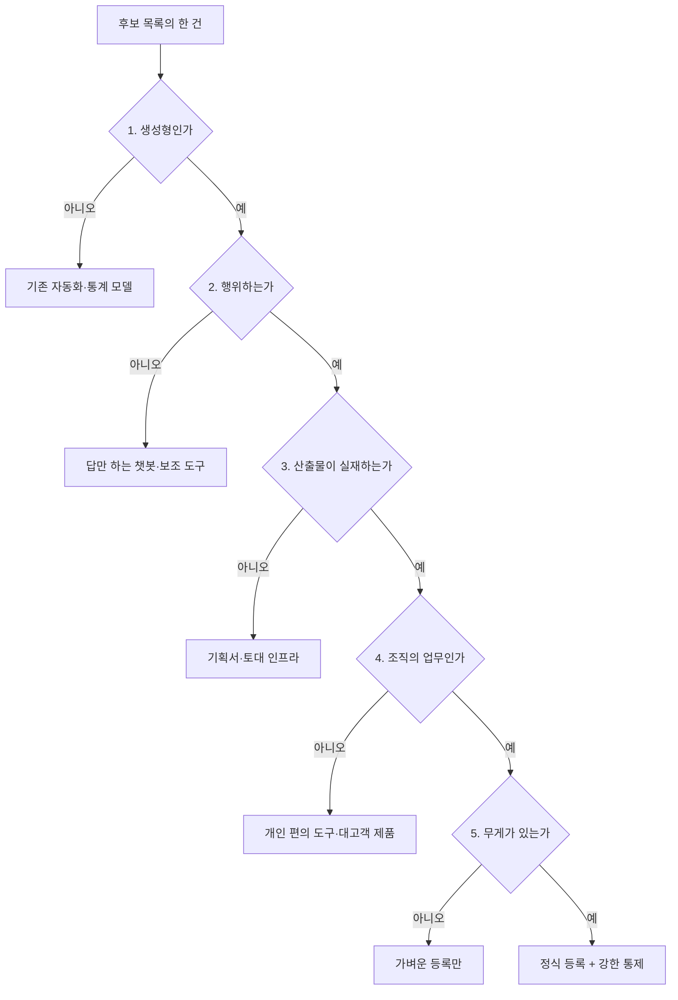

# 2장. 세어보면 다 있는데, 대보면 없다

2025년 6월, 시장조사 기관 가트너(Gartner)가 짧은 추정치 하나를 내놓았다. 에이전틱 AI를 표방하는 벤더가 수천 곳인데, 그중 실제로 에이전틱이라고 부를 만한 역량을 갖춘 곳은 **약 130개**라는 것이다. 가트너는 이 현상에 이름까지 붙였다. **에이전트 워싱(agent washing)** — 기존 챗봇과 자동화 도구, 예전 RPA에 에이전트라는 라벨만 새로 붙이는 일이다. (가트너 발표, 2025년 6월 25일. 원문 페이지에 직접 접근하지 못해 복수 매체 교차 확인을 거친 수치임을 밝혀 둔다.)

이 숫자를 액면 그대로 믿을 필요는 없다. 가트너가 무엇을 "실제 에이전틱 역량"으로 셌는지는 공개되지 않았다. 그래도 방향은 남는다. 이름은 값이 싸고 실체는 값이 비싸다. 그래서 이름표를 세는 것과 실체를 세는 것 사이의 간극이 자릿수 단위로 벌어질 수 있다.

열 달 뒤에 나온 다른 조사는 이 간극을 조직 안쪽에서 다시 보여준다. 딜로이트(Deloitte)가 24개국 IT·비즈니스 리더 3,235명을 대상으로 한 조사(2026년 4월 24일 발표)에서, 에이전틱 AI를 최소한 "어느 정도는" 쓰고 있다고 답한 비율은 **23%**였다. 그런데 에이전틱 AI에 성숙한 거버넌스 모델을 갖췄다고 답한 비율은 **21%**였다.

두 숫자가 거의 같으니 균형이 맞는 것 아니냐고 읽고 싶어진다. 딜로이트 보고서의 제목이 이미 답을 말한다. *"AI 에이전트가 가드레일보다 빠르게 확산되고 있다."* 같은 조사에서 2027년까지 최소한 어느 정도는 쓰겠다고 답한 비율은 74%였다. 쓰는 쪽은 세 배 넘게 늘어날 예정인데 갖춘 쪽은 그 자리에 있다면, 지금의 균형은 곧 벌어질 간격의 출발점에 가깝다.

여기까지가 밖에서 보이는 풍경이다. 그런데 이 장면을 남의 이야기로 읽고 넘어가면 곤란하다. 당신 조직의 목록도 정확히 같은 방식으로 만들어졌기 때문이다.

한 가지만 먼저 갈라두자. 조직이 어느 칸에 있는지를 재는 것은 진단이고, 진단은 이미 끝났거나 최소한 시작은 했을 것이다. 지금 하려는 일은 그 조직에 무엇이 있는지를 세는 것이다. **성숙도가 아니라 재고다.** 진단은 점수를 남기고, 재고는 목록을 남긴다. 그리고 체계는 점수 위에 세울 수 없다. 목록 위에 세운다.

## 이름표를 세면 목록은 불어난다

조직이 "AI 과제를 공모합니다"라는 공지를 한 번 띄우면 무슨 일이 벌어질까? 목록은 아주 빠르게 불어난다. 이건 좋은 신호다. 앞 장에서 봤듯 씨앗은 아래에서 올라오고, 공모는 그 씨앗을 위로 끌어올리는 가장 값싼 장치다. 보고 자리에서도 그 숫자는 훌륭하게 작동한다. "저희 조직에는 이미 이만큼의 AI 과제가 있습니다."

그런데 그 목록을 한 건씩 열어보기 시작하면 표정이 바뀐다.

상당수는 몇 년 전에 만들어진 규칙 기반 자동화다. 잘 돌고 있고 성과도 분명한데, 이번 공모에 맞춰 소개 문구만 새로 쓴 것이다. 또 어떤 것은 분류 모델을 붙인 데이터 분석 과제다. 예측 정확도를 개선하는 훌륭한 일이지만 스스로 무언가를 하지는 않는다. 세 번째 부류는 아직 아이디어 문장 한 줄이다. 만들 사람도, 붙일 시스템도, 착수 시점도 정해지지 않았다. 여기에 개인 편의 도구와 대고객 서비스의 기능 하나까지 섞여 들어온다.

이름표는 전부 "AI 과제"다. 실체는 전부 다르다.

공모라는 장치 자체의 성질도 한몫한다. 목록에 올리면 관심과 지원을 받고, 안 올리면 없는 것이 된다. 그러니 애매하면 올린다. 각자의 자리에서는 합리적인 판단이다. 문제는 그 합리적인 행동들이 모여 만든 목록을, 취합하는 쪽에서 있는 그대로의 실태로 읽는다는 데 있다.

**그래서 조직은 자기가 가진 것을 실제보다 훨씬 많다고 믿게 된다.** 이 착시가 왜 위험할까? 부풀려진 목록 자체는 참을 만하다. 문제는 그다음이다. 그 목록을 근거로 제도를 설계하면 제도가 헛돈다.

세 갈래로 헛돈다. 첫째, 등록 스키마를 만들었는데 등록할 대상의 상당수가 등록할 필요가 없는 것이다. 등록부는 첫 달부터 잡음으로 채워지고, 두 달째부터는 아무도 안 본다. 둘째, 자율성 등급표를 만들었는데 애초에 자율적으로 도는 게 거의 없다. 정교한 표의 항목이 전부 최하 등급에 몰려 있으면 그 표는 아무 결정도 돕지 못한다. 셋째, 예산과 인력은 목록 크기에 비례해 잡히는데 실제 운영 부담은 다른 곳에서 발생한다. 스무 건을 관리할 준비를 했는데 정작 손이 가는 건 세 건이고, 그 세 건에는 아무도 배정되어 있지 않다.

여기서 흔히 나오는 대응이 "그럼 키워드로 한번 걸러봅시다"다. 해보면 알겠지만 이건 거의 아무것도 걸러내지 못한다. 이름을 붙이는 사람과 실체를 만드는 사람이 다르고, 이름은 유행을 따라가기 때문이다. 오히려 작년에 만들어진 진짜 실행형 자동화가 이름이 촌스럽다는 이유로 탈락하고, 이번 달에 적힌 아이디어 한 줄이 세련된 이름 덕에 통과한다. 밖에서 벤더들이 하는 일을 조직 안에서 그대로 반복하는 셈이다. 듣기 편한 이야기는 아니지만 사실이다.

이 장이 어느 칸을 움직이려는지도 밝혀두자. 1장에서 깔아 둔 여섯 축·다섯 단계의 격자로 말하면, 재고 조사는 **보안·거버넌스(축 J)와 기획·개발(축 B)을 1단계 각자도생에서 2단계 반복으로** 옮기는 일이다. 각자 알아서 세던 상태에서 같은 기준으로 두 번 셀 수 있는 상태로 넘어가는 것이다. 소박한 진전이다. 그런데 이 칸을 건너뛰고 3단계 레일을 깔면 깔아놓은 레일 위로 아무것도 지나가지 않는다. 레일은 대상이 정해진 다음에야 의미가 있다.

## 밖에서도 목록은 빠르게 분다

이게 한 조직만의 문제라면 오히려 다행이다. 대조군을 하나 보자.

미국 연방정부는 각 기관이 연례 AI 활용 사례 인벤토리를 작성해 예산관리국에 제출하고, 공개 가능한 항목은 기관 웹사이트에 게시하도록 하고 있다. 관리 지침에 근거한 의무이고, 제출본은 공개 저장소에 원자료로 올라온다. 2025년 인벤토리에는 **56개 기관에서 3,611건**이 제출됐다. 전년의 1,757건과 비교하면 **105% 증가**다. (미국 정부 공개 원자료.)

일 년 만에 두 배가 됐다는 사실은 조심해서 읽어야 한다. 활용이 실제로 두 배가 됐을 수도, 세는 관행이 자리 잡으면서 원래 있던 것이 드러났을 수도, 제출 기준이 넓어졌을 수도 있다. 셋 다일 가능성이 가장 높다. 어느 쪽이든 한 가지는 분명하다. **공식적으로 세기 시작하면 목록은 빠르게 분다.** 정부에서도 그렇다. 그러니 조직의 목록이 지난 분기 대비 두 배가 됐다는 사실 자체는 좋은 소식도 나쁜 소식도 아니다. 그건 늘었다는 뜻이기 전에 세기 시작했다는 뜻이다. 이 구분을 못 하면 증가율이 성과 지표가 되고, 증가율이 성과 지표가 되는 순간 목록은 다시 부풀기 시작한다.

이 인벤토리에서 진짜로 눈여겨볼 것은 총 건수보다 분류 항목 쪽이다. 스키마에는 시스템을 여섯 가지로 나누는 `classification` 필드가 있는데, 그 여섯 값 중 하나가 `Agentic`이다. 고전적 머신러닝, 컴퓨터 비전, 생성형 AI, 자연어 처리, 강화학습과 나란히 에이전틱이 독립된 값으로 앉아 있다.

이게 왜 중요할까? **정부가 에이전트를 따로 세고 있다는 뜻이기 때문이다.** 생성형 AI 안에 뭉뚱그리지 않고 별도의 값으로 갈라 세야 할 이유가 있다고 판단했다는 것이다. 그리고 이 판단은 행정이 내렸다. 누군가는 이 필드를 채워야 했고, 채우려면 갈라야 했다. 여기저기서 "무엇을 에이전트라고 부를 것인가"를 두고 회의를 한 시간씩 하고 있을 때, 어떤 등록 체계는 이미 그 칸을 만들어 두고 데이터를 받고 있다. 세야 해서 갈라본 쪽이 먼저 도착했다.

이 사례에서 하나 더 가져갈 것이 있다. 이 목록은 매년 작성되고, 공개 가능한 항목은 밖에 게시된다. 지난번 목록과 이번 목록을 대볼 수 있고, 누군가 그것을 읽고 물어볼 수 있다. 목록에 검증 압력이 걸리는 것이다. 당신 조직의 목록은 어떤가? 대개 한 번 취합되고, 보고에 쓰이고, 다음 취합 때 새로 시작한다. 그러면 목록은 그때그때 필요한 모양으로 만들어진다. 설명은 간단하다. **읽는 사람이 없는 목록은 정확할 이유가 없다.** 그러니 재고 조사를 설계할 때 절차만 설계하지 말고 주기와 공개, 이 두 조건을 함께 얹는 편이 낫다.

여기서는 규모와 증가율까지만 보자. 이 정도로 잘 설계된 스키마를 갖춘 등록부가 실제로 어떻게 작동했는지는 5장에서 정면으로 본다. 미리 한 줄만 말해두면, 그쪽 이야기는 여기보다 훨씬 불편하다. 필드가 잘 설계돼 있다는 것과 그 필드가 실제로 채워진다는 것은 완전히 다른 문제이기 때문이다.

## 미루던 일에 기한이 붙었다

재고 조사가 좋은 일이라는 건 다들 안다. 문제는 좋은 일이 늘 밀린다는 것이다. 분기 목표에는 "재고 조사 완료"보다 "에이전트 3종 오픈"이 훨씬 잘 어울린다. 재고 조사에는 데모가 없고, 데모가 없는 일은 보고 자리에서 두 번째 슬라이드를 넘기지 못한다. 그래서 이 일은 하고 싶은 사람도 없고 반대하는 사람도 없는 채로 다음 분기로 넘어간다.

그런데 2026년 9월 기준으로, 국내 조직에는 이 미루기를 어렵게 만드는 외부 압력이 하나 생겼다.

**「인공지능 발전과 신뢰 기반 조성 등에 관한 기본법」이 2026년 1월 22일에 시행됐다.** 흔히 AI 기본법이라고 부르는 그 법이다. 고영향 인공지능과 생성형 인공지능을 다루는 사업자에게 구체적인 책무를 지운다. 그중 실무에 가장 먼저 닿는 것이 투명성 확보 의무다 — 고영향 AI 또는 생성형 AI를 활용한 제품·서비스를 제공할 때, AI를 기반으로 운영된다는 사실을 이용자에게 사전에 알려야 한다. 여기에 안전성 확보 의무가 따라붙는다.

많은 조직이 여기서 한 번 안심한다. "우리는 모델을 만들지 않는데요."

그 안심이 유효하지 않다는 것이 이 법의 핵심이다. 의무 주체의 범위에 모델을 만드는 회사만이 아니라, 남이 만든 AI를 이용해 제품·서비스를 제공하는 회사까지 포함된다. **"AI를 만들지 않고 쓰기만 한다"는 면책 사유가 되지 못한다.** 상용 모델을 API로 붙여 사내 업무를 자동화하고 그 결과가 어떤 형태로든 고객에게 닿는다면, 그 조직은 이 법이 말하는 인공지능사업자다.

이 범위가 실무에서 어떻게 번지는지 따라가 보자. 고객 문의에 답하는 초안을 모델이 쓰고 상담사가 손봐서 보낸다고 해보자. 이건 AI 기반 운영인가? 도구와 서비스를 가르는 선을 어디에 긋느냐에 따라 판단이 갈릴 수 있다. 그런데 판단이 갈리든 말든, 판단을 하려면 그런 흐름이 조직 안에 몇 개나 있는지부터 알아야 한다. 목록이 없으면 판단할 대상 자체가 없다.

계도 기간은 있다. 시행 후 최소 1년 이상으로 알려져 있으니 2027년 초 무렵까지는 시간이 있는 셈이다. 다만 정확한 종료 시점은 이 책을 쓰는 2026년 9월 기준으로 확정 공표된 것을 확인하지 못했다. 규제 정보는 분기 단위로 바뀌니 실제 대응을 설계할 때는 소관 부처의 최신 고시를 함께 확인하는 편이 낫다. (여기서는 조문 번호를 인용하지 않는다. 시행일과 의무 주체의 범위, 계도 기간의 성격까지만 이야기한다.)

계도 기간을 어떻게 읽을 것인가도 중요하다. 유예로 읽으면 다음 분기로 밀리고, 설계 창으로 읽으면 지금이 가장 값싼 시점이 된다. 등록할 대상이 적을 때 체계를 세우는 것과 이미 수백 개가 돌 때 세우는 것은 난이도가 다르다. 뒤에 세우면 세는 일과 정리하는 일과 설명하는 일을 동시에 해야 한다. 앞 장에서 이 책이 "지금 난리가 났다"고 쓰지 않기로 한 이유가 여기 있다. 난리가 나기 전이라서 값싸게 할 수 있는 것이다.

자, 이제 실무적인 질문 하나가 남는다. 사전 고지 의무를 지키려면 무엇을 먼저 알아야 하는가? 무엇이 AI 기반으로 돌아가고 있는지를 알아야 한다. 어느 화면의 어느 응답이, 어느 배치 작업의 어느 산출물이 모델을 거쳐 나오는지를 알아야 고지할 대상을 정할 수 있다. 안전성 확보 의무도 마찬가지다. 대상을 모르면 조치할 범위도 모른다.

**재고를 모르면 대응할 대상도 모른다.** 이 한 줄이 재고 조사에 외부 기한을 붙인다. 이제 이 일은 하고 싶은 사람이 없어도 굴러가야 하는 일이 됐다.

## 관문 다섯 개 — 이 책이 남기는 첫 도구

그렇다면 어떻게 세야 할까?

가장 먼저 떠오르는 방법은 좋은 정의를 하나 만드는 것이다. "AI 에이전트란 무엇인가"를 정의하고 거기 맞는 것만 세자는 것이다. 해본 조직은 알겠지만 이 길은 대체로 막힌다. 정의 회의를 세 번쯤 하면 참석자 수만큼의 정의가 생기고, 그중 어느 것도 목록의 애매한 항목을 갈라주지 못한다. 정의는 회의실에서 합의되지만 판정은 항목 하나하나에서 일어나기 때문이다. 게다가 내가 만든 것이 정의 안에 들어와야 지원을 받으니, 회의는 개념 토론의 형태를 한 예산 협상이 된다.

한 번의 기준으로 거르려는 시도도 비슷하게 실패한다. 느슨하게 잡으면 아무것도 걸러지지 않고, 빡빡하게 잡으면 정작 중요한 것까지 함께 떨어진다. 그리고 떨어진 쪽에서 항의가 들어왔을 때 "기준에 안 맞아서요"로는 설명이 되지 않는다.

그렇다고 정의 없이 가자는 말은 아니다. 참조점은 필요하고, 좋은 참조점은 이미 나와 있다. 에이전트를 만드는 회사들이 각자 정의를 걸어두었고, 나란히 놓으면 쓸모가 있다.

| 출처 | 정의 |
|---|---|
| OpenAI, 『A Practical Guide to Building Agents』 (2025) | "Agents are systems that **independently** accomplish tasks on your behalf." — 사용자를 대신해 과업을 독립적으로 완수하는 시스템 (강조는 원문) |
| Anthropic, 「Building Effective Agents」 (2024-12) | "Agents are systems where LLMs dynamically direct their own processes and tool usage, maintaining control over how they accomplish tasks." — LLM이 자기 프로세스와 도구 사용을 동적으로 지휘하며 과업 수행 방식의 통제권을 쥔 시스템. 미리 짜인 경로를 따르는 워크플로(workflow)와 명시적으로 구분한다 |
| Google, 에이전트 백서 (2024) | "an application that attempts to achieve a goal by observing the world and acting upon it using the tools that it has at its disposal" — 가진 도구로 세계를 관찰하고 그에 작용하여 목표를 달성하려는 애플리케이션 (백서 원문 PDF는 미접근 — 문면은 독립된 2차 문헌 다수로 교차 확인했다) |

문장은 제각각이지만 셋이 가리키는 곳은 같다. **목표**가 있고, 도구로 외부에 **작용**하며 — 읽고 보여주기만 하는 게 아니라 — 그 과정을 **스스로 결정**한다. 그리고 셋 다 무엇이 아닌지도 함께 말한다. OpenAI의 가이드는 정의 바로 아래에 이렇게 못 박는다. LLM을 쓰더라도 그것으로 실행 흐름을 제어하지 않으면 — 단순 챗봇, 단발 호출, 분류기라면 — 에이전트가 아니다.

이 공통분모를 손에 들면 흔한 목록의 정체가 미리 보인다. 대시보드는 관찰만 하고 작용하지 않는다. 규칙 기반 알람은 작용하지만 스스로 결정하지 않는다. 음성이나 이미지 처리를 자동화한 것은 정해진 경로를 벗어나지 않는다. 셋 다 훌륭한 도구이고 값을 내고 있을 것이다. 다만 세 정의 중 어느 것으로도 에이전트는 아니다.

그런데 이 좋은 정의들을 실제 목록에 대보면 곧 한계가 온다. "독립적으로"는 어디부터인가. 사람이 마지막에 한 번 승인하면 독립이 깨지는가. "동적으로 지휘한다"는 분기 하나면 충분한가. 정의는 방향을 주지만, 판정은 해주지 않는다.

그래서 방향을 바꿔보자. **한 번에 거르지 말고, 관문을 여러 개 세워 단계적으로 좁힌다.** 실제로 작동한 관문의 순서는 대략 이렇다.

**① 생성형인가.** 기존의 규칙 기반 자동화, 통계 모델, 예전부터 돌던 배치 작업을 여기서 걸러낸다. 걸러진 것들에도 값이 있다는 점을 판정 결과에 꼭 적어두자. 잘 돌고 있다면 그대로 두면 된다. 이 한 줄을 안 적으면 첫 관문부터 반발이 생긴다.

**② 행위하는가.** 답만 하는 것과 실제로 하는 것을 가른다. 챗봇과 초안 도구는 여기서 갈라지고, 반대편에는 쓰고 보내고 등록하고 처리하는 것들이 남는다. 판정이 헷갈리면 이렇게 물어보자. 결과물이 사람의 손을 거치지 않고 다음 단계로 넘어가는가? 사람이 복사해 붙여넣어야 다음이 진행된다면 아직 이쪽이 아니다.

**③ 산출물이 실재하는가.** 기획서만 있는 것, 아직 만들어지지 않은 것, 다른 것들이 올라탈 토대 인프라인 것을 걸러낸다. 마지막 항목이 특히 헷갈린다. 공용 게이트웨이나 프롬프트 관리 도구는 AX의 핵심 자산이지만 그 자체가 등록·평가의 단위는 아니다. 별도의 인프라 목록으로 빼두자. 섞어두면 나중에 성과를 셀 때 분모가 이상해진다.

**④ 조직의 업무인가.** 개인 편의 도구와 대고객 제품을 걸러낸다. 판정 기준은 하나다 — 팀의 업무와 목표에 연결되는가. 누군가 혼자 만들어 혼자 쓰는 훌륭한 도구는 이 체계의 대상이 아니다. 그렇다고 없애라는 뜻은 전혀 아니다. 오히려 그런 도구가 많다는 건 좋은 신호다.

**⑤ 무게가 있는가.** 되돌릴 수 없는 일을 하는가, 돈·대외 커뮤니케이션·민감정보를 건드리는가. 여기까지 통과한 것이 정식 등록과 강한 통제의 대상이다. 이 관문은 앞의 넷과 성격이 다르다. 앞의 넷은 대상 여부를 가르지만, 이 관문은 대상 안에서 강도를 가른다.

그림 1. 재고 조사의 다섯 관문

각 관문을 지날 때마다 후보는 크게 줄어든다. 마지막에 남는 것은 처음 목록의 아주 일부다. 처음 이 절차를 돌려본 사람은 대개 두 번 놀란다. 한 번은 이렇게 많이 떨어진다는 데 놀라고, 또 한 번은 떨어진 것들이 하나같이 "떨어질 만했다"는 데 놀란다.

그래서 보고하는 자리에서는 프레임을 미리 잡아두는 편이 낫다. 목록이 줄어든 것은 초점이 생겼다는 뜻이다. 이 문장을 준비하지 않고 회의에 들어가면 두 배로 불어난 숫자를 자랑했던 지난 분기의 자료가 곧바로 되돌아온다. 꽤 곤혹스러운 자리가 된다. 떨어진 항목들을 사유별로 묶은 표를 함께 준비하자. 그러면 "줄었다"가 "정리됐다"로 읽힌다.

이 관문을 누가 돌리는가도 설계에 속한다. 중앙 조직이 전부 판정하겠다고 나서면 판정이 밀리고, 현장이 방어적으로 적기 시작한다. 앞 장의 결론이 여기에도 적용된다 — 중앙은 관문과 판정 기준을 공급하고, 판정은 그 업무를 아는 도메인 조직이 한다.

## 관문의 순서가 곧 정의다

여기서 이 장의 핵심 통찰이 나온다. 조금 천천히 읽어주면 좋겠다.

**정의를 만들지 않았는데 정의가 생겼다.**

다섯 관문을 순서대로 통과시키고 나면 "이 조직이 AI 에이전트라고 부르는 것"의 외연이 확정된다. 그 외연은 항목 하나하나의 판정이 쌓여 만들어졌다. 그리고 이렇게 만들어진 정의에는 추상적 정의가 갖지 못하는 성질이 셋 있다.

첫째, **다시 돌릴 수 있다.** 다음 분기에 새 후보 목록이 들어와도 같은 관문을 같은 순서로 통과시키면 된다. 정의 문서는 개정 회의를 열어야 바뀌지만, 관문은 그냥 다시 돌리면 된다.

둘째, **판정자가 바뀌어도 결과가 크게 흔들리지 않는다.** 앞으로 이 책은 등급이니 계수니 하는 판정 장치를 여러 개 세울 텐데, 그런 장치는 대개 판정의 편차 때문에 무너진다. 정교하게 만들어도 사람마다 다르게 판정하면 소용이 없다. 관문을 질문 형태로 잘게 쪼개두면 그 편차가 줄어든다.

셋째, **설명할 수 있다.** 떨어진 쪽에 "왜요"라고 물었을 때 답할 문장이 있다. "세 번째 관문에서 산출물이 아직 없어서 이번 회차 대상이 아닙니다. 만들어지면 다음 회차에 다시 봅니다." 이 답은 절차처럼 들린다.

"에이전트란 무엇인가"를 추상적으로 논쟁하는 대신 거르는 절차를 만들면 정의가 저절로 확정된다. 이것이 이 책이 정의를 다루는 방식이고, 5장의 등록 스키마와 7장의 자율성 등급에서도 같은 방식을 쓴다. **절차를 만들어서 개념을 확정한다.** 순서가 거꾸로다.

관문의 순서에도 이유가 있다. 값싼 판정을 앞에, 비싼 판정을 뒤에 놓았다. ①과 ②는 과제 설명서만 읽어도 대개 판정된다. ③과 ④는 담당자에게 한 번 물어봐야 한다. ⑤는 실제로 무엇을 건드리는지 확인해야 하므로 가장 비싸다. 순서를 뒤집으면 모든 항목에 대해 "돈을 건드리는가"를 확인하느라 몇 주가 지나가고, 그중 대부분은 애초에 생성형도 아니었다는 걸 나중에 알게 된다. 비싼 판정을 앞에 두면 재고 조사 자체가 큰 프로젝트가 되고, 큰 프로젝트가 되는 순간 다시 다음 분기로 밀린다. **한 사람이 며칠 안에 1차 통과를 끝낼 수 있어야 이 절차는 살아남는다.**

물론 이 방식에도 대가가 있다. 정의를 절차로 만들었다는 것은 절차가 바뀌면 정의도 바뀐다는 뜻이다. 관문 하나의 문구를 손보면 지난 분기에 통과했던 것이 이번 분기에 떨어질 수 있고, 그러면 "작년에는 대상이라더니 왜 지금은 아니냐"는 정당한 질문이 들어온다. 해법은 변경 이력이다. 관문 문구를 바꿀 때마다 언제, 무엇을, 왜 바꿨는지를 한 줄씩 적어두자. 처음에 "행위하는가"라고만 적었던 관문이 반년 뒤에 "결과물이 사람의 손을 거치지 않고 다음 단계로 넘어가는가"로 구체화됐다면, 그 사이에 어떤 판정에서 막혔는지가 그 변경에 담겨 있다.

판정자 둘의 의견이 갈리는 항목도 반드시 나온다. 억지로 한쪽으로 밀어 넣지 말고 **판정 보류 칸**을 만들어 모아두자. 서너 개 쌓이면 공통으로 걸리는 지점이 보이고, 그 지점이 다음 관문 개정의 재료가 된다.

이 관문을 실제 목록에 대보면 어떤 그림이 나오는지, 하나의 관찰을 적어둔다. 내 주변에서 "조직에서 쓰는 에이전트"라 불리는 것들을, 앞의 세 정의를 손에 들고 하나씩 열어본 적이 있다. 대부분 대시보드였다. 나머지는 규칙 기반 알람이었고, AI를 쓴다는 것도 열어보면 음성이나 이미지 처리를 자동화한 것이었다. 첫 관문과 두 번째 관문을 넘는 것이 거의 없었다. 목록은 길었지만, 이 장의 정의로 에이전트라 부를 만한 것은 그 안에 사실상 없었다.

반대쪽 그림도 있다. 개인의 업무를 돕는 에이전트는 빠르게 늘고 있다. 블로그 초안을 대신 써서 올려 주는 것, 보안 시스템이 통보한 공격 IP를 방화벽에 자동으로 차단 등록하는 것 — 나도 그런 것을 몇 개 만들어 쓰고 있고, 내 일을 꽤 덜어준다. 그런데 이것들을 전제 관문에 대보면 판정이 갈린다. 조직의 업무 흐름에 연결된 것도 있고, 내 개인 산출을 돕는 도구에 머무는 것도 있다. 그리고 어느 쪽이든 "한 사람 몫의 역할을 맡겨 정식 등록까지 갈 물건인가"라고 물으면, 아직 아니라고 답하게 된다.

두 관찰을 겹치면 재고 조사의 실제 모양이 나온다. 조직 명의의 목록에는 에이전트가 아닌 것이 가득하고, 에이전트에 가까운 것은 개인의 책상 위에 흩어져 있다. 관문은 앞의 것을 걷어내는 도구다. 뒤의 것을 조직으로 끌어올리는 통로는 6장에서 만든다 — 모두에게 식별자를 주되, 자격을 갖춘 것만 정식 등록으로 올리는 두 계층이 그것이다. 그러니 재고 조사가 끝났을 때 "우리는 아직 에이전트가 없다"는 결론이 나와도 이상하지 않다. 그것은 실패한 조사가 아니라, 처음으로 정확해진 목록이다.

## 실무자에게는 질문 셋이면 된다

관문 다섯 개는 취합 담당자가 목록 전체를 훑을 때 쓰는 도구다. 현장의 실무자에게는 다른 형태가 필요하다. 자기가 만든 것 하나를 두고 "이건 등록 대상인가"를 30초 안에 판단해야 하기 때문이다. 다섯 개짜리 흐름도를 띄워놓고 고민하게 만들면 대부분은 그냥 안 하고 넘어간다.

압축하면 전제 하나와 질문 셋이 된다.

| | 묻는 것 | 아니라면 |
|---|---|---|
| **전제** | 조직의 업무인가 (팀 목표에 연결되는가) | 대상 아님 |
| **①** | 실제로 행동하는가 (쓰기·발송·처리) | 가볍게 등록만 |
| **②** | 스스로 도는가 (사람은 예외 상황에만 개입) | 보통 등록 |
| **③** | 되돌릴 수 없는 일인가 (돈·대외·민감정보) | 등록 + 모니터링 |
| | 셋 다 그렇다 | **정식 등록 + 강한 통제** (승인 게이트·감사 로그·킬 스위치) |

세 질문이 각각 무엇을 결정하는지 짚고 가자. ①은 관리 대상 여부를, ②는 얼마나 자주 볼 것인지를, ③은 무엇을 미리 막을 것인지를 정한다. 사람이 매번 확인하는 물건은 사람이 감시자 역할을 하지만, 스스로 도는 물건은 아무도 안 볼 때 무언가를 한다.

오른쪽 열의 세 단계도 실체가 있어야 한다. 말만 다르고 처리가 같으면 실무자는 금방 알아채고 대충 답한다. 가볍게 등록만은 이름·담당자·용도를 남기고 분기마다 살아 있는지 확인하는 것, 보통 등록은 여기에 실행 기록과 비상 연락처가 더해진 것, 등록 + 모니터링은 결과를 주기적으로 들여다보고 이상 징후에 알림이 가는 상태다. 이렇게 갈라두면 실무자는 귀찮은 일이 얼마나 늘어나는지 미리 알 수 있고, 알 수 있으면 정직하게 답한다.

이 표를 처음 보면 관문 다섯 개를 그냥 줄여놓은 것처럼 보인다. 그런데 하나가 결정적으로 달라졌다. **판정 결과가 통과/탈락이 아니라 통제의 강도다.**

이 차이가 이 책 전체에서 가장 중요한 설계 결정 중 하나로 이어진다.

> **통제의 강도를 에이전트의 능력이 아니라 되돌릴 수 없음의 정도로 정한다.**

조이는 대상은 위험한 정도로 정해진다. 예를 들어보자. 최신 모델을 쓰고, 여러 도구를 엮어 복잡한 분석을 수행하고, 결과를 잘 정리된 보고서로 내놓는 물건이 있다. 대단히 정교하다. 그런데 그 보고서를 읽고 결정하는 것은 사람이고, 보고서가 틀렸다면 다시 만들면 된다. 되돌릴 수 있다. 반대로 아주 단순한 규칙 몇 줄로 도는 것이라도 대외 발송 버튼을 누른다면 이야기가 다르다. 나간 메일은 돌아오지 않는다.

직관은 자꾸 전자를 무섭게 여긴다. 정교한 것이 통제하기 어려워 보이기 때문이다. 직관을 거스르는 쪽이 맞다. 통제해야 할 것은 되돌릴 수 없는 행동 쪽이다.

학술 쪽에서도 같은 방향의 이야기가 나온다. AI 시스템에 식별자를 부여하는 일이 언제 가장 정당화되는지를 다룬 연구(Chan, 2024, 「IDs for AI Systems」 — 아직 동료평가를 거치지 않은 프리프린트다)는 그 지점을 이렇게 짚는다 — AI 시스템이 세상에 큰 영향을 미칠 수 있는 상황, 예컨대 "금융 거래를 하거나 실제 사람과 접촉하는" 곳이다. 위험은 능력이 높은 곳보다 닿는 곳에 있다.

같은 연구 계열이 "가시성(visibility)"을 정의하는 방식도 이 워크시트와 잘 맞는다(Chan 외, 2024, FAccT 게재 동료평가 논문). 어떤 에이전트가 **"어디서·왜·어떻게·누구에 의해"** 쓰이는가에 대한 정보가 가시성이다. 방금 만든 세 질문은 이 중 "어떻게"와 "어디서"를 묻고 있다. 나머지 둘 — 왜, 누구에 의해 — 은 5장의 등록 스키마가 맡는다. 재고 조사는 가시성의 절반을 확보하는 일이다.

임원 자리에서 쓸 만한 비유도 하나 있다. 같은 연구진이 이듬해 낸 후속 논문(Chan 외, 2025, TMLR 게재)은 에이전트에 식별자를 붙이는 일을 이미 세상에 있는 제도들에 빗댄다 — 소비재의 일련번호, 항공기의 기체등록번호, 사업자등록번호. 전부 리스크와 사고를 관리하기 위해 존재하는 번호들이다. 이 비유의 힘은 익숙함에 있다. 이미 여러 영역에서 오래 하던 일을 여기서도 하자는 이야기로 들리기 때문이다.

실무 규칙으로 옮기면 간단하다. **결제와 대외 커뮤니케이션에 닿는 것부터 등록하자.** 전부 등록하려다 아무것도 등록 못 하는 것보다 훨씬 낫다. 그리고 이 세 질문은 별도 회의 안건으로 만들지 말고, 만드는 사람이 착수할 때 채우는 신고 양식에 그대로 넣자. 판정을 나중에 몰아서 하면 그건 감사가 되고, 만들 때 함께 하면 그건 설계가 된다.

## 진짜 관문은 API 쪽에 있다

여기서 뼈아픈 이야기를 하나 해야겠다.

세 질문을 실제 후보에 적용해보면 관문 ①에서 예상보다 많은 것이 떨어진다. 그런데 떨어지는 이유가 예상과 다르다. **떨어지는 이유는 대개 대상 시스템 쪽에 있다. 행동을 걸 인터페이스가 없는 것이다.**

기획서에는 이렇게 적혀 있다. "에이전트가 승인 요청을 확인하고 처리한다." 그런데 그 승인 시스템에는 외부에서 호출할 수 있는 인터페이스가 없다. 사람이 화면에 로그인해서 버튼을 누르는 것만 가능하다. 그러면 이 에이전트는 정의상 아무리 훌륭해도 아무것도 못 한다. 화면을 흉내 내는 우회로가 없는 건 아니지만, 그 우회로는 화면이 한 번 바뀌면 조용히 깨지고 깨진 걸 아무도 모른 채 며칠이 지난다. 그런 물건을 정식 자원으로 등록하는 건 곤란하다.

이건 놀랍도록 흔하다. 그리고 이 대목에서 많은 조직이 처음으로 불편한 사실과 마주한다. **AX 체계를 세우려고 시작한 일이 결국 디지털 전환 숙제로 되돌아온다.** 몇 년 전에 미뤄둔 레거시 시스템의 인터페이스 개방, 데이터 표준화, 계정·권한 체계 정비 같은 것들 말이다. AI가 그 숙제를 건너뛰게 해줄 거라는 기대가 있었을 텐데, 아쉽게도 그렇지 않다. AI가 하는 일은 미룬 숙제가 어디에 있는지를 아주 정확하게 알려주는 데까지다.

두 가지를 권하고 싶다.

첫째, **재고 조사 산출물에 "API 가용성" 열을 하나 추가하자.** 대상 시스템이 호출 가능한 인터페이스를 제공하는지, 부분적으로만 제공하는지, 사람만 조작 가능한지를 적는다. 세 값이면 충분하다. 이 열 하나가 나중에 강력한 근거 자료가 된다. "붙일 곳이 없어서 못 만든다"를 목록으로 보여줄 수 있기 때문이다. 같은 시스템이 여러 후보에서 반복해 걸린다면, 그 시스템 하나를 여는 것이 에이전트 열 개를 만드는 것보다 나은 투자다.

이 열은 예상 못 한 것도 드러낸다. 후보들이 특정 시스템 주변에 몰려 있다는 사실이다. 잘 열려 있는 시스템 주변에는 후보가 여러 개 붙어 있고, 닫혀 있는 시스템 쪽에는 아이디어조차 올라오지 않는다. 해봐야 안 된다는 걸 현장이 이미 알기 때문이다. 그러니까 후보 목록은 업무의 중요도를 그리는 대신 시스템의 개방도를 그리고 있다. 이 사실을 모르고 목록을 읽으면 정작 가장 손이 많이 가는 업무 영역이 AX 대상에서 통째로 빠진 채 계획이 세워진다. 꽤 위험한 일이다.

둘째, **이 열의 결과는 인프라 로드맵이 받아야 한다.** AX 추진 조직이 이 숙제를 자기 예산으로 떠안는 순간 AX는 시스템 연동 프로젝트가 되고 원래 하려던 일은 밀린다. 앞 장에서 이야기한 것처럼 중앙이 공급할 목록에는 기준·자원·제도가 들어가고, 과제 목록은 들어가지 않는다. "붙일 곳을 만드는 일"은 그중 자원에 해당한다. 기준을 만드는 조직이 자원까지 직접 만들려고 하면 둘 다 늦어진다.

## 눈에 안 보이는 재고를 어떻게 셀 것인가

지금까지 센 것은 전부 누군가 신고한 것이다. 그런데 조직 안에서 실제로 돌고 있는 것 중 상당 부분은 신고되지 않는다. 개인이 구독한 도구로 업무 문서를 만들고, 팀 단위로 결제한 서비스에 사내 자료를 넣고, 누군가 주말에 만든 스크립트가 어느새 팀의 정기 업무가 되어 있다. 흔히 섀도 AI(shadow AI)라고 부르는 영역이다.

먼저 수치에 대해 정직하게 밝혀두자. **섀도 AI에 관한 통계는 거의 전부 벤더 조사이거나 업계 조사다.** 조사 주체와 표본이 불분명한 것도 적지 않고, 집계 사이트를 거치며 원 출처가 흐려진 것도 많다. 그래서 이 책은 그 숫자들을 분위기 전달용으로만 쓰고 논증의 하중을 싣지 않는다. 다만 어느 조사를 봐도 방향은 같다. 생각보다 많고, 조직이 아는 것보다 많다. 직급이 높을수록 승인되지 않은 도구를 더 많이 쓴다는 결과를 담은 조사도 있는데, 조사 주체가 명확하지 않아 수치는 옮기지 않겠다. 방향만 놓고 봐도 곱씹을 만하다. 리더가 지키지 않는 규칙은 공지로 지켜지지 않는다.

섀도 AI는 바텀업의 성공 지표이자 실패 지표다. 아무도 시키지 않았는데 사람들이 알아서 쓰고 있다는 점에서 성공이고, 조직이 그것을 모른다는 점에서 실패다. 모르는 것은 거둘 수 없다.

여기서 갈림길이 나온다. 한쪽은 탐지와 차단이고, 다른 쪽은 공식 경로의 개선이다. 탐지 쪽 사람들이 자기 일을 설명하는 언어를 한번 보자. 어느 개발자 커뮤니티에 이런 문장이 올라온 적이 있다(2026년 7월 1일 게시).

> "지금 큰 관심사는 섀도 AI입니다. 그러니까 직원이 민감한 데이터를 ChatGPT에 붙여넣는 걸 **잡아내는(catching)** 거죠."

문장 자체는 아무 문제가 없다. 보안 담당자로서 정확한 서술이고, 실제로 해야 하는 일이기도 하다. 그런데 잡아낸다는 단어가 직원에게 어떻게 들릴지를 생각해보면 이야기가 달라진다. 잡아낸다는 말의 반대편에는 잡히는 사람이 있다. 그리고 그 사람은 대부분 회사가 안 주는 도구를 스스로 구해서 일을 더 잘하려고 한 사람이다. 국내 커뮤니티에 올라온 다른 한 줄이 그 사정을 잘 보여준다(게시 시점 상대 표기, 2026년 9월 조회 기준으로 2026년 5월 무렵).

> "일단 회사에서 AI 서비스를 지원 거의 안해주네요. 개인별로 쓰는건 개인이 하라고 하고(회사에서 쓰려고 개인이 AI 서비스 구독 ㅜ) 팀에는 클로드 프로?월 3만원짜리 지원하고 끝."

당신이 이런 상황에서 탐지부터 붙이면 무슨 일이 생길까? 도구는 사라지지 않고 더 안 보이는 곳으로 옮겨간다. 개인 계정으로, 개인 기기로, 퇴근 후로. 그리고 다음번 재고 조사에서 목록은 더 깨끗해 보이고 실체와의 간극은 더 벌어진다. 측정을 정확하게 만들려는 조치가 측정을 더 부정확하게 만드는 구조다. 이 구조는 8장과 9장에서 훨씬 더 위험한 형태로 다시 나온다. 미리 이름을 붙여두자면, 재는 행위가 재려는 대상을 숨게 만드는 문제다.

그래서 이 책이 권하는 설계 조건은 하나다. **공식 경로가 개인 경로보다 나아야 한다.** 조건을 구체적으로 적어보자. 공식 도구가 최신 모델을 쓰고, 결재 없이 오늘 신청해 오늘 쓸 수 있고, 제약이 업무 흐름을 망가뜨리지 않으면 섀도 AI의 상당 부분은 저절로 양지로 올라온다. 셋 중 하나만 어긋나도 사람들은 다시 개인 경로로 돌아간다. 재고 조사의 관점에서 보면 이건 데이터 품질 문제로 다루는 편이 낫다. 사람들이 숨기지 않아야 목록이 정확해진다.

측정 방식 자체도 바꾸는 편이 낫다. 성숙도나 활용도를 잴 때 대개 설문을 돌리는데, "AI 도구를 업무에 활용하십니까?"라는 질문이 실제로 재는 것은 응답이다. 대안은 산출물에 흔적이 있는지를 보는 것이다. 정부 공개 문서에서 언어모델이 개입한 흔적을 탐지한 연구가 있는데(앳킨슨·오브라이언, 2026, ICML 2026 워크숍 발표 논문), 연구진은 이 접근을 "진술된 의도가 아니라 드러난 행동에 기반한다"고 설명한다. 2021년 기준선에서는 흔적이 일관되게 0에 가까웠는데 2026년 기준으로는 조사한 10개 소스 중 4개에서 유의한 징후가 나타났다. 다만 언어모델 텍스트 탐지는 오탐과 미탐이 난제로 남아 있으니 이 수치는 추세로만 읽자. 가져갈 것은 질문의 형태다 — "몇 명이 쓴다고 답했나"를 "산출물에 흔적이 있나"로 바꿔 재는 것. 행동을 보는 측정은 사람을 심문하지 않는다는 부수 효과까지 딸려 온다.

## 판정하려는 순간, 판정할 근거가 없다

이제 워크시트를 손에 쥐었다. 관문 다섯 개와 질문 셋. 목록을 앞에 놓고 실제로 돌려보자.

①과 ②는 잘 굴러간다. 생성형인지 아닌지는 대개 한눈에 보이고, 행동하는지 답만 하는지도 설명서를 읽으면 갈린다. 그런데 ③과 ⑤에서 손이 멈춘다. 왜 그럴까?

이 두 관문을 판정하려면 **"이 에이전트가 무슨 절차를 수행하는가"**를 알아야 하기 때문이다. 산출물이 실재하는지 알려면 어떤 산출물이 나와야 하는지를 알아야 하고, 무게가 있는지 알려면 어떤 단계에서 무엇을 건드리는지를 알아야 한다. 이건 정보의 문제다. 판정자를 바꿔도 달라지지 않는다.

그래서 후보 목록의 그 칸을 열어본다. 대부분 비어 있다.

과제명이 있고, 담당자가 있고, 기대 효과가 한 줄 적혀 있다. 어떤 절차를 어떤 순서로 수행하는지, 각 단계에서 무엇이 나와야 하는지, 어디서 사람이 개입하는지는 어디에도 없다. 있다 해도 "AI가 처리한다" 수준이다. 담당자에게 물어보면 대개 잘 설명해준다. 머릿속에는 다 있고, 다만 어디에도 적혀 있지 않을 뿐이다.

**판정하려는 순간, 판정할 근거가 없다.**

이게 재고 조사가 실제로 막히는 지점이다. 흥미로운 건 이 벽이 워크시트가 작동한 증거라는 점이다. 관문이 제대로 만들어졌기 때문에 이 공백이 드러났다. 관문을 세우기 전에는 이 칸이 비어 있다는 사실조차 아무도 몰랐다. 세는 데는 아무 지장이 없었으니까. 세는 것과 대보는 것의 차이가 여기서 갈린다.

그러니까 이 장은 워크시트 말고 결론을 하나 더 남긴다.

**관문의 판정 가능성 자체가 절차 문서를 요구한다.**

등록 대상인지 판정하는 것만 하려고 해도, 그전에 그 에이전트가 무슨 일을 어떤 순서로 하는지가 어딘가에 글로 적혀 있어야 한다. 그리고 이 요구는 관문 다섯 개를 성실하게 통과시키려고 하니 저절로 나왔다.

워크시트를 다 만들고 목록을 다 훑고 나면, 자연히 다음 문장이 입에서 나온다.

*"그래서 그 절차를 적어야 하는데… 왜 그 말이 이렇게 반갑지 않은가."*

### 이 장의 핵심

- 이름표를 세면 조직은 자기가 가진 것을 실제보다 훨씬 많다고 믿는다. 부풀려진 목록 위에 제도를 설계하면 등록부는 잡음으로 채워지고, 등급표는 결정을 돕지 못하고, 예산은 엉뚱한 곳에 잡힌다.
- 정의를 합의하는 대신 거르는 절차를 만들자. 관문 다섯 개를 순서대로 통과시키면 정의가 저절로 확정된다. 그 정의는 다시 돌릴 수 있고, 판정자가 바뀌어도 덜 흔들리고, 떨어진 쪽에 설명할 수 있다.
- 통제의 강도는 되돌릴 수 없음의 정도로 정한다. 결제와 대외 커뮤니케이션에 닿는 것부터 등록하는 편이 낫다.
- 재고 조사에는 이제 외부 기한이 붙었다. 2026년 1월 시행된 AI 기본법의 의무 주체에는 남이 만든 AI를 이용해 제품·서비스를 제공하는 회사까지 포함된다.
- 판정하려는 순간 판정할 근거가 없다는 사실이 이 장의 진짜 발견이다. 관문이 제대로 만들어졌기 때문에 절차 문서의 공백이 드러났다.

---

다음 분기를 기다릴 것 없다. 이번 주에 할 수 있는 일이 있다.

기존 후보 목록에서 아무 항목이나 열 건을 뽑자. 무작위면 더 좋다. 그리고 그림 1의 관문 다섯 개를 순서대로 통과시켜보자. 한 건에 5분이면 된다. 떨어진 것들은 지우지 말고 왜 떨어졌는지 사유를 옆 칸에 적어두자. 그 칸이 다음 회차의 기준이 된다.

그러고 나서 살아남은 것들에 열을 두 개 더 만들어보자. 하나는 "대상 시스템에 호출 가능한 인터페이스가 있는가." 다른 하나는 "이 에이전트가 수행하는 절차가 적힌 문서가 있는가." 있으면 링크를, 없으면 빈칸을.

두 번째 열의 빈칸이 몇 개인지가 다음 장의 출발점이다.
