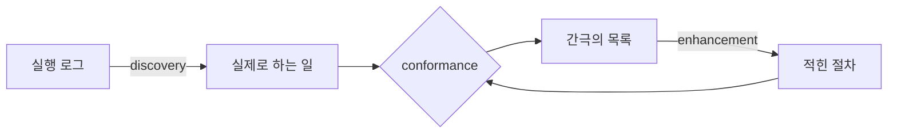

# 3장. 적힌 절차와 실제로 하는 일

2020년 7월, 한 개발자가 해외 기술 커뮤니티 게시판에 짧은 문장 하나를 남겼다.

> "Confluence is where documentation goes to die. And then rot."
> — 컨플루언스는 문서가 죽으러 가는 곳이다. 그리고 거기서 썩는다.

한 사람의 그날 기분이었다면 여기 옮길 이유가 없다. 그런데 같은 게시판에서 2019년 3월, 2022년 2월, 2023년 8월, 2024년 2월에 각각 다른 사람이 거의 같은 문장을 반복했다. 검색이 안 된다, 원하는 페이지를 찾을 수 없다, 열리기까지 한참 걸린다, 그냥 쓰레기다. 2019년부터 2024년까지, 다섯 해에 걸쳐 다섯 사람이 같은 말을 했다. 한국어 커뮤니티의 기록도 결이 같다. 검토를 마친 공식 문서 버전이 있는데 다음 버전을 작업하려면 별도 작업용 페이지를 만들어야 하고 그러다 보니 검색 결과가 오염된다는 지적이 있었고, 문서 도구가 너무 느려서 "기다리는 중"이라는 말이 관용구가 될 정도였다는 증언도 있었다. 두 건 모두 2026년 9월 조회 기준이다.

출처의 성격을 먼저 밝혀 두자. 앞의 다섯 건은 해외 개발자 커뮤니티 게시물이고 뒤의 둘은 한국어 기술 커뮤니티 게시물이다. 어느 쪽도 업계 전체를 대표하는 조사가 아니라 개인들의 공개 발언이다. 그래도 여러 해에 걸쳐 서로 다른 사람들에게서 같은 문장이 나왔다는 사실 자체는 세어볼 만하다.

이 이야기를 장 첫머리에 꺼내는 데는 이유가 있다. 당신이 다음 주 회의에서 "우리도 에이전트에게 줄 절차 문서를 정비합시다"라고 말하는 순간, 그 자리에 앉은 사람들의 머릿속에 떠오를 그림이 방금 그것이기 때문이다. 그 그림은 오랜 경험이 만들어 낸 예측이다. 이 예측을 설득으로 이기려 들면 진다. 대신 조건을 바꾸면 된다. 그러니 우리가 세워야 할 문장은 하나다. **살아 있는 절차만이 재료가 된다.**

그렇다면 살아 있는 절차는 지금 어디에 있을까? 여기서 조금 이상한 답이 나온다. 대개 문서 안에는 없다.

## 적힌 절차와 실제로 하는 일

조직 연구에서 가장 자주 인용되는 관찰 하나를 빌려 오자. 어떤 일이든 그 일에는 두 개의 얼굴이 있다. 하나는 **적힌 절차**다. 문서에 정리된 단계, 신입에게 설명할 때 쓰는 순서, "우리 팀은 이렇게 일합니다"라고 말할 때의 그 그림이다. 다른 하나는 **실제로 하는 일**이다. 특정한 사람이, 특정한 날에, 특정한 상황에서 실제로 손을 움직인 것이다.

이 구분 자체는 라투르(Latour)에게서 왔고, 그것을 조직의 일상적인 일에 또렷하게 적용한 연구가 펠드먼과 펜틀랜드(Feldman & Pentland)의 2003년 논문이다(『Administrative Science Quarterly』 48권 1호, 동료평가 논문). 그들은 앞의 것을 **ostensive**, 뒤의 것을 **performative**라고 불렀다. 용어를 먼저 외울 필요는 없다. 한국어로 "적힌 절차"와 "실제로 하는 일"이라고만 기억해도 이 장을 읽는 데 아무 문제가 없다. 다만 논문이 뒤쪽을 정의한 방식은 한 번 볼 만하다. 실제로 하는 일이란 "the specific actions, by specific people, at specific times and places, that bring the routine to life", 즉 루틴을 살아 있게 만드는 특정한 사람들의 특정한 시간과 장소에서의 특정한 행동이다. 한 문장에 '특정한'이 세 번 나온다. 우연이 아니다. 실제로 하는 일은 언제나 상황에 붙어 있다는 뜻이고, 상황이 매번 다르니 행동도 매번 조금씩 다르다.

이제 두 얼굴의 관계를 보자. 논문의 문장을 그대로 옮기면 이렇다. 적힌 절차는 사람들이 실제 수행을 "guide, account for, and refer to" 하게 해 준다 — 안내하고, 설명하고, 참조하게 한다. 그리고 실제 수행은 적힌 절차를 "creates, maintains, and modifies" 한다 — 만들고, 유지하고, 수정한다. 방향이 한쪽으로만 흐르지 않는다. 문서가 행동을 낳고, 행동이 다시 문서를 고친다.

여기서 흔한 오해 하나를 짚어야 한다. 적힌 것과 실제가 다르면 대개 우리는 둘 중 하나가 틀렸다고 생각한다. 문서가 낡았거나, 현장이 규정을 안 지키거나. 그래서 대응도 둘 중 하나다. 문서를 갱신하거나, 준수를 감사하거나. 그런데 이 연구는 세 번째 답을 내놓는다. 두 얼굴은 원래 다르다. 적힌 절차는 일반화된 것이고 실제 수행은 특정한 것이기 때문이다. 일반화된 것과 특정한 것이 완전히 겹치는 상태는 논리적으로 존재하기 어렵다. 만약 어떤 절차에서 그 둘이 정확히 일치한다고 보고된다면, 먼저 의심할 것은 그 일이 지금도 실제로 수행되고 있는가다.

이 구분을 손에 쥐면 조직에서 벌어지는 익숙한 장면 하나가 다르게 보인다. 감사에서 절차 미준수가 지적되고, 담당자가 "실무에서는 그렇게 못 합니다"라고 답하고, 결국 문서에 예외 조항이 붙는다. 우리는 이 장면을 관료제의 낭비로 여기는 데 익숙하다. 그런데 방금 본 정의에 따르면, 그 장면은 실제 수행이 적힌 절차를 수정하는 경로가 작동한 순간이다. 형태가 거칠 뿐이지 기능은 정상이다. 문제는 그 경로가 감사라는 연 1회 이벤트에만 열려 있다는 데 있다.

## 그 간극이 왜 자원인가

절차를 에이전트에게 넘긴다고 해 보자. 가장 자연스러운 순서는 이렇다. 문서 저장소를 뒤져 해당 업무의 절차 문서를 찾는다. 그 단계를 그대로 프롬프트나 도구 정의로 옮긴다. 에이전트를 돌린다.

이 순서에는 조용한 함정이 하나 있다. **우리가 옮긴 것은 일이 실제로 되는 방식이 아니라 일이 된다고 적혀 있는 방식이다.** 문서에 없는 예외 처리, 다음 단계로 넘기기 전에 담당자가 습관적으로 확인하는 것, 특정 조건에서만 슬쩍 건너뛰는 단계 — 이런 것들은 문서에 거의 적히지 않는다. 적을 이유가 없어서다. 사람에게는 굳이 적지 않아도 전달되는 것들이니까.

그렇게 만들어진 에이전트는 절차대로 도는데 결과가 이상하다. 그리고 이 실패는 티가 잘 나지 않는다. 절차를 지켰기 때문에 생긴 실패라서, 로그를 열어 봐도 어느 단계가 틀렸는지 짚기가 어렵다. 모든 단계가 문서대로 실행됐다고 나오기 때문이다. 원인은 문서에 없다. 그 일을 오래 해 온 사람에게 물어야 하고, 그 사람이 "아, 그건 원래 이렇게 안 하는데요"라고 말해 주기 전까지는 아무도 모른다. 절차 문서를 그대로 자동화했을 때 가장 흔히 마주치는 실패가 이것이다.

그런데 같은 간극을 반대편에서 보면 이야기가 달라진다. 적힌 절차와 실제로 하는 일이 벌어져 있다는 것은, 곧 **문서에 없는 지식이 실행 안에 남아 있다**는 뜻이다. 그 지식은 어디에 있는가? 사람의 손끝에, 그리고 시스템이 남긴 기록에 있다. 아직 아무도 꺼내지 않았을 뿐 사라진 것은 아니다.

그래서 이 책은 간극을 캐낼 수 있는 광맥으로 다룬다. 앞의 논문이 말한 방향을 실무로 번역하면 이렇게 된다. **실행이 문서를 갱신하는 경로를 만들어라.** 사람이 일한 기록이 절차 문서를 고치고, 나중에는 에이전트가 일한 기록이 같은 문서를 고친다. 그 경로가 있으면 문서는 살아 있고, 없으면 발행되는 순간부터 늙기 시작한다. 이 장 첫머리의 커뮤니티 증언들이 가리키는 것도 결국 그 경로의 부재다. 느린 도구는 표면의 증상이었다. 문서는 아무도 다시 열어야 할 이유가 없을 때 죽는다.

경로라는 말이 막연하게 들린다면 최소 형태를 하나 그려 보자. 절차 문서마다 담당자를 한 명 지정하고, 정해진 주기마다 그 절차의 실행 기록과 문서를 나란히 놓고 30분만 대조한다. 달라진 것이 있으면 문서를 고치고, 고쳤다는 사실과 날짜를 남긴다. 여기까지가 최소다. 도구도 예산도 필요 없고, 필요한 것은 그 30분이 업무로 인정된다는 조직의 합의뿐이다. 이 합의가 없으면 뒤에 무엇을 붙여도 굴러가지 않는다.

여기서 이 장의 첫 번째 실무 지침이 나온다. 절차 문서를 만드는 일보다 절차 문서가 갱신되는 경로를 먼저 설계하는 편이 낫다. 문서는 하루면 쓴다. 경로는 하루로 안 된다.

## 지도를 그리기 전에 발자국을 봐라

그러면 실제로 하는 일은 어떻게 관측할까? 담당자를 붙잡고 물어보는 방법이 있다. 나쁘지 않지만 한계가 분명하다. 사람은 자기가 실제로 무엇을 하는지 정확히 기억하지 못한다. 특히 습관이 된 단계일수록 그렇다. 물어보면 대개 적힌 절차를 다시 말해 준다. 그게 자기가 하는 일이라고 진심으로 믿기 때문이다.

다른 방법이 있다. 시스템이 이미 남긴 기록을 읽는 것이다. 이 접근에는 오래된 이름이 붙어 있다. **프로세스 마이닝**이다. 이 분야를 체계화한 빌 판 데어 알스트(Wil van der Aalst)가 2011년 『Process Mining: Discovery, Conformance and Enhancement of Business Processes』에서 정리한 세 축이 그대로 우리 작업 순서가 된다. 책 제목이 곧 그 세 축이다.

- **discovery(발견)** — 이벤트 로그에서 실제 프로세스의 모양을 뽑아낸다. 문서를 보지 않고 기록만으로 절차를 그린다.
- **conformance(대조)** — 그렇게 그린 실제 절차를 적혀 있는 절차와 맞대어 본다. 어디가 어긋나는지 목록이 나온다.
- **enhancement(개선)** — 대조에서 나온 것을 문서에 되먹인다. 문서가 실제에 가까워진다.

앞 소절에서 말한 대조를 기계적으로 수행하는 절차가 정확히 이 conformance다. 손으로 하던 일을 도구가 대신하는 셈이다.

그림 1. 발견 → 대조 → 개선의 닫힌 루프

이 그림에서 눈여겨볼 것은 화살표가 되돌아온다는 점이다. 루프가 닫혀 있다. 나중에 에이전트가 그 절차를 수행하기 시작하면 왼쪽 위의 "실행 로그"에 에이전트의 기록이 함께 쌓이고, 같은 루프가 계속 돈다. 사람의 절차를 캐던 도구가 그대로 에이전트의 절차를 캐는 도구가 되는 것이다. 절차 정비를 한 번 하고 끝내는 일로 여기지 않으려면 이 그림을 기억해 두는 편이 좋다.

그런데 여기에 아주 불편한 전제가 하나 붙어 있다. 프로세스 마이닝은 **양질의 이벤트 로그**를 요구한다. 각 건이 어떤 케이스에 속하는지, 언제 일어났는지, 무슨 활동이었는지가 정리되어 있어야 한다. 이 세 가지 중 하나만 빠져도 도구는 아무것도 그려 주지 못한다. 케이스 식별자가 없으면 개별 사건이 하나의 흐름으로 묶이지 않고, 타임스탬프가 없으면 순서를 세울 수 없고, 활동명이 없으면 무슨 일이 일어났는지 알 수 없다. 애초에 로그를 남기지 않는 시스템이라면 시작조차 못 한다.

많은 조직이 여기서 멈춘다. 그리고 이 멈춤 자체가 이 책의 논지를 한 번 더 확인해 준다. 절차를 캐려 했더니 로그가 없고, 로그를 남기려면 시스템에 손을 대야 한다. **AX 체계를 세우려다 결국 하던 디지털 전환 숙제로 되돌아간다.** 뼈아프지만 이걸 우회하는 지름길은 이 책에도 없다.

대신 순서를 바꿀 수는 있다. 로그가 없는 절차부터 정비하지 말고, **로그가 있는 절차부터 정비한다.** 어차피 등록도 측정도 그쪽이 먼저 가능하다. 그리고 로그가 없는 절차는 표본 관찰로 시작한다. 완전한 데이터를 기다리는 대신 다섯 건이든 열 건이든 실제 처리 과정을 옆에서 지켜보고 적는 것이다. 정밀도는 떨어지지만, 문서만 보고 있는 것보다는 언제나 낫다. 그 표본을 담아낼 그릇이 다음 소절에서 만들 표다.

## 우리 조직의 절차는 지금 어디에 있는가

여기까지 왔으면 이 장이 남길 도구를 꺼낼 때가 됐다. 방금 설명한 대조를 도구 없이, 표본 관찰만으로도 시작할 수 있게 만든 것이다. 이름은 **SOP 진단표**라고 부르자. 세 개의 열이면 충분하다.

| 적힌 단계 | 실제 로그·관찰에서 확인된 단계 | 간극의 성격 |
|---|---|---|
| 문서에 적혀 있는 순서 그대로 | 기록이나 관찰로 확인한 것 | 아래 넷 중 하나로 분류 |

세 번째 열이 이 표의 핵심이다. 간극에도 종류가 있고, 종류마다 처방이 다르다.

- **누락** — 실제로는 하는데 문서에 없다. 처방: 문서에 추가한다. 가장 다루기 쉬운 유형이다.
- **순서 역전** — 문서와 실제의 순서가 다르다. 처방: 어느 쪽이 옳은지부터 판정한다. 실제 순서가 더 나은 경우가 생각보다 많다.
- **비공식 우회** — 문서에 있는 단계를 특정 조건에서 건너뛴다. 처방: 조건을 명문화하거나, 그 단계를 없앤다. **우회 자체를 금지하는 것은 대개 답이 되지 못한다.** 우회에는 이유가 있고, 그 이유가 사라지지 않으면 우회도 사라지지 않는다.
- **형식화 불가** — 사람의 판단으로만 되는 단계다. 처방: 옮기지 않는다. 여기에 사람을 남기고 경계로 표시한다. 이 유형은 다음 소절에서 따로 다룬다.

말로만 보면 추상적이니 예시를 하나 채워 보자. **아래는 설명을 위해 지어낸 가상의 절차이며, 실제 조직의 사례가 아니다.** 어떤 회사에 "거래처 대금 지급 요청 검토"라는 절차가 있고 문서에는 다섯 단계가 적혀 있다고 해 보자.

| 적힌 단계 | 실제 로그·관찰에서 확인된 단계 | 간극의 성격 |
|---|---|---|
| ① 요청서 접수 | 접수됨. 문서와 동일 | — |
| ② 계약서 대조 | 대조 전에 담당자에게 먼저 전화해 금액을 확인 | 누락 (전화 확인이 문서에 없음) |
| ③ 예산 항목 확인 | ②보다 먼저 수행되는 경우가 대부분 | 순서 역전 |
| ④ 팀장 승인 | 소액 건은 승인 없이 ⑤로 감 | 비공식 우회 (기준 금액이 문서에 없음) |
| ⑤ 지급 시스템 등록 | 등록 직전 "느낌이 이상한" 건은 담당자가 보류 | 형식화 불가 |

이 표를 열 개 절차에 대해 채워 보면 대개 두 가지가 한꺼번에 드러난다. 하나는 문서가 얼마나 낡았는가다. 다른 하나는 어떤 절차가 에이전트에게 넘길 만한가다. 위 예시라면 ①~③은 지금 옮길 수 있고, ④는 기준 금액을 명문화한 뒤에야 옮길 수 있고, ⑤는 지금 옮기면 안 된다. 절차 정비와 후보 선별이 같은 표에서 동시에 나오는 셈이다. 앞 장에서 만든 관문이 "이것이 에이전트인가"를 물었다면, 이 표는 "이것을 에이전트에게 넘길 준비가 됐는가"를 묻는다.

쓰는 방법도 정해 두자. 세 가지만 지키면 된다. 첫째, **적힌 단계를 먼저 채운다.** 관찰부터 시작하면 관찰한 것에 맞춰 문서를 읽게 되고, 그러면 간극이 안 보인다. 둘째, **한 절차에 다섯에서 열 건 정도의 실제 사례를 본다.** 한 건만 보면 그 담당자의 습관인지 조직의 관행인지 구별되지 않는다. 셋째, 간극이 없는 행도 지운다. 표를 간극만 남기고 압축하면 다음 회의에서 무엇을 논의해야 하는지가 그대로 안건이 된다.

한 가지만 더 당부하자. 이 표는 그 일을 직접 하는 사람이 채워야 한다. 감사 담당자가 채우면 전혀 다른 표가 된다. 우회를 적어 내면 불이익이 온다고 느끼는 순간, 네 번째 행이 조용히 비어 버린다. 그리고 그렇게 비어 버린 표는 원래 문서보다 더 나쁘다. 실제를 반영했다는 착각까지 얹어 주기 때문이다. 이 문제는 뒤에서 훨씬 큰 규모로 다시 나온다. 사람들이 자기 일에 대한 사실을 숨기기 시작하면 어떤 측정 체계든 무너진다.

## 어디까지 옮길 수 있는가

방금 표의 마지막 유형, 형식화 불가로 돌아가자. 이 질문에는 학계에서도 결론이 나지 않았다. 양쪽을 다 보고 가는 편이 낫다.

한쪽에는 노나카(Nonaka)의 1994년 논문이 있다(『Organization Science』 5권 1호, 동료평가 논문). 암묵지는 형식지로 전환될 수 있다는 입장이고, 그 전환 과정에 **외재화(externalization)**라는 이름을 붙였다. 조직의 지식은 "a continuous dialogue between tacit and explicit knowledge", 즉 암묵지와 형식지 사이의 끊임없는 대화를 통해 만들어진다는 것이 그의 정식화다. 이 틀은 지식경영 분야에서 지금도 가장 널리 인용된다.

반대쪽에는 걸레이(Gourlay)의 2006년 논문이 있다(『Journal of Management Studies』 43권 7호, 동료평가 논문). 그는 노나카의 네 가지 전환 모드를 하나씩 검토한 뒤, 어느 것도 "none are supported by evidence that cannot be explained more simply" — 더 단순한 설명으로 대체할 수 없는 증거를 갖지 못했다고 결론지었다. 더 아픈 지적도 있다. 노나카의 틀이 "omits inherently tacit knowledge", 본질적으로 암묵적인 지식을 아예 빠뜨린다는 것이다. 공정하게 덧붙이면, 걸레이가 제시한 대안 틀 역시 광범위한 실증 검증을 거친 것은 아니다. 양쪽 다 완결되지 않은 논쟁이라는 뜻이다.

이 논쟁의 승부를 여기서 가릴 생각은 없다. 대신 실무에 필요한 결론만 가져가자. **절차를 적는 일은 전부를 옮기는 작업이 아니라 옮길 수 있는 것을 골라내는 작업이다.** 그리고 골라내는 과정에서 옮길 수 없는 영역이 드러나면, 그 영역을 사람에게 남기고 경계를 그어 두는 것까지가 설계에 포함된다.

이 결론에는 실용적인 무게가 있다. "모든 노하우를 문서로 만들면 에이전트가 다 처리한다"는 전제로 시작한 프로젝트는 대체로 좌초한다. 좌초하는 지점도 비슷하다. 쉬운 대부분을 옮기고 나서 남은 일부에 몇 배의 시간을 쏟다가, 그 일부가 애초에 옮길 수 없는 것이었다는 사실을 뒤늦게 발견한다. 처음부터 그 구간을 **경계선**으로 선언하고 시작했다면 같은 프로젝트가 성공으로 기록됐을 것이다. 산출물은 똑같은데 목표를 어떻게 잡았느냐가 판정을 갈랐을 뿐이다.

경계선을 그었다면 그것을 어딘가에 적어야 한다. 절차 문서에 "이 단계는 사람이 판단한다"는 표시를 남기고, 왜 그런지도 한 줄 붙여 둔다. 이 표시는 나중에 두 번 일한다. 한 번은 에이전트를 만들 때 어디까지 자동화할지의 경계로, 또 한 번은 그 에이전트를 등록할 때 사람이 개입하는 지점을 적는 칸으로. 등록부에 "사람의 개입 지점"이라는 항목이 필요한 이유가 여기서 이미 생긴다.

그러니 절차를 정비할 때 목표를 이렇게 잡아 두자. 완결된 문서를 만드는 것보다, **어디까지가 옮길 수 있는 구간인지에 대한 합의**를 만드는 편이 훨씬 값지다.

## 표준이 없으면 개선도 없다

여기까지 읽고 이런 의문이 들 수 있다. 절차를 적는 일이 이렇게 성가시고 불완전하다면, 그냥 잘하는 사람들이 각자 알아서 하게 두면 안 되는가? 실제로 지금까지의 AI 도입은 대체로 그렇게 진행됐다. 할 수 있는 사람이, 할 수 있는 것부터, 각자.

이 질문에 대한 가장 오래된 답이 제조 현장에 있다. 도요타 생산방식의 **표준작업(standardized work)** 개념이다. 린 생산 문헌이 반복해서 정리해 온 요지는 이렇다. 표준작업은 개선(kaizen)의 토대로 설계됐다. 이유는 단순하다. 비교할 표준이 없으면 개선이 정말 개선인지 확인할 방법이 없기 때문이다. 표준화 → 표준 준수 → 문제 발견 → 개선 → 새 표준 수립 → 다시 반복. 표준작업과 개선은 같은 사이클의 두 부분이다.

이 문장을 지금 우리 상황에 겹쳐 보면 꽤 서늘하다. **각자 알아서 하는 AI 실험은 표준 없는 개선이다.** 모두가 나아지고 있다고 말하는데, 무엇 대비 나아졌는지는 아무도 모른다. 성과를 합산할 수 없고, 합산할 수 없으니 자원 배분의 근거가 되지 못한다. 앞 장에서 재고를 세어 보자고 했던 것과 같은 문제가 절차 층위에서 반복되는 셈이다. 세어 보려면 세는 단위가 있어야 하고, 절차에서 그 단위가 표준이다.

조금 더 실무적인 장면으로 옮겨 보자. 두 팀이 사실상 같은 업무를 각자 자동화했다고 하자. 한 팀은 처리 시간이 절반으로 줄었다고 보고하고, 다른 팀은 오류가 크게 줄었다고 보고한다. 둘 다 사실이다. 그런데 두 성과를 더할 수 있는가? 기준이 되는 절차가 서로 다르니 더할 수 없다. 어느 쪽 방식을 다른 조직에 옮겨야 하는지도 판단할 수 없다. 각자의 출발선이 어디였는지 아무도 적어 두지 않았기 때문이다. 도요타 사이클에서 '표준 준수'라는 단계가 굳이 들어 있는 이유가 여기 있다. 그 단계의 목적은 다음 개선의 기준선을 고정하는 데 있다. 통제와는 상관이 없다.

도요타 사례에서 한 가지 더 짚고 갈 것이 있다. 그 표준을 만들고 고치는 주체가 **현장 작업자 자신**이라는 점이다. 표준을 위에서 내려보내고 현장이 준수 여부만 감사받는 구조였다면 개선 사이클은 돌지 않았을 것이다. 표준을 만드는 손과 그 표준으로 일하는 손이 같아야 개선이 표준으로 되돌아온다. 이 사실은 이 책이 1장에서 세운 방향을 절차 층위에서 다시 확인해 준다.

제도 쪽에도 같은 지혜가 있다. 품질경영 표준인 ISO 9001:2015는 문서화된 정보의 통제와 가용성을 요구하면서도 **형식이나 구조는 규정하지 않는다.** 그리고 해설 자료들이 정리하는 문서화된 정보의 기능은 셋이다. 지식의 운반체, 의도를 전달하는 수단, 증거의 기록. 이 세 가지는 우리가 에이전트에게 절차를 주려는 이유와 정확히 겹친다. 에이전트에게 절차를 주는 것은 지식을 옮기는 일이고, 무엇을 원하는지 전달하는 일이고, 나중에 무슨 일이 있었는지 확인할 근거를 남기는 일이다.

형식을 규정하지 않은 그 유연성에는 뜻밖의 배당금도 있다. 같은 요구가 수십 년 뒤 기계가 읽는 형식으로 옮겨 가는 것을 허용하기 때문이다. 문서화된 정보가 반드시 사람이 읽는 문서일 필요는 없다는 뜻이다. 기계가 읽는 형식도 같은 요구를 만족한다.

## 쓰기는 공짜가 되고 읽기는 희소해졌다

절차 정비가 성가신 일이라는 데까지 동의했다면, 2026년의 가장 자연스러운 다음 생각은 이것이다. "그거 AI한테 시키면 되지 않나?" 회의록과 코드와 기존 문서를 넣고 절차서를 뽑아내면 며칠이면 끝날 것 같다.

2026년 8월에 올라온 짧은 코멘트 하나가 이 기대에 정확히 찬물을 끼얹는다. 해외 기술 커뮤니티의 한 사용자가 남긴 문장이다.

> "When I get an LLM-generated doc or runbook, my first thought is that its very possible that I'm the first person who has ever read this."
> — LLM이 만든 문서나 런북을 받으면, 첫 생각은 '내가 이걸 읽은 최초의 인간일 가능성이 꽤 높다'는 것이다.

읽고 나면 등골이 식는다. 그리고 이건 문서 품질에 대한 불평 이상의 이야기다. 예전에는 문서를 쓰는 비용이 높았고, 그 비용을 치른 사람이 최소한 한 번은 그것을 읽었다. 검토자도 읽었다. **쓰기가 공짜가 되면서 그 최소한의 보증이 사라졌다.** 아무도 읽지 않은 절차서가 저장소에 쌓이고, 그것을 처음 읽는 존재가 당신이 등록하려는 그 에이전트가 된다.

이 상황이 특히 고약한 이유가 있다. 사람이 잘못 쓴 문서는 다음 사람이 읽다가 "이거 이상한데" 하고 멈춘다. 그런데 에이전트는 멈추지 않는다. 이상한 절차도 이상한 대로 성실하게 수행한다. 사람이 절차 문서의 마지막 검증 장치 노릇을 해 왔다는 사실을, 그 사람을 빼고 나서야 알게 되는 것이다.

같은 커뮤니티의 다른 사용자가 2026년 7월에 남긴 조언이 실무적인 처방에 가깝다. AI로 문서를 한 번에 뽑아내는 것은 나쁜 생각이고, 쓸모가 있으려면 **검증 패스를 여러 번** 거쳐야 한다는 것이다. 두 건 모두 개인의 공개 발언이며 조사 데이터가 아니다. 그래도 실무자가 뽑을 결론은 하나다. 한 번에 뽑아낸 절차서를 그대로 저장소에 올리지 않는다.

검증이라는 말이 또 막연하니 이 장의 도구와 연결해 두자. AI가 뽑아낸 절차서를 검증하는 방법은 앞에서 이미 만들었다. 그 절차서를 진단표의 첫 번째 열에 붙이고, 두 번째 열을 실제 기록으로 채워 보면 된다. 생성된 문서가 실제와 얼마나 어긋나는지가 그 자리에서 드러난다. 문장을 다듬는 작업과는 성격이 전혀 다르다. 그리고 이 검증에는 부수 효과가 하나 있다. AI가 그럴듯하게 채워 넣었지만 실제로는 아무도 하지 않는 단계가 걸러진다. 사람이 쓴 절차서에는 그런 단계가 잘 생기지 않는다. 없는 일을 굳이 적을 이유가 없기 때문이다.

그래서 이 장의 두 번째 실무 지침은 이렇다. 절차서 생성에 AI를 쓰는 것은 괜찮다. 다만 **초안 생성기로만 쓰고 검증은 사람에게 남긴다.** 그리고 검증했다는 사실 자체를 기록에 남긴다. 누가 언제 이 문서를 확인했는지가 문서 안에 적혀 있지 않으면, 그 문서는 아무도 읽지 않은 문서와 구별되지 않는다. 확인자와 확인 날짜, 두 칸이면 된다. 이 책 후반부에서 등록부를 설계할 때 같은 성격의 칸이 다시 등장한다. 누가 책임지는지를 적어 두지 않으면 아무것도 관리되지 않는다는 원칙은 문서에서나 에이전트에서나 같다.

## 누가 절차를 적는가

마지막으로 남은 질문은 주체다. 조직에서 절차를 정비하자는 결정이 내려지면 그다음 장면은 대개 정해져 있다. 지원 부서가 표준 양식을 만들어 배포하고, 각 조직에 기한을 주고, 취합해서 저장소에 올린다. 그렇게 만들어진 문서의 운명이 이 장 첫머리의 인용문이다.

절차 표준화를 실제로 시도해 본 조직들이 도달한 결론은 그 반대쪽이다. **도메인 조직이 주도하고, 지원 부서는 조정하고 지원한다.** 하향식으로 찍어 누른 표준화가 남기는 것은 문서뿐이다. 이유는 이 장에서 이미 다 나왔다. 실제로 하는 일을 아는 사람은 그 일을 하는 사람뿐이고, 적힌 절차를 살아 있게 유지하는 것도 결국 그 사람의 손이기 때문이다.

그렇다면 중앙은 무엇을 하는가? 중앙이 공급하는 것은 틀이다. 어떤 항목을 채워야 하는가, 간극을 어떻게 분류하는가, 갱신 주기는 얼마인가, 어디에 두어야 나중에 에이전트가 읽을 수 있는가. 이 장에서 만든 진단표가 바로 그런 물건이다. 내용은 비어 있고 틀만 있다. 그 빈칸을 채우는 사람은 현장이다.

여기서 흔히 생기는 오해 하나만 풀고 가자. 도메인이 주도한다는 말이 중앙은 손을 떼라는 뜻으로 읽히곤 한다. 그러면 다시 각자도생으로 돌아간다. 주도의 대상이 다를 뿐이다. 무엇을 절차로 적을지, 어느 단계가 우회되는지, 어디까지가 사람의 판단인지 — 이건 현장만 안다. 반대로 그 결과를 어떤 형식으로 남길지, 얼마나 자주 갱신할지, 어디에 두어야 나중에 등록과 이어질지는 현장이 조직마다 다르게 정하면 곤란하다. 앞의 것을 중앙이 정하면 문서가 죽고, 뒤의 것을 현장에 맡기면 열 개 조직에서 열 가지 양식이 나온다.

여기에 하나만 더 얹으면 틀이 완성된다. 그 30분을 업무로 인정하는 제도다. 양식을 배포하는 일에는 비용이 거의 들지 않는다. 그래서 대개 그것만 한다. 정작 어려운 쪽은 현장의 시간을 확보해 주는 일이고, 그것을 할 수 있는 곳은 중앙뿐이다. 1장에서 우리는 위가 공급할 것을 넷으로 정리했다. 기준, 자원, 제도, 그리고 폐기의 규칙. 절차 층위에서도 목록은 그대로다. **위가 공급하는 것은 절차의 내용이 아니라 절차를 적고 유지하는 방식이다.**

이제 다시 처음의 질문으로 돌아가자. 우리 조직의 절차는 지금 어디에 있는가? 문서 저장소에 일부가 있고, 로그에 일부가 있고, 담당자의 손끝에 나머지가 있다. 이 셋을 한자리에 모아 대조하는 작업이 이 장이 말한 전부다. 그러고 나면 절차를 만드는 일이 조금 다르게 보인다. 이미 흩어져 있는 것을 찾아내고, 찾아낸 것을 계속 살아 있게 지키는 일에 가깝다.

결국 절차 문서의 수명은 그것이 실행과 얼마나 자주 만나느냐로 정해진다.
