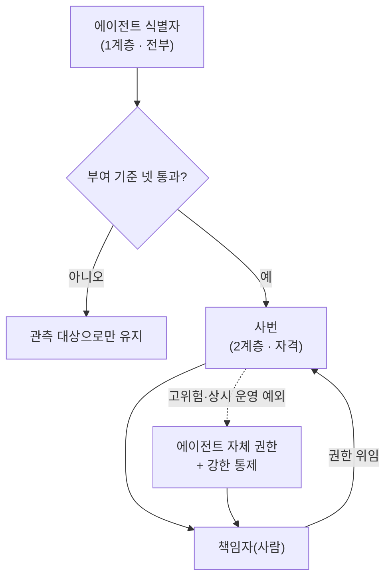

# 6장. 제도는 청구서에 부딪혀 모양이 잡힌다

결정이 내려진 다음 날 아침이라고 해 보자. 어제 회의에서 방향이 잡혔다. 우리 조직의 에이전트에게 사람과 같은 신분을 주기로. 사번을 부여하고, 계정을 만들고, 소유자를 지정하고, 성과를 귀속시킨다. 회의실 분위기는 좋았다. 앞 장에서 정리한 등록 항목도 이미 손에 있다.

당신은 그 결정을 실행에 옮기려고 계정 관리 담당자에게 요청을 보낸다. 한 시간 뒤 답장이 온다. 짧다.

"몇 개 만드실 건가요? 라이선스 비용부터 확인해야 할 것 같습니다."

여기서 잠깐 멈추게 된다. 계정을 만드는 일에 비용이 든다는 생각을 어제 회의에서 아무도 하지 않았다. 그리고 이 질문에 답하려고 계산기를 두드리는 순간, 어제 세운 깔끔한 설계가 조금씩 모양을 바꾸기 시작한다.

변형이 끝났을 때, 설계는 어제보다 나아져 있었다.

## 계정 하나가 부르는 것들

사번을 준다는 말은 실무에서 한 줄로 끝나지 않는다. 사번을 받으면 계정이 생긴다. 계정이 생기면 그 계정이 조직의 협업 도구와 업무 시스템에 들어간다. 그리고 상용 소프트웨어 상당수는 계정 수를 기준으로 과금한다. 사람이든 아니든, 디렉터리에 등재되어 서비스를 쓰는 주체 하나당 얼마다.

여기서 계산이 갑자기 커진다. 에이전트가 열 개일 때는 문제가 되지 않는다. 백 개, 수백 개로 늘어나면 이야기가 달라진다. 사람 직원 한 명이 쓰는 도구 묶음의 월 비용을 에이전트 하나에 그대로 곱하는 셈이 되기 때문이다.

숫자 감각을 잡기 위해 계산을 하나 해 보자. **아래 값은 설명을 위해 지어낸 가상의 예시이며 실제 조직의 수치가 아니다.** 어떤 회사에서 직원 한 명이 쓰는 업무 도구 묶음의 월 비용이 5만 원이라고 하자. 에이전트 200개에 사람과 같은 계정을 주면 월 1,000만 원, 연 1억 2,000만 원이다. 그런데 이 200개 중 실제로 협업 도구에 글을 쓰거나 메일을 보내야 하는 것은 몇 개일까? 대부분은 정해진 시스템 하나를 호출하고 결과를 돌려주는 일만 한다. 사람이 쓰는 도구 묶음이 통째로 필요한 에이전트는 소수다.

계산기를 두드리다 보면 이 지점에서 좀 난감해진다. **우리가 사려던 것과 실제로 필요한 것이 다르다는 사실이 그제야 보이기 때문이다.** 어제 회의에서는 "사람과 같은 신분"이 하나의 덩어리로 보였다. 청구서가 그 덩어리를 뜯어 보게 만든다.

게다가 에이전트는 사람보다 만들기 쉽다. 잘 굴러가면 복제하고, 부서마다 변형을 만들고, 실험용으로 몇 개를 더 띄운다. 사람 정원은 예산 심의와 채용 절차를 거쳐 늘어나는데, 에이전트 정원에는 그런 관문이 없다. 그러니 "사람과 똑같은 신분을 주자"는 문장은 실무에서 이렇게 번역된다. **사람 정원 증가에 붙던 비용 구조를, 정원 통제 장치가 없는 대상에 그대로 적용하자는 말이다.**

이 벽에 부딪혀 본 조직들의 결론은 대체로 같다. 사람과 같은 계정을 전부에게 주는 설계는 규모가 커지는 순간 지탱되지 않는다. 그런데 이 벽을 만난 조직이 도달한 다음 설계가 흥미롭다. 비용 때문에 어쩔 수 없이 택한 우회로가, 따져 보면 처음 설계보다 더 옳았다. 그 이야기로 가기 전에 공개된 자료부터 확인하자. 이 벽이 우리 조직만의 특수 사정인지, 아니면 구조적인 것인지부터 알아야 한다.

## 공개된 가격표가 말해 주는 것

2026년 중반 기준으로, 주요 클라우드 아이덴티티 제품이 에이전트 신원을 어떻게 취급하는지는 공식 문서로 확인할 수 있다. 구조가 꽤 명확하다.

- **에이전트의 신원을 만들고 관리하는 것 자체**는 추가 비용이 없다. 해당 아이덴티티 서비스를 이미 쓰고 있다면 그 안에서 된다.
- **그 에이전트가 실제로 업무 서비스와 워크플로에서 동작**하려면 사용자 단위 라이선스를 산다.
- **조건부 접근 정책을 적용**하려면 상위 등급이 필요하다.
- **위험 탐지, 액세스 검토, 수명주기 관리** 같은 거버넌스 기능은 그보다 더 상위 등급 또는 별도 묶음이다.

가격을 여기 적지는 않겠다. 이 영역은 분기 단위로 바뀌고, 공개 가격 페이지와 2차 자료의 숫자가 어긋나는 경우도 있어서 그대로 옮기면 독자를 틀리게 만들 수 있다. 대신 구조만 기억하자. **세는 것은 공짜고, 쓰는 것은 유상이며, 관리하는 것은 더 유상이다.**

이 구조가 왜 중요한가? 우리가 앞 장에서 세운 등록 체계의 목적이 두 가지로 나뉘기 때문이다. 하나는 무엇이 몇 개 도는지 아는 것이다. 다른 하나는 그것들이 실제로 일하게 하고 성과를 귀속시키는 것이다. 그리고 가격표는 이 둘을 정확히 다른 값으로 매기고 있다. 앞의 것은 거의 공짜다.

세 번째 줄과 네 번째 줄도 그냥 지나칠 것이 아니다. 액세스 검토와 수명주기 관리가 상위 등급에 묶여 있다는 것은, **거버넌스를 제대로 하려는 조직이 더 많이 낸다**는 뜻이다. 조금 얄궂다. 등록만 하고 재심사도 폐기도 하지 않는 조직은 싸게 끝나고, 마지막 칸까지 채우려는 조직은 청구서가 커진다. 이 사실은 예산 협의 전에 알고 들어가야 한다. "거버넌스 기능이야말로 우리가 사려는 것의 본체"라고 미리 말해 두지 않으면, 예산 삭감의 1순위가 정확히 그 항목이 된다.

같은 문서에서 신규 객체 유형 넷이 정의된다는 것도 확인된다. 신원의 설계도에 해당하는 것, 그 설계도의 주체, 에이전트 신원 자체, 그리고 각 에이전트 신원에 선택적으로 붙일 수 있는 사용자 객체다. 마지막 것이 흥미롭다. 공식 문서는 에이전트 신원과 그 사용자 객체가 "서로 다른 접근 권한을 가질 수 있다"고 명시한다. 신원이 있다는 것과 사용자로 취급된다는 것이 별개라는 뜻이다.

정직하게 덧붙일 것이 하나 있다. 그 사용자 객체가 라이선스 좌석을 소비하는지에 대한 명시 문장은 확인하지 못했다. 이 책이 확인한 것은 신원 생성이 무상이라는 것과 실제 동작에 사용자 단위 라이선스가 필요하다는 것까지다. 중간의 이 한 칸은 비어 있고, 도입을 검토한다면 그 조직이 직접 벤더에 확인해야 한다. 계약 협상에서 이 질문을 문서로 남겨 두는 것 자체가 나중에 근거가 된다.

그래도 방향은 읽힌다. 제품들이 이미 **신원과 사용자를 분리 가능한 객체로 설계해 두었다.** 우리가 아침에 계산기를 두드리며 발견한 그 구분을, 제품 쪽에서도 같은 이유로 발견한 것으로 보인다.

## 디지털 좌석이라는 냉소

이쯤에서 나올 만한 반응이 있고, 실제로 나왔다. 2026년 4월 해외 기술 커뮤니티에 올라온 한 사용자의 코멘트다.

> "If a company gets more efficient and uses fewer people, Microsoft's immediate reaction is to figure out how to invent some kind of digital seats so they can keep taxing the headcount."
> — 회사가 효율화되어 사람을 덜 쓰게 되면, 마이크로소프트의 즉각적인 반응은 정원에 계속 과세할 수 있도록 어떤 종류의 디지털 좌석을 발명해 내는 것이다.

개인의 공개 발언이고 조사 데이터는 아니다. 그런데 이 냉소에는 근거가 있다. 소프트웨어 업계에는 **간접 사용 과금**이라는 오래된 분쟁의 계보가 있다. 사람이 직접 시스템에 로그인하지 않고 다른 시스템을 통해 데이터를 주고받아도 그 접근을 라이선스 대상으로 볼 것인가를 두고, 벤더와 고객이 오래 다퉜다. 쟁점은 늘 같았다. 라이선스의 단위를 무엇으로 셀 것인가.

에이전트는 그 분쟁의 다음 라운드에 딱 맞는 소재다. 사람이 아니면서 사람처럼 시스템을 쓰고, 사람보다 훨씬 빠르게 늘어나기 때문이다. 그러니 이 협상은 앞으로 몇 년간 반복될 것이고, 우리 쪽에서 준비할 것은 하나다.

여기서 이 장의 첫 번째 실무 규칙이 나온다. **등록 단위와 과금 단위를 명시적으로 분리하라.** 우리가 만드는 등록부의 단위를 벤더의 좌석 수와 일치시키지 않는다. 일치시키면 두 가지가 동시에 일어난다.

하나는 등록부가 비용 통제의 대상이 되는 것이다. 등록을 하나 늘릴 때마다 비용이 늘어난다면, 조직에는 등록을 줄이라는 압력이 생긴다. 관리하려고 만든 장부가 관리를 줄이는 방향으로 작동하기 시작한다.

다른 하나는 조직이 단위를 조작해 회피하는 것이다. 에이전트 다섯 개를 하나로 합쳐 신고하거나, 아예 등록하지 않고 돌린다. 그러면 우리가 앞 장에서 그렇게 공들여 만든 원장이 실체와 어긋난다. 2장에서 세어보자고 했던 그 재고 조사가 통째로 원점으로 돌아간다. 이건 좀 아찔한 시나리오다. 제도를 만든 쪽이 제도를 무력화하는 유인을 직접 설계해 넣은 셈이기 때문이다.

같은 스레드에는 이런 말도 있었다. 5분 뒤에는 회사 전체에 에이전트를 하나만 두는 도구가 나올 것이라고. 농담이지만 예측으로는 정확하다. 단위에 세금을 매기면 시장은 단위를 줄이는 방향으로 진화한다. 그러니 등록부의 단위는 관리에 필요한 단위로 정하고, 벤더 계약의 단위는 그것과 별개로 협상한다. **두 숫자가 다르다는 사실 자체를 이상하게 여기지 않도록 처음부터 문서에 적는다.** 나중에 감사에서 "등록된 에이전트 수와 구매한 좌석 수가 왜 다르냐"는 질문이 반드시 나온다. 그때 설명하는 것보다 지금 적어 두는 쪽이 훨씬 싸다.

## 두 계층으로 나눈다

이제 아침의 계산기 문제로 돌아가자. 전부에게 사람과 같은 계정을 줄 수 없다면 어떻게 할까? 실무에서 도달한 답은 계층을 나누는 것이다.

**1계층은 식별자다.** 만들어진 모든 에이전트가 받는다. 목적은 관리와 관측이다. 무엇이 몇 개 도는지, 누가 만들었는지, 어디에 붙어 있는지를 안다. 이 층은 값이 싸야 한다. 싸야 빠짐없이 부여할 수 있고, 빠짐없이 부여해야 재고가 실체와 맞는다. 앞 절에서 확인한 가격 구조가 이 설계를 뒷받침한다. 신원을 만들고 목록에 올리는 것 자체는 대체로 공짜다.

**2계층은 사번이다.** 기준을 통과한 것만 받는다. 목적은 생산성 관리다. 평가의 대상이 되고, 자원을 배정받고, 성과가 귀속된다. 여기서부터 비용이 발생하므로 심사가 필요하고, 심사가 있으니 자격 기준도 있어야 한다.

비유하자면 앞의 것은 지원자 명단이고 뒤의 것은 정규 임용이다. 둘 사이에 인턴 단계를 두는 설계도 나온다. 제한된 범위에서 실제 업무를 시켜 보고, 기록을 남기고, 그 기록으로 승격을 판정하는 방식이다. 인턴 단계에는 기한을 못 박아 두는 편이 좋다. 기한이 없으면 승격도 탈락도 하지 않은 채 인턴 상태로 몇 년을 도는 에이전트가 쌓인다. 그 상태가 관리상 가장 나쁘다. 등록은 되어 있는데 아무도 책임지지 않고, 성과 집계에도 안 잡히고, 그렇다고 지울 근거도 없다.

그렇다면 2계층으로 올리는 기준은 무엇인가? 실무에서 채택된 것은 넷이다.

| 기준 | 묻는 것 | 왜 이것이 기준인가 |
|---|---|---|
| 연결 범위 | 다른 시스템이나 다른 에이전트를 호출하는가 | 연결이 늘면 영향 범위가 늘어난다 |
| 접근 권한 | 어떤 데이터와 기능에 닿는가 | 닿는 곳이 곧 사고 시 피해 범위다 |
| 상시 운영 여부 | 일회성 실험인가, 계속 도는 업무인가 | 계속 도는 것에만 유지 비용이 든다 |
| **절차 문서 보유 여부** | 이 에이전트가 수행하는 절차가 글로 적혀 있는가 | 기준선이 없으면 평가가 성립하지 않는다 |

네 번째를 보자. 이 책이 왜 절차 문서에서 출발했는지에 대한 답이 여기 있다. 1장에서 예고하고 4장에서 다리를 놓았던 것이 이 칸이다. **절차가 적혀 있지 않은 에이전트는 입장권이 없다.** 성과를 귀속시키려면 무엇을 했는지 알아야 하고, 무엇을 했는지 알려면 무엇을 하기로 되어 있었는지가 먼저 있어야 한다. 앞의 세 기준이 위험과 비용을 묻는다면, 이 기준은 관리 가능성 자체를 묻는다.

이 기준에는 부수 효과도 있다. 2계층 승격에 절차 문서를 요구하면, 절차 문서를 쓸 유인이 생긴다. 3장에서 우리는 절차를 적는 일이 왜 반갑지 않은 일인지 길게 이야기했다. 그 일에 보상을 붙이는 가장 실효적인 방법이 이것이다. 문서를 쓰라고 독려하는 대신, 문서가 있어야 통과되는 관문을 하나 세운다.

그리고 여기가 이 장의 핵심이 드러나는 자리다. 비용 때문에 억지로 나눈 두 계층이, 실은 서로 다른 두 질문에 대응한다. 1계층은 "무엇이 존재하는가"를 묻고 2계층은 "무엇에 책임을 물을 것인가"를 묻는다. 처음 설계에서는 이 둘이 뭉쳐 있었다. 청구서가 그것을 갈라 주었다.

## 권한은 빌려 쓰는 것이 기본값이다

계층을 나누고 나면 곧바로 다음 질문이 온다. 2계층 에이전트가 실제로 일을 하려면 권한이 있어야 한다. 그 권한을 누구의 것으로 할 것인가?

답은 두 가지다. 에이전트에게 자기 권한을 직접 주거나, 사람의 권한을 빌려 쓰게 하거나. 실무의 기본값으로 삼을 만한 것은 뒤쪽이다.

그림 1. 두 계층과 책임자 매핑

그림에서 눈여겨볼 것은 오른쪽 아래로 향하는 화살표가 전부 사람에게 모인다는 점이다. 위임 구조에서 에이전트가 무엇을 하든, 그 행위는 누군가의 권한을 빌려서 이루어진다. 로그에는 빌려준 사람의 이름이 함께 남는다. **책임의 종착점이 언제나 사람으로 남는다.**

이 설계에는 실무적인 이점이 하나 더 있다. 권한 관리 대상이 늘지 않는다는 것이다. 에이전트마다 권한 집합을 따로 정의하고 유지하면, 에이전트가 늘어나는 만큼 권한 정책도 늘어난다. 그리고 그 정책들은 시간이 지나면서 서로 어긋나기 시작한다. 사람의 권한을 빌리는 구조에서는 사람 쪽 권한 체계 하나만 유지하면 된다.

물론 예외가 필요하다. 야간에 도는 배치 작업처럼 사람이 없는 시간에 동작해야 하는 것, 사람의 세션과 무관하게 상시 대기해야 하는 것이 있다. 이런 경우에는 에이전트가 자기 권한을 가져야 한다. 다만 그때는 통제를 함께 세운다. 접근 범위를 좁게 자르고, 자격 증명의 수명을 짧게 하고, 실행 기록을 별도로 남긴다. 예외를 허용하되 예외의 비용을 함께 부과하는 방식이다.

여기서 두 가지를 정직하게 밝혀 둘 필요가 있다.

첫째, **사람이 개입하지 않는 상황의 인가에는 아직 확립된 표준이 없다.** 여러 서버를 프로덕션에서 운영한다는 한 개발자의 공개 기록은 문제를 이렇게 정리했다. 사용자가 루프에 없고, 중앙 아이덴티티 제공자도 없으며, 표준 인가 흐름은 사용자 에이전트의 리디렉션을 전제하는데 에이전트에게는 브라우저가 없다는 것이다. 이 개발자는 결국 자체 방식으로 해결했다고 적었다. 익명 개인의 주장이고 검증된 것은 아니다. 그래도 이 영역이 아직 미완이라는 신호로는 읽힌다.

둘째, **에이전트가 다른 에이전트를 호출할 때 책임이 어디로 가는지는 정리되지 않았다.** 2026년 기준의 한 학술 분석은 이것을 아이덴티티 영역의 핵심 공백 중 하나로 꼽았다. 아직 동료심사를 거치지 않은 프리프린트이고, 저자들은 이 공백이 구조적이어서 공학적 노력만으로는 메워지지 않는다고 결론지었다. 우리가 지금 세우는 등록부도 이 문제를 완전히 풀지는 못한다. 다만 위임의 사슬을 기록으로 남겨 두면, 나중에 표준이 정해졌을 때 옮겨 갈 수는 있다. 기록이 없으면 그 옮김조차 못 한다.

마지막으로 위임 모델에도 그림자가 있다. 사람의 권한을 빌린다고 할 때 그 사람의 권한 **전체**를 빌리면 곤란하다. 담당자 한 명이 가진 모든 접근 권한을 에이전트가 그대로 물려받는 구조라면, 사고가 났을 때 피해 범위가 그 사람이 닿을 수 있는 전부가 된다. 그러니 위임은 과제 단위로 좁혀야 한다. 이 절차를 수행하는 데 필요한 권한만, 그 절차가 도는 동안만이다.

## 층위가 다르다

이 2계층 설계가 책상 위의 발명이 아니라는 증거가 공개 기록에 남아 있다. 시점이 6년 떨어진 두 사례를 나란히 놓으면 층위 차이가 그대로 보인다.

**2020년 7월, 도이체방크(Deutsche Bank)**가 자사 기업금융 부문에 첫 "디지털 직원"을 온보딩했다고 공식 보도자료로 발표했다. 원문은 이렇게 적었다.

> "It has been allocated an employee number and has a dedicated working email address."
> — 사번이 부여되었고 전용 업무 이메일 주소를 가진다.

여기서 두 가지를 정확히 짚어야 한다. 첫째, 이것은 **사번**이다. 공식 보도자료가 직접 그 단어를 적었으므로 이 표현을 쓸 수 있다. 다만 보도자료가 밝힌 것은 사번과 전용 이메일 주소까지이고, 인사 시스템에 실제로 어떻게 등재됐는지는 공개되지 않았다. 둘째, 이것은 **2020년, 대규모 언어 모델이 등장하기 전, 규칙 기반 자동화 시대의 일이다.** 자동화에 의미 인식과 AI 기능을 결합한 것으로 설명됐다. 지금 우리가 말하는 생성형 에이전트의 사례로 옮겨 쓰면 사실이 아니다. 그리고 중요한 조건이 하나 더 있다. **그것은 하나였다.** 부문의 첫 디지털 직원이라고 보도자료가 명시했다.

**2026년 BNY**의 사례는 층위가 다르다. 경영진이 밝힌 바에 따르면 이 은행은 백 개가 넘는 특화된 "디지털 직원"을 운영 중이다. 이들은 회사 로그인을 가지고, 사람 라인 매니저에게 보고하며, 그 매니저가 산출물을 검토하고 승인한다. 각 인스턴스의 접근 범위는 좁게 정의된 팀 안으로 한정된다.

그런데 확인된 표현은 **사용자 ID, 로그인, 이름, 페르소나**까지다. 회사 보도자료 원문은 없고 공식 웹페이지도 이 표현을 쓰지 않는다. 그러니 이 사례를 "사번을 줬다"고 쓰면 근거를 넘어선다. 매니저 지정이 인사 시스템상의 실제 보고 라인인지도 공개 자료로는 확인되지 않는다.

그런데 바로 이 조심스러움이 이 절의 결론이다. **두 사례의 층위 차이 자체가 2계층 설계의 실물 증거다.** 2020년의 사례는 봇 하나를 인사 제도 안에 넣었다. 2026년의 사례는 백 개가 넘는 에이전트를 업무 신원 체계 안에 넣되 인사 제도와는 다른 층에 두었다. 규모가 커지면 층이 갈린다. 하나일 때 가능했던 것이 백 개일 때 불가능해지고, 그 불가능이 설계를 바꾼다.

한 가지 더 짚어 둘 것이 있다. 뒤쪽 사례에서 사람 매니저가 산출물을 검토하고 승인한다는 대목이다. 신분을 어느 층에 두느냐와 무관하게, 두 사례 모두 사람이 종착점에 있다. 앞 절에서 본 위임 구조가 다른 형태로 같은 결론에 닿아 있는 셈이다.

여기서 근거의 성격을 정리한다. 앞의 사례는 회사 공식 보도자료이고, 뒤의 사례는 최고경영자와 최고정보책임자의 인터뷰를 매체가 보도한 것이다. 신뢰 등급이 다르며, 이 책은 그 차이를 문장의 강도에 반영한다. 그리고 두 사례 모두 은행이라는 점도 함께 봐야 한다. 규제가 강하고 감사 관행이 오래된 산업이라 기록을 남기는 문화가 이미 있다. 다른 산업에 그대로 옮길 때는 그 조건 차이를 감안해야 한다.

## 새 신원인가, 있는 신원인가

여기까지 오면 다른 방향에서 반론이 들어온다. 애초에 에이전트마다 새 신원을 만드는 것이 옳으냐는 물음이다.

이 반론은 표준을 만드는 쪽에서 나온다. 워크로드 아이덴티티 연합을 다루는 한 표준 제안의 설계 의도는 이렇게 적혀 있다. 워크로드가 **이미 가지고 있는 자격 증명**을 쓰게 해서, 더 나은 선택지가 있는데도 클라이언트 시크릿을 더 늘리지 않아도 되게 하자는 것이다. 실행 환경이 이미 각 워크로드에 암호학적 신분을 발급하고 있는데 그 위에 또 한 겹의 신원 체계를 쌓을 이유가 무엇이냐는 물음이다.

기술적으로 보면 이 지적에는 무게가 있다. 자격 증명이 늘어나는 것은 그 자체로 공격 표면이 늘어나는 일이다. 관리해야 할 비밀이 하나 늘 때마다 유출될 자리도 하나 는다. 이 긴장은 피하지 않는 쪽이 정직하다.

그리고 답의 방향은 이미 나와 있다. **발급 주체는 런타임이되, 등록과 소유와 수명주기의 원장은 조직이 갖는다.** 에이전트가 시스템에 접속할 때 쓰는 자격 증명은 실행 환경이 짧은 수명으로 발급한다. 그것이 보안 측면에서 낫다. 우리가 만드는 등록부는 그 자격 증명을 대체하지 않는다. 등록부가 답하는 질문은 다른 것이다. 이 에이전트는 누가 만들었고, 누가 책임지며, 무슨 절차를 수행하고, 언제 폐기되는가. 이건 실행 환경이 답해 줄 수 없는 질문이다. 실행 환경은 이 워크로드가 진짜 그 워크로드인지는 알아도, 그것을 만든 사람이 지난달에 퇴사했다는 사실은 모른다.

이 구분을 세우면 앞서 나왔던 다른 반론에도 함께 답하게 된다. "그거 결국 서비스 계정 리브랜딩 아니냐"는 물음 말이다. 답은 이렇다. 자격 증명 층위에서는 그 지적이 상당 부분 맞다. 우리가 새로운 인증 기술을 발명하는 것은 아니니까. 차이는 그 위에 얹는 원장에서 생긴다. 서비스 계정에는 대개 소유자 필드가 없거나, 있어도 퇴사한 사람의 이름이 남아 있다. 수행하는 절차가 문서화되어 있지도 않고, 폐기 기준도 없다. 우리가 만드는 것은 그 빈칸들이다.

같은 자리에서 또 하나의 경계를 그어 두자. 커뮤니티에서 반복적으로 나오는 우려 중에 조직도가 폭발한다는 것이 있다. 2026년 3월의 한 게시물은 하루 반 만에 역할이 스무 개로 불어나고 실제 산출물 대신 메타 작업이 우선되기 시작했다고 적었다. 개인 실험 규모의 경험담이지만 방향은 새겨들을 만하다. 같은 해 9월에는 에이전트를 인사 시스템에 직속 보고자로 등록하지는 말아 달라는 호소도 올라왔다. 둘 다 개인의 공개 발언이다.

그래도 경계는 분명히 해 두는 편이 낫다. **사번을 준다는 것은 책임의 귀속을 뜻하지 조직 놀이를 뜻하지 않는다.** 에이전트에게 직급을 매기고 보고 체계를 만들고 회의체를 구성하는 순간, 우리는 관리하려던 대상을 관리 비용으로 바꾸게 된다. 사람 제도의 문법을 어디까지 빌리고 어디서 끊을 것인가는 다음 장에서 등급을 다룰 때 본격적으로 나온다.

## 청구서를 처음부터 계산에 넣는다

이제 이 장의 마지막 질문이다. 그래서 이 체계를 운영하는 데 얼마가 드는가?

이 질문을 회피하면 안 되는 이유가 계보에 있다. 로봇 프로세스 자동화가 먼저 같은 길을 갔고, 먼저 실패했다. 실패의 구조를 한 문장으로 요약한 커뮤니티 증언이 있다. 2026년 7월에 올라온 글로, 기존 자동화가 너무 깨지기 쉬웠고 **유지보수 부담이 대체하려던 노동보다 커지는 경우가 많았다**는 것이다. 다른 사용자들의 경험담도 같은 방향을 가리킨다. 자동화 스크립트를 오래 다뤄 본 끝에 완전 자동화를 접고 결정론적 코드에 AI를 의도적으로 결합하는 쪽으로 갔다는 증언이 있고, 런타임 에이전트가 깨지기 쉽고 감사하기 어렵다는 판단이 직장에서의 자동화 경험으로 강화됐다는 증언도 있다.

이 계보를 정직하게 받아들이면 결론은 분명하다. **로봇 프로세스 자동화가 실패한 구조는 기술이 아니라 손익이었다.** 그리고 "이번엔 다르다"는 말로는 이 구조를 넘지 못한다. 넘으려면 비용 항목을 처음부터 적어 놓고 시작해야 한다. 아래가 이 장이 남기는 두 번째 도구다.

| 비용 항목 | 언제 발생하는가 | 놓치기 쉬운 이유 |
|---|---|---|
| 인사 데이터와 접근 권한 그룹의 지속 동기화 | 상시 | 초기 구축 비용으로만 잡고 운영비를 안 잡는다 |
| 소유자 이탈 시 자격 증명 교체 | 담당자 퇴사·이동 때마다 | 사람 오프보딩 절차에 이 단계가 없다 |
| 감사 로그 적재와 보관 | 상시 | 저장 비용은 규모에 비례해 늘어난다 |
| 절차 문서의 회귀 테스트 | 모델을 교체할 때마다 | 모델 교체를 비용 이벤트로 보지 않는다 |
| 라이선스 | 2계층 부여 시점부터 | 이 장 전체가 그 이야기다 |
| 등록·심사 자체의 인건비 | 상시 | 제도 운영에 사람이 든다는 사실을 빼먹는다 |

두 번째 항목을 조금 더 보자. 2026년 4월의 한 커뮤니티 게시물이 이렇게 물었다. 자동화에 이름이 걸린 사람을 해고하거나 정리할 때마다 키를 교체해야 하느냐고. 냉소적인 어조지만 실무적으로 정확한 질문이다. 소유자를 지정하는 설계에는 소유자가 사라질 때의 절차가 반드시 따라붙는다. 그 절차가 없으면 소유자 필드는 시간이 지날수록 퇴사자 명단이 된다. 이 문제는 마지막 장에서 폐기를 다룰 때 다시 나온다.

네 번째 항목도 짚어 두자. 모델을 새 버전으로 교체하는 일은 대개 개선으로만 여겨진다. 그런데 4장에서 봤듯이 모델이 바뀌면 기존 절차가 그대로 작동한다는 보장이 없다. 그러니 모델 교체는 회귀 테스트를 동반하는 비용 이벤트다. 등록부에 모델 버전과 성능 기준선을 함께 적어 두라고 한 이유가 여기서 청구서로 돌아온다. 기준선이 없으면 교체 후에 성능이 떨어졌는지조차 알 수 없고, 알 수 없으면 되돌릴 시점도 못 잡는다.

여섯 개 항목을 다 적고 나면 다음 질문이 자연스럽게 나온다. 그래서 이게 남는 장사인가? 이 책은 그 답을 대신 계산해 줄 수 없다. 조직마다 인건비도 다르고 절차의 반복 빈도도 다르기 때문이다. 다만 판단의 형태는 말할 수 있다. **한 에이전트의 연간 유지 비용이 그 에이전트가 절감한 노동의 가치를 넘으면 그것은 폐기 후보다.** 그리고 이 판정을 하려면 두 숫자가 다 있어야 한다. 비용 쪽은 이 장의 표가 준다. 절감 쪽은 아직 없다. 그것을 어떻게 셀 것인가가 다음 부의 주제다.

한 가지 반가운 숫자도 있다. 감사 오버헤드가 성능을 크게 해치지 않는다는 실측이 있다. 다만 특정 실험 조건에서의 중앙값이고 아직 동료심사를 거치지 않은 프리프린트다. 조직 규모와 구성이 다르면 값도 달라진다. 그래도 "감사를 붙이면 느려진다"는 막연한 우려를 근거 없이 받아들일 필요는 없다는 정도로는 쓸 수 있다.

이제 이 장의 처음으로 돌아가자. 아침에 받은 그 짧은 답장, 몇 개 만들 거냐는 질문 말이다. 그 질문이 어제의 설계를 망가뜨린 것처럼 보였지만 실제로 한 일은 반대다. 전부에게 사람과 같은 신분을 주려던 설계는 두 계층으로 갈렸고, 갈리면서 각 층의 목적이 또렷해졌다. 권한은 사람에게서 위임받는 형태가 기본값이 되었고, 에이전트가 스스로 가지는 권한은 고위험 상시 운영에만 남는 예외가 되었다. **비용 제약이 거버넌스를 망친 것이 아니라 바른 방향으로 밀어붙였다.**

좋은 제도는 대개 이상 앞에서가 아니라 청구서 앞에서 모양을 갖춘다.
