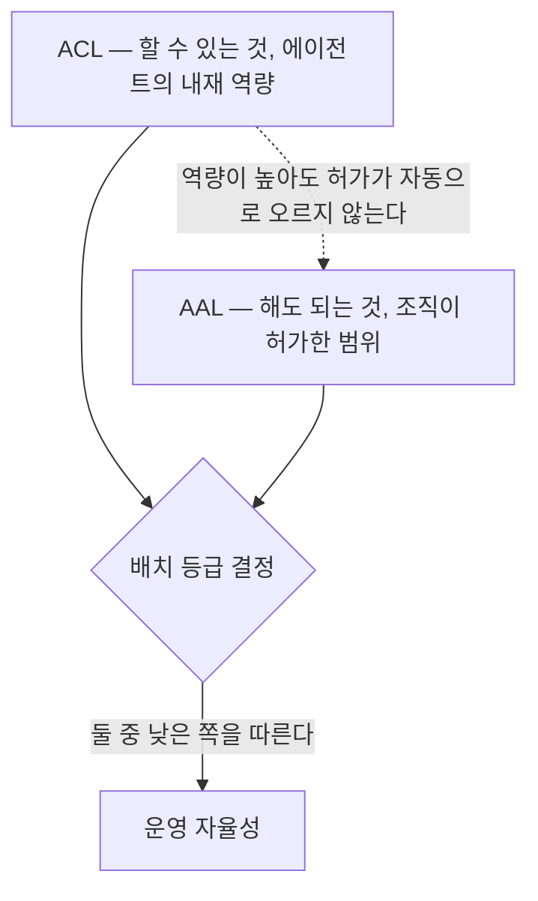

# 7장. 할 수 있는 것과 해도 되는 것

테스트트랙에 운전자 106명을 앉혔다. 차에는 중간 등급 자동화가 들어 있었다. 실험 전에 시스템의 한계를 명시적으로 알려줬고, 감독 책임이 운전자에게 있다는 것도 반복해서 고지했다. 그리고 주행 중 앞에 장애물을 세웠다.

**28퍼센트가 충돌했다. 눈은 그 장애물을 보고 있었고, 손은 핸들 위에 있었는데도 그랬다.**

빅터 등이 2018년에 보고한 결과다. 원문은 이렇게 적었다 — *"이 리마인더도, 시스템 한계와 감독 책임에 대한 명시적 지시도, 76명 중 21명(28퍼센트)이 눈을 충돌 대상에 둔 채로 충돌하는 것을 막지 못했다."*

자율주행 실험이다. 이 책은 자동차를 다루지 않으니 그대로 옮길 수는 없다. 다만 여기서 무너진 것이 감독이라는 설계 가정이라는 점은 그대로 옮겨진다. 사람을 감독자로 세워두면 위험이 관리된다는 가정 말이다. 우리가 에이전트에 자율성 등급을 매기고 "이 등급부터는 사람이 확인한다"고 적을 때, 정확히 그 가정 위에 서 있다.

그래서 이 장은 등급표를 만들기 전에 등급표가 어디서 무너지는지부터 본다. 통제의 강도는 무엇으로 정하는가? 에이전트가 똑똑한 정도인가, 아니면 되돌릴 수 없는 정도인가?

## 중간 등급이 가장 위험하다

자율주행 등급 논의에서 가장 곤란한 자리는 언제나 중간이었다. 완전 수동은 사람이 다 한다. 완전 자율은 기계가 다 한다. 중간은 기계가 하다가 사람에게 넘긴다.

넘기는 그 순간을 서로 다른 팀이 서로 다른 방법으로 조사했다. 계측이 가능했던 것부터 보자.

에릭손과 스탠턴이 2017년에 인계 시간을 실측했더니 1.97초에서 25.75초까지, 13배 분산이 나왔다. 장 등이 2019년에 129편을 모아 메타분석한 결과는 평균 2.72초였는데 연구별로 0.69초에서 19.79초까지 벌어졌다. 메랏 등이 2014년에 잰 것은 더 뒤의 시점이다. 핸들을 잡고 나서도 제어가 안정화되기까지 35~40초가 걸렸다. 미국 도로교통안전국이 2백만 대 규모로 벌인 결함조사에서는 467건의 충돌이 분석 대상이 됐고, 국가교통안전위원회는 개별 사고 2건을 따로 조사했다.

숫자가 제각각인데, 제각각인 것 자체가 결론이다. **인계에 필요한 시간을 하나로 정할 수 없다.** 사내 등급표에 "사람이 확인한다"고 적을 때 우리는 그 확인에 걸리는 시간을 암묵적으로 짧게 가정하는데, 그 가정을 뒷받침할 값이 없다는 뜻이다.

여기에 오래된 진단이 붙는다. 베인브리지가 1983년에 쓴 「자동화의 아이러니」는 이 구조를 이미 정확히 적었다.

> "the designer who tries to eliminate the operator still leaves the operator to do the tasks which the designer cannot think how to automate."
> (조작자를 없애려는 설계자는, 자동화할 방법을 자기가 생각해내지 못한 일들을 결국 조작자에게 남긴다.)

남겨진 그 일이 하필 가장 어려운 일이다. 같은 글의 다른 문장은 이렇다 — *"가능성이 낮은 이상 상황을 감시한다는 기본 기능은 인간에게 수행 불가능하다."*

엔즐리가 2017년 『Human Factors』에 실은 논문은 이것을 딜레마로 정식화했다.

> "as more autonomy is added to a system, and its reliability and robustness increase, the lower the situation awareness of human operators and the less likely that they will be able to take over manual control when needed."
> (시스템에 자율성이 더해지고 신뢰성과 견고성이 올라갈수록, 인간 조작자의 상황 인식은 낮아지고 필요할 때 수동 제어를 넘겨받을 가능성은 줄어든다.)

**잘 만들수록 감독이 어려워진다.** 곱씹을수록 무거워지는 문장이다. 우리가 에이전트 성능을 올리는 데 쓰는 노력이 감독 가능성을 갉아먹고 있다는 뜻이기 때문이다.

미국 도로교통안전국의 2024년 조사 보고서도 같은 자리를 짚었다. 운전자가 기대한 시스템 능력과 실제 능력 사이의 불일치가 *"결정적 안전 공백"*을 만들었고, 그것이 *"예견 가능한 오용과 회피 가능했던 충돌"*로 이어졌다는 것이다.

여기서 갈래를 한 번 세어보자. 테스트트랙 실험(오프닝의 106명), 129편을 모은 메타분석, 시뮬레이터 실험, 전문가 인터뷰, 규제 당국의 결함조사, 개별 사고조사. **여섯이다.** 수행한 팀이 다르고 방법도 다르며, 서로를 검증하려고 설계된 연구도 아니다.

그 여섯이 각자 "중간 등급을 안전하게 만들려면 무엇이 필요한가"를 물었다. 답을 모아보면 기이한 그림이 나온다. 필요한 조건들이 하나같이 중간 등급의 편익을 상쇄하거나 없앤다. 사람이 계속 상황을 파악하고 있어야 한다면 자동화로 얻은 여유가 사라진다. 인계 시간을 넉넉히 주려면 애초에 기계가 혼자 판단하는 구간을 줄여야 한다. 감독을 성실하게 만들려면 에이전트를 덜 믿을 만하게 두어야 한다.

**중간 등급이 나쁘다는 이야기가 아니다.** 중간 등급을 안전하게 만들면 그것은 더 이상 중간 등급이 아니게 된다는 이야기다.

조직으로 옮기면 이렇게 된다. 에이전트에 중간 등급을 주고 사람이 확인하게 하는 설계는 가장 자연스러워 보이지만, 실제로는 조건이 가장 많이 붙는 설계다. 그 조건을 다 붙일 생각이 없다면 중간 등급을 만들지 않는 편이 낫다. 위로 올리거나 아래로 내리는 쪽이 정직하다.

## 승인을 축으로 삼으면 외양만 남는다

중간 등급을 실무로 옮기면 대개 승인 게이트가 된다. 에이전트가 무언가 하려고 할 때 사람에게 물어보고, 사람이 확인 버튼을 누르면 진행한다. 설계가 단순하고 감사에도 잘 남는다.

그런데 실제로 얼마나 눌러줄까?

Anthropic이 자사 제품의 텔레메트리를 공개했다. 2026년 5월 25일 자 엔지니어링 포스트인데, 사용자가 권한 승인 프롬프트의 약 93퍼센트를 승인하고 있었다. 같은 회사의 다른 포스트에서도 같은 수치가 확인된다. 벤더가 자기 제품에 대해 낸 자체 계측이라는 점을 밝혀 둔다. 진단 쪽이 더 중요하다.

> "The more approvals a user sees, the less attention they pay to each, becoming over time much less diligent in their supervision."
> (승인을 많이 볼수록 하나하나에 기울이는 주의는 줄어들고, 시간이 지나며 감독은 훨씬 덜 성실해진다.)

이 숫자 하나에 논증을 걸 생각은 없다. 다만 방향이 세 갈래의 다른 계보와 정확히 맞물린다.

첫째, 판정 자체가 사람마다 갈린다. 시온 등이 에이전트 행위 등급의 판정자 간 일치도를 측정한 결과 카파값 0.30이 나왔다. 낮은 값이다. 같은 행위를 놓고 두 사람이 다른 등급을 매긴다는 뜻이고, 승인 게이트란 결국 그 판정을 매번 사람에게 시키는 장치다.

둘째, 자동화 편향이라는 오래된 계보가 있다. 스킷카 등이 1999년에 보고한 실험에서, 자동화 보조를 받지 않은 참가자가 매우 신뢰할 만하지만 완벽하지는 않은 보조를 받은 참가자보다 모니터링 과제를 더 잘 수행했다. 자동화를 성실한 탐색의 대체물로 쓰기 때문이다. 1999년 항공 시뮬레이션 연구이고, 현대 언어모델의 오류 양상은 그럴듯한 환각이라 탐지가 더 어려운 쪽으로 다르다.

여기서 이 책에서 가장 반직관적인 문장이 나온다. **거의 항상 맞는 시스템이 가장 위험하다.** 에이전트가 95퍼센트 맞으면 사람은 검토를 멈춘다. 70퍼센트 맞는 에이전트가 오히려 더 성실하게 감독된다. 성능 향상이 감독 품질을 떨어뜨린다.

셋째, 현장의 진술도 같다. 한 개발자 커뮤니티에 2026년 7월 올라온 문장은 이렇다 — *"사용자에게 승인이나 거부를 묻는 방식은 무엇이든 터지기를 기다리는 재앙이다."* 익명 진술이다.

그렇다면 축을 어디에 세워야 하는가. 같은 회사가 답의 방향을 스스로 보여줬다. 2025년 10월 20일 자 포스트에서, 샌드박싱으로 권한 프롬프트를 84퍼센트 줄였다고 보고했다. 역시 자체 계측이다.

이 대비를 눈여겨보자. 승인 축에서는 사람이 93퍼센트를 그냥 눌러주고 있었다. 환경 축에서는 물어볼 일 자체가 84퍼센트 사라졌다. 같은 커뮤니티의 다른 문장이 원리를 짧게 말한다 — *"보안은 환경에 속한다. 하네스가 아니라."*

실무 규칙으로 옮기면 이렇다. **승인은 되돌릴 수 없는 소수 행위에만 남기고, 나머지는 애초에 닿을 수 없게 만든다.** 그리고 등급표에 위협 모델 열을 둔다. 이 등급에서 무엇이 잘못될 수 있는지를 적지 않으면 등급은 이름표에 그친다.

남는 질문이 하나 있다. 승인을 소수 행위로 줄이고 나머지를 구조로 막았다고 하자. 그렇게 쌓이는 전수 실행 로그는 누가 읽는가. 3장에서 심사의 재료가 진술에서 로그로 바뀐다고 했는데, 전수 로그는 사람이 읽을 수 있는 양이 아니다.

그래서 실무는 검증하는 에이전트를 따로 세우는 쪽으로 간다. 작업 에이전트의 실행 기록을 적힌 절차와 대조하고, 어긋난 것만 골라 올리는 역할이다. 다만 조건이 둘 붙는다. 첫째, **검증자는 작업자와 다른 곳에서 틀려야 한다.** 8장에서 팀 성과를 가르는 것이 정확도가 아니라 틀리는 지점의 차이라는 실증을 보게 될 텐데, 그 논리가 여기 먼저 적용된다. 같은 모델을 같은 맥락으로 불러 받아 낸 "검증했음"은 복창에 가깝다. 다른 모델 계열을 쓰든 입력을 다르게 주든 — 이를테면 검증자에게는 절차 원문과 규칙만 주고 작업자의 사정은 주지 않는 식으로 — 틀림의 상관을 끊어야 한다. 둘째, **검증 에이전트도 등록부에 오르는 에이전트다.** 등급이 매겨지고 판정 로그가 남는다. 그래야 "검증자는 누가 검증하나"라는 회귀가 감사 가능성에서 끊긴다.

그러면 사람의 자리는 사라지는가. 사라지지 않고 이동한다. 건별 검증은 위에서 본 대로 사람이 감당할 수 없는 일이 됐다. 사람이 하는 일은 검증 체계를 설계하는 것, 검증자의 판정을 표본으로 감사하는 것, 그리고 검증자가 올려 보낸 예외를 판정하는 것이다. 조금 뒤에 이 장의 명제로 다시 만나겠지만, 여기서도 통제는 실행의 순간에서 설계의 순간으로 옮겨 간다.

## 할 수 있는 것과 해도 되는 것

자율성 이야기가 헛도는 이유는 두 가지가 계속 섞이기 때문이다. 기술적으로 가능한 범위와 조직이 허용할 범위다.

에너지·중공업 기업인 ExxonMobil의 기술 조직이 2026년 7월에 낸 프리프린트가 이 둘을 명시적으로 분리했다. **동료심사를 거치지 않은 10페이지 산업 실무 보고이고, 실증 사례가 단일 기업 2건**이라는 점을 먼저 밝힌다. 비가역성이 지배적인 물리 도메인의 직관이라 소프트웨어에 그대로 이식되지 않을 수 있다. 그럼에도 이 구분은 이 책이 찾던 형태다.

| 축 | 무엇을 재는가 |
|---|---|
| ACL (Autonomous Capability Level) | 에이전트의 내재적 기술 역량. 그 역량이 실제로 행사되는지와 무관하다 |
| AAL (Allowed Autonomy Level) | 배포 환경에서 허가된 범위. 조직이 감수할 의사가 있는 책임의 수준이다 |

표 1. 두 개의 자율성 축

저자들의 정식화는 짧다.

> "Importantly, higher capability does not automatically imply higher allowed autonomy."
> (중요한 점은, 더 높은 역량이 자동으로 더 높은 허용 자율성을 뜻하지는 않는다는 것이다.)

> "An agent should not operate at an AAL higher than the human organization is prepared to accept."
> (에이전트는 조직이 받아들일 준비가 된 것보다 높은 허용 자율성으로 운영되어서는 안 된다.)

그림 1. 두 축의 분리 — 배치는 역량이 아니라 허가가 정한다

허용 자율성 쪽은 사람의 역할로 다섯 칸이 된다.

| AAL | 사람의 역할 | 사람이 하는 일 | 실패했을 때 |
|---|---|---|---|
| A1 | 손을 얹고 | 직접 실행 | 오류가 한 번의 호출에 갇히고, 실행한 사람이 바로 고친다 |
| A2 | 지시를 얹고 | 지시 | 에이전트가 조언하고, 그 조언이 사람의 판단을 간접적으로 나쁘게 만들 수 있다 |
| A3 | 눈을 얹고 | 감독 | 에이전트가 행위한다. 실패가 조언에서 행동으로 바뀐다 |
| A4 | 마음을 얹고 | 목표와 제약 설정 | 사람이 단계를 감독하지 않는다. 실패의 원인이 실행 실수에서 설계 오류로 옮겨간다 |
| A5 | 마음을 떼고 | 정책 설정 | 의사결정 권한이 위임된다. 실패가 과업 오류를 넘어 책임과 거버넌스의 공백을 드러낸다 |

표 2. 허용 자율성 다섯 단계

이 표에서 눈여겨볼 곳은 마지막 열이다. 등급이 올라갈 때 **실패의 성격이 바뀐다.** 낮은 등급에서 실패는 실행 실수이고 그 자리에서 고쳐진다. 높은 등급에서 실패는 설계 오류가 되고, 더 높이 가면 제도의 공백이 된다. 사고가 났을 때 누구를 부를지가 등급마다 달라진다는 뜻이기도 하다.

저자들은 이것을 세 축의 변화로 정리했다. 사람의 통제가 덜 직접적이 되고, 가역성이 줄고, 실패의 결과를 봉쇄하기 어려워진다. 그리고 A3에서 A5로 가는 과정을 통제권이 실행 중 감독에서 사전 거버넌스로, 다시 위임된 권한으로 넘어가는 연속적 이전이라고 적었다.

**통제가 사라지는 게 아니라, 통제가 놓이는 시점이 앞당겨진다.** 실행 중에 지켜보던 것을 설계 시점으로 옮기고, 다시 정책 시점으로 옮긴다. 등급을 올린다는 것은 감시를 미리 해두는 일이다. 그러니 등급을 올리기 전에 물어야 할 것이 하나 생긴다. 우리는 지금 그 감시를 앞당겨 할 준비가 되어 있는가?

## 두 축이 어긋난 자리가 설계다

이 프레임이 실무에 주는 것은 격자에서 대각선을 벗어나는 칸이다. 역량과 허용이 같은 등급이면 격자를 그릴 이유가 없다.

논문의 실증 2건이 정확히 그 칸에 있다.

첫째, 데이터 엔지니어링에 쓰는 다중 에이전트 구성은 기술적으로 C4 수준이었다. 그런데 배치는 A3로 낮췄다. 이유가 구체적이다. 통제되지 않은 백필 작업이 하류 파이프라인을 오염시킬 수 있기 때문이다.

둘째, 에너지 운영 코파일럿은 연 2만 건 규모의 비정형 현장 보고서를 검토한다. 기술적으로 C3인데 A2, 그러니까 자문 전용으로 배치했다. 운영 원칙을 이렇게 적었다 — *"AI가 추론하고, 가드레일이 검증하고, 사람이 결정한다."* 물리 도메인의 행위는 대체로 되돌릴 수 없다는 판단이다.

저자들의 문장이 이 장의 중심에 놓일 만하다.

> "The gap between C4 and A2 or A3 is not a deficiency; it is a `deliberate governance choice`."
> (C4와 A2 또는 A3 사이의 간극은 결함이 아니다. 의도된 거버넌스 선택이다.)

왜 중요한가. 조직에서 등급 논의를 하다 보면 낮은 등급이 아직 덜 된 상태로 취급된다. 언젠가 올려야 할 것을 사정상 못 올리고 있다는 식이다. 로드맵에 "3분기 내 자율 실행 전환"이라고 적히는 순간 낮은 등급은 결함이 된다. 그런데 여기서는 낮춘 것이 결론이다. 되돌릴 수 없는 일이기 때문에 낮췄고, 능력은 충분했다.

같은 자리에서 등식 하나를 더 버리자. **역량 등급이 높은 에이전트가 조직에 더 필요한 에이전트라는 등식이다.** 등급표를 만들고 나면 시선이 자연스럽게 표의 오른쪽 위 — 높은 역량, 높은 자율 — 로 쏠린다. 그런데 조직 전체로 보면 값을 먼저 내는 것은 대개 반대쪽이다. 역량은 평범해도 여러 부서가 실제로 쓰는 범용 에이전트다. 이유는 산수다. 등록·권한·감사·운영의 비용은 에이전트 단위로 들어가는데, 효용은 실제로 쓰는 부서 수만큼 곱해진다. 최고 역량의 특수 에이전트 하나는 한 부서의 문제를 깊게 풀고, 평범한 범용 에이전트 하나는 열 부서의 같은 문제를 동시에 던다. 그리고 실사용 부서 수는 그 자체로 검증이다. 여러 부서가 자발적으로 붙었다는 것은 수요가 실재한다는 뜻이고, 이 신호는 어떤 심사표보다 위조하기 어렵다. 그러니 포트폴리오를 짤 때는 표의 오른쪽 위를 채우는 일보다 왼쪽 아래를 넓게 까는 일을 먼저 놓자. 등급표의 소임은 위험의 배분이다. 야심의 배분까지 맡기면 표가 일을 잘못 배운다.

한국의 AX 논의가 자주 멈추는 자리가 여기다. **"우리 모델이 뭘 할 수 있나"까지는 가는데 "우리 조직이 뭘 허용할 것인가"로 넘어가지 않는다.** 앞의 질문은 벤더가 답해주고, 뒤의 질문은 아무도 대신 답해주지 않기 때문이다. 그래서 뒤의 질문이 회의에서 자주 미뤄지고, 미뤄진 채로 배포된다.

뒤의 질문에 답하려면 기준이 필요하다. 2장에서 만든 판별 프레임이 그 기준이다. 되돌릴 수 없는 일인가, 돈이나 대외 커뮤니케이션이나 민감정보에 닿는가. **통제의 강도를 능력이 아니라 되돌릴 수 없음의 정도로 정한다.** 똑똑한 에이전트보다 위험한 에이전트를 먼저 조인다.

대조가 선명한 예가 하나 있다. 코드 커밋과 물리 공정 제어 명령은 기술적으로 비슷한 난이도의 행위일 수 있다. 그런데 앞의 것은 되돌릴 수 있고 뒤의 것은 안 된다. 같은 능력의 에이전트라도 허용 등급이 달라져야 하는 이유가 여기 있다. 사내로 옮기면 사보 초안 작성과 대외 공시 자료 수정이 같은 자리에 놓인다. 둘 다 문서를 고치는 일인데 되돌릴 수 있는 범위가 완전히 다르다.

## 실무 프레임 넷을 나란히 놓으면

이 책이 등급표를 처음 제안하는 것은 아니다. 2025년부터 2026년 사이에 나온 실무 프레임 넷을 놓고 보면 공통점과 차이가 함께 보인다.

| 출처 | 성격 | 등급 수 | 통제 차등 | 발행 |
|---|---|---|---|---|
| Gartner 비례적 거버넌스 | 컨설팅 조사 | 4 | 가장 명확 | 2026-05-26 |
| Cloud Security Alliance 자율성 등급 | 표준·기관 | 6 (L0~L5) | 있음 | 2026-01-28 |
| 펑·맥도널드·장 (컬럼비아 나이트 연구소) | 학술 | 5 | 있음 + 자율성 인증제 | 2025-07-28 |
| Salesforce 에이전트 성숙도 모델 | 벤더 | 5 | 부분적 (성숙도 축이 주) | 2025-04-10 |

표 3. 자율성 등급 프레임 네 종

가트너 쪽 진단부터 보자. 보도자료(2026년 5월 26일)에 따르면 분석가의 지적은 이렇다.

> "Enterprises are treating AI agent governance as `binary, either locked down or fully trusted`, and that is the root cause of failure."
> (기업들은 에이전트 거버넌스를 이분법으로 다룬다. 잠그거나 완전히 신뢰하거나. 그것이 실패의 근원이다.)

확인 경로(원문 미접근, 복수 매체 교차)는 부록 B에 밝혔다. 이 프레임의 네 단계는 관찰 전용, 조언, 승인을 받고 행위, 자율 행위로 올라가는데, 각 단계에 붙는 통제가 다르다는 점이 유용하다. 관찰 단계에는 범위 지정 데이터 접근과 사용 로깅이면 되고, 승인 단계에서는 감사 추적을 갖춘 승인 워크플로와 에이전트 전용 인시던트 대응 절차가 필요하며, 자율 단계에서는 지속 모니터링과 신속 롤백과 서킷 브레이커와 명확한 소유권이 요구된다.

**등급을 나누는 목적이 여기 있다.** 통제 항목을 차등 배분하려는 것이다. 모든 에이전트에 같은 통제를 걸면 낮은 등급에서는 그 통제가 과잉이 되어 우회를 부른다. 1장에서 본 실패 모드 — 강제와 과잉 통제가 우회로와 섀도를 낳는다 — 가 등급 설계에서 그대로 반복되는 자리다. 반대쪽 끝에서는 같은 통제가 모자란다. 앞에 적은 요건대로라면 자율 단계에는 지속 모니터링과 신속 롤백과 서킷 브레이커가 붙어야 하는데, 관찰 단계의 통제만 걸어두면 그중 아무것도 없다. 잠그거나 완전히 신뢰하거나라는 이분법이 실패하는 이유가 양쪽에 하나씩 있는 셈이다.

클라우드 보안 연합의 여섯 단계에서 가장 값어치 있는 것은 L3의 정의다. 정해진 경계 안에서 움직이고 그 경계를 넘을 때만 사람에게 올린다는 단계인데, 여기 붙은 통제 요건이 이렇다. **기계가 읽을 수 있는 경계 정의와 기술적 강제가 필요하며, 정책 문서만으로는 불가능하다.**

이 책의 논지에 직결되는 문장이다. 체계가 문서로 끝나면 작동하지 않는다. 4장에서 절차 문서에 결정론적 검증 지점을 요구한 것도 같은 이유였다. 경계를 산문으로 적어두면 그 경계는 지켜지는지 확인할 수 없다.

세 번째 프레임의 진짜 기여는 인증서 쪽에 있다. 인증서가 에이전트의 자율성 상한을 규정한다. 개발자가 에이전트와 함께 그 등급 이하로 동작한다는 증거 기반 논증을 제출하면, 제3자 거버닝 바디가 평가해 발급한다. 그리고 **기술 사양이나 운영 환경이 바뀌면 갱신해야 한다.**

등록에서 등급 부여로, 상한 규정으로, 환경 변경 시 재심사로 이어지는 완결된 고리다. 5장에서 만든 등록 스키마와 10장에서 다룰 재심사가 여기서 미리 만난다.

## 단일 값을 쓰지 마라

여기까지 오면 등급표를 만들 준비가 된 것처럼 보인다. 그런데 지금 나와 있는 프레임 대부분이 공유하는 문제가 하나 있다. **자율성을 숫자 하나로 표현한다는 것이다.**

이 습관은 자율주행 등급에서 왔다. 그런데 자동화 등급 이론에는 훨씬 오래된 계보가 있고, 그 계보는 다른 모양이었다.

셰리든과 버플랭크가 1970년대 후반에 정리한 10단계가 출발점이다. 원 보고서를 직접 확보하지 못해 재수록본을 경유했고, 발표 연도 귀속이 자료마다 갈린다는 점을 밝혀 둔다. 중요한 것은 그다음이다.

파라수라만·셰리든·위켄스가 2000년 『IEEE Transactions on Systems, Man, and Cybernetics』에 실은 논문이 이 계보를 정리했다. 초록의 문장이 핵심이다.

> "automation does not merely supplant but changes human activity and can impose new coordination demands on the human operator. We propose that automation can be applied to four broad classes of functions: 1) information acquisition; 2) information analysis; 3) decision and action selection; and 4) action implementation. Within each of these types, automation can be applied across a continuum of levels... A particular system can involve automation of all four types at different levels."

두 가지를 말하고 있다.

첫째, 자동화는 사람이 하던 일을 대신하는 데서 그치지 않고 사람의 활동 자체를 바꾸며, 새로운 조율 부담을 얹는다. 이 문장은 8장으로 이어진다. AX 효과를 사람이 하던 일의 뺄셈으로만 계산하면 새로 생긴 조율 비용이 회계에서 통째로 빠진다.

둘째, 자동화는 **네 부류의 기능에 각각 적용되고, 각 기능마다 등급이 다를 수 있다.** 정보 수집, 정보 분석, 의사결정과 행동 선택, 행동 집행이다. 조직 언어로 옮기면 무엇을 조회하는가, 그것을 어떻게 해석하는가, 어떤 조치를 택하는가, 그 조치를 실제로 집행하는가가 된다.

이론 정리 논문이며 원저 실증 데이터가 없다는 점, 2000년 논문이라 확률적이고 불투명한 현대 모델을 다루지 않는다는 점을 함께 적어 둔다.

이 틀로 중간 등급을 해부하면 앞의 기이함이 설명된다. 자율주행 L3는 앞의 세 기능을 모두 높게 자동화해놓고 **실패했을 때의 결정과 실행만 사람에게 남긴다.** 앞의 세 단계에 전혀 참여하지 않은 사람이 네 번째만 맡는 구조다. 인계 시간이 13배로 벌어진 것이 이상한 일이 아니다. 그 사람은 상황을 파악하는 과정을 통째로 건너뛴 채 결론만 넘겨받는다.

그리고 계보가 끊겨 있다. arXiv에서 셰리든과 자동화 등급과 대규모 언어모델을 모두 포함하는 논문은 0건이었다(2026년 9월 5일 직접 확인). 고전 계보를 명시적으로 잇는 논문은 두 건뿐이고, 나머지는 자율주행 등급만 인용한다. **자율주행 등급은 1차원이고, 1978년부터 2000년까지의 계보는 2차원이다.** 지금의 논의는 더 단순한 쪽을 베끼고 있는 셈이다.

실무 템플릿으로는 엔즐리와 케이버가 1999년에 만든 배분표가 더 직접적으로 이식된다. 열 단계를 네 기능에 걸쳐 배분하되, 각 칸을 사람 / 컴퓨터 / 공동 중 하나로 지정하는 형태다.

| 기능 | 사람 | 컴퓨터 | 공동 |
|---|---|---|---|
| 무엇을 조회·수집하는가 | ☐ | ☐ | ☐ |
| 수집한 것을 어떻게 해석하는가 | ☐ | ☐ | ☐ |
| 어떤 조치를 택하는가 | ☐ | ☐ | ☐ |
| 그 조치를 집행하는가 | ☐ | ☐ | ☐ |

표 4. 네 기능별 자율성 배분표

"자율도 3단계"라고 적는 대신 이 네 칸을 채우자. 채우다 보면 대부분의 조직이 같은 그림을 만난다. 앞의 세 칸은 컴퓨터로 기울어 있고 마지막 칸만 사람에게 남아 있다. **그 배치가 안전한지를 묻는 것이 등급 심사다.**

## 등급표가 감추면 안 되는 것

이 책이 등급표를 내밀면서 반드시 함께 밝혀야 할 한계가 있다.

앞서 나온 카파값 0.30을 다시 보자. **등급 판정자 간 일치도가 낮다는 실증이다.** 등급을 매기면 판단이 객관화된다는 기대가 이 숫자에서 꺾인다. 같은 에이전트를 두고 두 사람이 다른 등급을 매긴다면, 등급표는 판단을 정리했다고 믿게 만들 뿐 실제로는 판단을 숨긴다.

이 한계를 감추면 8장에서 남의 숫자를 의심하라고 말할 자격을 잃는다. 그래서 처방을 함께 놓는다. **등급 판정을 개인 재량에 두지 말고 2장의 관문 질문이 내놓는 산출로 만든다.** 되돌릴 수 없는가, 스스로 도는가, 실제로 행동하는가. 세 질문의 답이 같으면 등급도 같아야 한다. 등급이 갈린다면 질문에 답하는 방식이 갈린 것이므로, 고쳐야 할 곳은 질문의 정의다.

두 번째 한계는 등급 수다. 개발자 커뮤니티의 진술을 보면 실제로 채택된 등급 수가 2로 수렴하는 경우가 보고된다. 테스트 모드와 프로덕션, 또는 제안 전용과 실험용 전권 같은 식이다. 몇 곳인지 셀 수 있는 조사는 아니므로 커뮤니티 관찰로만 받되, 방향은 무시할 것이 못 된다. 다단계를 제안하려면 왜 2단계로 부족한지를 근거로 세워야 한다.

앞의 프리프린트 저자들도 같은 경계를 적었다 — *"자율성 등급의 수는 제한되어야 하고, 각 등급의 의미는 분명히 서술되어야 하며, 등급 간 진행은 명확해야 한다."* 등급을 잘게 쪼개는 것 자체가 승인 피로를 재생산할 수 있다. 근거가 없다면 **2단계에서 시작해 필요할 때 쪼개는 편이 현장 언어에 맞는다.** 다섯 칸짜리 표를 만들어 두고 실제로는 둘만 쓰는 조직을 여럿 보게 될 텐데, 그건 표가 틀린 것이다.

세 번째는 조금 다른 종류의 한계다. **국제 표준도 이 문제를 숫자로 정하지 못했다.** 자율주행 국제 표준의 해당 조항은 인계에 필요한 "충분한 시간"을 초 단위로 규정하지 않았고, 수용성을 "의식의 한 측면"이라고만 정의한다.

이것이 이 장의 실무 논증이다. 표준이 못 정한 것을 사내 등급표가 정해야 한다. 내키지 않는 자리지만 피할 방법이 없다. 그러니 목표를 정확히 잡자. **지금 조직이 감수할 수 있는 선을 명시적으로 적어 두고, 틀리면 고칠 수 있게 만든다.** 완결된 기준을 세우려 들면 표는 영원히 완성되지 않는다.

## 감독자를 세우는 것만으로는 감독이 되지 않는다

마지막으로 등급표가 기대는 전제 하나를 검사한다. 높은 등급에는 사람 감독자를 붙인다는 전제다.

그린이 2022년 『Computer Law & Security Review』에 실은 논문이 인간 감독 정책 41개를 조사했다. 결론이 둘이다. 하나는 사람들이 요구되는 감독 기능을 수행할 능력이 없다는 것이고, 다른 하나가 더 아프다. 그 결과 인간 감독 정책이 결함 있고 논쟁적인 알고리즘의 사용을 정당화하면서 근본 문제는 다루지 않는다는 것이다.

원문의 표현으로는 이런 정책이 알고리즘 채택에 대한 *"잘못된 안전감"*을 제공하고, 벤더와 기관이 알고리즘 피해에 대한 *"책임을 회피"*하게 만든다.

실무 언어로 옮기면 **책임 세탁**이다. 사고가 나면 승인자가 있었다고 방어하는데, 정작 그 승인자에게는 판단할 능력도 시간도 없었다. 앞 절의 93퍼센트가 바로 그 장면이다. 그리고 이 구조는 등급표를 정교하게 만들수록 오히려 튼튼해진다. 표가 그럴듯할수록 방어가 쉬워지기 때문이다.

그린의 대안은 이 책의 방향과 오히려 맞는다. 규제의 중심 기제를 인간 감독에서 제도적 감독으로 옮기라는 것이다. 처방이 세 겹이 된다.

**첫째, 개인 감독자가 아니라 등록·로그·감사라는 제도로 감독을 구성한다.** 5장의 등록부와 감사 로그가 여기서 감독 장치가 된다. 사람 한 명의 성실성에 기대는 설계는 4장에서 세운 원칙과 어긋난다.

둘째, 감독자가 틀릴 것을 전제하고 설계한다. 라욱스가 2023년에 정리한 구분이 유용하다. 사람의 사전 승인 없이는 결정이 성립하지 않는 구성적 개입과, 사후 교정으로 충분한 교정적 개입을 나누는 것이다. 등록부의 권한 필드를 이 두 등급으로 나누면 어디에 승인을 남길지가 정리된다. 그리고 이 구분이 앞 절의 규칙과 맞물린다. 구성적 개입은 되돌릴 수 없는 소수 행위에만 두고, 나머지는 교정적으로 처리한다.

셋째, 승인 버튼 대신 인지적 강제 기능을 둔다. 부친자 등이 2021년에 제안한 설계인데, 사람이 실제로 검토하도록 흐름을 바꾸는 장치다. 에이전트의 결론을 보여주기 전에 사람이 먼저 자기 판단을 적게 하거나, 일정 시간 지연 후 노출하는 식이다. 효과 크기를 확보하지 못해 방향만 인용한다.

함께 기록할 반전이 하나 있다. **설명을 붙이면 감독이 나아진다는 통념은 정면 반박됐다.** 반살 등이 2021년에 보고한 실험에서 AI의 설명은 팀 성과의 상보성을 높이지 못했고, 오히려 권고의 정답 여부와 무관하게 수용률을 높이는 경향을 보였다. 수치는 확보하지 못해 방향만 적는다. 설명을 붙였으니 사람이 잘 판단할 것이라는 기대는 근거가 약하다는 뜻이다.

여기서 실무 카드 하나를 꺼낸다. 등급을 매기면 자연히 책임자의 직급이 따라 올라간다. 낮은 등급은 담당자가, 중간은 팀장이, 높은 등급은 임원이 오너가 되는 식이다. 사람 조직도를 그대로 복제하는 셈인데, 빠르고 설득력 있다. 이해관계자 모두가 이미 그 문법을 안다.

그런데 에이전트는 사람이 아니다. 복제 비용이 0이고, 하루에 수백 번 갱신되며, 성과가 나쁘면 즉시 지울 수 있다. 사람 인사 제도의 문법을 어디까지 빌리고 어디서 끊을 것인가가 설계의 핵심 긴장이다.

이 책은 여기서 답을 단정하지 않는다. 인사 문법을 빌리면 사내 설득이 쉬워지고 기존 결재 체계에 얹을 수 있다. 대신 사람에게 맞춰진 주기가 따라 들어온다. 반기 평가나 연간 승진 같은 것들이 하루에 수백 번 바뀌는 대상에 붙는다. 빌리지 않으면 제도를 새로 설계해야 하고 설득 비용이 커진다. **조직의 규모와 에이전트 수가 이 선택을 가른다.** 열 개를 관리한다면 인사 문법이 편하고, 수백 개가 되면 그 문법이 먼저 무너진다.

## 다음 주에 채울 표 한 장

이 장이 남기는 도구는 등급표 초안이다. 초안이라고 부르는 이유는 앞에서 밝힌 대로다. 국제 표준도 정하지 못한 선을 우리가 한 번에 맞출 수는 없다.

칸은 세 방향으로 열린다. 세로축은 허용 자율성 다섯 단계, 가로축은 네 기능, 그리고 각 행에 위협 모델 열을 붙인다.

| 허용 자율성 | 조회 | 해석 | 선택 | 집행 | 위협 모델 | 필요한 통제 |
|---|---|---|---|---|---|---|
| A1 손을 얹고 | | | | | | |
| A2 지시를 얹고 | | | | | | |
| A3 눈을 얹고 | | | | | | |
| A4 마음을 얹고 | | | | | | |
| A5 마음을 떼고 | | | | | | |

표 5. 자율성 등급표 초안

채울 때 세 가지만 지키자. 등급 판정은 2장의 관문 질문이 내놓는 산출로 한다. 위협 모델 열을 비워두지 않는다 — 비면 그 행은 이름표일 뿐이다. 그리고 2단계로 시작해도 좋다. 다섯 행을 다 채우지 못했다고 실패한 것은 아니며, 오히려 왜 다섯이 필요한지 답하지 못한 채 다섯을 채우는 쪽이 더 나쁘다.

### 이 장의 핵심

- **통제의 강도는 되돌릴 수 없음의 정도로 정한다.** 똑똑한 에이전트보다 위험한 에이전트를 먼저 조인다.
- **기술 역량(ACL)과 허용 자율성(AAL)은 다른 축이다.** 두 축이 어긋난 칸이 곧 의도된 거버넌스 선택이며, 그 선택을 명시적으로 적는 것이 등급표의 목적이다.
- **승인을 등급의 축으로 삼지 않는다.** 승인률 93퍼센트와 판정자 간 카파 0.30이 그 설계의 한계를 보여준다. 축은 능력과 환경에 세우고, 승인은 되돌릴 수 없는 소수 행위에만 남긴다.
- **자율성을 숫자 하나로 적지 않는다.** 관찰·분석·의사결정·실행 네 기능에 따로 배분한다.
- **감독은 제도가 한다.** 등록·로그·감사가 감독 장치이고, 감독자가 틀릴 것을 전제로 설계한다.

---

표를 다 채우고 나면 질문 하나가 남는다. 이 에이전트가 A3에서 잘 돌고 있다는 것을 무엇으로 아는가? 사람 개입률이 낮아지면 등급을 올려도 되는가?

숫자가 필요해지는 지점이다. 그리고 숫자를 세기 시작하면 곧 알게 된다. 우리는 투입은 이미 재고 있고, 성과를 잴 기준은 아직 없다.
