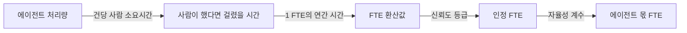

# 8장. 성과를 세는 법

자동화 업계에서 오래 일한 한 실무자가 자기 이름을 걸고 이런 글을 올린 적이 있다.

> "'절감 시간' 사업 케이스대로 실현된 자동화 프로그램은 세상에 거의 없을 것이다. 이유는 단순하다 — 인적 자본의 변화를 계산에 넣지 않았기 때문이다. **1만 시간은 근사하게 들린다. 그런데 그건 직원 2만 명에게서 각각 30분씩이다.**"

출처를 먼저 밝혀 두자. 이 문장은 조사 데이터가 아니라 한 사람의 경험담이다. 그래도 이 장을 여는 데 이만한 문장이 없다. 당신이 다음 분기에 받게 될 보고서에 정확히 그 숫자가 적혀 있을 것이기 때문이다. "연간 1만 시간 절감." 숫자는 크고, 계산은 맞고, 어디에도 거짓이 없다.

그런데 그 1만 시간이 한 사람의 5년치 노동인지, 2만 명의 30분씩인지에 따라 조직이 할 수 있는 일이 완전히 달라진다. 전자라면 정원 하나가 남는다. 후자라면 아무것도 남지 않는다. 30분은 회의 하나에 흡수되고, 흡수된 30분은 어느 회계 항목에도 나타나지 않는다.

그러니 그 보고서를 받았을 때 던질 첫 질문이 정해진다. 이 시간은 누구에게서, 얼마씩 모인 것인가. 이 장이 만들려는 환산 절차는 결국 그 질문에 답할 수 있는 형태로 숫자를 만드는 일이다.

한 가지 미리 밝혀두자. 투입은 이미 재고 있는데 성과를 잴 기준이 없다는 진단, 그리고 등급이 목적이 되는 순간 등급이 망가진다는 경고 — 둘 다 이 책이 처음 하는 이야기가 아니다. 여기서는 그 진단을 전제로 깔고 곧바로 처방으로 내려간다. 이 장이 남기려는 것은 다음 주에 돌릴 수 있는 절차다.

## 재기 전에 못 박을 것

측정을 다루는 장이니 재는 법부터 시작하는 게 자연스럽다. 그런데 순서를 뒤집자.

**잰 숫자를 어디에 쓰지 않을 것인지부터 정한다.**

이상하게 들릴 수 있으니 이유를 대겠다. **측정 체계는 도구가 정확해질수록 무너진다.** 정확해질수록 그 숫자가 사람에게 위협이 되고, 위협이 되는 순간 현장은 숫자를 숨기기 시작한다.

이 구조가 왜 고약한지 짚고 가자. 보통의 품질 문제는 도구를 개선하면 나아진다. 그런데 여기서는 개선이 문제를 키운다. 추정으로 대충 세던 시절에는 아무도 그 숫자를 심각하게 받아들이지 않았으니 숨길 이유도 없었다. 로그를 붙이고 실측을 시작하는 순간 그 숫자는 근거가 되고, 근거가 되는 순간 무기가 될 수 있다. 측정 체계를 정교하게 만들수록 그 체계를 무력화할 유인도 함께 자란다.

이 구조가 현장에서 어떤 말로 나타나는지, 그리고 왜 그 말이 나오는지는 9장이 증언과 함께 다룬다. 여기서는 결과만 짚어두자. **당신이 다음 분기에 정확한 환산표를 들고 가면, 그 표를 가장 열심히 읽는 사람은 표에 이름이 걸린 조직의 관리자다.** 그 사람에게 절감 숫자는 성과 지표이기 전에 예고로 읽힌다. 그리고 예고로 읽히는 숫자는 정직하게 올라오지 않는다.

그래서 이 장의 첫 처방은 선언이다. "이 숫자는 감원 명단으로 번역되지 않는다"를 제도로 보장하지 못하면 측정을 시작하지 않는 편이 낫다. 구두 약속으로는 부족하다. 문서로 남기고, 기한을 적고, 누가 그 약속을 지키는지를 적어야 한다. 그 선언문을 어떻게 쓰는지는 9장이 다룬다. 여기서는 순서만 확인해두자 — **선언이 먼저고 측정이 나중이다.**

순서를 지키면 얻는 것이 하나 더 있다. 선언을 먼저 하면 측정 설계 자체가 달라진다. 감원 근거로 쓰지 않겠다고 못 박은 숫자는 정원 단위로 합산할 이유가 없어지고, 그러면 조직별 절감 순위표 같은 것도 만들 이유가 없어진다. 무엇을 만들지 않을지가 정해지면 무엇을 만들지가 훨씬 선명해진다.

참고로 이 장이 움직이는 칸은 축 D(평가·측정·개선)의 2단계에서 4단계다. 반복 가능한 측정을 세우고, 그 측정이 스스로를 검증하게 만드는 데까지 간다.

## 무엇과 비교할 것인가

이제 재는 법으로 들어가자. 그런데 환산식보다 앞에 놓아야 할 결정이 하나 있다. 무엇과 비교할 것인가.

이 질문이 왜 중요한지는 한 메타분석이 아주 선명하게 보여준다. 바카로·알마투크·말론이 370개 효과크기를 모아 분석한 연구인데, 게재본 제목은 「인간과 AI의 조합이 유용할 때: 체계적 문헌고찰과 메타분석」이고 『네이처 휴먼 비헤이비어』 8권 12호에 실렸다.

먼저 이 연구의 한계부터 밝히고 들어가자. 대상이 2020년 1월부터 2023년 6월까지 게재된 논문이다. GPT-4가 2023년 3월에 나왔으니 최신 세대 모델로 한 실험이 사실상 거의 없다. 게다가 연도를 조절변수로 넣으면 개선 추세가 보인다 — 2020년 −0.56에서 2023년 +0.11까지 올라온다. 이 연구를 인용할 때 가장 강한 반박이 여기서 나오므로, 반박을 먼저 꺼내 놓고 시작하는 편이 정직하다.

그럼에도 이 연구를 쓰는 이유는 수치보다 수치가 갈리는 구조가 이 장에 필요하기 때문이다.

| | 증강 기준선 (인간 단독과 비교) | 시너지 기준선 (인간 단독·AI 단독 중 나은 쪽과 비교) |
|---|---|---|
| 효과크기 | **g = +0.64** [0.53, 0.74] | **g = −0.23** [−0.39, −0.07] |
| 읽는 방식 | 담당자가 훨씬 잘하게 됐다 | 그 사람을 뺐으면 더 나았다 |
| 출판편향 검정 | ❌ 통과하지 못했다 | ✅ 통과했다 |

같은 370개 효과크기다. 기준선만 바꿨다. 그런데 부호가 뒤집힌다.

여기서 반드시 함께 읽어야 할 것이 출판편향 줄이다. 널리 인용되는 낙관적 수치, 즉 **+0.64가 출판편향 검정을 통과하지 못했고, 비관적인 −0.23이 통과했다.** 저자들은 증강 쪽에 대해 분석의 무결성을 지키려고 출판편향을 보정하지 않았다고 명시한다. 그러니 +0.64만 인용하는 것은 가장 약한 근거를 가장 강한 자리에 놓는 일이 된다.

기준선을 병기해야 하는 이유도 여기서 나온다. "AI를 도입했더니 담당자가 더 잘하게 됐다"와 "인간과 AI를 함께 쓰는 체계가 AI 단독보다 낫다"는 완전히 다른 주장이다. 저자들의 원문은 이렇다 — 분석한 인간-AI 체계는 평균적으로 인간 단독보다는 나았지만, **인간 단독과 AI 단독 둘 다보다 낫지는 않았다.**

이 문장을 조직의 언어로 옮기면 이렇게 된다. **대부분의 AX 보고서는 전자를 측정하고 후자를 주장한다.** 재는 것은 증강인데 결론에서 말하는 것은 시너지다. 악의가 개입해서 그런 게 아니다. 두 기준선의 차이를 아무도 짚어주지 않기 때문이다.

세 번째로, 이질성을 숨기면 안 된다. I² 값이 시너지 쪽 97.7%, 증강 쪽 93.8%다. 극단적으로 높다. 그래서 "평균 −0.23"을 대표값처럼 쓰면 오독이다. 정확한 진술은 **"평균은 −0.23이지만 편차가 거의 전부다"** 다. 저자들도 초록을 효과의 이질성을 강조하는 문장으로 닫는다.

이 대목은 실무에서 특히 조심해야 한다. 편차가 거의 전부라는 말은 곧 당신 조직의 어느 공정이 어느 쪽에 있는지를 평균으로는 알 수 없다는 뜻이다. 남의 평균을 가져와 자기 조직에 적용하는 순간 그 숫자는 장식에 가까워진다.

네 번째 조심할 지점. 이 연구에서 생성 과업의 효과크기가 +0.19로 나오는데, **이걸 "생성 과업에서는 시너지가 난다"로 쓰면 안 된다.** p = 0.180, 95% 신뢰구간이 [−0.09, 0.48]로 0과 유의하게 다르지 않고 표본도 34로 작다. 여기서 말할 수 있는 정확한 진술은 "의사결정 과업의 손실과 생성 과업의 이득 사이의 차이가 유의하다"(F(1,104) = 7.84, p = 0.006)까지다.

마지막으로 함께 쓸 만한 확정 수치가 하나 있다. AI가 인간보다 나은 구간에서 시너지는 최저(g = −0.54)인데 증강 지표는 최대(+0.74)를 찍는다. 반대로 인간이 AI보다 나은 구간에서는 시너지가 +0.46이다.

이 대비를 한 문장으로 옮기면 이 장에서 가장 값어치 있는 문장이 나온다. **"담당자가 훨씬 잘하게 됐다"와 "그 사람을 뺐으면 더 나았다"가 동시에 참일 수 있다.**

그래서 AX 체계를 세울 때의 첫 번째 설계 결정은 **기술 선택이 아니라 기준선 선택이다.** 그리고 이 선택은 중립적이지 않다. 기준선을 고르는 순간 "사람을 어디에 둘 것인가"가 이미 결정된다.

## 그렇다고 사람을 빼라는 뜻은 아니다

앞 절을 읽고 나면 위험한 결론으로 미끄러지기 쉽다. "AI 단독이 더 낫다면 사람을 빼면 되는 것 아닌가."

그렇게 읽히지 않게 하려면 답을 같은 자리에 붙여야 한다. 그리고 답이 있다.

헤머 등의 연구는 인간을 팀에 넣는 것이 언제 값어치가 있는지를 조건으로 정리했다. 핵심 조건은 **인간이 AI가 접근하지 못하는 정보를 쥐고 있는가**다. 그 정보가 없으면 인간과 AI의 팀은 AI 단독과 사실상 구별되지 않는다(d = 0.16, p = 1.0). 그 정보가 있으면 팀이 AI 단독을 뚜렷하게 이긴다(d = 0.68, p < 0.001). (게재 여부가 확인되지 않은 프리프린트다.)

같은 연구의 두 번째 실험이 더 흥미롭다. 단독 성능이 동일한 두 AI를 각각 사람과 짝지었더니 팀 성과가 41% 차이 났다. 모델의 정확도가 같은데 팀의 결과가 갈린 것이다. 갈림의 원인은 틀리는 지점이었다. 사람과 다른 곳에서 틀리는 AI가 팀 성과를 끌어올렸다.

여기서 이 장의 두 번째 문장이 나온다. **"AI를 더 정확하게"가 아니라 "AI가 인간과 다른 곳에서 틀리게"가 팀 성과를 결정한다.**

이 결론이 앞 절의 위험한 독법을 막는다. 기준선 논쟁은 인력 감축 논리에서 공정 설계 논리로 돌아와야 한다. 물어야 할 것도 달라진다. "사람을 뺄까"를 묻는 대신 "이 공정에서 사람이 쥔 정보가 무엇인가" 를 묻는다. 그 정보가 없는 자리라면 사람은 검토자 역할을 못 하고 잡음만 보탠다. 있는 자리라면 사람을 빼는 순간 성과가 떨어진다.

실무로 옮기면 등록부의 한 칸이 여기에 대응한다. 5장에서 세운 여덟 칸 중 사람의 개입 지점 칸이다. 그 칸에 "담당자 검토"라고만 적혀 있으면 이 판단을 할 수 없다. 그 사람이 무엇을 보고 판단하는지, 그리고 그 정보를 에이전트가 볼 수 있는지가 적혀 있어야 한다. 볼 수 있는 정보라면 그 검토 단계는 언젠가 지워도 되는 단계이고, 볼 수 없는 정보라면 그 단계는 지우면 안 되는 단계다.

이 판정을 미루면 어떻게 될까? 검토 단계가 관성으로 남는다. 아무도 지우자고 하지 않고, 아무도 그 단계가 무엇을 막고 있는지 설명하지 못한 채 분기마다 자율성 계수만 깎인다. 반대로 판정을 해 두면 지울 단계와 지키는 단계가 갈리고, 지키는 단계에는 이유가 붙는다. 이유가 붙은 단계는 감원 논의에서 방어된다.

7장에서 자율성 등급을 설계하며 "사람을 어디에 남길 것인가"를 물었던 것이 여기서 측정의 언어로 다시 나타난다. 그리고 이 질문은 9장의 변화관리와도 곧장 이어진다 — 사람이 남는 자리를 근거로 설명할 수 있는 조직과 그러지 못하는 조직은 같은 숫자를 들고도 전혀 다른 대화를 하게 된다.

## 개인 지표에서는 잡히는데 조직 손익에서는 안 잡힌다

1장에서 이상한 현상을 하나 봤다. 개인 생산성은 오르는데 조직 성과는 안 오른다는 것. 왜 그럴까? 그 현상을 실험으로 해부한 연구가 있다.

딜런 등이 7,137명을 대상으로 한 현장 실험(전미경제연구소 워킹페이퍼)에서 세 가지가 관측됐다. **이메일에 쓰는 시간이 주당 3.6시간, 즉 31% 줄었다.** 문서 작성은 다소 빨라졌다. 그런데 **회의 시간에는 유의한 변화가 없었다.**

세 결과를 나란히 놓으면 그림이 선명해진다. **혼자 바꿀 수 있는 것만 바뀌었다.** 이메일은 혼자 쓴다. 문서도 대체로 혼자 쓴다. 회의는 여럿이 한다. 조율이 필요한 이득은 실현되지 않았다.

같은 방향을 다른 각도에서 보여주는 연구도 있다. 데미러 등의 연구(전미경제연구소 워킹페이퍼)는 개발 도구의 효과가 최종 산출물까지 내려오면서 얼마나 줄어드는지를 추적했다. 커밋 누적 효과는 자동완성 도구에서 +40%, 대화형 에이전트에서 +140%, 자율 에이전트에서 +180%까지 올라간다. 그런데 프로젝트 수로는 +50%, 실제 릴리스로는 +30%가 된다. **과업 수준 이득의 약 6분의 1만 최종 산출물로 통과한 셈이다.**

같은 연구가 추정한 대체탄력성은 0.25다. 값이 낮다는 것은 AI와 인간이 강한 보완재라는 뜻이다. 한쪽이 늘면 병목이 다른 쪽으로 옮겨간다.

그래서 실무 규칙이 하나 나온다. **과업 수준 이득을 조직 성과로 곱하지 마라.** "코드 작성이 두 배 빨라졌으니 개발 조직 산출도 두 배"라는 계산은 6분의 1 지점에서 무너진다. 병목은 조율이 필요한 인간 공정에 있고, 그 공정은 도구를 바꿔도 잘 안 바뀐다.

이 관찰은 환산표의 설계에도 직접 영향을 준다. 에이전트 단위로 잰 절감을 그대로 합산하지 마라. 같은 흐름 안의 에이전트 셋이 각각 30%씩 빨라졌다고 해서 그 흐름이 90% 빨라지지 않는다. 흐름 전체의 처리 시간을 따로 재고, 에이전트별 값과 대조해 얼마가 통과했는지를 남겨두는 편이 낫다. 이 대조표가 없으면 다음 분기 보고서의 합산값은 계속 부풀어 오른다.

곁가지로 하나 더 짚자. 설명을 붙이면 사람이 AI를 더 잘 판단하게 되리라는 기대가 널리 퍼져 있는데, 실증은 그 기대를 지지하지 않는다. 반살 등의 연구는 설명이 AI의 추천이 맞을 때는 정확도를 높이지만 틀렸을 때는 오히려 낮춘다는 방향성을 보고한다. 그리고 신뢰도 표시와 비교했을 때 설명이 유의한 개선을 만들지 못했다(각 과업에서 z = −1.18 p = .24 / z = 1.23 p = .22 / z = 0.427 p = .64). 측정 체계에 "설명 가능성을 붙였으니 사람 검토가 정확해질 것"이라는 가정을 넣지 않는 편이 낫다.

## 자기 숫자부터 의심한다

이 책은 남의 숫자를 의심하라고 말하는 책이다. 그래서 자기 인용이 편파적이면 타격이 배가된다. 그러니 이 장이 기대고 싶은 연구 하나를 스스로 흔들어 보자.

메트르(METR)의 2025년 실험은 널리 인용된다. 숙련 오픈소스 개발자들에게 AI 도구 사용을 허용했더니 이런 결과가 나왔다.

- 과제 시작 전 예측: 완료 시간이 24% 줄 것
- 실측: 완료 시간이 19% 늘었다
- 종료 후 사후 추정: 20% 줄었다

예측과 실측이 39%포인트 갈린다. 이 장이 만들려는 신뢰도 등급에 이보다 좋은 근거는 없어 보인다.

그런데 후속이 있다. 같은 팀이 2026년 2월에 속도 향상을 보고했다. 이 후속을 빼고 2025년 결과만 인용하면, 이 책은 스스로 하지 말라고 말하는 바로 그 선택적 인용을 하는 셈이 된다.

원 연구의 조건도 밝혀야 한다. 표본이 개발자 16명이고, 대상 프로젝트에 평균 5년의 사전 경험을 가진 사람들이다. AI의 상대 우위가 가장 작은 조건이며, 프리프린트다. 이 결과를 "AI는 생산성을 떨어뜨린다"로 일반화하면 심각한 오독이다.

그렇다면 이 연구에서 무엇을 가져갈까? 논점을 더 약하고 더 견고한 명제로 옮기면 된다. 이 장에 필요한 것은 "AI가 개발자를 느리게 한다"가 아니라 **"자기 보고와 실측이 갈라진다"** 이다. 후속 연구가 속도 향상을 보고했다는 사실은 이 약한 명제를 조금도 흔들지 않는다. 오히려 강화한다 — 같은 팀이 조건을 바꾸자 결과가 뒤집혔다면, 자기 보고로 그 차이를 잡아낼 수 있었겠는가?

약한 명제로 후퇴하면 반박이 근거가 된다. 이 태도를 이 장 전체에 적용한다.

같은 태도를 조직 안에서도 쓸 수 있다. 절감 보고서를 받았을 때 "이 숫자가 맞습니까"라고 물으면 대화가 방어로 흐른다. 대신 "이 숫자는 어떻게 만들어졌습니까" 라고 물어보자. 실측인지 추정인지, 기준값은 누가 정했는지, 언제 잰 것인지가 나온다. 앞의 질문은 상대를 시험하지만 뒤의 질문은 절차를 드러낸다. 다음 절의 신뢰도 등급이 하는 일이 정확히 이 질문의 제도화다.

그 전에 이 태도를 규칙으로 굳혀 두자. **이 체계에 들어오는 모든 수치에는 출처 성격 라벨을 붙인다** — 조사 주체, 표본, 시점, 문헌 유형. 실측인지 추정인지, 사내 로그인지 벤더 백서인지, 동료평가를 거친 연구인지 프리프린트인지를 숫자 옆에 적는다. 라벨이 없는 숫자는 표에 올리지 않는다.

번거로운 규칙처럼 보이는데, 값은 반년 뒤에 돌아온다. 그 표를 두고 논쟁이 붙었을 때 라벨이 있으면 논쟁이 숫자의 출처로 좁혀지고, 라벨이 없으면 논쟁이 사람의 신뢰도로 번진다. 앞의 논쟁은 한 시간이면 끝나지만 뒤의 논쟁은 분기를 넘긴다.

## RPA가 먼저 했고, 먼저 실패했다

FTE 환산은 새 발명이 아니다. 로봇 프로세스 자동화 시대에 업계가 이미 했고, 그 결과가 남아 있다. "이번엔 다르다"고 말하려면 그때 나온 비판을 넘어야 한다.

무엇이 달라졌는지 확인하려면 그때 쓰던 계산식부터 봐야 한다. 업계 관행이던 계산식은 단순하다. 봇의 월 처리 건수를 사람의 월 처리 건수로 나누거나, 건당 사람 소요시간에 봇 처리 건수를 곱해 월 정규 근로시간으로 나눈다. 채택 문턱으로는 "한 프로세스를 자동화해서 최소 2 FTE는 확보돼야 할 만하다"는 기준이 돌았다. 지금 AX 쪽에서 도는 계산식과 구조가 같다.

여기서 업계 자기모순이 드러난다. 벤더 자료에는 **"보수적으로 잡아도 라이선스 1개가 3 FTE"** 라는 숫자가 있는데, 같은 업계의 실무 문헌에는 **"실무에서는 1대 1을 넘기는 것조차 어렵다"** 고 적혀 있다. 이유도 함께 적혀 있다. 로봇은 대체로 정규 업무시간에만 돌고, 시스템 지연과 응답시간 때문에 사람보다 빠르지도 않다는 것이다. (양쪽 모두 벤더·업계 문헌이다.)

세 배와 한 배가 같은 업계 안에 공존한다. 어느 쪽이 맞는지는 이 책이 판정할 수 없다. 다만 같은 계산식이 세 배 차이 나는 결과를 낼 수 있다는 사실 자체가 그 계산식의 성질을 말해준다.

비판은 네 갈래로 정리된다.

첫째, 벤더 사업 케이스가 과장된다. 12개월 미만 회수, 3년 투자수익률 500% 같은 숫자가 제시되는데, 조직은 적합한 프로세스 개수를 과대평가하고 규칙 정교화 작업량을 과소평가한다. 그 결과 비용 절감이라는 핵심 이정표가 끝내 실현되지 않고, 그러면 정치적 지지가 증발한다.

**둘째, 절감 시간 사업 케이스에 근본 결함이 있다.** 이 장의 오프닝 인용이 바로 그 지적이다. 절감된 시간이 한 사람에게 모이지 않으면 그 시간은 회수되지 않는다.

셋째, 이중 계상이 일어난다. 사무 인력이 제거되지 않고 재배치되었다면 재배치 가치는 정원 절감과 별도로 계상해야 한다는 지적이다.

넷째가 가장 실무적이다. 계산식 자체가 비표준이다. 업계 문헌은 이렇게 적는다 — 모두가 자기만의 FTE 편익 계산식을 쓰며, 생산 가능 시간은 하루 5.5시간에서 8시간 사이 어디든이고 연간 생산일수는 200일에서 255일 사이 어디든이다. 두 값의 조합에 따라 **같은 자동화의 편익이 40% 이상 차이 난다.**

넷째 비판이 다음 절의 출발점이다. 분모가 정해지지 않으면 전사 합산이 무너진다.

그리고 이 넷 중 어느 것도 모델 성능으로 해결되지 않는다는 점을 눈여겨보자. 전부 회계와 합의의 문제다. 그러니 "이번 세대 모델은 훨씬 낫다"는 말은 이 비판들에 대한 답이 되지 못한다. 실패의 원인은 **편익을 세는 방식에 합의가 없다는 데** 있었다. 지금 AX 쪽에서 같은 계산식을 쓰면서 같은 합의를 건너뛰고 있다면, 결말도 같은 자리에 있을 것이다.

## 두 단 환산과 세 개의 벽

이제 환산 절차를 세우자. 투입은 이미 재고 있다. 토큰도 비용도 대시보드에 뜬다. 문제는 성과 쪽이다.

환산은 두 단으로 이뤄진다.

그림 1. 두 단 환산과 두 계수가 붙는 지점

돌려보면 곧바로 세 개의 벽이 나온다.

**첫째, 분모가 없다.** "1 FTE는 연 몇 시간인가"에 조직이 합의한 답이 없다. 인사·재무·현업이 각자 다른 값을 쓰고 있고, 대개 그 사실 자체를 서로 모른다. 앞 절에서 본 5.5~8시간, 200~255일 문제가 그대로 재현된다. 이건 AX 추진 조직이 정할 수 있는 값이 아니다. 인사 부서가 정해줘야 한다. 그리고 한번 정하면 전사가 같은 값을 쓴다.

분모가 그림을 얼마나 바꾸는지 보여주는 사례가 있다. 2018년 데이터를 분석한 맥엘헤런 등의 연구는 같은 데이터에서 기업 수를 기준으로 채택률을 계산하면 6%인데, 고용 규모로 가중하면 18%가 된다고 보고한다. 세 배 차이다. (연도를 밝혀 두는 이유가 있다. 채택률 자체는 그 뒤로 크게 올랐을 것이다. 여기서 가져갈 것은 분모가 만드는 격차다.) 그림을 바꾼 것은 무엇으로 나누느냐다.

**둘째, 분자가 부실하다.** "이 일을 사람이 하면 몇 분 걸리는가"라는 기준값이 필요한데, 조직마다 제각각이면 전사 합산이 성립하지 않는다. 이 문제를 파고들면 결국 직무 분석이라는 고전적 숙제로 돌아간다. 2장에서 API 가용성이 미뤄둔 디지털 전환 숙제를 드러냈던 것과 같은 구조다. 미뤄둔 과제가 하나 더 드러난 셈이다.

그리고 분자에는 함정이 하나 더 있다. 기준값을 정할 때 사람들은 대개 그 일이 가장 오래 걸렸던 경우를 떠올린다. 힘들었던 기억이 선명하기 때문이다. 그래서 자기보고 기준값은 체계적으로 부풀려지는 경향이 있고, 그 위에 처리 건수를 곱하면 오차가 그대로 확대된다. 이 편향은 다음 절의 신뢰도 등급이 자기보고를 절반만 인정하는 이유 중 하나다.

기준값을 정하는 실무 요령을 하나 덧붙이자. 완벽한 직무 분석을 기다리지 말고 처음에는 담당 조직이 스스로 적게 하되, 그 값을 공개하라. 같은 업무의 기준값이 조직마다 세 배 차이 나는 것이 목록으로 보이면 조정 압력이 저절로 생긴다. 중앙이 기준값을 정해 내리는 것보다 이 편이 빠르고, 앞 장들에서 반복해 나온 결론과도 같은 모양이다.

**셋째, 실측 인프라가 아직 없다.** 실제 처리 로그를 주는 시스템이 준비되기 전까지는 추정으로 버텨야 한다. 그런데 추정을 그대로 받으면 숫자를 믿을 수 없고, 실측될 때까지 기다리면 아무것도 시작하지 못한다. 꽤 난감한 자리인데, 이 벽을 넘는 장치가 다음 절의 두 계수다.

## 두 계수 — 신뢰도와 자율성

**첫 번째 계수는 신뢰도다.** 숫자의 출처에 따라 인정 비율을 달리한다.

| 등급 | 근거 | 인정 |
|---|---|---|
| 실측 | 시스템 로그·처리 기록 | 전부 |
| 표본 | 시간일지·직접 관찰 등 표본 실측 | 일부 할인 |
| 자기보고 | 담당자 추정 | 절반 |

왜 인정 비율을 나누는가? 실측될 때까지 기다리면 아무것도 시작하지 못하고, 자기보고를 그대로 받으면 표 전체가 신뢰를 잃기 때문이다. 등급은 그 사이를 잇는 장치다. 이 설계의 값어치는 인프라가 없는 조직도 오늘 참여할 수 있다는 데 있다. 동시에 실측으로 옮겨갈 유인이 생긴다. 같은 성과인데 인정이 두 배라면 로그를 붙일 이유가 명확해진다. 그래서 자기보고 등급에는 폐지 시한을 못 박는 편이 낫다. 시한이 없으면 자기보고는 영구 제도가 된다.

이 설계가 문헌으로 방어된다는 점도 확인해두자. 메이브와 웨스트의 고전적 메타분석은 자기평가와 실제 수행의 상관이 r = .29로 낮다고 보고한다. 여기까지만 읽으면 "자기보고는 못 믿는다"가 결론처럼 보인다. 그런데 같은 연구가 함께 보고한 것이 더 중요하다 — **측정 조건이 변동의 64%를 설명한다.**

**신뢰도는 설계 변수다.** 어떻게 묻느냐가 그 값을 정한다. 그래서 신뢰도 등급표에는 가산·감산 조건을 함께 붙이는 편이 낫다.

가산 조건은 이렇다. "지난주에 몇 건을 처리했습니까" 같은 구체적 기간 앵커를 쓸 것, 나중에 실측과 대조할 예정임을 미리 알릴 것, 실행 당사자가 아닌 제3자가 추정할 것, 원인과 결과를 서로 다른 출처에서 받을 것.

감산 조건은 반대다. "통상적으로 얼마나 걸립니까" 같은 형태로 묻는 경우, 원인과 결과를 같은 설문지로 묻는 경우, 그리고 그 숫자가 평가나 보상에 연동되는 경우.

두 번째 감산 조건에는 정량 근거가 있다. 포드사코프 등의 연구는 원인과 결과를 같은 설문지로 물으면 상관이 133~304% 팽창한다고 보고한다. 설문 하나로 "AI를 얼마나 쓰십니까"와 "얼마나 절감됐습니까"를 함께 묻는 순간, 그 조사는 관계를 최대 세 배까지 부풀린다. 사내 AX 성숙도 조사가 대개 이 형태라는 점을 생각하면 찜찜해지는 대목이다.

**두 번째 계수는 자율성이다.** 대부분의 에이전트는 사람을 대체하지 않고 보조한다. 사람이 검토하는 단계가 남아 있으면 절감 시간을 전부 에이전트 몫으로 잡을 수 없다. 사람이 얼마나 남아 있는지에 따라 계수를 곱하고, 실측이 되면 사람 개입 없이 끝난 비율을 그대로 쓴다.

두 계수는 서로 다른 것을 보정한다. 신뢰도는 *이 숫자를 믿을 수 있나*를 묻고, 자율성은 *이 중 에이전트 몫이 얼마인가*를 묻는다. 곱해서 쓰지만 이중 할인이 아니다. 이 구분을 설명하지 못하면 현장에서 "왜 두 번 깎느냐"는 반발이 나온다.

7장과의 연결이 여기서 생긴다. 개입률이 낮아지면 자율성 계수가 올라가고, 계수가 올라간다는 것은 등급이 올라갔다는 뜻이며, 등급이 올라가면 통제 설계가 달라진다. 즉 **측정이 곧 등급 심사가 된다.** 두 체계를 따로 운영할 이유가 없다.

예시로 계산을 한 번 해보자. **아래 숫자는 설명을 위해 지어낸 가상의 값이며 실제 조직의 수치가 아니다.** 어떤 에이전트가 월 400건을 처리하고, 사람이 한 건에 12분 걸린다고 하자. 그러면 월 80시간이다. 1 FTE를 연 1,800시간, 월 150시간으로 정했다면 0.53 FTE가 된다. 근거가 표본 실측이라 신뢰도 0.7을 곱하고, 사람이 3분의 1을 검토하고 있어 자율성 0.67을 곱하면 최종 인정은 약 0.25 FTE다. 처음의 0.53과 절반 가까이 차이 난다. 이 간극이 바로 이 표가 하는 일이다.

## 지표가 보상에 걸리는 순간

환산표를 만들었다고 하자. 그다음에는 무슨 일이 벌어질까? 미리 알아두는 편이 낫다.

먼저 흔한 오귀속 하나를 정정하고 가자. **"지표가 목표가 되면 좋은 지표이기를 멈춘다"는 말은 굿하트가 한 말이 아니다.** 이 정식화는 1997년 스트래던의 논문(『유러피언 리뷰』 5권 3호)에 나온다. 굿하트의 1975년 원문은 다른 문장이다 — 관측된 통계적 규칙성은 통제 목적으로 압력이 가해지는 순간 무너지는 경향이 있다.

사소한 정정처럼 보이지만 그렇지 않다. 인용의 인용을 쫓다 보면 원전이 흐려진다. 이 책이 문헌 등급을 따지고 남의 수치를 의심하라고 말하는 이유가 이 한 사례에 들어 있다.

그리고 스트래던의 초록에는 이 장 전체의 경구로 삼을 만한 문장이 있다. **감사는 감시 이상의 일을 한다 — 감사는 자기 자신의 생명을 가지며, 그것이 감사하는 대상의 생명을 위태롭게 한다.**

지표가 무너지는 방식은 유형화되어 있다. 만하임과 개러브런트는 굿하트 효과를 회귀형·극단형·인과형·적대형 네 갈래로 나눈다(동료평가를 거치지 않은 프리프린트다). 대리지표와 실제 목표 사이의 통계적 관계가 최적화 때문에 붕괴하는 것이 공통 구조다.

이게 추상적인 이야기가 아니라는 것을 보여주는 실증도 있다. 비번과 후드가 영국 공공 부문에서 관측한 결과인데, 같은 대상에 대해 **공식 통계는 96%인데 환자 설문은 77%** 였다. 그리고 공표된 별점과 실제 임상 품질의 상관이 0이었다. 지표가 보상에 걸리는 순간 지표와 실체가 분리된다는 것이, 다른 분야에서 이미 측정된 것이다.

에이전트 쪽에서도 같은 일이 시작됐다. 어느 개발자 커뮤니티에는 토큰 사용량이 리더보드로 걸리자 순위를 지키려고 쓸모없는 작업에 토큰을 태운다는 증언이 올라왔다(2026년 5월 게시. 익명 게시물이며 검증되지 않았다. 단일 게시물이므로 업계 관행으로 읽으면 안 된다). 국내 커뮤니티에도 같은 결의 관찰이 있다(2026년 8월 말 게시).

> "AI 사용량 자체를 성과 지표로 삼으면 사람들은 필요하지 않은 작업에도 AI를 사용해 숫자를 맞추게 될 수 있음"

그렇다면 지표를 아예 걸지 말아야 할까? 그건 다른 극단이다. 지표가 없으면 측정도 없고, 측정이 없으면 이 장 전체가 성립하지 않는다. 실무적인 답은 보상에 거는 지표와 관찰하는 지표를 갈라두는 것이다. 관찰용 지표는 많을수록 좋고 보상용 지표는 적을수록 좋다. 그리고 보상에 걸린 지표는 반드시 그 지표를 만들어내는 방법이 함께 발명된다는 것을 전제하고 설계한다.

이 문장을 "현장이 잔머리를 쓴다"로 읽으면 절반만 읽은 것이다. **당신이 사용량을 지표로 거는 순간 조직은 사용량을 만들어낸다.** 사람들의 품성 문제가 아니다. 지표가 그렇게 설계됐기 때문이다.

그래서 실무 규칙이 하나 나온다. **AI 사용량을 성과 지표로 삼지 마라.** 사용량이 실제 성과로 잘 이어지지 않는다는 관찰은 커뮤니티에서 반복해 나오는데, 이건 커뮤니티 관찰이지 조사 결과가 아니다. 그러니 논증의 하중은 다른 데 싣자. 사용량이 놓치는 것이 하나 있다. 시켜서 쓰는 것과 스스로 쓰는 것이 사용량 지표에서는 똑같이 1로 계산된다. 둘을 가르는 이론적 근거는 9장에서 변화관리를 다룰 때 나온다.

## 정직하게 남길 것

마지막으로 이 체계가 못 하는 일을 적어두자. 못 하는 일을 적지 않은 측정 체계는 오래 못 간다.

이중 계상이 남는다. 여러 조직이 같은 업무 흐름에 각자 에이전트를 만들면 절감이 두 번 세 번 계산된다. 각 조직의 계산은 저마다 정확한데 합계만 틀린다는 점이 이 문제를 특히 아찔하게 만든다. 전사 합산 전에 흐름 단위로 중복을 확인하는 절차가 필요한데, 그 절차를 자동화할 방법은 아직 없다.

시간으로 환산되지 않는 성과가 남는다. 품질 향상과 리스크 감소는 이 체계 밖에 있다. 이걸 억지로 시간으로 환산하면 그 순간 이 표는 신뢰를 잃는다. 별도 항목으로 정성 기술하고, 환산하지 않았다는 사실 자체를 남기는 편이 낫다.

초기에는 숫자가 나쁘게 나온다. 무형 투자는 비용으로 잡히고 산출로는 안 잡히기 때문에, 체계를 세우는 기간에 측정 생산성이 오히려 떨어지는 것이 정상이다. 다만 이 이론을 알리바이로 쓰지는 말자. "지금은 곡선의 아래쪽이니 기다려 달라"는 말은 무한히 반복될 수 있다. 기다림에도 기한과 확인 지점을 붙여야 한다.

에이전트 KPI는 프레임만 있고 조직 사례가 없다. 과업 성공률, 완료 시간, 사람 개입률, 완료 건당 비용 같은 지표군이 여러 벤더 문헌에서 제안된다. 그런데 실제 조직이 에이전트에 이 지표를 걸고 운영한 공개 사례를 이 책은 찾지 못했다. 그러니 "업계에서는 이렇게 쓴다"고 쓰지 않겠다. 제안된 지표군이 있을 뿐이다.

그중 하나만 짚어두자. 사람 개입률이 지표로 제안된다는 사실 자체가 이 장과 7장을 잇는 다리다. 개입률은 자율성 계수의 실측값이면서 동시에 등급 심사의 입력이다.

그리고 이 책이 답하지 못한 질문이 하나 있다. 성과가 도구에서 나온 것인지 운영자에게서 나온 것인지를 가르는 문제 — 기술이 만든 잉여가 자본과 노동 사이에 어떻게 배분되는가 하는 경제학적 질문이다. 이 영역의 전용 문헌을 우리는 찾지 못했다. 앞 절들에서 인용한 연구들을 귀속 관점으로 다시 읽은 것이지, 이 질문을 직접 다룬 조사를 한 것이 아니다. 공백을 감추기보다 밝히는 편이 이 책의 규율과 일관된다.

마지막으로 이 장이 의도적으로 하지 않은 것 하나. 거시 경제 수치를 쓰지 않았다. AI가 총요소생산성에 미치는 영향에 대해서는 10년 누적 0.66%라는 추정과 연 0.68%포인트라는 추정이 공존한다. 열 배 격차다. 한쪽만 인용하면 독자에게 열 배 틀린 그림을 준다. 이 책은 조직 층위의 책이므로 거시 수치를 기본적으로 쓰지 않는 쪽을 택했다.

### 이 장의 핵심

- 재는 법보다 **잰 숫자를 어디에 쓰지 않을 것인지**를 먼저 정한다. 정확도가 올라갈수록 현장은 숨기고, 그러면 측정 체계가 무너진다.
- 첫 번째 설계 결정은 **기준선 선택**이다. 같은 370개 효과크기에서 기준선만 바꾸면 +0.64와 −0.23이 나오고, 널리 인용되는 낙관 수치 쪽이 출판편향 검정을 통과하지 못했다. 평균은 −0.23이지만 편차가 거의 전부다.
- 그렇다고 사람을 빼라는 결론이 아니다. 인간이 AI가 못 보는 정보를 쥔 공정에만 인간을 넣는다. 팀 성과를 가르는 것은 **AI가 사람과 다른 곳에서 틀리는지**다.
- 환산은 두 단이고 벽은 세 개다(분모·분자·실측 인프라). 신뢰도 계수와 자율성 계수는 서로 다른 것을 보정하므로 곱해도 이중 할인이 아니다. **신뢰도는 설계 변수다.**
- 못 하는 일을 적어두자 — 이중 계상, 시간으로 환산되지 않는 성과, 초기 하락, 조직 사례 없는 에이전트 KPI, 그리고 도구와 운영자 사이의 귀속 문제.

---

이 장은 표 하나를 남겼다. 그 표는 잘 쓰면 조직의 언어가 되고, 잘못 쓰면 조직의 무기가 된다.

그러니 마지막으로 한 가지만 기억해두자. **이 표를 완성한 다음 날, 누군가는 반드시 그 숫자로 정원을 계산할 것이다.** 그때 무슨 말을 할지 준비되어 있지 않다면, 이 표는 만들지 않는 편이 낫다.
