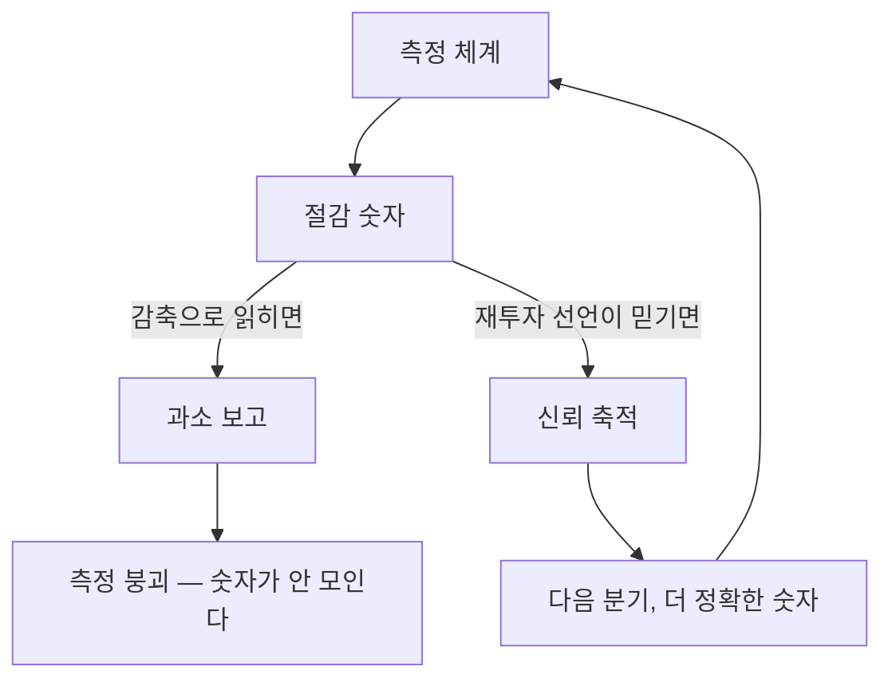

# 9장. 절감분은 누구의 것인가

분기 보고서의 마지막 칸에 커서가 놓여 있다. 앞 장에서 만든 환산 절차를 실제로 돌렸고, 숫자가 나왔다. 신뢰도 등급도 매겼고 자율성 계수도 곱했다. 이제 그 값을 "절감 효과" 칸에 적기만 하면 된다.

그런데 커서가 깜빡이는 채로 손이 멈춘다.

이 숫자를 적으면 다음 주 회의에서 누군가 이렇게 물을 것이다. "그러면 그만큼 사람이 남는다는 거네요?" 그 질문에 뭐라고 답할지 아직 정해지지 않았다. 정해지지 않은 채로 숫자를 먼저 적는 것이 옳은가?

이 망설임은 정직한 망설임이다. 그리고 이 장은 그 망설임을 제도로 옮기는 방법을 다룬다.

## 왜 손이 멈추는가

앞 장에서 우리는 재는 법을 세웠다. 이 장의 출발점은 그 반대편이다. 잘 잰 숫자가 조직에서 어떻게 읽히는가.

이 책에서 가장 중요한 문장 하나를 여기서 꺼낸다.

> **절감이 곧 감원으로 읽히는 순간, 현장은 성과를 숨긴다. 그러면 측정 체계 자체가 붕괴한다.**

문장 자체는 어렵지 않다. 어려운 것은 이 문장이 함의하는 구조다. 우리는 대개 측정이 부정확한 것을 문제로 본다. 그래서 도구를 개선하고, 로그를 붙이고, 기준값을 다듬는다. 앞 장 전체가 그 작업이었다.

그런데 여기서 반대 방향의 힘이 작동한다. **측정이 정확해질수록 그 숫자의 위협도 정확해진다.** 뭉뚱그린 추정치일 때는 아무도 그것으로 인력 계획을 세우지 않는다. 정밀한 실측값이 되면 세울 수 있게 된다. 그러니 도구를 개선할수록 숨길 유인이 커진다. 이건 도구의 품질 문제가 아니라 구조의 문제다.

이 구조가 실제로 어떻게 작동하는지 보여주는 증언이 있다. 2025년 10월 해외 기술 커뮤니티에 올라온 글이다.

> "At my company people always understate the headcount savings. Because the invariable question is - 'You are spending x million and for y FTEs you save only 1 FTE of HC? How does that make sense?'. Or worse yet - 'You estimated 40 FTE savings, why don't we pick and chose 40 FTEs to let go'."
> — 우리 회사에서 사람들은 항상 절감 인원을 축소해서 보고한다. 반드시 이런 질문이 돌아오기 때문이다. "몇백만을 쓰면서 인원 y명분에 겨우 1명분을 절감했다고요? 그게 말이 됩니까?" 아니면 더 나쁜 쪽으로 — "40명분을 절감한다고 추정했죠? 그럼 40명을 골라서 내보내면 되겠네요."

익명 개인이 사내 관행을 전한 글이고 검증된 조사는 아니다. 그래도 이 문단은 앞의 명제를 한 번에 설명한다. 축소 보고를 움직이는 것은 **자기 보존**이다. 무능이나 태만을 원인으로 짚는 진단은 여기서 아무것도 설명하지 못한다. 절감을 크게 보고하면 자기 조직의 영역이 줄어든다. 작게 보고하면 투자 대비 효과가 없다고 질책받는다. 그 사이에서 사람들은 대체로 작게 보고하는 쪽을 택한다. 질책이 감원보다는 견딜 만하기 때문이다. 이 계산을 탓하기는 어렵다. 그러니 먼저 손대야 할 것은 이 계산의 전제다. 절감을 정직하게 보고해도 자기 조직이 위태로워지지 않는다는 조건을 만들지 못하면, 측정 도구를 아무리 정교하게 다듬어도 숫자는 올라오지 않는다.

한국어 커뮤니티에는 더 짧고 더 아픈 짝이 있다. 2026년 5월의 글이다.

> "개발자가 먼저 나서서 미친 생산성을 보여줬기에… 관리자는 더 미친 생산성을 바랄 뿐입니다. 그러게 적당히 사용했어야죠."

여기서 처벌의 형태가 다르다는 것을 알 수 있다. **기준선 상향**이다. 그리고 실무에서는 감원보다 이쪽이 훨씬 흔하다. 잘하면 잘한 만큼이 다음 분기의 기본값이 되고, 그 기본값에서 다시 향상을 요구받는다. 절감분이 어디로 갔느냐고 물으면 답은 간단하다. 다음 분기의 목표치로 갔다. 그렇다면 측정 체계를 설계할 때 목표치 상향의 규칙도 함께 정해야 앞뒤가 맞는다. 향상분의 어느 정도까지를 다음 기준선에 반영할지 미리 못 박아 두면, 잘한 것이 곧 벌이 되는 구조를 조금은 늦출 수 있다.

이 구조가 특히 난감한 것은 스스로를 강화한다는 점이다. 현장이 절감을 축소해 보고하면 체계의 성과가 실제보다 작아 보인다. 성과가 작아 보이면 다음 해 예산이 깎인다. 예산이 깎이면 실측 인프라를 못 깔고, 실측이 없으면 자기보고에 더 의존하게 되며, 자기보고 비중이 커질수록 축소는 더 쉬워진다. 한 바퀴를 돌 때마다 숫자와 실체의 거리가 벌어진다. 그리고 몇 바퀴 뒤에는 아무도 그 표를 믿지 않게 된다. 표는 계속 만들어지는데 그 표로 아무 결정도 하지 않는 상태, 조직에서 흔히 보는 그 상태가 이 회로의 종점이다.

당신이 측정 체계를 세우겠다고 선언하면, 현장에서 이런 말이 나온다. 이 말들이 나오는 것을 막을 방법은 없다. 다만 이 말들이 나오기 전에 답을 준비해 둘 수는 있다. 그 답이 이 장이 만들려는 물건이다.

## 절감분이 애초에 생기지 않는다면

여기서 훨씬 근본적인 반론을 하나 받고 가자. 앞 장 전체와 이 장의 전제를 흔드는 물음이다. 절감된 시간이라는 것이 정말 생기기는 하는가?

2025년 5월, 한국어 커뮤니티에 올라온 관찰이다.

> "엑셀이 나와서 바뀐 것의 핵심은 일을 자동화시켜준 것이라기 보다는. 일을 실시간으로 그리고 항시적으로 만든거죠. 발표 5분전이라도 수정할수 있는 긴장된 상태가 유지되니.. 일하는 시간개념이 실시간인 동시에 항시적이라 결국 바빠집니다."

개인의 공개 발언이고 조사가 아니다. 그런데 이 관찰이 강한 이유가 있다. 40년 전에 나온 도구로 지금을 설명하기 때문이다. 현재의 AI 논쟁은 진영이 갈려 있어서 어떤 주장을 해도 입장으로 읽힌다. 표계산 프로그램은 그렇지 않다. 그것이 사무직 노동에 무엇을 했는지는 이제 논쟁거리가 아니다. 이 관찰이 우리 설계에 거는 조건은 하나다. 절감분이 생긴다는 것을 전제로 두지 말고, 실제로 생겼는지를 확인하는 단계를 절차 안에 넣어야 한다.

그리고 그 답이 "일이 줄었다"가 아니었다는 것이 이 관찰의 요점이다. 계산이 빨라진 만큼 계산의 요구가 늘었다. 한 번 만들면 끝이던 자료가 언제든 고칠 수 있는 자료가 되었고, 고칠 수 있으면 고쳐 달라는 요청이 온다. 절감된 시간은 새로운 요구로 채워졌다.

이 반론을 이 책의 전제를 지키기 위해 반박하지는 않겠다. 상당 부분 맞는 이야기이기 때문이다. 다만 두 가지를 덧붙일 수 있다.

첫째, 이 구조는 절감분의 행선지를 명시해야 할 이유가 된다. 세지 말아야 할 이유로 읽으면 곤란하다. 절감된 시간이 자동으로 새 요구에 흡수된다면, 그 흡수가 의도된 것인지 아닌지는 조직이 알고 있어야 한다. 아무도 세지 않으면 그 흡수는 그냥 "요즘 왜 이렇게 바쁘지"로 끝난다.

둘째, 앞 장에서 본 실험 하나가 이 관찰과 정확히 맞물린다. 대규모 현장 실험에서 이메일에 쓰는 시간은 유의하게 줄었지만 회의 시간에는 유의한 변화가 없었다. 혼자 바꿀 수 있는 것은 바뀌었고 조율이 필요한 것은 바뀌지 않았다. 표계산 도구의 관찰은 이 결과의 다른 얼굴로 읽힌다. 개인이 확보한 시간은 조직의 요구가 다시 가져간다.

그러니 이 장의 질문을 조금 고쳐 두자. 절감분이 누구의 것이냐는 물음은 실은 그 절감분이 어디로 흘러갈지를 누가 결정하느냐는 물음이다.

## 사용처는 셋뿐이다

흘러갈 곳을 정하려면 선택지를 먼저 봐야 한다. 확보한 시간의 사용처는 셋뿐이다.

| 사용처 | 내용 | 현장의 반응 |
|---|---|---|
| **재투자** | 확보한 시간을 새 일, 더 가치 있는 일로 | 협조적 |
| **품질·처리량 증가** | 같은 인원으로 더 많이, 더 정확하게 | 중립 |
| **감축** | 정원 조정 | 강한 저항 |

이 표에서 정작 중요한 것은 **세 줄이 서로를 오염시킨다**는 사실이다. 조직이 첫 번째를 하겠다고 말해도, 세 번째가 가능하다는 것을 모두가 알고 있으면 첫 번째 선언은 믿기지 않는다. 그리고 믿기지 않는 선언 아래에서 사람들은 앞 절에서 본 대로 행동한다. 숫자를 작게 적는다.

여기서 이 장의 첫 번째 원칙이 나온다. **측정을 세우는 일과 감축을 논하는 일은 순서가 반대여야 한다.** 숫자가 먼저 쌓이고, 그 숫자로 무엇을 하는지 지켜본 경험이 신뢰를 만든 다음에야 활용의 범위를 넓힐 수 있다. 순서를 거꾸로 하면 숫자 자체가 안 모인다.

그림 1. 같은 숫자라도 어떻게 읽히느냐가 측정의 운명을 정한다

실무적으로는 도입 초기 몇 년 동안 **재투자를 기본값으로 명시적으로 선언**하는 형태가 된다. 여기서 "명시적으로"가 중요하다. 말하지 않은 기본값은 기본값이 아니다. 사람들은 말해지지 않은 것을 최악으로 해석한다.

그래서 이 장이 남기는 첫 번째 도구가 선언문이다. 아래는 고쳐 쓰라고 만든 초안이다.

> **측정 결과 사용 제한 선언 (초안)**
>
> 1. 이 체계가 산출하는 절감 수치는 개인 또는 조직 단위의 인력 조정 근거로 사용하지 않는다. 적용 기간은 ○○년 ○월까지이며, 연장 여부는 그 시점에 다시 논의한다. **재논의 없이 기한이 지나면 본 선언은 자동 연장된 것으로 본다.**
> 2. 확보된 시간의 기본 용도는 **재투자**다. 다른 용도로 쓰려면 그 결정을 별도 안건으로 공개 논의한다.
> 3. 이 수치는 조직 단위로만 집계하며, 개인별로 분해해 보관하거나 인사 평가에 연동하지 않는다.
> 4. 이 체계는 에이전트의 활동을 기록한다. 구성원 개인의 도구 사용 내역을 수집 대상으로 삼지 않는다.
> 5. 위 항목의 변경은 사전에 고지하며, 소급 적용하지 않는다.

이런 문서를 쓰자고 하면 대개 두 가지 반응이 온다. 하나는 "그런 약속을 우리가 할 권한이 있느냐"이고, 다른 하나는 "약속해 놓고 나중에 못 지키면 더 나빠진다"이다.

둘 다 타당한 우려다. 그래서 초안 1항에 기한을 넣었다. 영구적인 약속은 지킬 수 없고, 지킬 수 없는 약속은 처음부터 안 하는 편이 낫다. 반면 "앞으로 2년간은 이 숫자를 그 용도로 쓰지 않는다"는 약속은 지킬 수 있고, 그 2년이면 체계가 자리 잡기에 충분하다. 돌려주는 프레임으로 시작하는 데 필요한 최소치가 그 정도다.

## 같은 사실, 여러 개의 문장

선언이 왜 어려운지는 실제 사례를 보면 알 수 있다. 공개된 기록으로 추적 가능한 사례가 하나 있다.

2024년 2월, 클라르나(Klarna)가 보도자료를 냈다. 고객 응대에 AI를 도입한 결과를 발표하는 내용이었고, 숫자가 구체적이었다. 첫 달에 처리한 대화 건수, 전체 고객 응대 채팅에서 차지하는 비중, 반복 문의 감소율, 평균 처리 시간 단축. 그리고 문제의 문장이 있었다.

원문은 그 AI가 **"700명의 전일제 상담원이 하는 일에 상당하는 양"**을 처리한다고 적었다. 이익 개선에 대해서는 그해에 얼마만큼의 개선을 가져올 것으로 예상한다고 썼다.

이 두 표현을 정확히 읽어야 한다. 보도자료는 700명을 대체했다고 쓰지 않았다. 700명분의 일에 상당하는 양이라고 썼다. 쓰인 표현은 환산이고, 대체라는 단어는 그 문장에 없다. 이익 개선도 확정이 아닌 예상이었다.

그런데 이 발표가 세상에 옮겨지는 과정에서 두 표현은 사라졌다. 며칠 뒤 커뮤니티에 올라온 한 사용자의 해부가 그 과정을 정확히 짚었다.

> "So they simultaneously claim that they've got AI that has replaced 700 people, but that they haven't actually fired 700 people, but if you're listening Wall Street we're are firing them, but if you're listening EU regulators and main street no no we're definitely not."
> — 그러니까 이들은 700명을 대체한 AI를 가졌다고 주장하면서 동시에 실제로 700명을 해고하지는 않았다고 하고, 듣는 쪽이 월가라면 해고 중이라는 뜻이고, 듣는 쪽이 규제 당국과 일반 대중이라면 절대 아니라는 뜻이다.

개인의 공개 발언이다. 그래도 이 문단이 짚은 것은 구조적이다. **"AI로 N명분"이라는 문장은 하나의 사실 주장이 아니라 청중별로 다르게 읽히는 여러 개의 진술이다.** 투자자에게는 비용 절감의 신호로, 규제 당국에게는 고용 유지의 해명으로, 직원에게는 예고로 읽힌다. 발화자가 의도를 하나로 정해도 수신자가 셋이면 문장도 셋이 된다. 이걸 처음 겪는 사람은 대개 아찔해한다. 정확하게 쓴 문장이 자기 손을 떠난 뒤 정반대 뜻으로 돌아오기 때문이다. 그래서 발표문을 준비할 때는 문장을 다듬는 데서 멈추면 안 된다. 각 청중이 그 문장을 받아 무엇을 할 수 있게 되는지까지 적어 두고 시작해야 한다.

이 사례에는 후일담이 있다. 이듬해 이 회사의 최고경영자는 인터뷰에서 AI 응대가 사람보다 싸긴 했지만 품질이 낮았다고 밝혔고, 고객이 원하면 언제든 사람과 대화할 수 있도록 사람을 다시 채용하고 있다고 말했다. 매체 보도를 통해 알려진 내용이며 여러 매체가 교차 보도했다.

그리고 확인되지 않은 것이 하나 남는다. 처음 발표에서 예상한 이익 개선이 실제로 실현됐는지에 대한 사후 공시나 검증 자료를 이 책은 찾지 못했다. 원 발표는 예상이라고 명시했고, 실현 여부는 공개되지 않았다.

이것이 이 절의 결론이다. **선언은 공개되고 검증은 공개되지 않는다.** 그리고 이 비대칭은 공시라는 제도의 성질에서 나온다. 특정 회사를 탓할 일이 아니다. 좋은 예상은 발표할 유인이 있고, 빗나간 예상은 발표할 유인이 없다.

한 회사 안에서 문장이 갈리는 경우도 있다. 2025년 9월에 보도된 세일즈포스(Salesforce)의 사례에서, 최고경영자는 팟캐스트에서 고객 지원 인력을 줄였다고 말했다. 같은 시기 회사 공식 성명은 처리해야 할 문의 건수가 줄어 지원 엔지니어 자리를 적극적으로 충원하지 않게 되었다고 설명했고, 상당수 인력을 다른 직무로 재배치했다고 밝혔다. 해고와 결원 미충원은 같은 사실의 다른 이름일 수 있지만, 듣는 사람에게는 전혀 다른 문장이다.

당신이 절감 수치를 발표하는 자리에 서게 되면, 이 두 사례가 예고편이 된다. 그러니 발표 전에 정할 것이 있다. 이 숫자를 듣는 사람이 몇 종류인지, 그리고 각각에게 같은 문장이 어떻게 들릴지다. 앞 절의 선언문이 필요한 이유가 여기서 한 번 더 나온다. **선언문은 청중이 셋이어도 문장이 하나로 유지되게 만드는 장치다.**

## 자동화가 정말 일자리를 없앴는가

여기까지 오면 이 장이 한쪽으로 기울어 보일 수 있다. 균형을 위해 반대 방향의 실증을 봐야 한다. 그리고 이 실증은 직관을 꽤 강하게 깬다.

경제학자 제임스 베슨(James Bessen)이 2015년에 쓴 기고문의 사례다. 현금인출기가 보급된 기간에 은행 창구직에 무슨 일이 일어났는지를 다뤘다.

> "the number of tellers required to operate a branch office in the average urban market fell from 20 to 13 between 1988 and 2004"
> — 도시 지역 평균 지점을 운영하는 데 필요한 창구직원 수는 1988년에서 2004년 사이 20명에서 13명으로 줄었다.

여기까지는 예상대로다. 그런데 다음 문장이 이어진다.

> "Bank branches in urban areas increased 43 percent"
> — 도시 지역 은행 지점 수는 43퍼센트 늘었다.

지점 하나를 운영하는 비용이 내려가자 지점을 더 열 수 있게 되었다. 그래서 저자는 현금인출기가 보급되는 동안 창구직 일자리 자체는 줄지 않았다고 적었다.

더 강한 사례도 같은 글에 있다. 19세기 방직이다.

> "power looms automated 98 percent of the labor needed to weave a yard of cloth"
> — 역직기는 옷감 1야드를 짜는 데 필요한 노동의 98퍼센트를 자동화했다.

98퍼센트다. 그런데 같은 기간 공장 방직 일자리는 늘었고, 방직공의 임금은 크게 올랐다.

이 두 사례는 "80퍼센트를 자동화하면 인력의 80퍼센트가 남는다"는 직관을 정면으로 깬다. 가격이 내려가면 수요가 늘고, 수요가 늘면 일이 늘어난다.

인용에 한 가지 주의가 필요하다. 위 수치들은 저자 본인이 2015년 3월에 쓴 기고문에 나온 것이다. 다른 논문이 이 저자를 인용하면서 제시한 창구직원 총수의 절대 수치가 따로 있는데, 그것은 저자 본인의 기고문에는 없다. 판본이 다른 수치를 한 문장에 섞으면 그 자체가 이 책이 비판하는 인용 관행이 된다. 그래서 여기서는 저자 본인의 문장만 옮겼다.

그리고 이 사례를 안심의 근거로 쓰면 안 된다. 자동화가 고용을 늘린 경우가 있다는 것은 항상 그렇다는 뜻이 아니다. 로봇 도입이 지역 고용과 임금에 부정적 영향을 미쳤다는 실증도 나란히 존재한다. 여기서 말할 수 있는 것은 하나다. 결과가 한 방향으로 정해져 있지 않다. 그리고 정해져 있지 않다는 사실이 조직의 선택을 중요하게 만든다. 어느 쪽으로 갈지가 기술보다 결정에 달려 있다면, 그 결정을 명시적으로 내리는 것이 이 장의 일이다.

## 등록은 감시로 오해되기 가장 쉽다

측정 이야기를 하는 동안 등록 이야기가 조용히 따라와 있었다. 이 장에서 정면으로 다뤄야 할 위험이 그것이다.

우리가 앞의 여러 장에서 세운 것은 에이전트를 등록하고, 소유자를 지정하고, 실행 기록을 남기는 체계다. 이 문장을 조직에 전달하면 상당수 구성원은 다르게 듣는다. 자기가 입력한 내용이 기록되고 누군가에게 보인다고 듣는다. 2026년 3월 커뮤니티의 한 문장이 그 반응을 압축한다. 회사에서 감독하는 사람이 프롬프트를 전부 추적하고 쉽게 열람할 수 있다는 것이다.

**등록의 대상이 에이전트인지 사람인지를 명확히 갈라주지 못하면, 이 책이 설계한 체계는 감시 매뉴얼로 읽힌다.**

그리고 이 오해는 정서의 문제로 그치지 않는다. 성과를 실제로 떨어뜨린다. 근거가 있다.

작업장의 알고리즘 통제를 종합한 2020년의 학술 리뷰(『Academy of Management Annals』 14권 1호, 동료평가 논문)는 알고리즘 통제의 여섯 기제를 정리했다. 제한하기, 추천하기, 기록하기, 평정하기, 대체하기, 보상하기다. 이 목록을 보면 불편한 사실 하나가 드러난다. **"등록하고 로그를 남긴다"는 우리 설계는 이 목록의 세 번째 항목과 기술적으로 구별되지 않는다.** 로그는 감사에도 쓰이고 감시에도 쓰인다. 같은 데이터, 다른 용도다.

같은 리뷰의 또 다른 요지가 실무적으로 더 중요하다. 통제는 언제나 **쟁투의 장**이라는 것이다. 통제 장치가 도입되면 반대편에서는 그것을 우회하거나 재해석하거나 저항하는 실천이 함께 생긴다. 이 관점을 받아들이면 결론이 하나 따라온다. **등록 체계 도입은 기술 프로젝트가 아니라 협상이다.** 협상에는 상대가 있고, 상대에게는 요구가 있다.

전자적 성과 모니터링에 대한 메타분석(2023년, 동료평가 논문)은 더 직접적인 경고를 준다. 세 가지가 확인됐다. 모니터링이 노동자 성과를 개선한다는 증거는 없다. 모니터링의 존재 자체가 스트레스 증가와 연관된다. 그리고 전자 모니터링과 반생산적 업무 행동 사이에 정적 관계가 있다.

여기에는 외삽의 경계를 분명히 그어야 한다. **이것은 사람을 모니터링한 연구이지 에이전트를 로깅한 연구가 아니다.** 우리가 하려는 것은 후자다. 그런데 요점은 이것이다. 직원이 에이전트 로그를 자기에 대한 감시로 인식하는 순간, 이 연구 결과들이 그대로 발동한다. 인식이 실체를 이긴다.

같은 메타분석에는 처방도 들어 있다. 더 투명하고 덜 침습적으로 모니터링하는 조직은 더 긍정적인 태도를 기대할 수 있다는 것이다.

여기서 한 걸음 더 나갈 수 있다. 투명성을 약속으로만 두지 않고 구조로 만드는 방법이 있다. 표준 논의에서 제안된 형태 하나가 참고가 된다. **정책 판단 단계와 감사 기록 단계를 파이프라인으로 물리적으로 분리하는** 설계다. 에이전트가 스스로 밝힌 의도 같은 정보는 감사 기록에는 남지만 인가 판단에는 닿지 못하게 단계를 갈라 놓는 것이다. 원래 의도는 보안이었다. 자기가 한 말을 근거로 자기 권한을 얻는 경로를 차단하려는 것이다. 그런데 이 구조는 감시 우려에도 그대로 답이 된다. 어떤 데이터가 어느 단계에서만 보이는지가 코드로 정해져 있으면, "이건 안 봅니다"가 확인 가능한 사실이 된다. 문서로 하는 약속은 사람이 바뀌면 흔들리지만, 파이프라인 구조는 바꾸려면 누군가 코드를 고쳐야 하고 그 변경은 기록에 남는다.

이 처방들을 실무 항목으로 옮긴 것이 다음 절이다.

## 커뮤니케이션 체크리스트

이 장이 남기는 두 번째 도구다. 네 항목이고, 순서에 의미가 있다.

**① 사전 고지 — 발견당하지 않게 한다.**
가장 나쁜 시나리오는 구성원이 로그의 존재를 우연히 알게 되는 것이다. 그 순간 이후로는 무슨 설명을 해도 사후 해명으로 들린다. 체계를 켜기 전에 알린다. 알리는 시점이 늦어질수록 같은 내용의 설명이 더 비싸진다.

**② 수집 범위 명시 — 무엇을 보는지와 무엇을 안 보는지를 함께 적는다.**
많은 조직이 앞의 절반만 한다. 그런데 사람들이 알고 싶은 것은 대개 뒤쪽이다. 안 보는 것의 목록이 없으면, 사람들은 명시되지 않은 전부를 본다고 가정한다. 우리 설계에서는 이 항목이 특히 유리하다. 에이전트의 실행 기록과 구성원의 도구 사용 내역은 원래 다른 데이터다. 그 사실을 문서로 못 박을 수 있다.

**③ 당사자 이익과 연결 — 이 기록이 당사자에게 무엇을 해 주는지 말한다.**
사전에 알리고 수집 범위를 투명하게 밝히면 우려가 줄어든다는 조사 결과, 그리고 수집된 데이터가 자기 커리어상 이익과 연결되면 수용하겠다는 응답이 있다. 다만 이 수치들의 일부는 집계 사이트를 경유한 것이라 원 조사를 재확인해야 한다. 그래서 여기서는 방향만 쓴다. 방향은 분명하다. 기록이 자기에게 돌아오는 것이 있으면 사람들은 받아들인다. 실무적으로는 성과 귀속이 그 자리다. 에이전트가 낸 성과가 그것을 만들고 운영한 사람의 기여로 기록된다면, 로그는 증빙이 된다.

**④ 폐기 규칙의 존재를 함께 고지한다.**
이 항목이 앞의 셋보다 덜 알려져 있는데, 실은 가장 효과가 크다. 무엇을 어떻게 내보내는지가 이미 정해져 있다는 사실 자체가 감시 공포를 낮춘다. 이유는 단순하다. **정리의 대상이 에이전트임을 제도로 보여주는 항목이기 때문이다.** 에이전트를 재심사하고 폐기하는 규칙이 문서에 있으면, "정리"라는 단어가 사람을 향하지 않는다는 것이 절차로 증명된다. 이 규칙을 어떻게 만드는지가 다음 장의 주제다.

네 항목의 순서에도 뜻이 있다. 실무에서는 대개 ③부터 하고 싶어진다. 좋은 이야기이기 때문이다. 그런데 ①과 ②를 건너뛰고 ③으로 시작하면 홍보로 들린다. 이익을 먼저 말하는 쪽은 무언가를 감추고 있다고 여겨지기 쉽다. 그러니 순서를 지키자. 무엇을 하는지 먼저 알리고, 범위를 밝히고, 그다음에 이익을 말한다. ④는 시점이 조금 다르다. 폐기 규칙은 체계를 켤 때 아직 완성되지 않았을 수 있다. 그렇다면 "만들고 있고 언제까지 공개한다"까지만 말한다. 없는 것을 있다고 하는 것보다 낫고, 아예 말하지 않는 것보단 훨씬 낫다.

마지막으로 어휘 하나를 금지해 두자. **"잡아낸다"는 말을 쓰지 않는다.** 미승인 도구 사용을 다루는 실무 논의에서 이 동사가 자주 등장한다. 말하는 쪽에서는 탐지 기능을 가리키는 중립적 표현이지만, 듣는 쪽에서는 자기가 잡히는 대상이라는 뜻으로 들린다. 어휘 하나가 체계 전체의 성격을 규정할 수 있다.

## 저항은 분배의 문제다

체크리스트를 다 지켜도 남는 것이 있다. 커뮤니케이션으로 풀리지 않는 부분이다.

2026년 3월, 커뮤니티의 한 문장이 그것을 정확히 짚었다.

> "You work the same hours, but you're more tired, and the company pockets the profits"
> — 일하는 시간은 같은데 더 피곤해지고, 이익은 회사가 챙긴다.

같은 시기 다른 사용자들의 발언도 같은 방향이었다. 개인 생산성이 올라가면 프로젝트당 필요한 인원이 줄고 남는 사람은 나가게 된다는 것, 그리고 인원 감축이 비용을 줄이는 주된 방법이며 AI가 그것을 가능하게 하는 가장 유망한 수단이라는 것. 모두 개인의 공개 발언이다.

이 발언들을 읽는 방식이 중요하다. 조롱으로 읽으면 이 장은 여기서 끝난다. **예고로 읽으면 설계 요구사항이 된다.** 실무자가 AI를 거부하는 진짜 이유는 분배에 있다. 생산성 향상의 과실이 자기에게 오지 않는다고 믿기 때문이다. 이 믿음은 지난 수십 년의 관찰에서 나온 귀납이다. 근거 없는 피해의식으로 치부하면 대응할 방법도 함께 사라진다.

그래서 변화관리를 설득 기법으로 접근하면 실패한다. 필요한 것은 분배의 약속이다. 앞에서 만든 선언문이 그 약속의 최소 형태였다. 그리고 약속에는 지킨 기록이 따라야 한다. 첫 분기에 확보된 시간이 실제로 어디에 쓰였는지를 공개하는 것이, 두 번째 분기의 숫자가 정직하게 올라오게 만드는 유일한 방법이다.

그렇다면 이 약속을 무엇 위에 세울 것인가. 변화관리를 다루겠다고 하면 익숙한 프레임들이 따라온다. 여기서 하나를 정리하고 가자.

"조직 변화의 70퍼센트는 실패한다"는 수치가 있다. AX 관련 자료와 컨설팅 문서에 거의 빠짐없이 등장한다. 2011년의 한 연구(『Journal of Change Management』 11권 4호, 동료평가 논문)가 이 수치의 가장 저명한 출처 다섯을 추적했다. 결과는 이렇다. 각 출처는 증거 없이 그 숫자를 진술했거나, 증거 없이 그 숫자를 진술한 다른 출처를 인용하고 있었다. 저자의 결론은 명확하다. 그런 서사가 널리 퍼져 있다는 것은 인정하되, 그것을 뒷받침하는 유효하고 신뢰할 만한 실증 근거는 없다는 것이다.

그래서 이 책은 그 수치를 쓰지 않는다. 8장에서 남의 숫자에 출처 성격 라벨을 붙이라고 요구해 놓고, 변화관리 장에서 출처 없는 수치로 독자를 설득하면 앞의 요구가 무효가 된다.

유명한 변화관리 프레임을 쓰지 말라는 뜻은 아니다. 조직에서 이미 그 언어를 쓰고 있다면 그대로 쓰면 된다. 다만 그것을 실증 검증을 거친 예측 모델로 믿을 이유는 없다. 대신 후속 실증이 축적된 이론 위에 뼈대를 세울 수 있다.

1996년에 제시된 한 이론(『Academy of Management Review』 21권 4호, 동료평가 논문)은 도입 실패를 두 변수로 설명한다. 하나는 **구현 풍토**다. 대상 구성원이 그 혁신의 사용이 보상받고, 지원받고, 기대된다고 공유해서 인식하는 정도다. 다른 하나는 **혁신-가치 정합**이다. 그 혁신이 자기 가치를 촉진한다고 인식하는지, 저해한다고 인식하는지다.

이 틀이 실무적으로 유용한 이유는 진단이 간단해지기 때문이다. "쓰라고 했는데 안 쓴다"의 원인이 둘로 좁혀진다. 풍토가 약하거나, 가치가 안 맞거나. 그리고 이 이론은 구현의 결과를 네 단계로 구분한다. 저항, 회피, 순응, 헌신이다. **AX 지표가 사용률만 본다면 순응까지만 측정하는 것이다.** 8장에서 사용량을 성과 지표로 삼지 말라고 한 이유가 여기서 이론적 근거를 얻는다.

여기서 파생되는 실행 원칙을 정리해 두자. 이 장이 남기는 세 번째 도구다.

| 실행 원칙 | 근거 | 함께 봐야 할 것 |
|---|---|---|
| 사용자에게 아주 작은 수정 권한이라도 준다 | 결과를 수정할 수 있으면 불완전한 알고리즘도 훨씬 기꺼이 쓰고 성과도 개선됐다. 수정 폭이 심하게 제한된 조건에서도 효과 유지 | 수정 권한이 책임 소재를 흐릴 수 있다 (아래 참조) |
| 에이전트의 오류율을 사람의 오류율과 나란히 공개한다 | 같은 실수를 봐도 알고리즘 쪽에 더 빠르게 신뢰를 잃는다는 실증 | 비교 기준이 없으면 에이전트만 불공정하게 심판받는다 |
| 롤아웃은 효과가 큰 집단부터 시작한다 | 경험이 적은 인력이 증강형 도구에서 더 큰 이득을 본다는 패턴 / 시니어는 대체를 자율성·전문성에 대한 위협으로 인식 | 효과가 큰 집단과 저항이 작은 집단이 대체로 겹친다 |
| 문화 슬로건보다 개인 수준의 작업에 투자한다 | 2025년 연구에서 조직 문화는 직업 정체성 위협·사용 의도에 유의한 영향 없음. 설명 가능성과 개인의 AI 정체성 형성이 결정적이었다 | 동·남부 아프리카 단일 직군 413명, 자기 보고 횡단 연구 — 다른 맥락에 옮길 때 조건 명시 |
| 중간관리자를 최우선 대상으로 삼는다 | 탑다운 전향에서 집행 주체이자 최대 저항 세력 | 앞 절의 축소 보고 동기가 이 층위에서 가장 강하다 |
| 리더의 자기 규율을 첫 단계로 둔다 | 규칙을 만드는 쪽이 먼저 그 규칙 밖에 있으면 어떤 체계도 권위를 갖지 못한다 | 관련 조사 수치는 원 조사가 특정되지 않아 이 책은 쓰지 않는다 |

첫 줄에는 부연이 필요하다. 수정 권한을 주는 설계는 등록부에 "사용자 수정 가능 구간"이라는 필드를 두는 형태가 된다. 그런데 여기에 찜찜한 긴장이 하나 있다. 사용자가 수정했으니 결과의 책임도 사용자에게 있다는 논리로 흐르면, 앞의 여러 장에서 공들여 세운 책임 귀속이 도로 흐려진다. 수용을 높이려던 장치가 책임을 분산시키는 장치가 되는 셈이다. 이 긴장은 등록부에서 명시적으로 끊어야 한다. **수정 가능 구간과 책임 귀속은 별도 필드로 둔다.** 사용자가 어디까지 손댈 수 있는지와 사고가 났을 때 누가 답하는지는 서로 다른 질문이고, 한 칸에 뭉쳐 두면 반드시 뒤섞인다.

마지막 줄도 한마디 덧붙일 만하다. 경영진이 실무자보다 미승인 도구를 더 많이 쓴다는 조사 결과가 여러 곳에서 인용된다. 다만 원 조사가 특정되지 않아 이 책은 그 수치를 쓰지 않는다. 수치가 없어도 논리는 성립한다. 규칙을 만든 쪽이 그 규칙의 첫 번째 준수자가 아니면, 나머지 사람들에게 그 규칙은 통제로만 남는다.

## AX는 DX와 무엇이 다른가

마지막으로 가장 아픈 반론을 받고 끝내자. 이 책 전체를 겨눈다.

커뮤니티에 이런 지적이 있다. 오래된 기업들이 수십 년째 디지털 전환을 말하면서 서류를 디지털화하는 것 이상으로 못 간 이유가 기술에 있지 않고 정치에 있다는 것이다. 충분히 많은 사람이 그 서류에서 자기 일자리를 얻고 있어서, 실제 전환은 정치적으로 지탱 불가능하고 끊임없는 사보타주 때문에 실행 불가능하다는 진단이다.

이 지적이 아픈 이유는 앞의 반론들과 종류가 다르기 때문이다. 다른 반론들은 기술적 반복을 지적했다. 이건 **정치적 반복**을 지적한다. 그리고 정치적 반복은 기술 개선으로 극복되지 않는다. 더 좋은 모델이 나와도, 표준이 정해져도, 등록부가 잘 굴러가도 이 문제는 그대로 남는다.

여기서 "이번엔 다르다"고 답하지 않겠다. 그렇게 답할 근거가 이 책에 없다. 답이 없는 것에는 없다고 쓰는 편이 낫다. 이 책이 인용한 어떤 자료도 AX가 DX의 정치적 실패를 반복하지 않으리라는 증거가 되지 못한다.

대신 실제로 다르게 할 수 있는 것 하나는 말할 수 있다. 디지털 전환은 서류를 디지털화했다. 지금 우리가 하려는 것은 책임의 귀속을 재설계하는 일이다. 서류의 형식을 바꾸는 일에는 기존 업무의 존재 이유가 흔들리지 않는다. 그래서 조직은 형식만 바꾸고 실질은 유지하는 쪽으로 안착할 수 있었다. 반면 무엇을 누가 책임지는지를 다시 적는 작업은 형식만 바꿔서는 끝나지 않는다. 등록부의 소유자 칸을 채우려면 실제로 누군가 손을 들어야 한다.

물론 이 차이가 성공을 보장하지 않는다. 오히려 저항이 더 클 수도 있다. 다만 한 가지는 분명하다. **정원 감축을 목표로 세우는 순간, 이 작업은 그 사보타주 구조에 그대로 들어간다.** 앞에서 다룬 축소 보고와 기준선 상향이 그 구조의 입구다. 그러니 이 장이 내내 말한 순서 — 사용 제한을 먼저 약속하고 측정을 나중에 세우는 것 — 는 윤리적 배려이기 이전에 실행 가능성의 조건이다.

이제 이 장을 덮기 전에 할 일이 하나 남았다. 앞에서 본 선언문 초안을 꺼내 당신 조직의 언어로 고쳐 써 보자. 다섯 항목 중 몇 개를 지금 약속할 수 있는지, 기한은 언제까지로 잡을 수 있는지, 그리고 그 약속을 누구의 이름으로 낼 수 있는지. 이 세 질문에 답이 나오지 않는다면, 앞 장에서 만든 환산 절차를 아직 돌리지 않는 편이 낫다. 숫자는 한 번 나오면 되돌릴 수 없고, 되돌릴 수 없는 숫자를 어디에 쓸지 정하지 않은 채로 꺼내는 것이 이 장이 내내 경고한 바로 그 실수다.
