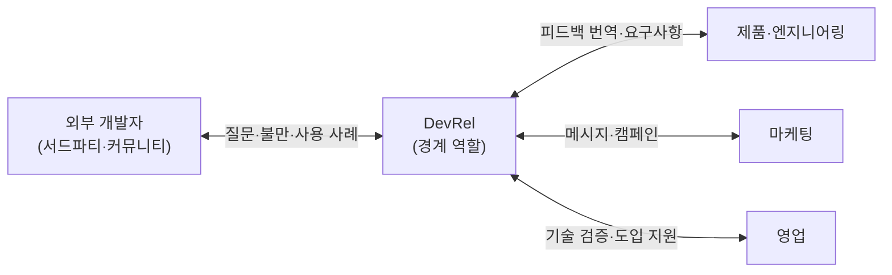

# 2장. 경계에 선 사람들 — DevRel이 원래 하던 일

DevRel을 흔히 '개발자 마케팅'이라고 부른다. 틀린 말은 아니다. 행사를 열고, 기술 블로그를 쓰고, 컨퍼런스 무대에 서서 제품을 소개한다. 겉으로 보이는 활동만 모아 놓으면 마케팅 부서의 일과 꽤 닮았다. 그런데 이 일의 출발점까지 거슬러 올라가면 풍경이 조금 달라진다. 1984년, 이 일의 목적은 서드파티 개발자를 플랫폼으로 데려오는 것이었다. 플랫폼 위에서 무언가를 만들 사람을 모으는 일, 그것이 이 일의 첫 모습이었다.

부고를 읽었으니 이제 이력서를 펼쳐볼 차례다. 죽었다는 그 일은 원래 누구를 위해, 무엇을 하던 일이었을까? 이 질문에 제대로 답해두지 않으면, 앞으로 이 책이 말할 "바뀌었다"는 진단도 무엇과 비교해 바뀌었다는 것인지 흐릿해진다. 천천히 계보를 따라 걸어보자.

## 1984년, 매킨토시를 위한 설득

1984년 매킨토시가 나왔을 때 Guy Kawasaki의 직함은 "software evangelist"였다. 위키백과의 요약은 그의 일을 이렇게 적는다. "His job title was 'software evangelist,' and his responsibility was to evangelize Macintosh to software developers." 소프트웨어 개발자들에게 매킨토시를 전도하는 일, 다시 말해 서드파티 개발사가 매킨토시용 프로그램을 만들도록 설득하는 일이었다. Kawasaki 본인은 자기 블로그 회고에서 이 일을 처음 시작한 사람이 따로 있었다고 밝힌다. "Mike Boich started evangelism and hired me." 에반젤리즘은 처음부터 누군가 시작하고 사람을 뽑아 채운 직무였던 셈이다.

여기서 잠시 멈추고 생각해보자. 왜 회사가 남의 회사 개발자를 설득하는 사람에게 월급을 줬을까? 매킨토시가 아무리 훌륭한 컴퓨터여도 그 위에서 돌아가는 소프트웨어가 없으면 사람들은 사지 않는다. 쓸 프로그램이 없는 컴퓨터는 비싼 전시품일 뿐이다. 그리고 그 프로그램을 Apple 혼자 전부 만들 수는 없었다. 결국 플랫폼의 가치는 플랫폼 밖에 있는 사람들이 무엇을 만들어 주느냐에 달려 있었다.

이 직관을 경영학의 언어로 정리한 연구가 있다. Parker, Van Alstyne, Jiang은 2017년 MIS Quarterly에 실린 논문에서 개발자가 늘어날수록 기업이 바깥의 기여를 받아들여 혁신하는 쪽으로 움직인다는 모형을 제시했다. 이들이 쓴 문장은 짧고 선명하다. "The locus of value creation moves from inside the firm to outside." 가치가 만들어지는 자리가 회사 안에서 밖으로 옮겨간다는 뜻이다. 같은 논문은 이렇게도 쓴다. "More developers give platform firms more chances at success." 개발자가 많을수록 플랫폼 기업이 성공할 기회도 많아진다.

이 두 문장을 1984년에 겹쳐보면 에반젤리스트의 존재 이유가 또렷해진다. 플랫폼 기업에게 외부 개발자는 가치의 원천이다. 그러니 그들을 데려오는 사람은 판매 조직의 보조가 아니라 플랫폼 전략의 한가운데에 선다. DevRel의 뿌리가 플랫폼 경제학에 닿아 있다는 점을 기억해두자.

이 시점의 그림을 짧게 요약해두자. 1984년의 에반젤리스트는 서드파티 소프트웨어 개발자를 설득하는 사람이었다. 플랫폼의 가능성을 믿게 만들고, 그 믿음이 실제 제품 개발로 이어지게 하는 일이다. 이 요약은 이 장 끝에서 다시 꺼낼 것이다.

## 양방향이라는 발명

설득만으로 충분했을까? 개발자를 플랫폼으로 데려오는 데까지는 그럴 수 있다. 하지만 데려온 다음이 문제다. 개발자들은 플랫폼 위에서 무언가를 만들다가 벽에 부딪힌다. 문서가 부족하고, API가 이상하게 동작하고, 필요한 기능이 없다. 그 불만은 어디로 가야 할까? 설득하는 일만 맡은 사람이라면 그 목소리를 들어도 전할 통로가 마땅치 않다. 개발자 입장에서는 꽤 찜찜한 관계다. 자기 말이 어디에도 닿지 않는다고 느끼게 되기 때문이다.

에반젤리스트라는 이름이 서서히 애드보킷으로 바뀐 배경에는 이 문제의식이 있다. Microsoft의 사례를 보자. 2012년 보도에 따르면 Microsoft에는 DPE(Developer & Platform Evangelism)라는 사업부가 있었고, 이후 이 계열의 직무명은 Cloud Developer Advocate로 바뀌었다. 전 Microsoft 직원 Dmitri Soshnikov는 2006년 Academic Developer Evangelist로 입사해 10년 넘게 에반젤리즘 조직에 있다가 Cloud Developer Advocate로 옮겼다고 스스로 적었다. 한 사람의 경력 안에서 직함이 바뀐 것이다.

이름이 바뀐 이유는 무엇이었을까? 업계에서 흔히 설명되는 논리는 이렇다. 에반젤리즘은 회사의 메시지를 개발자에게 전하는 일방향의 일로 설명된다. 애드보킷은 거기에 반대 방향을 더한다. 회사를 대변해 개발자에게 말하는 동시에, 개발자를 대변해 제품팀에 목소리를 전한다. 'Advocate'라는 단어가 원래 '옹호자', '대변인'이라는 뜻이라는 점을 떠올리면 이해하기 쉽다. 누구를 옹호하느냐는 질문에 이 직함은 "양쪽 모두"라고 답한다.

여기서 흔히 빠지기 쉬운 오해가 하나 있다. 애드보킷이 에반젤리스트를 몰아내고 그 자리를 차지했다고 생각하기 쉽다. 하지만 시간축 위에 놓고 보면 모습이 다르다. 1984년에 설득이 있었고, 그 위에 2010년대를 지나며 피드백이라는 방향이 한 겹 더해졌다. 애드보킷도 발표하고 데모하고 설득한다. 거기에 되돌아가는 길, 즉 개발자의 목소리를 회사 안으로 들여오는 일이 공식적으로 더해진 것이다.

이 변화는 이 일을 하는 사람이 서는 자리를 옮긴다. 관계를 맺는 수단이 두 방향으로 늘어났기 때문이다. 회사 쪽에서 바깥을 향해 서 있던 사람이 이제 회사와 바깥 사이, 그 경계 위에 서게 된다. 이 경계라는 자리가 뒤에서 DevRel을 설명하는 핵심 개념이 된다.

## 정의들 — 사람마다 다르게 불러온 이름

그렇다면 DevRel을 한 문장으로 정의할 수 있을까? 막상 해보려 하면 난감해진다. 1장에서 본 Lee Briggs가 이 일을 두고 "defies simple definition"이라고 쓴 것도 무리가 아니다. 회사마다, 연구자마다, 나라마다 강조점이 조금씩 다르다. 몇 가지 정의를 나란히 놓고 살펴보자.

| 정의 | 출처 | 라벨 |
|---|---|---|
| "Developer Relations' role is to create a vibrant ecosystem of 3rd party developers, by being the interface between those developers and your platform's product, engineering, and design teams." | Google DevRel 미션, Phil Leggetter의 글(2016-02-03)에서 인용 | 블로그 속 1차 인용 |
| "Our job is to inspire and equip developers to build the next generation of amazing applications..." | Twilio 미션, 같은 글에서 인용 | 블로그 속 인용 |
| DevRel은 플랫폼 중심 조직(keystone)이 서드파티 개발자의 임계 질량을 끌어들이고 참여시키기 위한 생태계 거버넌스 기능. 모델 DevGo 제안 | Fontão et al., *Journal of Software: Evolution and Process* 35(5), 2023(온라인 2021-10) | 동료 검토 논문 |
| "The Developer Relations (DevRel) is a strategy to attract, engage and mature developers in contributing to a platform." | Massanori et al., SBES 2020 | 동료 검토 학회 단편 논문 |
| "PR(Public Relations)이 일반인에게 기업을 알리는 활동이라면, DR(Developer Relations)은 개발자에게 기업을 알리는 활동" | kt cloud 기술블로그, 2024-11-04 | 블로그, 국내 통념의 한 예 |

표를 천천히 읽어보면 흥미로운 점이 보인다. 이 일이 향하는 대상에 대해서는 다섯 정의가 놀랄 만큼 같은 답을 한다. 서드파티 개발자, 플랫폼에 기여하는 개발자, 개발자.

관계를 맺는 방식을 설명하는 대목에서는 정의마다 강조점이 제각각이다. Google의 미션은 "interface"라는 단어를 쓴다. 개발자와 제품·엔지니어링·디자인 팀 사이의 접점이 되라는 것이다. 앞 절에서 본 양방향의 논리가 그대로 들어 있다. Twilio는 개발자에게 영감을 주고 도구를 쥐여주는 쪽에 무게를 둔다. Fontão 등의 논문은 한발 물러서서 이 일을 '생태계를 다스리는 기능'으로 본다. DevRel을 학술적으로 직접 다룬 연구가 드문 가운데 나온 정의라 눈여겨볼 만하다. Massanori 등은 끌어들이고, 참여시키고, 성숙시키는 세 동사를 쓴다.

국내에서 흔히 쓰이는 설명은 어떨까? kt cloud 기술블로그의 문장은 PR과 DR을 나란히 놓는다. 이 정의는 알기 쉽지만, 앞에서 본 계보에 비추면 '알리는' 한 방향에 무게가 실려 있다. 에반젤리즘에 가까운 이해라고 할 수 있다. 어느 쪽이 옳다고 판정할 문제는 아니다. 다만 같은 이름 아래 이만큼 다른 그림이 들어 있다는 사실은 알아두는 편이 낫다.

국내에서도 이 일을 다룬 번역서가 나왔다. Mary Thengvall의 『The Business Value of Developer Relations』(Apress, 2018)는 2022년 『기업의 성공을 이끄는 Developer Relations』(조은옥 옮김, 한빛미디어)로 번역되어 나왔다.

여기서 작은 연습을 하나 해보자. 지금 몸담은 회사, 또는 관심 있는 회사의 DevRel이 하는 일을 한 문장으로 적어보는 것이다. 다 적었다면 그 문장의 동사에 밑줄을 그어보자. '알린다'인가, '데려온다'인가, '돕는다'인가, 아니면 '전한다'인가. 그리고 목적어에도 밑줄을 그어보자. 누구에게 그 동사를 하는가. 밑줄 친 두 단어에 그 회사가 이 일에 거는 기대가 담겨 있다. 이 두 밑줄은 이 장 끝에서 쓸모가 생긴다.

정의가 하나로 모이지 않는 이유를 이렇게 생각해보면 어떨까. 정의하는 사람이 저마다 이 일의 다른 면을 보고 있기 때문이다. 그 대상과 관계를 맺는 방식은 회사의 사정에 따라 달라진다. 이 관찰을 붙들고 다음 개념으로 넘어가보자.

## 경계 역할 — 번역하고 중개하는 사람

DevRel이 회사와 외부 개발자 사이에 선다는 것은 조직 이론에서 오래된 질문과 맞닿아 있다. 조직 안과 밖의 정보를 잇는 사람의 역할이다. Michael Tushman은 1977년 *Administrative Science Quarterly*에 실린 논문 「Special Boundary Roles in the Innovation Process」에서 혁신 과정의 **경계 역할(boundary role)**을 다뤘다. 여기서는 개념의 뼈대만 빌려오자. 경계 역할을 맡은 사람은 조직 바깥의 정보를 안으로 들여오고, 그 정보를 조직 안에서 통하는 말로 번역하고, 필요한 곳에 퍼뜨린다. DevRel에 적용하면 여기에 반대 방향의 흐름이 하나 더 붙는다. 조직 안의 사정을 바깥이 알아들을 수 있는 말로 옮기는 일이다.

이 설명을 DevRel에 겹쳐보면 거의 그대로 들어맞는다. 앞 절 표의 Google 미션이 쓴 "interface"라는 단어가 바로 이 자리를 가리킨다.

그림 1. 경계 역할로서의 DevRel — 외부 개발자와 제품·엔지니어링·마케팅·영업을 잇는 자리

그림에서 DevRel에 연결된 선이 모두 양방향이라는 점에 주목하자. 제품팀이 새 API를 내놓으면 DevRel은 그것을 개발자가 쓸 수 있는 문서와 예제, 데모로 번역한다. 반대로 개발자 커뮤니티에서 "이 API는 인증 흐름이 너무 번거롭다"는 불만이 쌓이면, DevRel은 그 불만을 제품팀이 우선순위를 매길 수 있는 요구사항의 언어로 번역한다. 마케팅과 영업을 향한 선에서도 기술에 대한 설명과 시장의 사정이 함께 오간다.

번역이라는 말을 조금 더 곱씹어보자. 번역은 한쪽의 맥락을 이해하고 다른 쪽의 맥락에 맞게 다시 짜는 일이다. 개발자의 짜증 섞인 이슈 댓글을 그대로 제품 회의에 가져가면 아무도 움직이지 않는다. 그 댓글 뒤에 있는 사용 사례와 규모, 경쟁 제품과의 차이를 함께 전해야 우선순위가 된다. 그래서 경계 역할을 맡은 사람에게는 양쪽 언어를 모두 하는 능력이 필요하다. 이 자리에 기술 배경이 요구되는 이유도 여기서 짐작할 수 있다.

그런데 경계 위의 자리에는 개념에서 곧바로 따라 나오는 곤란함이 있다. 어느 한쪽에 완전히 속하지 않는다는 점이다. 그래서 양쪽 모두에게서 '정말 우리 편인가'라는 의심을 받기 쉽다. 조직도에서도 마찬가지다. 이 일이 마케팅 밑에 있어야 하는지, 엔지니어링 밑에 있어야 하는지, 제품 조직 안에 있어야 하는지는 회사마다 답이 다르다. 소속이 흔들리면 성과를 누가, 어떤 잣대로 평가하느냐도 흔들린다.

이 문제는 곧바로 다음 질문으로 이어진다. 경계에서 만들어진 가치는 어디에 기록될까? 번역이 잘되면 제품팀의 기능이 좋아지고, 영업팀의 계약이 늘고, 마케팅의 메시지가 개발자에게 먹힌다. 성과는 대부분 다른 부서의 숫자로 기록된다. 기억해두자. 이 구조가 DevRel 측정 논쟁의 뿌리다.

## 측정의 계보 — AAARRRP에서 Orbit까지

1장에서 본 측정 압박은 갑자기 생긴 것이 아니다. DevRel은 오래전부터 자기 가치를 숫자로 보여주려고 애써왔다. 그 시도들을 시간 순서대로 따라가보자. 어떤 틀이 나왔고, 각 틀이 무엇을 세려 했는지를 보면 이 일이 스스로를 어떻게 이해해왔는지도 보인다.

2016년 Phil Leggetter는 DevRelCon London에서 AAARRRP라는 틀을 발표했다. Awareness, Acquisition, Activation, Retention, Referral, Revenue, Product의 머리글자다. 스타트업이 흔히 쓰는 AARRR 퍼널에 Awareness와 Product를 더한 것이다. 흥미로운 점은 Leggetter가 모든 회사에 같은 목표를 권하지 않았다는 것이다. API 스타트업이라면 인지·획득·추천이, API를 가진 SaaS라면 활성화·매출이, 오픈소스 프로젝트라면 추천·제품이 중요하다고 봤다. 마지막 글자 Product가 특히 눈에 띈다. 개발자의 피드백을 제품에 되돌리는 일, 앞에서 본 양방향의 한쪽을 측정 틀 안에 명시적으로 넣은 셈이다.

2019년 12월 Mary Thengvall은 DevRel Qualified Leads라는 개념을 내놓았다. DevRel이 커뮤니티에서 발견해 사내의 적절한 팀으로 연결한 사람, 예컨대 제품 피드백을 줄 사람이나 베타 테스터, 파트너 후보, 채용 후보를 가치의 단위로 보자는 것이다. 영업 리드라는 익숙한 개념을 빌려 DevRel의 가치를 여러 부서에 대한 영향으로 설명하려 했다. 다만 Thengvall은 DevRel에 영업 지표를 그대로 씌우는 데에는 반대했다. 관계가 돈 중심으로 변질될 수 있다는 이유였다. 측정의 필요와 측정이 관계를 망칠 위험 사이에서 이미 줄타기가 시작된 것이다.

같은 해 11월에는 Orbit Model이 GitHub에 공개됐다. Josh Dzielak 등이 만든 이 틀은 커뮤니티의 힘을 Gravity = Love × Reach로 표현했다. Love는 구성원의 참여와 책임의 깊이, Reach는 커뮤니티 안에서의 연결과 영향력이다. Dzielak의 발표 제목은 "Communities aren't funnels"였다. 커뮤니티를 판매 퍼널의 한 단계로 보지 말자는 선언이다. 그런데 이 모델을 바탕으로 사업을 하던 회사 Orbit은 2024년 4월 11일 Postman에 인수됐다고 발표됐고, 기존 제품은 문을 닫았다. 2차 정리 자료에 따르면 데이터 수집은 2024년 5월 31일에, 전체 기능은 7월 11일에 멈췄다. 커뮤니티 측정을 독립 제품으로 키우려던 시도가 오래 버티지 못한 한 장면이다. 한 회사의 사례이니 시장 전체로 넓혀 읽지는 말자.

2021년 Caroline Lewko와 James Parton은 『Developer Relations』(Apress)에서 Developer Journey Map을 제시했다. Discover, Evaluate, Learn, Build, Scale의 다섯 단계다. 첫 단계에서 개발자가 던지는 질문은 "Is this of use to me?"다. 측정의 초점이 DevRel의 활동량에서 개발자가 실제로 걷는 여정으로 옮겨간 틀이라고 볼 수 있다.

개발자의 경험 자체를 개념으로 다룬 흐름도 있다. Fagerholm과 Münch는 2012년 ICSSP 학회 논문에서 개발자 경험(DX)을 "a means for capturing how developers think and feel about their activities within their working environments"라고 정의했다. 이 개념이 처음 제안될 때부터 생태계에 자발적으로 참여하는 외부 개발자가 고려 대상에 들어 있었다는 점을 짚어두자.

이후 Noda·Storey·Forsgren·Greiler가 2023년 ACM Queue에 기고한 DevEx는 피드백 루프·인지 부하·몰입이라는 세 차원을, Forsgren 등이 2021년 같은 잡지에 발표한 SPACE는 생산성을 단일 지표로 잴 수 없다는 원칙을 내세웠다. 둘 다 실무자 대상 잡지 기고로, 동료 검토 논문과는 성격이 다르다는 점도 덧붙여 둔다. 오픈소스 쪽에서는 Linux Foundation의 CHAOSS 작업 그룹을 분석한 Goggins 등의 2021년 연구가, 측정하기 쉬운 활동량 뒤에 있는 진짜 질문을 이렇게 적었다. "How healthy and sustainable is this project in the context of its competitors or dependent projects?"

이 계보를 한 줄로 이어보면 흐름이 하나 보인다. 틀은 점점 정교해졌고, 모두 같은 난제를 붙잡고 있었다. 경계에서 만든 가치를 어떻게 경계 너머의 숫자와 연결할 것인가. 그 난제는 아직 풀리지 않았다.

## 생태계를 DevRel 혼자 살릴 수는 없었다

지금까지 DevRel이 무엇을 해왔는지 봤다면, 이제 한계도 봐야 공정하다. DevRel에 투자하면 생태계는 살아날까? 역사는 그렇지 않다고 말한다.

Massanori 등은 2020년 브라질 소프트웨어 공학 심포지엄(SBES)에 발표한 단편 논문 「Death of a Software Ecosystem」에서 DevRel 투자에도 불구하고 무너진 생태계를 다뤘다. Symbian(2012), Firefox OS(2016), Windows Phone(2017)이다. 연구진은 Windows Phone 관련 Stack Overflow 질문 46,030개를 분석해, 핵심 플랫폼이 멈출 때 생태계에서 어떤 징후가 나타나고 개발자들이 어떻게 이주하는지를 정리했다. 앞 절 표에 있던 이 논문의 DevRel 정의, 끌어들이고 참여시키고 성숙시키는 전략이라는 말이 바로 이 연구에서 나왔다. DevRel을 정의한 연구가 동시에 DevRel만으로는 부족했던 사례를 기록한 셈이다.

이 사례가 알려주는 것은 분명하다. 플랫폼 자체의 경쟁력이 무너지면, 경계에서 아무리 번역을 잘해도 건너올 사람이 줄어든다는 것이다. 번역할 내용이 매력적이지 않으면 번역가가 할 수 있는 일에는 한계가 있다. DevRel을 평가할 때 이 점을 빼먹으면 억울한 판정이 나오기 쉽다. 반대로 DevRel의 가치를 주장할 때도 이 점을 잊지 않는 편이 낫다. 제품과 플랫폼의 힘을 넘어서는 약속은 결국 신뢰를 깎는다.

이제 이 장에서 걸어온 길을 하나의 틀로 묶어보자. 1984년부터 2020년대 초까지 DevRel의 모습을 설명하는 데에는 두 개의 변수면 충분하다.

첫째, **D — 누구에게.** 이 일이 관계를 맺는 대상이다. 계보 전체에 걸쳐 이 변수는 거의 움직이지 않았다. 매킨토시의 서드파티 소프트웨어 개발자에서 클라우드 API를 쓰는 개발자까지, 대상은 늘 플랫폼 바깥에서 코드를 쓰는 전문 개발자였다. 앞에서 본 다섯 정의가 대상에 대해서는 한목소리를 냈던 것도 이 때문이다.

둘째, **R — 무엇으로.** 관계를 맺는 수단이다. 이 변수는 꾸준히 움직였다. 설득으로 시작해 양방향 피드백이 더해졌고, 문서와 예제, 컨퍼런스와 밋업, 커뮤니티 운영이 쌓였다. 그리고 그 수단의 효과를 증명하기 위한 측정 틀이 줄지어 나왔다.

앞 절의 연습에서 목적어에 그은 밑줄이 D, 동사에 그은 밑줄이 R이다. 자기 회사의 DevRel을 적은 그 한 문장이 곧 이 두 변수를 어떻게 조합했는지에 대한 기록인 셈이다.

그리고 이 두 변수를 붙잡고 있는 자리가 경계 역할이다. DevRel은 D와 R을 조합해 플랫폼과 바깥을 잇는 경계에 선 사람이다. 이 틀을 렌즈로 삼으면 1장의 부고를 다시 읽을 수 있다. 무엇이 죽었는지 이렇게 물을 수 있다. 대상이 사라졌을까, 수단이 통하지 않게 되었을까, 아니면 둘이 한꺼번에 움직였을까? 2020년대 중반, 오랫동안 제자리에 있던 D가 크게 흔들리기 시작했다.

경계가 움직이면 경계에 선 사람도 움직인다.

### 이 장의 핵심

- DevRel은 1984년 매킨토시의 "software evangelist"에서 시작됐다. 목적은 서드파티 개발자를 플랫폼으로 데려오는 것이었고, 그 뿌리는 "가치 창출의 중심이 기업 밖으로 옮겨간다"는 플랫폼 경제학에 닿아 있다.
- 에반젤리스트에서 애드보킷으로의 변화는 설득 위에 피드백이라는 방향이 더해진 누적이다. 이때부터 이 일은 회사와 개발자 사이의 경계에 선다.
- DevRel의 여러 정의는 이 일이 향하는 대상(외부 개발자)에 대해 거의 같은 답을 한다.
- 경계 역할의 가치는 다른 부서의 숫자로 나타나기 때문에, AAARRRP부터 Orbit, DX·SPACE까지 측정 틀이 이어졌어도 측정의 난제는 남아 있다.
- 이 책은 DevRel을 **D(누구에게)**와 **R(무엇으로)** 두 변수로 이루어진 경계 역할로 읽는다.
